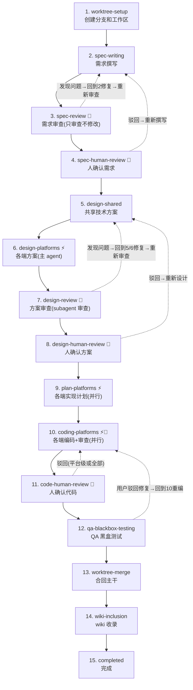

# Feature Workflow

## 定位

feature-workflow 是需求从「想法」到「代码落地」的完整编排层。它不替代任何已有 skill（如 llm-wiki），而是在它们之上提供阶段编排、状态管理和人机协作边界。

核心设计理念：**agent 高度自主推进流程，人只在 3 个固定确认点和必要时介入**。每个需要 review 的阶段都内置了「执行→审查→修复」循环，agent 会自行修复能解决的问题，仅将无法判断的问题上报给人。

## 推进路径

三种推进方式，适用于不同阶段类型：

| 阶段类型 | 推进方式 | 说明 |
|---------|---------|------|
| **普通阶段** | `workflow.py advance` | 标记当前阶段完成，推进到下一阶段 |
| **人工确认阶段** | `workflow.py human-review <stage> --approve` | 自动完成本阶段并推进到下一阶段 |
| **跳过阶段** | `workflow.py advance --skip <stage>` | 仅限 `qa-blackbox-testing`（无设备 skill 时可跳过 QA 黑盒测试）和 `wiki-inclusion`（纯技术改动可跳过 wiki 收录） |

## 能力线

| 能力线 | 职责 | 执行方式 | 规范 |
|--------|------|---------|------|
| **Worktree 管理** | 创建/合并/清理 git worktree | 主 agent + Bash | [references/worktree.md](references/worktree.md) |
| **需求撰写** | 查阅 wiki + 代码，撰写 spec | 主 agent | [references/spec-writing.md](references/spec-writing.md) |
| **需求 Review** | 审查需求完整性/一致性/可行性 | subagent（循环修复） | [references/spec-review.md](references/spec-review.md) |
| **技术方案设计** | Shared 设计 + 各端方案 | 主 agent 直接撰写 | [references/design-writing.md](references/design-writing.md) |
| **技术方案 Review** | 审查设计完整性/一致性/跨端对齐（单 subagent） | subagent（循环修复，回到 writing） | [references/design-review.md](references/design-review.md) |
| **Plan 撰写** | 轻量 TDD 实现计划 | subagent（并行） | [references/plan-writing.md](references/plan-writing.md) |
| **Coding** | 按 plan 逐步骤实现 | subagent（并行，内部含 code review） | [references/coding.md](references/coding.md) |
| **Code Review** | 审查代码质量、规范、一致性（coding agent 直接并行派发专项 subagent） | coding agent 内联执行 | [references/code-review.md](references/code-review.md) |
| **QA 黑盒测试** | 根据 spec 撰写测试文档，派发 subagent 执行黑盒测试（设备/模拟器方案预留） | 主 agent + subagent | [references/qa-blackbox-testing.md](references/qa-blackbox-testing.md) |
| **Wiki 收录** | 汇总全流程产物 + git diff，委托 llm-wiki 更新 wiki | subagent | [references/wiki-inclusion.md](references/wiki-inclusion.md) |

## 工作流总览



| 图例 | 含义 |
|------|------|
| 🔄 | 含 review 循环（执行→审查→修复→再审查，上限 3 轮后上报人工） |
| 👤 | 需要人工确认（驳回后回到对应撰写阶段，而非 review 阶段） |
| ⚡ | 涉及多端（plan 和 coding 阶段可并行派发 subagent，design 阶段主 agent 顺序撰写） |

## 阶段说明

以下每个阶段只列出编排层关键信息（执行者、前置条件、产物、推进命令）。详细的执行步骤、subagent prompt、修复策略等见各阶段对应的 reference 文件。

### 阶段 1：worktree-setup

- **执行者**：主 agent + EnterWorktree 工具
- **前置条件**：无
- **执行规范**：详见 [references/worktree.md](references/worktree.md)「创建 worktree」节
- **产物**：worktree 就绪，`docs/specs/<YYYY-MM-dd>-<name>/workflow.json`
- **推进命令**：`python3 scripts/workflow.py init <name>`（在 worktree 中执行，init 后阶段 1 自动完成）
- **下一阶段提示**：「worktree 已就绪。是否开始需求撰写？」

### 阶段 2：spec-writing

- **执行者**：主 agent
- **前置条件**：worktree-setup 完成
- **执行规范**：详见 [references/spec-writing.md](references/spec-writing.md)
- **产物**：`docs/specs/<YYYY-MM-dd>-<name>/spec.md`
- **推进命令**：`python3 scripts/workflow.py advance`
- **下一阶段提示**：「需求文档已完成。是否开始需求审查？」

### 阶段 3：spec-review 🔄

- **执行者**：subagent（只审查不修改，主 agent 执行修复，上限 3 轮）
- **前置条件**：spec-writing 完成
- **执行规范**：详见 [references/spec-review.md](references/spec-review.md)
- **产物**：`docs/specs/<YYYY-MM-dd>-<name>/spec-review.md`
- **review 循环**：`python3 scripts/workflow.py review-loop spec-review --increment`
- **下一阶段提示**：「需求审查完成。请确认需求文档，确认后进入技术方案设计。」

### 阶段 4：spec-human-review 👤

- **执行者**：人 + 主 agent
- **前置条件**：spec-review 完成，无遗留问题
- **通过**：`python3 scripts/workflow.py human-review spec-human-review --approve`
- **驳回**：`python3 scripts/workflow.py human-review spec-human-review --reject`，回到阶段 2
- **下一阶段提示**：「需求已确认。是否开始技术方案设计？」

### 阶段 5：design-shared

- **执行者**：主 agent
- **前置条件**：spec-human-review 通过
- **执行规范**：详见 [references/design-writing.md](references/design-writing.md)「design-shared」节
- **产物**：`docs/specs/<YYYY-MM-dd>-<name>/design.md`
- **推进命令**：`python3 scripts/workflow.py advance`
- **下一阶段提示**：「共享技术方案已完成。是否开始各端方案设计？」

### 阶段 6：design-platforms ⚡

- **执行者**：主 agent（按平台顺序撰写，无 subagent）
- **前置条件**：design-shared 完成
- **执行规范**：详见 [references/design-writing.md](references/design-writing.md)「design-platforms」节
- **产物**：`design-backend.md`, `design-ios.md`, `design-android.md`, `design-web.md`（按需）
- **推进命令**：各平台完成后 `mark-platform design-platforms <platform> --status completed`，全部完成后 `workflow.py advance`
- **下一阶段提示**：「各端方案已完成。是否开始方案审查？」

### 阶段 7：design-review 🔄

- **执行者**：subagent（单 subagent 审查全部方案，只审查不修改，上限 3 轮）
- **前置条件**：design-platforms 完成
- **执行规范**：详见 [references/design-review.md](references/design-review.md)。修复策略（问题归类 → 按需派发 → 靶向修复）见其中「主 agent 后续操作」节
- **产物**：`docs/specs/<YYYY-MM-dd>-<name>/design-review.md`
- **review 循环**：`python3 scripts/workflow.py review-loop design-review --increment`
- **下一阶段提示**：「方案审查完成。请确认技术方案，确认后进入实现计划。」

### 阶段 8：design-human-review 👤

- **执行者**：人 + 主 agent
- **前置条件**：design-review 完成，无遗留问题
- **通过**：`python3 scripts/workflow.py human-review design-human-review --approve`
- **驳回**：`python3 scripts/workflow.py human-review design-human-review --reject`，回到阶段 5
- **下一阶段提示**：「技术方案已确认。是否开始编写各端实现计划？」

### 阶段 9：plan-platforms ⚡

- **执行者**：subagent（各端并行）
- **前置条件**：design-human-review 通过
- **执行规范**：详见 [references/plan-writing.md](references/plan-writing.md)
- **产物**：`plan-backend.md`, `plan-ios.md`, `plan-android.md`, `plan-web.md`（按需）
- **推进命令**：各平台完成后 `mark-platform plan-platforms <platform> --status completed`，全部完成后 `workflow.py advance`
- **下一阶段提示**：「实现计划已完成。是否开始编码？」

### 阶段 10：coding-platforms ⚡🔄

- **执行者**：subagent（各端并行，内部含 build & lint → tests → review 渐进验证循环，上限 3 轮）
- **前置条件**：plan-platforms 完成
- **执行规范**：详见 [references/coding.md](references/coding.md)
- **产物**：各端代码变更 + `code-{platform}-review.md`（按需）
- **推进命令**：各平台完成后 `mark-platform coding-platforms <platform> --status completed`，全部完成后 `workflow.py advance`
- **下一阶段提示**：「编码完成。请审查代码变更，确认后合回主干。」

### 阶段 11：code-human-review 👤

- **执行者**：人 + 主 agent
- **前置条件**：coding-platforms 完成
- **通过**：`python3 scripts/workflow.py human-review code-human-review --approve`
- **仅驳回某平台**：`python3 scripts/workflow.py human-review code-human-review --platform <platform> --reject`（回到阶段 10，仅该平台重新编码）
- **全部驳回**：`python3 scripts/workflow.py human-review code-human-review --reject`（回到阶段 10）
- **下一阶段提示**：「代码已确认。是否进行 QA 黑盒测试？」

### 阶段 12：qa-blackbox-testing

- **执行者**：主 agent + subagent
- **前置条件**：code-human-review 通过
- **执行规范**：详见 [references/qa-blackbox-testing.md](references/qa-blackbox-testing.md)
- **产物**：`docs/specs/<YYYY-MM-dd>-<name>/qa-test.md`（测试文档，含执行结果）
- **推进命令**：全部通过时 `python3 scripts/workflow.py advance`（无设备 skill 时可 `--skip qa-blackbox-testing`）
- **用户决策**：测试有未通过时，等待用户决定：继续推进 / 驳回修复 / 记录并推进
- **下一阶段提示**：「QA 测试完成。是否合回主干？」

### 阶段 13：worktree-merge

- **执行者**：主 agent + Bash + ExitWorktree 工具
- **前置条件**：qa-blackbox-testing 完成或跳过
- **执行规范**：详见 [references/worktree.md](references/worktree.md)「合回主干」和「退出 worktree」节
- **产物**：代码已合并到 main 并推送
- **推进命令**：合并完成后 `python3 scripts/workflow.py advance`
- **下一阶段提示**：「主干已合并。是否进行 wiki 收录？」

### 阶段 14：wiki-inclusion

- **执行者**：subagent
- **前置条件**：worktree-merge 完成
- **执行规范**：详见 [references/wiki-inclusion.md](references/wiki-inclusion.md)
- **产物**：`docs/specs/<YYYY-MM-dd>-<name>/wiki.md`，wiki 各文档已更新
- **推进命令**：`python3 scripts/workflow.py advance`（纯技术改动可 `--skip wiki-inclusion`）
- **下一阶段提示**：「wiki 收录完成。需求全流程结束！💡 可通过 product-manager skill 更新 progress.md 中的功能状态。」

### 阶段 15：completed

调用 `python3 scripts/workflow.py advance` 标记完成。向用户报告全流程总结，包括：
- 产物清单（所有 spec/design/plan 文档）
- 代码变更摘要（各端变更文件数）
- Wiki 收录结果
- 流程耗时统计

## 人机协作边界

| 阶段 | 自动化程度 | 人介入条件 |
|------|-----------|-----------|
| worktree-setup | ✅ 全自动 | — |
| spec-writing | ✅ 全自动 | — |
| spec-review 🔄 | 🟡 半自动 | review subagent 无法判断的问题 |
| spec-human-review 👤 | 🔴 必须人确认 | 每次（驳回 → spec-writing） |
| design-shared | ✅ 全自动 | — |
| design-platforms ⚡ | ✅ 全自动 | — |
| design-review 🔄 | 🟡 半自动 | review subagent 无法判断的问题 |
| design-human-review 👤 | 🔴 必须人确认 | 每次（驳回 → design-shared） |
| plan-platforms ⚡ | ✅ 全自动 | — |
| coding-platforms ⚡🔄 | 🟡 半自动 | code review 无法判断的问题 |
| code-human-review 👤 | 🔴 必须人确认 | 每次（驳回 → coding-platforms，支持平台级） |
| qa-blackbox-testing | 🟡 半自动 | 测试未通过时需用户决策：继续推进 / 驳回修复 / 记录并推进 |
| worktree-merge | 🟡 半自动 | 合并冲突时 |
| wiki-inclusion | ✅ 全自动 | — |

人在 3 个必经确认点之外的介入条件：
- Review 循环发现 agent 无法解决的问题（如产品策略、架构权衡、外部依赖选择）
- 用户主动中断流程提出修改
- 代码合并冲突需要手动解决
- 3 轮 review 仍未收敛时，脚本输出 warning，强制上报人工

## 不适用平台的处理

对于不涉及某端的需求，使用 `skipped` 状态标记：

```bash
python3 scripts/workflow.py mark-platform design-platforms web --status skipped
python3 scripts/workflow.py mark-platform plan-platforms web --status skipped
python3 scripts/workflow.py mark-platform coding-platforms web --status skipped
```

`skipped` 在 advance 检查中等同于 `completed`（允许推进），但在 status 输出中单独列出以示区分。

## 各阶段完成后的提示

每个阶段完成后，主 agent 必须明确提示：

> 「✅ 阶段 {N} ({stage-name}) 已完成。」
> 「📁 产物：{文件列表}」
> 「⏭️ 下一阶段：阶段 {N+1} ({next-stage-name})」
> 「是否继续？」

这样确保人对流程进展始终有清晰感知。

## 快速开始示例

用户：「做一个倍速播放功能，支持 0.5x/1.0x/1.5x/2.0x 四个速度档位」

执行流程：

**阶段 1 — worktree-setup**（先 EnterWorktree，再 init）
```
调用 EnterWorktree 工具，name: "YYYY-MM-dd-add-playback-speed"
进入 worktree 后：
python3 scripts/workflow.py init add-playback-speed
```

**阶段 2 — spec-writing**
- 调用 `Skill("llm-wiki")` 查阅播放器功能文档 → 了解现有播放器架构
- 读取 `ios/`、`android/` 下的播放器源码 → 确认当前不支持倍速
- 按模板撰写 spec.md，定义 4 档速度的交互流程和验收标准
- 不确定的细节标注 `[待确认]`

**阶段 3 — spec-review 🔄**
- 派发 spec-review subagent → 发现「缺少控制栏 UI 变更说明」→ 补充
- Subagent 解决 spec 中的 `[待确认]` 标记 → 通过

**阶段 4 — spec-human-review 👤**
- 向用户展示需求摘要 → 用户确认

**阶段 5-8 — design + review**
- 撰写 design.md（API: `POST /api/player/speed`）
- 主 agent 逐平台撰写 design-backend.md、design-ios.md、design-android.md，web 标记 skipped
- design-review subagent 审查全部方案，Review 循环修复

**阶段 9-11 — plan + coding + review**
- 各端 plan 并行
- Coding subagent 并行（iOS/Android/Backend）→ 内部 code review 循环
- 用户确认代码（支持平台级确认：如仅 iOS 有问题，可只驳回 iOS）

**阶段 12 — QA 黑盒测试**
- 根据 spec 撰写 QA 测试文档（`qa-test.md`）
- 如设备/模拟器 skill 可用 → 派发 subagent 执行设备测试
- 如设备/模拟器 skill 不可用 → 跳过设备执行，仅在报告中注明

**阶段 13-15 — merge + wiki**
- 合回主干 → wiki 收录 → 完成

## 资源索引

### Scripts

| 脚本 | 用途 |
|------|------|
| `scripts/workflow.py` | 流程状态管理（init/status/advance/review-loop/human-review/mark-platform） |

### References

| 文件 | 用途 | 包含 subagent 定义 |
|------|------|--------------------|
| [references/worktree.md](references/worktree.md) | worktree 创建/合并/清理规范 | — |
| [references/spec-writing.md](references/spec-writing.md) | 需求撰写流程和注意事项 | — |
| [references/spec-review.md](references/spec-review.md) | 需求 review 流程 | ✅ |
| [references/design-writing.md](references/design-writing.md) | 技术方案设计流程（shared + platforms，主 agent 执行） | — |
| [references/backend-design/service-design.md](references/backend-design/service-design.md) | Backend 端设计参考指南（路由、中间件、服务层、migration、队列、测试） | — |
| [references/ios-design/arch-design.md](references/ios-design/arch-design.md) | iOS 端设计参考指南（组件、ViewModel、导航、网络、持久化、测试） | — |
| [references/android-design/arch-design.md](references/android-design/arch-design.md) | Android 端设计参考指南（组件、ViewModel、导航、网络、持久化、测试） | — |
| [references/web-design/frontend-design.md](references/web-design/frontend-design.md) | Web 端设计参考指南（组件、状态管理、路由、API 层、SSR/CSR、性能、测试） | — |
| [references/design-review.md](references/design-review.md) | 技术方案 review 流程 | ✅ |
| [references/plan-writing.md](references/plan-writing.md) | 轻量 TDD plan 撰写规范 | ✅ |
| [references/coding.md](references/coding.md) | coding subagent 派发规范（code review 在内部创建，prompt 见 code-review.md） | ✅ |
| [references/code-review.md](references/code-review.md) | code review subagent 规范（被 coding.md 引用） | ✅ |
| [references/qa-blackbox-testing.md](references/qa-blackbox-testing.md) | QA 黑盒测试执行规范（测试文档撰写 + 设备/模拟器测试预留） | ✅ |
| [references/wiki-inclusion.md](references/wiki-inclusion.md) | wiki 收录流程 | ✅ |
| [references/agent-team.md](references/agent-team.md) | agent team 派发规范（platform subagent 派发优先使用 agent team） | — |

### Assets（模板）

| 模板 | 用途 |
|------|------|
| `assets/spec-template.md` | 需求文档模板 |
| `assets/spec-review-template.md` | 需求 review 报告模板 |
| `assets/design-template.md` | 共享技术方案模板 |
| `assets/design-backend-template.md` | Backend 端技术方案模板 |
| `assets/design-ios-template.md` | iOS 端技术方案模板 |
| `assets/design-android-template.md` | Android 端技术方案模板 |
| `assets/design-web-template.md` | Web 端技术方案模板 |
| `assets/design-review-template.md` | 技术方案 review 报告模板 |
| `assets/plan-template.md` | 实现计划模板（TDD：测试→实现→验证→补充测试） |
| `assets/code-review-template.md` | 代码 review 报告模板 |
| `assets/qa-test-template.md` | QA 黑盒测试文档模板 |
| `assets/wiki-inclusion-template.md` | wiki 收录报告模板 |

## 关键约束

- **流程脚本优先**：状态变更通过 `scripts/workflow.py` 执行，不直接修改 `workflow.json`
- **workflow.json 位置**：`init` 在 worktree 中执行，确保 workflow.json 在 worktree 中可访问
- **wiki 操作委托**：wiki 维护通过 `llm-wiki` skill 执行，feature-workflow 不直接操作 wiki；wiki-inclusion subagent 通过 `Skill("llm-wiki")` 加载 llm-wiki 上下文后按 llm-wiki 的规范执行
- **QA 设备/模拟器预留**：设备/模拟器操作方案由独立 skill 提供（待定义）。qa-blackbox-testing 阶段会检查该 skill 是否存在：如果存在则派发 subagent 执行设备测试；如果不存在则跳过设备测试步骤，仅产出测试文档
- **产品信息引用**：涉及产品名、竞品名时引用 `PRODUCT.md`，不硬编码
- **已有 skill 配合**：
  - 编写 spec/design 前必须调用 `Skill("llm-wiki")` 了解现状
  - wiki 收录通过 llm-wiki skill 的子流程执行
  - 如需竞品分析，先通过 `product-research` skill 完成后再走 feature-workflow
  - 如功能尚未经过 `product-manager` skill 拆解（缺少 PRD + 子任务拆分），应先通过 product-manager 完成需求拆解后再走 feature-workflow。已有 PRD 时，spec-writing 阶段可直接引用 PRD 中的用户故事和核心流程
- **平台跳过**：不涉及的平台用 `mark-platform --status skipped`，advance 会等同 completed 处理
- **Review 循环上限**：脚本在 3 轮后输出 warning，agent 必须停止自动循环并上报人工
