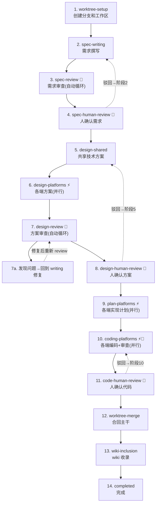

# Feature Workflow

## 定位

feature-workflow 是需求从「想法」到「代码落地」的完整编排层。它不替代任何已有 skill（如 llm-wiki），而是在它们之上提供阶段编排、状态管理和人机协作边界。

核心设计理念：**agent 高度自主推进流程，人只在 3 个固定确认点和必要时介入**。每个需要 review 的阶段都内置了「执行→审查→修复」循环，agent 会自行修复能解决的问题，仅将无法判断的问题上报给人。

## 推进路径

两种推进方式，适用于不同阶段类型：

| 阶段类型 | 推进方式 | 说明 |
|---------|---------|------|
| **普通阶段** | `workflow.py advance` | 标记当前阶段完成，推进到下一阶段 |
| **人工确认阶段** | `workflow.py human-review <stage> --approve` | 自动完成本阶段并推进到下一阶段 |
| **跳过阶段** | `workflow.py advance --skip <stage>` | 仅限 `wiki-inclusion`（纯技术改动可跳过 wiki 收录） |

## 能力线

| 能力线 | 职责 | 执行方式 | 规范 |
|--------|------|---------|------|
| **Worktree 管理** | 创建/合并/清理 git worktree | 主 agent + Bash | [references/worktree.md](references/worktree.md) |
| **需求撰写** | 查阅 wiki + 代码，撰写 spec | 主 agent | [references/spec-writing.md](references/spec-writing.md) |
| **需求 Review** | 审查需求完整性/一致性/可行性 | subagent（循环修复） | [references/spec-review.md](references/spec-review.md) |
| **技术方案设计** | Shared 设计 + 各端方案 | 主 agent + subagent（并行） | [references/design-writing.md](references/design-writing.md) |
| **技术方案 Review** | 审查设计完整性/一致性/跨端对齐（单 subagent） | subagent（循环修复，回到 writing） | [references/design-review.md](references/design-review.md) |
| **Plan 撰写** | 轻量 TDD 实现计划 | subagent（并行） | [references/plan-writing.md](references/plan-writing.md) |
| **Coding** | 按 plan 逐步骤实现 | subagent（并行，内部含 code review） | [references/coding.md](references/coding.md) |
| **Code Review** | 审查代码质量、规范、一致性（coding agent 直接并行派发专项 subagent） | coding agent 内联执行 | [references/code-review.md](references/code-review.md) |
| **Wiki 收录** | 汇总全流程产物 + git diff，委托 llm-wiki 更新 wiki | subagent | [references/wiki-inclusion.md](references/wiki-inclusion.md) |

## 工作流总览



| 图例 | 含义 |
|------|------|
| 🔄 | 含 review 循环（执行→审查→修复→再审查，上限 3 轮后上报人工） |
| 👤 | 需要人工确认（驳回后回到对应撰写阶段，而非 review 阶段） |
| ⚡ | 各端可并行执行 |

## 阶段说明

### 阶段 1：worktree-setup

**执行者**：主 agent + EnterWorktree 工具

**前置条件**：无

1. 确认需求名称（kebab-case），如 `add-player-speed-control`
2. **使用内置 `EnterWorktree` 工具创建 worktree**（name 格式：`YYYY-MM-dd-<name>`）：
   - 调用 `EnterWorktree` 工具，`name` 参数传入 `YYYY-MM-dd-<name>`
   - 工具会自动在 `.claude/worktrees/` 下创建 worktree 并切换会话到该 worktree 中
3. 进入 worktree 后执行 init：
   ```bash
   python3 scripts/workflow.py init <name>
   ```
4. 验证：worktree 目录已切换成功

**产物**：worktree 就绪，`docs/specs/<YYYY-MM-dd>-<name>/workflow.json`

**完成标志**：EnterWorktree 成功，已进入 worktree 目录，workflow.json 已就位

**下一阶段提示**：「worktree 已就绪。是否开始需求撰写？」

### 阶段 2：spec-writing

**执行者**：主 agent

**前置条件**：worktree-setup 完成

**执行规范**：详见 [references/spec-writing.md](references/spec-writing.md)

核心流程：
1. 调用 `Skill("llm-wiki")` 查阅现有功能文档
2. 读取各端代码了解当前实现
3. 按 `assets/spec-template.md` 撰写 `spec.md`
4. 不确定的信息标注 `[待确认]`，由 review 阶段系统化解决

**产物**：`docs/specs/<YYYY-MM-dd>-<name>/spec.md`

**完成标志**：spec.md 已写入，所有章节已填充

完成后：`python3 scripts/workflow.py advance`

**下一阶段提示**：「需求文档已完成。是否开始需求审查？」

### 阶段 3：spec-review 🔄

**执行者**：subagent（自动循环修复，上限 3 轮）

**前置条件**：spec-writing 完成

**执行规范**：详见 [references/spec-review.md](references/spec-review.md)

核心流程：
1. 派发 spec-review subagent（prompt 见 reference 文件）
2. Subagent 审查完整性/一致性/可行性，包括解决 spec 中的 `[待确认]` 标记
3. Subagent 发现问题直接修复，输出 `spec-review.md`
4. 主 agent 检查遗留问题：无遗留 → 推进；有遗留 → 询问用户 → 修复后重新派发
   - **注意**：主 agent 修复 spec.md 时是靶向修复（只修改 review 报告中指出的问题），不是重写整个文档
   - spec-review subagent 重新派发时，会看到已有 spec-review.md（记录历史问题），应按 review 模板重新审查更新后的 spec.md

**产物**：`docs/specs/<YYYY-MM-dd>-<name>/spec-review.md`

**review 循环**：每次循环调用 `python3 scripts/workflow.py review-loop spec-review --increment`。脚本会在达到 3 轮上限时输出 warning。

**下一阶段提示**：「需求审查完成。请确认需求文档，确认后进入技术方案设计。」

### 阶段 4：spec-human-review 👤

**执行者**：人 + 主 agent

**前置条件**：spec-review 完成，无遗留问题

1. 向用户展示需求文档关键内容摘要
2. 用户确认：`python3 scripts/workflow.py human-review spec-human-review --approve`
3. 用户驳回：`python3 scripts/workflow.py human-review spec-human-review --reject`，回到 **阶段 2 (spec-writing)**

**下一阶段提示**：「需求已确认。是否开始技术方案设计？」

### 阶段 5：design-shared

**执行者**：主 agent

**前置条件**：spec-human-review 通过

**执行规范**：详见 [references/design-writing.md](references/design-writing.md)

1. 调用 `Skill("llm-wiki")` 查阅现有架构和 API
2. 读取 backend 代码了解现有 API 设计
3. 按 `assets/design-template.md` 撰写 `design.md`（API 设计、数据模型、跨端共享逻辑）

**产物**：`docs/specs/<YYYY-MM-dd>-<name>/design.md`

**下一阶段提示**：「共享技术方案已完成。是否开始各端方案设计？」

### 阶段 6：design-platforms ⚡

**执行者**：subagent（各端并行）

**前置条件**：design-shared 完成

**执行规范**：详见 [references/design-writing.md](references/design-writing.md)

1. 判断涉及哪些平台
2. 为每个涉及平台并行派发 design subagent（**优先使用 agent team，详见 [references/agent-team.md](references/agent-team.md)**）
3. 不涉及的平台标记为 skipped：`python3 scripts/workflow.py mark-platform design-platforms <platform> --status skipped`
4. Subagent 按 `assets/design-platform-template.md` 输出 `design-{platform}.md`
5. 每个平台完成后调用 `python3 scripts/workflow.py mark-platform design-platforms <platform> --status completed`
6. 全部完成后 `python3 scripts/workflow.py advance`

**产物**：`design-backend.md`, `design-ios.md`, `design-android.md`, `design-web.md`（按需）

**下一阶段提示**：「各端方案已完成。是否开始方案审查？」

### 阶段 7：design-review 🔄

**执行者**：subagent（单 subagent 一次性审查全部方案，只审查不修改，上限 3 轮）

**前置条件**：design-platforms 完成

**执行规范**：详见 [references/design-review.md](references/design-review.md)

1. 派发单个 design-review subagent，一次性审查 `design.md` + 所有 `design-{platform}.md`
2. Subagent **只输出问题报告**，不修改方案文件
3. 主 agent 检查 review 结果：
   - **无问题** → `workflow.py advance` 推进到 design-human-review
   - **有问题（🔴 阻塞 / 🟡 关注）** → 调用 `workflow.py review-loop design-review --increment`，按以下策略修复：
     - **design.md 问题（Shared 层）** → 主 agent 直接修改 design.md（有完整上下文，靶向修复）
     - **design-{platform}.md 问题（各端）** → 重新派发对应平台的 subagent。Subagent 会通过内置的「模式检测」（见各 `references/<platform>-design/*.md`）识别修复轮次，只修改 review 报告指出的问题，不重写整个方案
   - **仅 🟢 建议** → 不阻塞，直接推进
   - **有遗留问题（需人决策）** → 向用户展示，用户回复后按修复模式修复
4. 达到 3 轮上限 → 脚本输出 warning，强制停止循环

**产物**：`docs/specs/<YYYY-MM-dd>-<name>/design-review.md`

**review 循环**：`python3 scripts/workflow.py review-loop design-review --increment`

**下一阶段提示**：「方案审查完成。请确认技术方案，确认后进入实现计划。」

### 阶段 8：design-human-review 👤

**执行者**：人 + 主 agent

**前置条件**：design-review 完成，无遗留问题

- 通过：`python3 scripts/workflow.py human-review design-human-review --approve`
- 驳回：`python3 scripts/workflow.py human-review design-human-review --reject`，回到 **阶段 5 (design-shared)**
  - design.md 修改 → 主 agent 直接靶向修复
  - design-{platform}.md 修改 → 重新派发对应平台 subagent（subagent 通过模式检测识别修复轮次）
  - 修改完毕后重新走 design-review 流程

**下一阶段提示**：「技术方案已确认。是否开始编写各端实现计划？」

### 阶段 9：plan-platforms ⚡

**执行者**：subagent（各端并行）

**前置条件**：design-human-review 通过

**执行规范**：详见 [references/plan-writing.md](references/plan-writing.md)

1. 为各涉及平台并行派发 plan subagent（**优先使用 agent team，详见 [references/agent-team.md](references/agent-team.md)**）
2. 不涉及的平台标记为 skipped：`python3 scripts/workflow.py mark-platform plan-platforms <platform> --status skipped`
3. Subagent 按 `assets/plan-template.md` 输出 `plan-{platform}.md`
4. 每个平台完成后 `python3 scripts/workflow.py mark-platform plan-platforms <platform> --status completed`
5. 全部完成后 `python3 scripts/workflow.py advance`

**plan 模板特点**：每个步骤遵循 "测试场景 → 实现 → 验证 → 补充测试" 的轻量 TDD 循环

**产物**：`plan-backend.md`, `plan-ios.md`, `plan-android.md`, `plan-web.md`（按需）

**下一阶段提示**：「实现计划已完成。是否开始编码？」

### 阶段 10：coding-platforms ⚡🔄

**执行者**：subagent（各端并行，每个内部含 build & lint → tests → review 渐进验证循环，上限 3 轮）

**前置条件**：plan-platforms 完成

**执行规范**：详见 [references/coding.md](references/coding.md)

1. 为各涉及平台派发 coding subagent（**优先使用 agent team，详见 [references/agent-team.md](references/agent-team.md)**）
2. 不涉及的平台标记为 skipped：`python3 scripts/workflow.py mark-platform coding-platforms <platform> --status skipped`
3. 每个 subagent 按 plan 步骤执行，遵循**渐进成本验证循环**：build & lint → tests → review
4. Coding subagent 自行逐项验收（Build、Lint、Tests、Review、修改范围、无硬编码），全部通过后才可报告完成
5. 每个平台完成后 `python3 scripts/workflow.py mark-platform coding-platforms <platform> --status completed`
6. 全部完成后 `python3 scripts/workflow.py advance`

**产物**：各端代码变更 + `code-{platform}-review.md`（按需）

**review 循环**：`python3 scripts/workflow.py review-loop coding-platforms --platform <platform> --increment`

**下一阶段提示**：「编码完成。请审查代码变更，确认后合回主干。」

### 阶段 11：code-human-review 👤

**执行者**：人 + 主 agent

**前置条件**：coding-platforms 完成

1. 向用户展示代码变更摘要和 review 结论
2. 确认全部通过：`python3 scripts/workflow.py human-review code-human-review --approve`
3. 仅驳回某平台：`python3 scripts/workflow.py human-review code-human-review --platform <platform> --reject`（只回退该平台的 coding，其他平台不动）
4. 全部驳回：`python3 scripts/workflow.py human-review code-human-review --reject`（回到阶段 10）

**下一阶段提示**：「代码已确认。是否合回主干？」

### 阶段 12：worktree-merge

**执行者**：主 agent + Bash + ExitWorktree 工具

**前置条件**：code-human-review 通过

**执行规范**：详见 [references/worktree.md](references/worktree.md)

1. 推送分支：`git push origin feature/<YYYY-MM-dd>-<name>`
2. 切回主仓库并合并：
   ```bash
   cd <project-root>
   git checkout main
   git pull origin main
   git merge --no-ff feature/<YYYY-MM-dd>-<name>
   git push origin main
   ```
3. **使用内置 `ExitWorktree` 工具退出并清理 worktree**：
   - 调用 `ExitWorktree`，`action` 设为 `"remove"`，`discard_changes` 设为 `false`
   - 工具会自动清理 worktree 目录和分支
4. 完成后运行 `python3 scripts/workflow.py advance`

**下一阶段提示**：「主干已合并。是否进行 wiki 收录？」

### 阶段 13：wiki-inclusion

**执行者**：subagent

**前置条件**：worktree-merge 完成

**执行规范**：详见 [references/wiki-inclusion.md](references/wiki-inclusion.md)

1. 派发 wiki-inclusion subagent
2. Subagent 收集 spec 目录下所有文档 + `git diff` 变更文件列表
3. 委托 llm-wiki skill 的子流程完成 wiki 文档维护
4. 输出 `wiki.md` 收录报告

**产物**：`docs/specs/<YYYY-MM-dd>-<name>/wiki.md`，wiki 各文档已更新

**跳过**：纯技术改动（如升级依赖、重构）可跳过：`python3 scripts/workflow.py advance --skip wiki-inclusion`

**下一阶段提示**：「wiki 收录完成。需求全流程结束！」

### 阶段 14：completed

调用 `python3 scripts/workflow.py advance` 标记完成。向用户报告全流程总结，包括：
- 产物清单（所有 spec/design/plan 文档）
- 代码变更摘要（各端变更文件数）
- Wiki 收录结果
- 流程耗时统计

## 轻量模式

对于小改动（仅 1 个平台、改动 < 5 个文件），可使用轻量模式跳过 review 和人工确认阶段：

```bash
python3 scripts/workflow.py init <name> --lightweight
```

轻量模式下：
- spec-review、design-review 自动标记为 skipped
- spec-human-review、design-human-review、code-human-review 自动标记为 skipped
- 仅保留：worktree-setup → spec-writing → design-shared → design-platforms → plan-platforms → coding-platforms → worktree-merge → wiki-inclusion → completed

适用场景：
- 修一个 UI bug
- 加一个简单配置项
- 升级依赖版本
- 调整构建配置

## 人机协作边界

| 阶段 | 自动化程度 | 人介入条件 |
|------|-----------|-----------|
| worktree-setup | ✅ 全自动 | — |
| spec-writing | ✅ 全自动 | — |
| spec-review 🔄 | 🟡 半自动 | review subagent 无法判断的问题 |
| spec-human-review 👤 | 🔴 必须人确认 | 每次（驳回 → spec-writing） |
| design-shared | ✅ 全自动 | — |
| design-platforms ⚡ | ✅ 全自动 | — |
| design-review 🔄 | 🟡 半自动 | review subagent 无法判断的问题 |
| design-human-review 👤 | 🔴 必须人确认 | 每次（驳回 → design-shared） |
| plan-platforms ⚡ | ✅ 全自动 | — |
| coding-platforms ⚡🔄 | 🟡 半自动 | code review 无法判断的问题 |
| code-human-review 👤 | 🔴 必须人确认 | 每次（驳回 → coding-platforms，支持平台级） |
| worktree-merge | 🟡 半自动 | 合并冲突时 |
| wiki-inclusion | ✅ 全自动 | — |

人在 3 个必经确认点之外的介入条件：
- Review 循环发现 agent 无法解决的问题（如产品策略、架构权衡、外部依赖选择）
- 用户主动中断流程提出修改
- 代码合并冲突需要手动解决
- 3 轮 review 仍未收敛时，脚本输出 warning，强制上报人工

## Review 循环机制

所有 review 阶段（spec-review、design-review、coding-platforms）遵循相同的循环模式，借鉴 Speckit 的 Clarify 理念——在每个 review 阶段中，subagent 首先系统化解决文档中的所有 `[待确认]` 标记，再进行审查：

```
执行 → 派发 review subagent → [Clarify: 解决 [待确认] 标记] → [审查并修复] → 输出 review 报告
                                                                              ↓
                                                      无遗留 ← 主 agent 检查 ←
                                                        ↓                      ↓
                                                   推进到下一阶段            有遗留
                                                                                ↓
                                                      需人决策 → 询问用户 → 用户回复后
                                                        ↓                      ↓
                                                   回到 writing 修复     agent 可修复 → 回到 writing 修复
                                                        ↓                      ↓
                                                   重新派发 subagent      重新派发 subagent
```

关键规则：
- Subagent 自行修复能修复的问题，不等待主 agent 确认
- **agent 可修复的问题不进入 human 环节**，直接回到 writing 修复后重新 review
- 只有必须由人决策的问题才展示给用户
- 每轮 review 后调用 `workflow.py review-loop` 递增计数
- **脚本强制上限**：`workflow.py review-loop --increment` 在达到 3 轮时输出 warning，提醒 agent 停止自动循环
- 遗留问题记录到 review 文档的「遗留问题」章节
- 用户回复遗留问题后，回到 writing 阶段修复，修复后重新派发 review subagent

## 完成前验证（Verification Gate）

每个阶段完成前，agent 必须提供**新鲜证据**（而非口头声明）证明完成：

| 声明 | 需要的证据 |
|------|-----------|
| 阶段 N 完成 | 产物文件存在且非空（`cat` 文件首行确认） |
| 测试通过 | 测试命令的实际输出，含 "0 failures" 或退出码 0 |
| Review 通过 | review 文档中结论为"所有问题已修复" |
| 合并成功 | `git log -1 --oneline` 显示 merge commit |
| Wiki 更新完成 | wiki 修订记录文件存在 |

禁止以下空洞声明：
- "should work"、"probably fine"、"seems correct"
- 没有命令输出的"Done!"、"Great!"
- 没有文件内容确认的"已写入"

## 不适用平台的处理

对于不涉及某端的需求，使用 `skipped` 状态标记：

```bash
python3 scripts/workflow.py mark-platform design-platforms web --status skipped
python3 scripts/workflow.py mark-platform plan-platforms web --status skipped
python3 scripts/workflow.py mark-platform coding-platforms web --status skipped
```

`skipped` 在 advance 检查中等同于 `completed`（允许推进），但在 status 输出中单独列出以示区分。

## 各阶段完成后的提示

每个阶段完成后，主 agent 必须明确提示：

> 「✅ 阶段 {N} ({stage-name}) 已完成。」
> 「📁 产物：{文件列表}」
> 「⏭️ 下一阶段：阶段 {N+1} ({next-stage-name})」
> 「是否继续？」

这样确保人对流程进展始终有清晰感知。

## 快速开始示例

用户：「做一个倍速播放功能，支持 0.5x/1.0x/1.5x/2.0x 四个速度档位」

执行流程：

**阶段 1 — worktree-setup**（先 EnterWorktree，再 init）
```
调用 EnterWorktree 工具，name: "YYYY-MM-dd-add-playback-speed"
进入 worktree 后：
python3 scripts/workflow.py init add-playback-speed
```

**阶段 2 — spec-writing**
- 调用 `Skill("llm-wiki")` 查阅播放器功能文档 → 了解现有播放器架构
- 读取 `ios/`、`android/` 下的播放器源码 → 确认当前不支持倍速
- 按模板撰写 spec.md，定义 4 档速度的交互流程和验收标准
- 不确定的细节标注 `[待确认]`

**阶段 3 — spec-review 🔄**
- 派发 spec-review subagent → 发现「缺少控制栏 UI 变更说明」→ 补充
- Subagent 解决 spec 中的 `[待确认]` 标记 → 通过

**阶段 4 — spec-human-review 👤**
- 向用户展示需求摘要 → 用户确认

**阶段 5-8 — design + review**
- 撰写 design.md（API: `POST /api/player/speed`）
- 并行派发 iOS/Android/Backend design subagent，web 标记 skipped
- Review 循环修复

**阶段 9-11 — plan + coding + review**
- 各端 plan 并行
- Coding subagent 并行（iOS/Android/Backend）→ 内部 code review 循环
- 用户确认代码（支持平台级确认：如仅 iOS 有问题，可只驳回 iOS）

**阶段 12-14 — merge + wiki**
- 合回主干 → wiki 收录 → 完成

## 资源索引

### Scripts

| 脚本 | 用途 |
|------|------|
| `scripts/workflow.py` | 流程状态管理（init/status/advance/review-loop/human-review/mark-platform） |

### References

| 文件 | 用途 | 包含 subagent 定义 |
|------|------|--------------------|
| [references/worktree.md](references/worktree.md) | worktree 创建/合并/清理规范 | — |
| [references/spec-writing.md](references/spec-writing.md) | 需求撰写流程和注意事项 | — |
| [references/spec-review.md](references/spec-review.md) | 需求 review 流程 | ✅ |
| [references/design-writing.md](references/design-writing.md) | 技术方案设计流程和 subagent 定义 | ✅ |
| [references/design-review.md](references/design-review.md) | 技术方案 review 流程 | ✅ |
| [references/plan-writing.md](references/plan-writing.md) | 轻量 TDD plan 撰写规范 | ✅ |
| [references/coding.md](references/coding.md) | coding subagent 派发规范（code review 在内部创建，prompt 见 code-review.md） | ✅ |
| [references/code-review.md](references/code-review.md) | code review subagent 规范（被 coding.md 引用） | ✅ |
| [references/wiki-inclusion.md](references/wiki-inclusion.md) | wiki 收录流程 | ✅ |
| [references/agent-team.md](references/agent-team.md) | agent team 派发规范（platform subagent 派发优先使用 agent team） | — |

### Assets（模板）

| 模板 | 用途 |
|------|------|
| `assets/spec-template.md` | 需求文档模板 |
| `assets/spec-review-template.md` | 需求 review 报告模板 |
| `assets/design-template.md` | 共享技术方案模板 |
| `assets/design-platform-template.md` | 各端技术方案模板 |
| `assets/design-review-template.md` | 技术方案 review 报告模板 |
| `assets/plan-template.md` | 实现计划模板（TDD：测试→实现→验证→补充测试） |
| `assets/code-review-template.md` | 代码 review 报告模板 |
| `assets/wiki-inclusion-template.md` | wiki 收录报告模板 |

## 关键约束

- **流程脚本优先**：状态变更通过 `scripts/workflow.py` 执行，不直接修改 `workflow.json`
- **workflow.json 位置**：`init` 在 worktree 中执行，确保 workflow.json 在 worktree 中可访问
- **wiki 操作委托**：wiki 维护通过 `llm-wiki` skill 执行，feature-workflow 不直接操作 wiki；wiki-inclusion subagent 通过 `Skill("llm-wiki")` 加载 llm-wiki 上下文后按 llm-wiki 的规范执行
- **产品信息引用**：涉及产品名、竞品名时引用 `PRODUCT.md`，不硬编码
- **已有 skill 配合**：
  - 编写 spec/design 前必须调用 `Skill("llm-wiki")` 了解现状
  - wiki 收录通过 llm-wiki skill 的子流程执行
  - 如需竞品分析，先通过 `product-research` skill 完成后再走 feature-workflow
- **平台跳过**：不涉及的平台用 `mark-platform --status skipped`，advance 会等同 completed 处理
- **Review 循环上限**：脚本在 3 轮后输出 warning，agent 必须停止自动循环并上报人工
