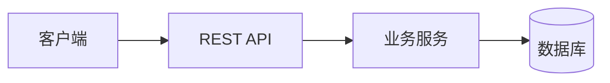

# 技术方案（共享部分）：{{功能名称}}

> 创建日期：{{YYYY-MM-DD}}
> 对应需求：spec.md

## 整体架构

<!-- 用 Mermaid 或 ASCII 描述本次需求涉及的系统架构 -->



## API 设计

### 涉及变更

| 类型 | 数量 | 说明 |
|------|------|------|
| 新增接口 | N | |
| 修改接口 | N | |
| 废弃接口 | N | |

### 新增接口

#### `{{METHOD}} /api/{{path}}`

- **功能简介**：
- **Path Parameters**：

| 字段 | 类型 | 必填 | 说明 |
|------|------|------|------|
| | | | |

- **Query Parameters**：

| 字段 | 类型 | 必填 | 默认值 | 说明 |
|------|------|------|--------|------|
| | | | | |

- **Request Body**：

```json
{
  "field": "value"
}
```

| 字段 | 类型 | 必填 | 说明 |
|------|------|------|------|
| | | | |

- **Response**：

```json
{
  "code": 0,
  "data": {},
  "message": "ok"
}
```

| 字段 | 类型 | 说明 |
|------|------|------|
| `code` | number | 状态码，0 表示成功 |
| `data` | object | 响应数据 |
| `message` | string | 状态描述 |

- **Error Codes**：

| 状态码 | 错误码 | 说明 |
|--------|--------|------|
| 200 | — | 成功 |
| 400 | `INVALID_PARAMS` | 参数校验失败 |
| 401 | `UNAUTHORIZED` | 未登录 |

### 修改接口

#### `{{METHOD}} /api/{{path}}`

- **变更说明**：
- **变更前**：
- **变更后**：
- **向后兼容性**：兼容 / 不兼容

## 数据模型

### 新增/变更数据表

| 表名 | 操作 | 说明 |
|------|------|------|
| | 新建 / 修改 | |

### Schema 定义

```typescript
// Zod schema
const {{ModelName}}Schema = z.object({
  id: z.string(),
  // ...
});
```

## 跨端共享逻辑

<!-- 描述各端需要一致实现的部分，如状态机、缓存策略、推送行为等 -->

| 共享逻辑 | 说明 | 涉及端 |
|---------|------|--------|
| | | |

## 安全考虑

- **认证与授权**：
- **数据校验**：
- **敏感数据处理**：

## 边界与错误处理（⚠️ 重点，最易遗漏）

### 错误处理架构

- **全局错误处理策略**：
- **错误响应格式**：统一使用 `{ code, data, message }` 结构
- **错误日志与监控**：

### API 错误码定义

| 业务错误码 | HTTP 状态码 | 说明 | 用户提示文案 |
|-----------|------------|------|-------------|
| `INVALID_PARAMS` | 400 | 参数校验失败 | |
| `UNAUTHORIZED` | 401 | 未登录 | |
| `FORBIDDEN` | 403 | 权限不足 | |
| `NOT_FOUND` | 404 | 资源不存在 | |
| `CONFLICT` | 409 | 资源冲突（并发修改） | |
| `RATE_LIMITED` | 429 | 请求过于频繁 | |
| `INTERNAL_ERROR` | 500 | 服务内部错误 | |

### 边界场景处理

| 场景 | 触发条件 | API 行为 | 说明 |
|------|---------|---------|------|
| 空参数/缺参数 | 必填字段为空 | 返回 400 + 字段级错误 | |
| 参数边界值 | 超长文本、特殊字符 | 校验失败返回 400 | |
| 数据不存在 | 查询不存在的资源 | 返回 404 | |
| 重复提交 | 短时间内相同请求 | 幂等处理 / 返回 409 | |
| 并发冲突 | 同一资源同时修改 | 乐观锁 / 返回 409 | |
| 限流触发 | 超过频率限制 | 返回 429 + Retry-After | |
| 服务降级 | 依赖服务不可用 | 返回降级数据 / 503 | |

## 性能考虑

- **预期 QPS**：
- **缓存策略**：
- **数据库优化**：

## 参考资料

### 已查阅的 wiki 文档

| 文档 | 相关章节 | 关键信息 |
|------|---------|---------|
| | | |

### 已查阅的代码文件

| 文件 | 关键内容 |
|------|---------|
| | |
