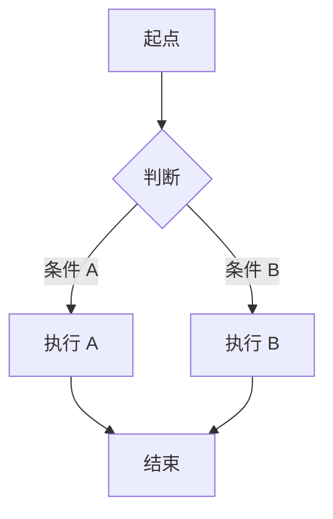

# 需求文档：{{功能名称}}

> 创建日期：{{YYYY-MM-DD}}
> 状态：草稿
> 作者：AI Agent + {{用户}}

---

## 1. 需求背景

### 1.1 问题描述

<!-- 当前存在什么问题？用户遇到了什么困难？ -->

- **现状**：
- **痛点**：

### 1.2 预期目标

<!-- 做完之后要达到什么效果？ -->

- **目标**：
- **成功指标**（可度量）：

### 1.3 范围定义

| 范围内 | 范围外（明确不做） | 原因 |
|--------|------------------|------|
| | | |

> 明确「不做什么」有助于防止 scope creep，也帮助 review 阶段判断是否存在过度设计。

---

## 2. 术语表

<!-- 定义本文档中使用的关键术语，确保与 PROJECT.md 和 wiki 中的定义一致 -->

| 术语 | 定义 | 来源 |
|------|------|------|
| | | PROJECT.md / wiki / 本文档新定义 |

---

## 3. 涉及平台

| 平台 | 是否涉及 | 变更概要 |
|------|---------|---------|
| Backend | ✅ 涉及 / ❌ 不涉及 | |
| Web | ✅ 涉及 / ❌ 不涉及 | |
| iOS | ✅ 涉及 / ❌ 不涉及 | |
| Android | ✅ 涉及 / ❌ 不涉及 | |

---

## 4. 用户故事

| 编号 | 角色 | 需求 | 验收标准 | 涉及平台 | 优先级 |
|------|------|------|---------|---------|--------|
| US-01 | | | | Backend/iOS/Android/Web | P0 / P1 / P2 |

---

## 5. 功能详述

<!-- 按用户故事逐一展开，每个故事包含：流程描述、前置/后置条件、边界与异常 -->

### 5.1 US-01：{{用户故事标题}}

#### 流程描述

<!-- 正常流程（Happy Path） -->

1. [步骤 1]
2. [步骤 2]



#### 前置条件

<!-- 执行此操作前必须满足的条件 -->

- [ ] 用户已登录
- [ ] 网络连接正常
- [ ] ...

#### 后置条件

<!-- 操作完成后系统的状态 -->

- 数据已持久化到服务端
- 页面刷新展示最新数据
- ...

#### 涉及的 UI/交互（如有）

| 页面 / 区域 | 交互描述 | 涉及端 |
|------------|---------|--------|
| | | |

#### 边界与异常

<!-- ⚠️ 边界问题和错误处理是需求中最容易被忽略的部分，必须在 spec 阶段充分覆盖 -->

**错误处理：**

| 操作步骤 | 错误类型 | 触发条件 | 系统行为 | 用户感知 |
|---------|---------|---------|---------|---------|
| | 网络异常 | 超时 / 断网 | | Toast / 重试 / 降级 |
| | 服务端错误 | 500 / 502 / 503 | | Toast / 错误页 |
| | 数据校验失败 | 必填为空 / 格式错误 | | 内联提示 / Toast |
| | 权限不足 | 未登录 / 角色不匹配 | | 跳转登录 / 提示 |
| | 操作超时 | 请求超过 N 秒 | | Toast + 重试 |
| | 并发冲突 | 资源被他人修改 | | 提示冲突 + 刷新 |

**边界场景：**

| 场景 | 触发条件 | 预期行为 |
|------|---------|---------|
| 空数据 | 列表/结果为 0 条 | 展示空态引导 |
| 输入边界值 | 空字符串、超长文本、特殊字符（emoji / 零宽字符） | 前端校验提示 |
| 重复提交 | 用户快速连续点击 | 按钮 disabled / 幂等处理 |
| 状态不一致 | 前置条件不满足时触发操作 | 提示用户 / 禁用操作 |
| 极端数据量 | 超长列表（> 1000 条）、超大文件 | 分页加载 / 限制大小 |
| 网络切换 | Wi-Fi ↔ 蜂窝网络 | 中断的请求自动重试 |
| App 后台恢复 | 切后台再回来 | 刷新过期数据 / 恢复状态 |
| 存储不足 | 本地缓存/存储满 | 清理过期缓存 / 提示用户 |

### 5.2 US-02：{{用户故事标题}}

<!-- 重复 5.1 的结构 -->

---

## 6. 数据概览

<!-- 描述本需求涉及的核心数据，不是数据库设计，而是业务数据概念 -->

| 数据实体 | 说明 | 关键字段 | 来源 |
|---------|------|---------|------|
| | | | 用户输入 / 系统生成 / 外部接入 |

### 数据关系

```
[实体 A] ──1:N──▶ [实体 B]
    │
    └──1:1──▶ [实体 C]
```

---

## 7. 现有功能影响

<!-- 本次变更对现有功能的影响分析 -->

| 现有功能 | 影响类型 | 说明 | 是否需要迁移 |
|---------|---------|------|------------|
| | 新增关联 / 修改行为 / 废弃 / 无影响 | | 是 / 否 |

### 兼容性说明

<!-- 对已有用户/数据的影响，是否需要数据迁移或用户引导 -->

---

## 8. 非功能性需求

### 8.1 性能

| 指标 | 目标值 | 测量方式 |
|------|--------|---------|
| 页面首屏加载 | < N 秒 | |
| API 响应时间（P95） | < N ms | |
| 列表滚动帧率 | ≥ 55 fps | |
| 并发用户数 | ≥ N | |

### 8.2 安全

| 关注点 | 要求 |
|--------|------|
| 认证与授权 | 是否需要登录？哪些角色可访问？ |
| 数据校验 | 客户端 + 服务端双重校验 |
| 敏感数据 | 是否涉及用户隐私？传输/存储是否加密？ |
| 防滥用 | 是否需要限流？是否需要防刷？ |

### 8.3 兼容性

| 维度 | 要求 |
|------|------|
| 设备兼容 | 最低支持版本（OS 版本、浏览器版本） |
| 数据兼容 | 旧版本 App 是否兼容新数据结构？ |
| 向后兼容 | API 变更是否向后兼容？旧客户端是否受影响？ |

---

## 9. 依赖

| 依赖项 | 类型 | 说明 | 状态 | 阻塞 |
|--------|------|------|------|------|
| | 内部能力 / 外部服务 / 第三方 SDK / 设计资源 | | ✅ 已就绪 / 🚧 待开发 / 📅 规划中 | 是 / 否 |

---

## 10. 待澄清问题

<!-- 集中记录所有待确认事项，避免散落在文档各处 -->

| 编号 | 问题 | 可能的答案 | 阻塞 |
|------|------|-----------|------|
| Q-01 | | A: ... / B: ... | 是 / 否 |

---

## 11. 参考资料

### 已查阅的 wiki 文档

| 文档 | 相关章节 | 关键信息 |
|------|---------|---------|
| | | |

### 已查阅的代码文件

| 文件 | 关键内容 |
|------|---------|
| | |

---

## 12. 变更历史

| 日期 | 变更内容 | 变更原因 |
|------|---------|---------|
| {{YYYY-MM-DD}} | 初始版本 | — |
