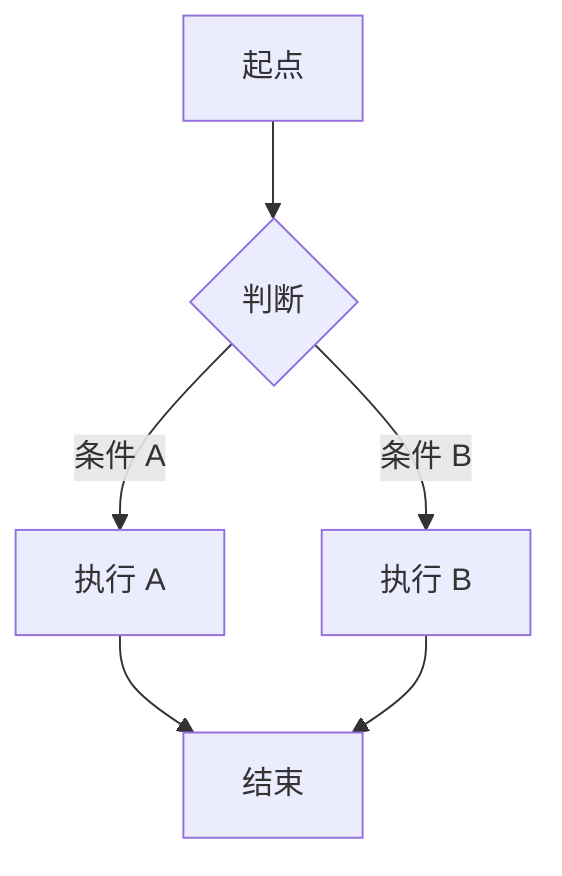

# 需求文档：{{功能名称}}

> 创建日期：{{YYYY-MM-DD}}
> 状态：草稿
> 作者：AI Agent + {{用户}}
> 分支：{{branch}}

## 需求背景

- **为什么做**：
- **要解决什么问题**：
- **预期收益**：

## 涉及平台

| 平台 | 是否涉及 | 说明 |
|------|---------|------|
| Backend | 是 / 否 | |
| Web | 是 / 否 | |
| iOS | 是 / 否 | |
| Android | 是 / 否 | |

## 用户故事

| 编号 | 角色 | 需求 | 验收标准 | 优先级 |
|------|------|------|---------|--------|
| US-01 | | | | P0 / P1 / P2 |

## 功能详述

### 流程：{{流程1名称}}

1. [步骤描述]
2. ...

### 边界与异常

> ⚠️ 边界问题和错误处理是需求中最容易被忽略的部分，必须在 spec 阶段充分覆盖。

#### 错误处理流程

对每个关键用户操作，描述从错误发生到用户感知的完整链路：

| 操作 | 错误类型 | 触发条件 | 系统行为 | 用户感知 |
|------|---------|---------|---------|---------|
| | 网络异常 | | | |
| | 服务端错误 | | | |
| | 数据校验失败 | | | |
| | 权限不足 | | | |
| | 操作超时 | | | |

#### 边界场景

| 场景 | 预期行为 |
|------|---------|
| 网络异常 | |
| 数据为空 | |
| 操作失败 | |
| 并发冲突 | |
| 输入边界值（空字符串、超长文本、特殊字符等） | |
| 重复提交 | |
| 状态不一致（前置条件不满足时触发操作） | |
| 资源不足（存储满、内存不足等） | |

## 非功能性需求

- **性能**：
- **安全性**：
- **兼容性**：

## 依赖

| 依赖项 | 说明 | 状态 |
|--------|------|------|
| | | ✅ 已就绪 / 🚧 待开发 / 📅 规划中 |

## 参考资料

### 已查阅的 wiki 文档

| 文档 | 相关章节 | 关键信息 |
|------|---------|---------|
| | | |

### 已查阅的代码文件

| 文件 | 关键内容 |
|------|---------|
| | |

## 验收标准总览

- [ ] AC-01:
- [ ] AC-02:
