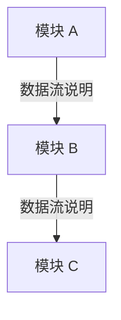

# <架构主题> 架构文档

> 最后更新：YYYY-MM-DD

## 概述

[该架构主题是什么，解决什么问题]

## 架构设计

### 整体架构

[用文字简述各模块之间的关系]

### 架构流程图

[用 Mermaid 描述架构层面的模块关系与数据流向]



### 核心流程调用栈

[列出关键业务路径的代码调用链路，从入口到出口]

#### 流程：<流程名称>

```
入口：<触发条件>

1. <文件名>::<函数名>             — <职责简述>
   └── <文件名>::<函数名>         — <职责简述>
       ├── <文件名>::<函数名>     — <职责简述>
       └── <文件名>::<函数名>     — <职责简述>
           └── <文件名>::<函数名> — <职责简述>
```

| 调用层级 | 文件 | 函数 | 职责 |
|---------|------|------|------|
| 入口 | `path/file.ts:L42` | `entry()` | [职责] |
| 1 | `path/file.ts:L58` | `handler()` | [职责] |
| 2 | `path/file.ts:L80` | `service()` | [职责] |
| 3 | `path/file.ts:L102` | `repository()` | [职责] |

### 设计决策

| 决策 | 原因 | 影响 |
|------|------|------|
| [选择方案 X] | [为什么选 X 而非 Y] | [对系统的影响] |

## 跨端涉及

| 端 | 相关模块/文件 | 说明 |
|----|-------------|------|
| Web | `web/src/.../xxx.ts` | [说明] |
| Android | `android/.../xxx.kt` | [说明] |
| iOS | `ios/.../xxx.swift` | [说明] |
| Backend | `backend/.../xxx.ts` | [说明] |

## 修订历史

| 日期 | 变更摘要 |
|------|---------|
| YYYY-MM-DD | 初始创建 / [变更描述] |

---

*本文档由 llm-wiki skill 自动维护。*
