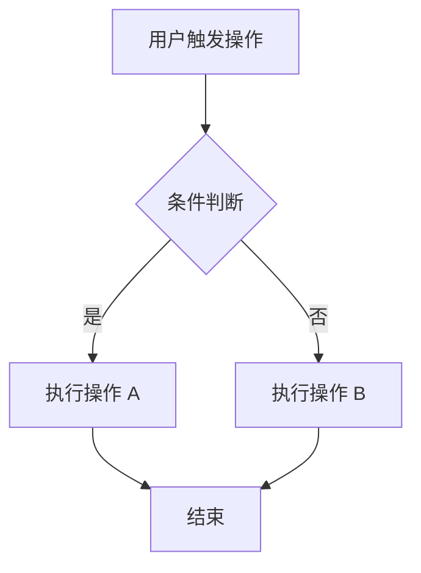

# 功能文档模板

新建功能文档时，按以下结构从代码中提取信息填充。

---

# [功能名称]

> 最后更新：YYYY-MM-DD
> 覆盖端：Web / Android / iOS / Backend

## 功能概述

[一句话描述该功能是什么，以及它在产品中的定位]

## 业务逻辑

[该功能的关键业务流程、交互细节]

### 业务流程图

用 Mermaid 或 ASCII 流程图描述核心业务流程的节点与分支：



### 流程：XXX

1. [步骤 1 描述]
   - 源文件：`.../xxx.ts:L42`
   - [必要时截图说明交互效果]
2. [步骤 2 描述]
   - 源文件：`.../xxx.ts:L58`
3. ...

### 边界与异常处理

| 场景 | 处理方式 | 源文件 |
|------|---------|--------|
| [异常场景 1] | [如何处理] | `.../xxx.ts:L100` |

## 代码架构

### 架构设计

[该功能的整体架构，用文字或 ASCII 流程图描述模块间关系]

```
┌─────────────┐     ┌─────────────┐     ┌─────────────┐
│   Web UI    │────▶│  API Layer  │────▶│   Backend   │
│  Components │     │  (REST)     │     │  Services   │
└─────────────┘     └─────────────┘     └─────────────┘
```

### 各端核心文件

#### Web

| 文件 | 职责 | 关键内容 |
|------|------|---------|
| `web/src/.../xxx.ts` | [职责] | [关键组件/hook/函数说明] |

关键代码片段（如有必要）：

```typescript
// web/src/.../xxx.ts:L42
// 说明：这段代码做了什么
```

#### Android

| 文件 | 职责 | 关键内容 |
|------|------|---------|
| `android/.../xxx.kt` | [职责] | [关键类/方法说明] |

#### iOS

| 文件 | 职责 | 关键内容 |
|------|------|---------|
| `ios/.../xxx.swift` | [职责] | [关键类/方法说明] |

#### Backend

| 文件 | 职责 | 关键内容 |
|------|------|---------|
| `backend/.../xxx.ts` | [职责] | [关键 service/router 说明] |

### 依赖关系

#### 内部依赖

| 功能 | 依赖方式 | 说明 |
|------|---------|------|
| [功能名] | [API 调用 / 共享状态 / 路由跳转] | [具体依赖什么] |

#### 外部依赖

| 服务 | 用途 | 接入方式 |
|------|------|---------|
| [服务名] | [用途] | [SDK/API] |

## API 引用

[不在此处定义 API，改为链接到 wiki/api/]

| 接口 | API 文档 | 说明 |
|------|---------|------|
| `GET /api/xxx` | [api/xxx.md](../api/xxx.md) | [该接口在此功能中的用途] |
| `POST /api/xxx` | [api/xxx.md](../api/xxx.md) | [该接口在此功能中的用途] |

## 入口与路由

[用户从哪些页面/操作可以进入该功能]

| 端 | 入口 | 路由/deeplink | 源文件 |
|----|------|-------------|--------|
| Web | [入口描述] | `/path` | `web/src/xxx.ts:L42` |
| Android | [入口描述] | `Activity/Fragment` | `android/.../xxx.kt:L10` |
| iOS | [入口描述] | `ViewController` | `ios/.../xxx.swift:L10` |

## 状态管理

[该功能涉及的关键状态、持久化存储、缓存策略]

| 状态 | 存储方式 | 作用域 | 说明 | 源文件 |
|------|---------|--------|------|--------|
| [状态名] | [Zustand/localStorage/Supabase/SharedPreferences/UserDefaults] | [全局/页面级] | [说明] | `.../xxx.ts:L15` |

## 已知限制

| 问题 | 影响 | 记录时间 |
|------|------|---------|
| [限制描述] | [影响范围] | YYYY-MM-DD |

## 修订历史

| 日期 | 变更摘要 |
|------|---------|
| YYYY-MM-DD | 初始创建 / [变更描述] |
---

*本文档由 llm-wiki skill 自动维护，从代码中提取。如有不一致，以代码为准。*
