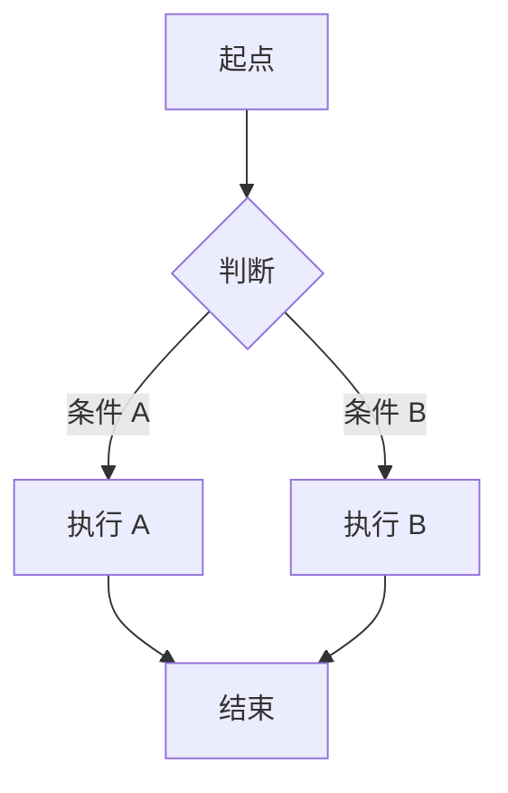

# PRD：{{功能名称}}

> 创建日期：{{YYYY-MM-DD}}
> 状态：草稿 / 已确认
> 作者：AI Agent + {{用户}}

---

## 1. 需求背景

### 1.1 问题描述

- **现状**：<!-- 当前产品在这个功能上的状态 -->
- **痛点**：<!-- 用户遇到了什么问题？为什么要做？ -->
- **竞品参考**：<!-- 竞品怎么做？（引用 product_research 中的具体文档） -->

### 1.2 目标用户

| 用户角色 | 特征描述 | 核心需求 |
|---------|---------|---------|
| | | |

### 1.3 预期目标

- **业务目标**：<!-- 要做成什么效果？ -->

### 1.4 范围定义

| 范围内 | 范围外（明确不做） | 原因 |
|--------|------------------|------|
| | | |

---

## 2. 涉及平台

| 平台 | 是否涉及 | 变更概要 |
|------|---------|---------|
| Backend | ✅ 涉及 / ❌ 不涉及 | |
| Web | ✅ 涉及 / ❌ 不涉及 | |
| iOS | ✅ 涉及 / ❌ 不涉及 | |
| Android | ✅ 涉及 / ❌ 不涉及 | |

---

## 3. 用户故事

| 编号 | 角色 | 需求 | 验收标准 | 涉及平台 | 优先级 |
|------|------|------|---------|---------|--------|
| US-01 | | | | | P0 / P1 / P2 |

---

## 4. 核心流程

### 4.1 US-01：{{用户故事标题}}

#### 用户旅程

1. [步骤 1：用户在什么页面，看到什么？]
2. [步骤 2：用户做了什么操作？系统如何响应？]
3. ...

#### UI/交互要点

| 页面 / 区域 | 交互描述 | 涉及端 | 竞品参考 |
|------------|---------|--------|---------|
| | | | |

#### 关键边界

<!-- 只标注影响产品决策的关键边界场景，不需要穷举。完整异常处理留给 spec -->

| 场景 | 预期行为 |
|------|---------|
| 空数据 | |
| 网络异常 | |

### 4.2 US-02：{{用户故事标题}}

<!-- 重复 4.1 的结构 -->

---

## 5. 依赖

| 依赖项 | 类型 | 说明 | 状态 |
|--------|------|------|------|
| | 内部能力 / 外部服务 / 第三方 SDK | | ✅ 已就绪 / 🚧 待开发 / 📅 规划中 |

---

## 6. 现有功能影响

| 现有功能 | 影响类型 | 说明 |
|---------|---------|------|
| | 新增关联 / 修改行为 / 无影响 | |

---

## 7. 待澄清问题

| 编号 | 问题 | 阻塞 |
|------|------|------|
| Q-01 | | 是 / 否 |

---

## 8. 参考资料

### 竞品调研

| 文档 | 关键发现 |
|------|---------|
| | |

### Wiki 文档

| 文档 | 关键信息 |
|------|---------|
| | |

---

## 9. 变更历史

| 日期 | 变更内容 | 变更原因 |
|------|---------|---------|
| {{YYYY-MM-DD}} | 初始版本 | — |
