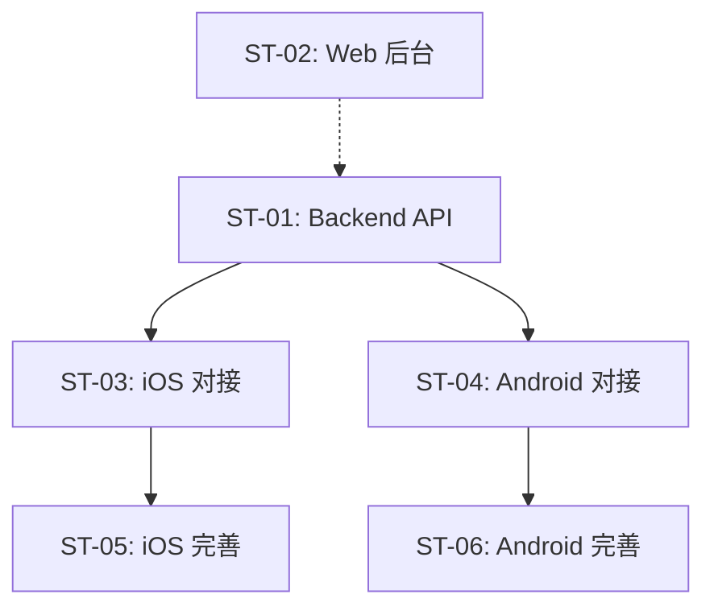

# 子任务拆分：{{功能名称}}

> 关联 PRD：[prd.md](prd.md)
> 创建日期：{{YYYY-MM-DD}}
> 状态：草稿 / Review 中 / 已确认

---

## 工时总览

| 平台 | 子任务数 | 总工时（人日） | 备注 |
|------|---------|--------------|------|
| Backend | N | N | |
| iOS | N | N | |
| Android | N | N | |
| Web | N | N | |
| **合计** | **N** | **N** | |

---

## 迭代规划

| 迭代 | 目标 | 包含子任务 | 交付物 |
|------|------|-----------|--------|
| Sprint 1 | 最小可用（核心链路打通） | ST-01, ST-03, ST-05... | 用户可完成核心操作 |
| Sprint 2 | 完善体验 | ST-02, ST-06... | 补充异常处理和边界场景 |
| Sprint 3 | 辅助功能 | ST-04, ST-07... | P1/P2 用户故事 |

> 单个迭代的时间跨度建议 1-2 周。同一迭代内各端子任务应可并行开发。

---

## 子任务详情

### ST-01：{{子任务名称}}

| 属性 | 值 |
|------|-----|
| **对应 PRD** | US-01 |
| **平台** | Backend / iOS / Android / Web |
| **优先级** | P0 / P1 / P2 |
| **预估工时** | N 人日 |
| **前置依赖** | 无 / ST-XX |
| **迭代** | Sprint 1 |

#### 工作内容

<!-- 精确描述这个子任务需要做什么，给谁做 -->
1.
2.
3.

#### 完成标准

<!-- 如何判断这个子任务完成了？可测试、可验证 -->
- [ ]
- [ ]

#### 涉及 API（如有）

| 方法 | 路径 | 说明 |
|------|------|------|
| GET | `/api/...` | |

#### 涉及 UI/页面（如有）

| 页面/组件 | 说明 | 涉及端 |
|----------|------|--------|
| | | |

---

### ST-02：{{子任务名称}}

<!-- 重复 ST-01 的结构 -->

---

## 子任务依赖图

> 实线箭头 = 必须在依赖完成后才能开始；虚线箭头 = 建议在依赖完成后开始，但可以并行探索

---

## 工时估算说明

<!-- 为什么是这个工时？基于哪些假设？ -->

| 假设 | 说明 |
|------|------|
| | |

## 风险与缓解

| 风险 | 影响 | 概率 | 缓解措施 |
|------|------|------|---------|
| | | | |

---

## 变更历史

| 日期 | 变更内容 | 变更原因 |
|------|---------|---------|
| {{YYYY-MM-DD}} | 初始版本 | — |
