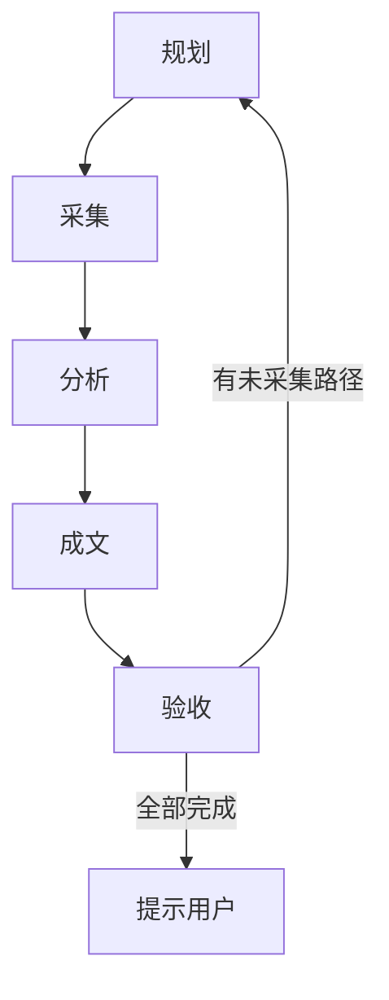

# 竞品业务功能文档化

## 定位

本 skill 将竞品应用的**业务逻辑、交互行为、UI 样式**系统化地采集并整理为结构化文档。

竞品分析是**迭代式深度分析**：
- 用户提供一个入口，每次只分析**一个场景 / 页面 / 路径**
- 每完成一轮分析后，根据采集中发现的新路径规划下一轮
- 使用内置 Task 工具（TaskCreate / TaskUpdate / TaskList）追踪每轮进度
- 循环推进，直到 PROGRESS.md 中所有路径采集完成

## 能力线与目录

能力线分工和目录结构详见 `references/doc-standards.md`。

频道下目录分两种类型：
- **页面型**：按 UI 页面组织，如 `homepage-feed/`，可有子页面层级
- **功能型**：按业务逻辑组织，如 `auth/`（登录流程）、`payment/`（支付流程），通常是跨页面的完整链路

## 工作流总览

每轮迭代 5 个阶段，使用 TaskCreate 创建 5 个 Task 追踪。

## 阶段 1：规划

确定**一条**路径，预制 plan.md。详见 `references/planning.md`。

核心步骤：
1. 读 `PROGRESS.md`，取第一个 `⬜` 路径。不存在则初始化
2. 从用户输入提取竞品、频道、深度（首屏快照/交互流程/异常边界），默认交互流程
3. 按 `assets/plan-template.md` 预制 plan.md 到 `.<页面或功能>/.captures/<日期>-<name>/plan.md`
4. 使用 TaskCreate 创建 5 个 Task（采集/分析/成文/验收/下一轮规划），第一个标记 `in_progress`
5. PROGRESS.md 中该路径置为 `🔄`
6. 直接进入采集阶段，无需等待用户确认。仅首轮用户信息不足（如只说"分析竞品"未指定具体目标）时才反问

## 阶段 2：采集

按 plan.md 操作序列逐步骤执行。详见 `references/mobile-adb.md`（命令参考）。

1. 读取 plan.md，逐步骤执行 ADB 命令
2. 每步完成后**立即回填** plan.md（观察、截图文件、采集日志、勾选执行状态）
3. 全部完成后回填产物清单和异常记录
4. TaskUpdate：采集 → completed，分析 → in_progress

## 阶段 3：分析

多模态分析产物，产出 analysis.md。详见 `references/analysis.md`。

1. 读取 plan.md 和 assets/ 下所有截图/录屏
2. 按分析维度逐一分析，按 `assets/analysis-template.md` 输出
3. 自检后 TaskUpdate：分析 → completed，成文 → in_progress

## 阶段 4：成文

将分析结果合并到业务功能文档。详见 `references/doc-standards.md`。

1. 从 plan.md 确定功能文档路径（`<目录>/<目录>.md`）
2. 存在则增量更新（追加 use case、补充子页面引用），不存在则按 `assets/doc-template.md` 创建
3. 更新附录和各级 index.md
4. TaskUpdate：成文 → completed，验收 → in_progress

## 阶段 5：验收

更新进度，发现新路径，决策下一轮。

1. 自检 plan.md、analysis.md、功能文档的一致性
2. 更新 PROGRESS.md：该路径 → `✅`，填写业务介绍和文档链接
3. 发现新路径：采集中观测到的新页面/新交互入口 → 追加到 PROGRESS.md 末尾
4. TaskUpdate：验收 → completed，下一轮规划 → completed
5. 检查 PROGRESS.md：有 `⬜` → 回阶段 1；全部 `✅` → 提示用户

## 完整示例

### 示例 1：页面型分析

用户：「分析红果的首页 Feed，从冷启动到浏览 Feed 的交互流程」

**阶段 1 — 规划**
- 读 `mobile/PROGRESS.md`（首次使用，不存在）→ 按 `assets/progress-template.md` 初始化
- 写入第一行：路径 `homepage-feed/`，来源：入口，状态：🔄
- 预制 `mobile/homepage-feed/.captures/2026-07-24-homepage-tab/plan.md`
- 创建 5 个 Task，直接进入采集

**阶段 2 — 采集** → 按 plan.md 执行 ADB 截图/录屏，回填 plan.md

**阶段 3 — 分析** → 多模态分析，输出 `analysis.md`

**阶段 4 — 成文** → 创建 `homepage-feed/homepage-feed.md`、`index.md`，更新频道 `index.md`

**阶段 5 — 验收**
- 自检通过，PROGRESS.md 中 `homepage-feed/` → ✅
- 发现新路径：评论、分享、搜索、菜单 → 追加到 PROGRESS.md
- 回到阶段 1（下一个：`homepage-feed/comments`）

### 示例 2：功能型分析

用户：「分析红果的登录注册流程，覆盖手机号登录和第三方登录」

**阶段 1 — 规划**
- 读 `mobile/PROGRESS.md`（已有页面型条目）→ 追加功能型入口 `auth/`
- 预制 `mobile/auth/.captures/2026-07-24-phone-login/plan.md`
- 创建 5 个 Task，直接进入采集

**阶段 2 — 采集** → 首页点击登录 → 登录页 → 输入手机号 → 验证码 → 完成登录

**阶段 3 — 分析** → 登录页 UI、验证码交互、协议勾选、错误状态

**阶段 4 — 成文** → 创建 `auth/auth.md`、`index.md`，更新频道 `index.md`

**阶段 5 — 验收**
- `auth/` → ✅，发现新路径：第三方登录、忘记密码、注册流程 → 追加
- 回到阶段 1（下一个：`auth/third-party-login`）
