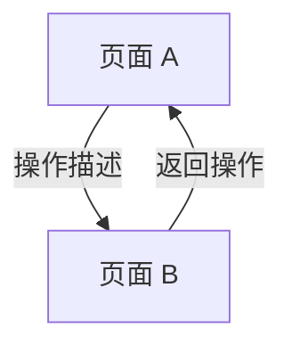

# 竞品分析文档模板

> 本模板用于采集 subagent 完成采集后，分析 subagent 输出结构化分析结果。
> 使用时将 `{{占位符}}` 替换为实际内容，不适用当前采集的章节标注「本次不适用」。
> 本文件保存为 `captures/<YYYY-MM-DD>-<描述>/analysis.md`。

---

# 分析：{{竞品名称}} — {{分析描述}}

## 分析信息

| 项目 | 内容 |
|------|------|
| 分析日期 | {{YYYY-MM-DD}} |
| 对应采集 | [{{采集描述}}](./capture.md) |
| 分析维度 | {{本次覆盖的维度，如"交互流程、UI 布局"}} |

## 交互流程

### 页面跳转关系

> 根据实际采集的交互路径绘制。

### 流程步骤分析

{{按采集文档中的操作序列，逐步骤分析。}}

#### 步骤 1：{{操作描述}}

- **触发**：{{用户操作}}
- **响应**：{{竞品行为}}
- **转场**：{{动画效果描述，如无动画则标注"无转场动画"}}
- **截图引用**：`assets/{{文件名}}.png`

#### 步骤 2：...

## UI 布局详解

{{逐页面分析，每个页面一个子章节。}}

### 页面：{{页面名称}}

| 区域 | 组件 | 位置 | 规格（估算） |
|------|------|------|-------------|
| 顶部 | {{组件}} | 左上/居中/... | 高度约 {{N}}dp，{{颜色}} |
| 中部 | {{组件}} | ... | ... |
| 底部 | {{组件}} | ... | ... |

#### 组件细节

> 精确值直接写数字，估算值加「约」前缀。无法从截图/录屏识别的信息标注「不可观测」。

##### {{组件名}}

- **尺寸**：{{精确值，或"约 {{宽}}×{{高}} dp"}}
- **间距**：与上方元素{{值}}dp，左右边距{{值}}dp
- **字号**：标题{{值}}sp，正文{{值}}sp
- **颜色**：背景 {{#hex}}，文字 {{#hex}}
- **圆角**：{{值}}dp
- **图标**：{{描述或"不可识别"}}

## 业务逻辑分析

{{根据采集覆盖的维度，在以下子章节中填写。未覆盖的章节标注「本次不适用」。}}

### 加载策略

| 场景 | 加载方式 | 耗时（估算） | 说明 |
|------|---------|-------------|------|
| 首屏加载 | {{骨架屏/spinner/空白}} | ~{{N}}s | {{描述}} |
| 加载更多 | {{方式}} | ~{{N}}s | {{描述}} |

### 内容策略

{{仅当采集覆盖了内容相关场景时填写。}}

- **内容组织形式**：{{描述内容的排列、分组方式}}
- **推荐策略（可观测部分）**：{{描述可观测到的推荐行为}} `[推断]`

### 状态管理

{{仅当采集覆盖了异常或边界状态时填写。如未覆盖，标注"本次不适用"。}}

| 状态场景 | UI 表现 | 用户可操作项 | 截图 |
|---------|--------|-------------|------|
| 空状态 | {{描述}} | {{可做什么}} | `assets/{{文件}}.png` |
| 网络错误 | {{描述}} | {{可做什么}} | — |

## 关键发现

{{列出本次分析中最值得关注的 3-5 个发现，按重要性排序。}}

1. **{{发现标题}}**：{{描述，包含具体数据/观察}} `[推断]`（如为主观判断）
2. ...
