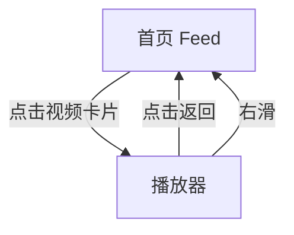

# 竞品业务功能文档模板

> 此模板为占位框架，由用户后续自定义补充。使用时将 `{{占位符}}` 替换为实际内容。
> 如某章节不适用当前分析，标注「本章节不适用」而非直接删除，保持模板一致性。
> 本文件为**功能文档**（合成文档），对应的采集实录见 `captures/` 目录。

---

# {{竞品名称}} — {{功能模块}}

## 基本信息

| 项目 | 内容 |
|------|------|
| 目标竞品 | {{竞品名称}} |
| 竞品版本 | {{版本号，不可获取时注明}} |
| 功能模块 | {{功能模块名称}} |
| 分析平台 | {{mobile / web}} |
| 最后更新 | {{YYYY-MM-DD}} |
| 采集源 | [captures/](../../captures/) — 共 {{N}} 次采集 |

## 功能概览

{{用 2-3 句话概述该功能模块的整体业务逻辑和用户价值。让读者在深入细节前有一个全局认知。}}

## 交互流程

{{按用户操作路径，用文字描述页面之间的跳转关系，辅以截图。}}

> 以上为示意，根据实际交互流程重画。

### 步骤 1：{{操作描述}}

*图：{{截图说明}} | 图源：[采集 {{日期}}](../../captures/{{日期}}-{{描述}}/capture.md)*

**触发**：{{用户做了什么操作}}

**行为**：{{竞品给出了什么响应}}

### 步骤 2：{{操作描述}}

...

## UI 布局详解

{{逐页面分析组件层级和视觉规格。每个页面一个子章节。}}

### {{页面名称}}

| 区域 | 组件 | 规格（估算值） |
|------|------|--------------|
| 顶部 | {{组件名}} | 高度约 {{}}dp，{{}}色 |
| 中部 | {{组件名}} | 字号约 {{}}sp |
| 底部 | {{组件名}} | ... |

*图：{{页面}}整体布局 | 图源：[采集 {{日期}}](../../captures/{{日期}}-{{描述}}/capture.md)*

## 业务逻辑分析

{{分析竞品在该功能上的业务决策和策略，按逻辑维度组织。}}

### 加载策略

{{首屏加载方式、骨架屏/loading、预加载、分页策略等}}

### 内容策略

{{内容组织形式、信息架构、推荐策略（可观测部分）}}

### 状态管理

{{空状态、错误状态、登录状态等各状态下的 UI 和行为}}

### {{其他业务维度}}

{{根据具体功能补充}}

## 关键发现

{{列出分析中最值得关注的细节，每条一个要点。}}

- **{{发现标题}}**：{{详细描述，包含可验证的观察数据}}
- **{{发现标题}}**：{{详细描述}}

## 与自身产品对比

> 本章节由产品团队在阅读本竞品文档后自行填写，不在 skill 自动产出范围内。

## 附录

### A. 采集源索引

| 日期 | 采集文档 | 覆盖内容 |
|------|---------|---------|
| {{日期}} | [{{描述}}](../../captures/{{日期}}-{{描述}}/capture.md) | {{覆盖的操作和场景}} |

### B. 截图索引

| 文件名 | 采集日期 | 内容 |
|--------|---------|------|
| `../../captures/{{日期}}-{{描述}}/assets/{{文件名}}.png` | {{日期}} | {{内容说明}} |

### C. 录屏

- [{{文件名}}](../../captures/{{日期}}-{{描述}}/assets/{{文件名}}.mp4)（采集于 {{日期}}）
  - `0:00–0:05` {{时间点描述}}
  - `0:05–0:12` {{时间点描述}}

### D. 修订历史

| 日期 | 修订记录 | 变更摘要 |
|------|---------|---------|
| {{日期}} | [revisions/{{日期}}-{{描述}}.md](../../revisions/{{日期}}-{{描述}}.md) | {{本次变更摘要}} |

## 待深入

{{列出当前功能模块下尚未覆盖的子功能或交互细节，需要后续采集分析。按优先级排列。}}

| 优先级 | 子功能 | 说明 | 状态 |
|--------|--------|------|------|
| P0 | {{子功能名称，如"下拉刷新"}} | {{需要分析什么，为什么重要}} | 待采集 |
| P1 | {{子功能名称，如"空状态页面"}} | {{需要分析什么}} | 待采集 |
| P2 | {{子功能名称，如"网络异常处理"}} | {{需要分析什么}} | 待采集 |

---

> 本文档基于模拟器操作采集 + 多模态分析生成。`[推断]` 标记的内容为主观判断，请结合实际验证。
> 原始采集实录见 `captures/` 目录。
