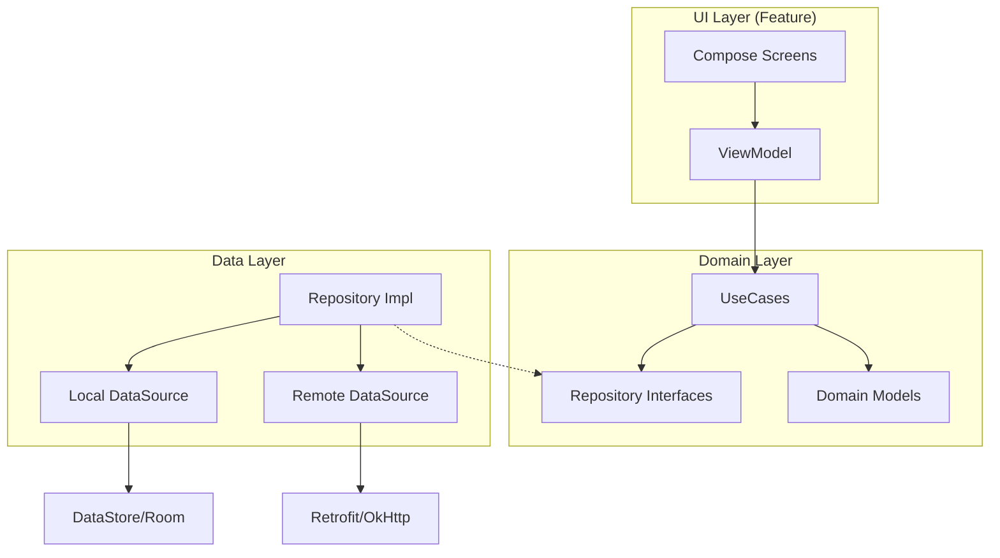
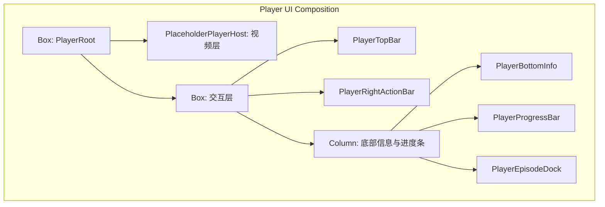
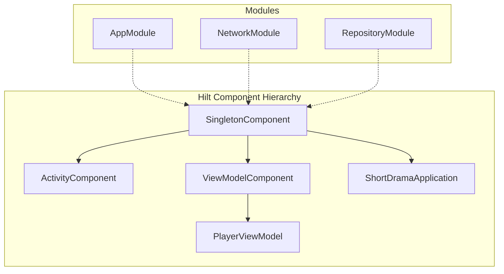
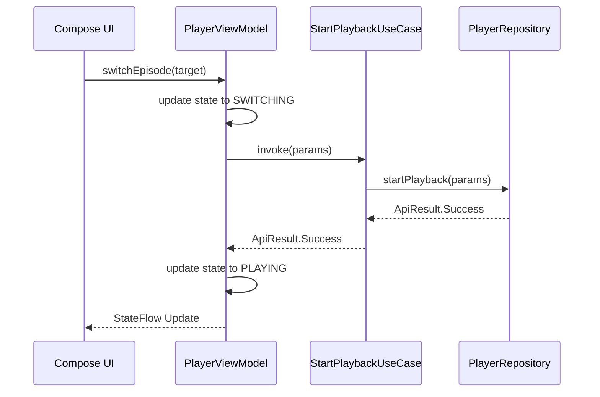
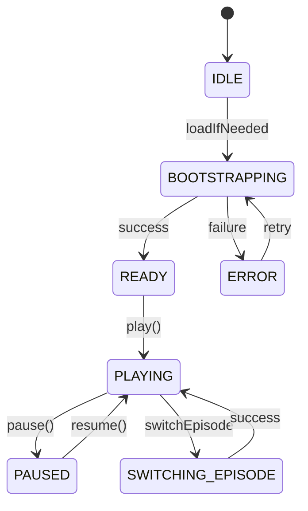

# Android 客户端开发指南（Compose）

## 目录
1. [模块概览](#模块概览)
2. [架构设计原则](#架构设计原则)
3. [Jetpack Compose UI 体系](#jetpack-compose-ui-体系)
   - [状态管理与 Hoisting](#状态管理与-hoisting)
   - [自定义布局与绘图](#自定义布局与绘图)
   - [生命周期管理](#生命周期管理)
4. [Hilt 依赖注入实践](#hilt-依赖注入实践)
   - [组件层次结构](#组件层次结构)
   - [模块配置示例](#模块配置示例)
5. [协程与 Flow 异步数据流](#协程与-flow-异步数据流)
   - [单向数据流 (UDF)](#单向数据流-udf)
   - [错误处理与 ApiResult](#错误处理与-apiresult)
6. [播放器集成与封装](#播放器集成与封装)
   - [Adapter 模式封装](#adapter-模式封装)
   - [播放状态机](#播放状态机)
7. [数据存储与安全](#数据存储与安全)
8. [混淆与多渠道打包](#混淆与多渠道打包)
9. [测试策略](#测试策略)
10. [核心文件索引](#核心文件索引)

## 模块概览

本模块涵盖了 Android 客户端的核心业务逻辑与 UI 实现，基于现代 Android 开发栈（Modern Android Development, MAD）构建。通过对 `android/app/src/main/java/` 目录的扫描，我们识别出该项目遵循严格的清洁架构（Clean Architecture）分层模式。

**统计数据**：
- **总文件数**：约 180 个源文件（包含 DTO、模型、用例、ViewModel 及 UI 组件）。
- **核心子模块**：
  - `core/`: 包含网络配置、依赖注入、主题定义及通用存储逻辑。
  - `data/`: 负责数据获取，包括远程 API 调用（Retrofit）和本地持久化。
  - `domain/`: 业务逻辑核心，定义了领域模型、存储库接口及纯 Kotlin 编写的用例。
  - `feature/`: 按功能垂直切分的 UI 层，每个功能拥有独立的 ViewModel 和 Compose 屏幕。
  - `navigation/`: 集中管理应用的导航图、深层链接（Deeplink）解析及目标定义。

在接下来的章节中，我们将深入探讨这些子模块的实现细节，特别是播放器核心功能、Compose 的状态管理技巧以及 Hilt 的高级配置。

## 架构设计原则

本项目采用清洁架构模式，旨在实现关注点分离（SoC）、易测试性和高度解耦。每一层都有明确的职责边界，且依赖关系始终指向内层（Domain 层）。

下面的图表展示了 Android 端的整体架构层次及数据流向：



整个架构从 `UI Layer` 开始，通过 `ViewModel` 驱动。`ViewModel` 不直接访问数据库或网络，而是通过 `UseCase` 执行特定的业务逻辑。`UseCase` 依赖于 `Domain Layer` 中定义的 `Repository` 接口，而具体的实现则在 `Data Layer` 中完成。这种设计确保了如果未来更换网络库（如从 Retrofit 换成 Ktor），只需修改 `Data Layer`，而不会影响核心业务逻辑和 UI。

**架构关键点**：
- **单向数据流 (UDF)**：UI 观察 ViewModel 暴露的 `StateFlow`，并通过调用 ViewModel 的方法发送事件。
- **依赖倒置**：Domain 层定义接口，Data 层提供实现，通过 Hilt 在运行时进行注入。
- **模型隔离**：`DTO` (Data Transfer Object) 仅存在于 Data 层，通过扩展函数转换为 Domain 层的 `Model`，防止后端 API 变更污染 UI 层。

## Jetpack Compose UI 体系

本项目完全使用 Jetpack Compose 构建声明式 UI。Compose 的核心在于“状态驱动界面”，即界面是状态的函数：`UI = f(State)`。

### 状态管理与 Hoisting

在 `PlayerScreen` 等复杂页面中，状态管理遵循 **状态提升 (State Hoisting)** 原则。ViewModel 维护一个统一的 `UiState` 对象，UI 组件通过 `collectAsState` 观察该状态。

```kotlin
// 示例：PlayerViewModel 中的状态定义
private val _uiState = MutableStateFlow(PlayerUiState(dramaId = dramaId))
val uiState: StateFlow<PlayerUiState> = _uiState.asStateFlow()

// 示例：PlayerScreen 中的状态观察
@Composable
fun PlayerScreen(viewModel: PlayerViewModel = hiltViewModel()) {
    val uiState by viewModel.uiState.collectAsState()
    // ... 根据 uiState 渲染不同的内容变体
}
```

通过将状态提升到 ViewModel，UI 组件变得更加纯粹且易于预览。`PlayerScreen` 根据 `uiState.screenState` 的不同（如 `LOADING`, `ERROR`, `READY`），动态切换显示内容。

### 自定义布局与绘图

由于本项目包含短剧播放器功能，UI 需要处理复杂的层叠关系。`PlayerScreen` 使用了 `Box` 布局来重叠视频渲染层、交互层（点赞、评论按钮）和进度控制层。

在 `PlaceholderPlayerHost.kt` 中，展示了如何使用 Compose 的 `Brush` 和 `Canvas` 思想进行自定义绘图。通过 `verticalGradient` 和 `linearGradient` 模拟视频封面的阴影和光泽感，这在真实视频加载完成前提供了良好的视觉占位。



上述层次结构确保了视频层位于最底部，而所有的交互控件都浮动在视频之上。通过 `Modifier.align()` 精确控制每个组件在屏幕上的位置。

### 生命周期管理

Compose 组件的生命周期与传统的 Activity/Fragment 不同。本项目利用 `LaunchedEffect` 处理页面加载时的副作用（如 `viewModel.loadIfNeeded()`），并使用 `DisposableEffect` 监听系统生命周期事件。

例如，在 `PlayerScreen` 中，当应用进入后台时，需要暂停播放并上报当前进度：

```kotlin
DisposableEffect(lifecycleOwner) {
    val observer = LifecycleEventObserver { _, event ->
        if (event == Lifecycle.Event.ON_STOP) {
            viewModel.onBackgrounded() // 暂停播放并上报进度
        }
    }
    lifecycleOwner.lifecycle.addObserver(observer)
    onDispose {
        lifecycleOwner.lifecycle.removeObserver(observer)
        viewModel.onScreenDisposed()
    }
}
```

这种模式确保了资源能够被及时释放，防止内存泄漏或后台流量消耗。

**Section sources**:
- [PlayerScreen.kt](android/app/src/main/java/com/djs66256/short_drama/feature/player/ui/PlayerScreen.kt)
- [PlayerViewModel.kt](android/app/src/main/java/com/djs66256/short_drama/feature/player/viewmodel/PlayerViewModel.kt)
- [PlaceholderPlayerHost.kt](android/app/src/main/java/com/djs66256/short_drama/feature/player/player/PlaceholderPlayerHost.kt)

## Hilt 依赖注入实践

Hilt 是基于 Dagger 的标准化依赖注入库，它极大地简化了 Android 中的 DI 配置。本项目在 `core/di` 目录下定义了多个模块，按功能划分 bindings。

### 组件层次结构

Hilt 预定义了一系列组件，对应 Android 系统的不同生命周期。本项目主要使用了以下组件：
- `SingletonComponent`: 整个应用生命周期内唯一的单例（如网络客户端、DataStore）。
- `ViewModelComponent`: 绑定到 ViewModel 的生命周期，用于注入 UseCase 或 Repository。
- `ActivityComponent`: 绑定到 Activity。



### 模块配置示例

在 `AppModule.kt` 中，我们定义了全局单例的提供者。特别值得注意的是 **限定符 (Qualifiers)** 的使用，用于区分相同类型的不同实例（例如不同的 CoroutineDispatcher 或 DataStore）。

```kotlin
@Module
@InstallIn(SingletonComponent::class)
object AppModule {
    @Provides
    @Singleton
    @AuthIoDispatcher
    fun provideAuthIoDispatcher(): CoroutineDispatcher = Dispatchers.IO

    @Provides
    @Singleton
    fun provideJson(): Json = Json {
        ignoreUnknownKeys = true
        coerceInputValues = true
    }
}
```

通过 `@AuthIoDispatcher` 自定义注解，我们可以精确控制注入到 Auth 模块的调度器，而不会与其他模块的 IO 调度器混淆。这种细粒度的控制对于大型项目的可维护性至关重要。

**Section sources**:
- [AppModule.kt](android/app/src/main/java/com/djs66256/short_drama/core/di/AppModule.kt)
- [RepositoryModule.kt](android/app/src/main/java/com/djs66256/short_drama/core/di/RepositoryModule.kt)
- [ShortDramaApplication.kt](android/app/src/main/java/com/djs66256/short_drama/ShortDramaApplication.kt)

## 协程与 Flow 异步数据流

本项目深度集成 Kotlin 协程和 Flow，用于处理所有的异步操作。Flow 提供了冷流（Cold Stream）特性，非常适合处理来自数据库或网络的持续更新。

### 单向数据流 (UDF)

在 ViewModel 中，我们使用 `StateFlow` 来管理 UI 状态。`StateFlow` 是一种热流，它始终保持最新的状态值，并在有新订阅者时立即发射当前值。



上面的序列图展示了一个典型的异步操作流程。ViewModel 负责协调状态转换，而具体的业务逻辑（如开始播放）则委托给 UseCase。这种模式保证了 UI 逻辑的简洁和业务逻辑的可重用性。

### 错误处理与 ApiResult

为了统一处理网络错误和异常，项目定义了 `ApiResult` 密封类（Sealed Class）。它包含 `Success`, `Error` 和 `Exception` 三种状态。

在 `PlayerViewModel` 中，通过 `when` 表达式对 `ApiResult` 进行穷举处理：

```kotlin
when (val result = startPlaybackUseCase(params)) {
    is ApiResult.Success -> {
        _uiState.update { it.copy(screenState = PlayerScreenState.PLAYING) }
    }
    is ApiResult.Error -> {
        _uiState.update { it.copy(screenState = PlayerScreenState.ERROR, errorMessage = result.message) }
    }
    is ApiResult.Exception -> {
        _uiState.update { it.copy(screenState = PlayerScreenState.ERROR, errorMessage = "网络异常") }
    }
}
```

这种显式的错误处理方式避免了 `try-catch` 块散落在代码各处，使得异步逻辑更加健壮且易于阅读。

**Section sources**:
- [PlayerViewModel.kt](android/app/src/main/java/com/djs66256/short_drama/feature/player/viewmodel/PlayerViewModel.kt)
- [ApiResult.kt](android/app/src/main/java/com/djs66256/short_drama/core/network/ApiResult.kt)
- [DramaRepositoryImpl.kt](android/app/src/main/java/com/djs66256/short_drama/data/repository/DramaRepositoryImpl.kt)

## 播放器集成与封装

短剧应用的核心是播放器。为了实现高性能和良好的生命周期管理，本项目采用了接口隔离的设计模式。

### Adapter 模式封装

`NativePlayerAdapter` 接口定义了播放器的基本行为（播放、暂停、跳转、释放）。目前的实现是 `PlaceholderNativePlayerAdapter`，但在实际生产环境中，这将被替换为基于 `ExoPlayer` 或 `Media3` 的真实实现。

```kotlin
interface NativePlayerAdapter {
    fun attach(sourceUrl: String)
    fun play()
    fun pause()
    fun seekTo(positionSeconds: Double)
    fun setPlaybackSpeed(speed: Float)
    fun currentPositionSeconds(): Double
    fun release()
}
```

这种封装允许我们在单元测试中使用 Mock 播放器，或者在不同设备上轻松切换不同的播放引擎。

### 播放状态机

播放器的状态转换非常复杂（加载中 -> 播放中 -> 暂停 -> 错误 -> 结束）。我们在 `PlayerUiState` 中定义了 `PlayerScreenState` 枚举来精确跟踪这些状态。



状态机的引入解决了播放器控制逻辑中的竞态条件（Race Conditions）。例如，当用户快速点击“下一集”时，ViewModel 会取消之前的 `requestJob`，确保只有最后一个请求的响应会更新 UI 状态。

**Section sources**:
- [NativePlayerAdapter.kt](android/app/src/main/java/com/djs66256/short_drama/feature/player/player/NativePlayerAdapter.kt)
- [PlayerViewModel.kt](android/app/src/main/java/com/djs66256/short_drama/feature/player/viewmodel/PlayerViewModel.kt)

## 数据存储与安全

本项目结合了多种存储方案以满足不同的安全和性能需求：

1.  **DataStore (Preferences)**：用于存储简单的键值对，如播放进度、用户设置。它是基于协程和 Flow 的，解决了 `SharedPreferences` 的主线程阻塞问题。
2.  **EncryptedSharedPreferences**：用于存储敏感信息（如 Auth Token）。它使用 Android KeyStore 系统自动加密数据，防止 root 设备上的数据泄露。

在 `AppModule.kt` 中可以看到两者的配置：

```kotlin
@Provides
@Singleton
@AuthSessionPreferences
fun provideEncryptedAuthSessionSharedPreferences(
    @ApplicationContext context: Context,
): SharedPreferences {
    val masterKey = MasterKey.Builder(context)
        .setKeyScheme(MasterKey.KeyScheme.AES256_GCM)
        .build()

    return EncryptedSharedPreferences.create(
        context,
        "auth_session.preferences",
        masterKey,
        EncryptedSharedPreferences.PrefKeyEncryptionScheme.AES256_SIV,
        EncryptedSharedPreferences.PrefValueEncryptionScheme.AES256_GCM,
    )
}
```

通过这种方式，开发者无需手动处理加密算法，只需像使用普通 `SharedPreferences` 一样读写即可享受硬件级别的安全保护。

**Section sources**:
- [AppModule.kt](android/app/src/main/java/com/djs66256/short_drama/core/di/AppModule.kt)
- [AuthSessionStore.kt](android/app/src/main/java/com/djs66256/short_drama/core/storage/AuthSessionStore.kt)

## 混淆与多渠道打包

为了保护代码安全并减小 APK 体积，项目配置了 R8 混淆规则。

### Proguard 配置

在 `proguard-rules.pro` 中，我们为关键库（如 Kotlinx Serialization, Hilt, Retrofit）配置了保持规则（Keep Rules）。特别地，对于数据模型类，我们需要防止混淆破坏 JSON 解析：

```proguard
# 保持数据模型（序列化/反序列化）
-keep class com.djs66256.short_drama.data.dto.** { *; }
-keep class com.djs66256.short_drama.domain.model.** { *; }
```

### 多渠道配置

`build.gradle.kts` 利用 `local.properties` 实现了环境隔离。开发者可以在本地文件中配置 `api.base.url`，而无需修改 Gradle 脚本。

```kotlin
val apiBaseUrl = localProperties.getProperty("api.base.url", "http://10.0.2.2:3001/api/")
buildConfigField("String", "API_BASE_URL", "\"$apiBaseUrl\"")
```

此外，通过 `signingConfigs` 和 `buildTypes` 的配合，项目支持一键生成 Release 版本，并自动应用资源缩减（Resource Shrinking）和代码混淆。

**Section sources**:
- [build.gradle.kts](android/app/build.gradle.kts)
- [proguard-rules.pro](android/app/proguard-rules.pro)

## 测试策略

本项目采用了分层测试策略，确保代码质量：

1.  **单元测试 (JUnit 5 + MockK)**：针对 ViewModel, UseCase 和 Repository 进行逻辑验证。使用 `turbine` 库测试 Flow 的发射序列。
2.  **UI 测试 (Compose Test)**：验证 UI 组件的渲染和交互逻辑。
3.  **集成测试**：通过 Hilt 的测试支持，在模拟环境中运行完整的业务流程。

在 `test/` 目录下可以看到大量的测试用例，例如 `PlayerViewModelTest.kt` 验证了各种异常情况下的状态转换。

## 核心文件索引

以下是本项目中最重要的源文件，建议开发者优先阅读：

- **应用入口**：
  - [ShortDramaApplication.kt](android/app/src/main/java/com/djs66256/short_drama/ShortDramaApplication.kt)：Hilt 应用类。
  - [MainActivity.kt](android/app/src/main/java/com/djs66256/short_drama/MainActivity.kt)：应用主 Activity，承载 Compose 容器。

- **播放器核心**：
  - [PlayerScreen.kt](android/app/src/main/java/com/djs66256/short_drama/feature/player/ui/PlayerScreen.kt)：播放器 UI 实现。
  - [PlayerViewModel.kt](android/app/src/main/java/com/djs66256/short_drama/feature/player/viewmodel/PlayerViewModel.kt)：播放器状态与逻辑管理。
  - [NativePlayerAdapter.kt](android/app/src/main/java/com/djs66256/short_drama/feature/player/player/NativePlayerAdapter.kt)：播放器抽象接口。

- **依赖注入**：
  - [AppModule.kt](android/app/src/main/java/com/djs66256/short_drama/core/di/AppModule.kt)：全局单例绑定。
  - [RepositoryModule.kt](android/app/src/main/java/com/djs66256/short_drama/core/di/RepositoryModule.kt)：存储库绑定。

- **数据与领域层**：
  - [DramaRepositoryImpl.kt](android/app/src/main/java/com/djs66256/short_drama/data/repository/DramaRepositoryImpl.kt)：短剧数据获取实现。
  - [StartPlaybackUseCase.kt](android/app/src/main/java/com/djs66256/short_drama/domain/usecase/StartPlaybackUseCase.kt)：开始播放业务用例。

- **配置与构建**：
  - [build.gradle.kts](android/app/build.gradle.kts)：构建脚本与依赖管理。
  - [proguard-rules.pro](android/app/proguard-rules.pro)：混淆规则定义。
