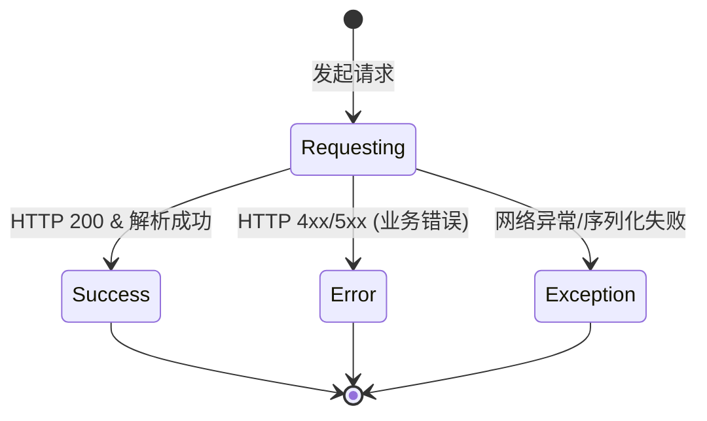
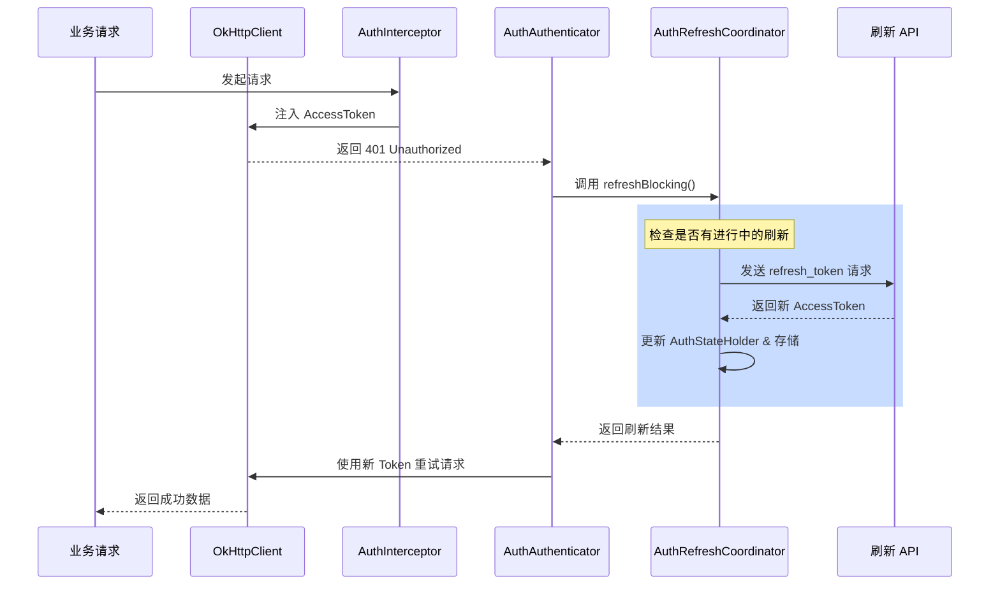
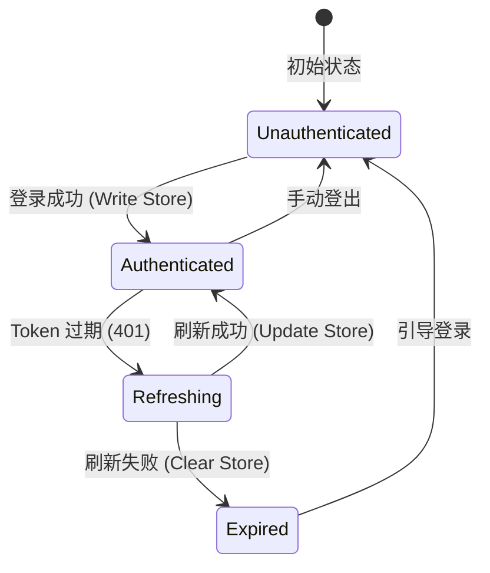
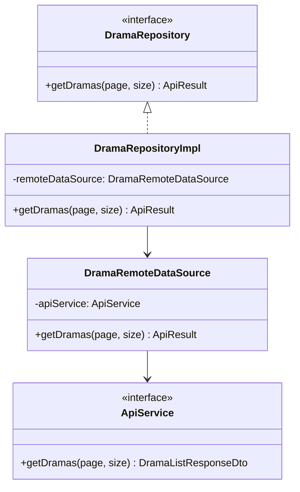
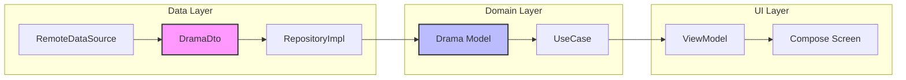

# Hilt 依赖注入与数据架构

## 目录
1. [模块概览](#模块概览)
2. [引言](#引言)
3. [Hilt 依赖注入架构](#hilt-依赖注入架构)
   - [作用域与组件生命周期](#作用域与组件生命周期)
   - [限定符与多实例管理](#限定符与多实例管理)
4. [网络层架构与认证机制](#网络层架构与认证机制)
   - [统一响应处理：ApiResult](#统一响应处理apiresult)
   - [认证拦截器：AuthInterceptor](#认证拦截器authinterceptor)
   - [自动刷新机制：AuthRefreshCoordinator](#自动刷新机制authrefreshcoordinator)
5. [数据存储与会话管理](#数据存储与会话管理)
   - [加密存储：EncryptedSharedPreferences](#加密存储encryptedsharedpreferences)
   - [结构化存储：DataStore](#结构化存储datastore)
6. [Clean Architecture 实践与数据流转](#clean-architecture-实践与数据流转)
   - [领域层 (Domain Layer)](#领域层-domain-layer)
   - [数据层 (Data Layer)](#数据层-data-layer)
   - [模型转换逻辑](#模型转换逻辑)
7. [核心组件分析](#核心组件分析)
8. [文件引用](#文件引用)

## 模块概览

本章节深入探讨 Android 端的核心底层架构，重点在于依赖注入（DI）的组织方式、网络层的健壮性设计以及遵循 Clean Architecture 原则的数据流转机制。该架构支撑了整个短剧应用的高效运行，确保了业务逻辑与底层基础设施的解耦。

### 文件规模与分布
根据对代码库的扫描，本模块涉及的核心目录及文件分布如下：

*   **总文件数**：约 128 个 Kotlin 源文件。
*   **核心目录分布**：
    *   `core/di/` (5 个文件)：定义了 Hilt 的模块配置，包括应用级单例、网络组件和存储组件的绑定。
    *   `core/network/` (6 个文件)：封装了基于 Retrofit 和 OkHttp 的网络请求链路，包含认证、拦截和响应处理逻辑。
    *   `core/storage/` (6 个文件)：管理本地持久化，涵盖加密 Prefs 和 DataStore 的实现。
    *   `data/` (41 个文件)：数据层实现，包含 `datasource`（远程/本地数据源）、`dto`（数据传输对象）和 `repository`（存储库实现）。
    *   `domain/` (70 个文件)：领域层抽象，包含 `model`（领域模型）、`repository`（接口定义）和 `usecase`（业务用例）。

### 覆盖范围说明
本文将深度解析 `core/` 下的 DI、网络和存储机制，并以 `Drama`（短剧）业务为例，透视 `data/` 和 `domain/` 目录下的 Clean Architecture 实践。对于 `data/dto` 和 `domain/model` 中大量的 POJO 类，我们将重点分析其转换逻辑而非逐一罗列。

## 引言

在现代 Android 开发中，架构的健壮性直接决定了应用的可维护性和扩展性。本项目采用了 **Hilt** 作为依赖注入框架，配合 **Clean Architecture**（洁净架构）思想，构建了一个层次分明、职责清晰的底层框架。

核心设计目标包括：
1.  **解耦**：通过依赖注入和接口抽象，使 UI 层不直接依赖于数据源实现。
2.  **安全性**：对敏感的认证信息（如 Access Token）进行加密存储，并在网络传输中自动处理过期刷新。
3.  **一致性**：通过 `ApiResult` 统一处理成功、业务错误和系统异常，简化调用方的逻辑判断。
4.  **可测试性**：各层级之间通过接口通信，便于编写单元测试和集成测试。

这种架构不仅能够应对复杂的业务需求（如短剧播放、评论互动、签到系统等），还为未来的功能扩展（如多数据源缓存、离线播放等）打下了坚实的基础。

## Hilt 依赖注入架构

Hilt 是基于 Dagger 2 的依赖注入库，它通过预定义的组件和作用域简化了 Android 中的 DI 配置。本项目充分利用了 Hilt 的特性，将不同职责的组件组织在不同的 Module 中。

### 作用域与组件生命周期

在 `AppModule.kt` 和 `NetworkModule.kt` 中，大多数基础组件都使用了 `@Singleton` 作用域，这意味着它们的生命周期与 `Application` 绑定。

*   **SingletonComponent**：用于存放全局唯一的实例，如 `OkHttpClient`、`Retrofit`、`AuthSessionStore` 等。
*   **ViewModelComponent**：用于注入 `Repository` 和 `UseCase` 到 ViewModel 中，确保业务逻辑实例在 ViewModel 生命周期内有效。

通过这种层次化的管理，我们确保了资源的有效利用，同时也避免了不必要的内存泄漏。

### 限定符与多实例管理

在复杂的网络应用中，往往需要多套 OkHttp 客户端。例如，普通的业务请求需要携带认证 Token，而刷新 Token 的请求则不能携带旧 Token 以免引起循环验证。

本项目通过自定义限定符（Qualifiers）解决了这一问题：
*   `@RefreshOkHttpClient`：用于 Token 刷新的 OkHttp 实例，仅包含日志拦截器。
*   `@RefreshApiService`：关联到刷新专用 Retrofit 实例的 API 服务接口。

这种设计模式确保了依赖注入的精确性，避免了手动构造实例时可能出现的配置错误。

下图展示了 Hilt 在项目中的依赖注入链路：

```mermaid
graph TB
    subgraph "AppModule (SingletonComponent)"
        AC[AppConfig]
        JS[Json]
        SS[AuthSessionStore]
    end

    subgraph "NetworkModule (SingletonComponent)"
        LI[LoggingInterceptor]
        AI[AuthInterceptor]
        AA[AuthAuthenticator]
        OK[OkHttpClient]
        ROK[@RefreshOkHttpClient]
        RF[Retrofit]
        AS[ApiService]
        RAS[@RefreshApiService]
    end

    subgraph "RepositoryModule (ViewModelComponent)"
        DR[DramaRepository]
        AR[AuthRepository]
    end

    AC --> LI
    JS --> RF
    AI --> OK
    AA --> OK
    LI --> OK
    LI --> ROK
    OK --> RF
    RF --> AS
    ROK --> RAS
    AS --> DR
    SS --> AR
```

在上述架构中，`AppModule` 提供了基础的配置和序列化工具。`NetworkModule` 则是核心，它构建了两套网络请求链路：一套是带认证的常规链路，另一套是用于 Token 刷新的干净链路。`RepositoryModule` 将这些底层服务封装成业务接口，供 UI 层使用。

**Section sources**:
- [AppModule.kt](android/app/src/main/java/com/djs66256/short_drama/core/di/AppModule.kt)
- [NetworkModule.kt](android/app/src/main/java/com/djs66256/short_drama/core/di/NetworkModule.kt)
- [NetworkQualifiers.kt](android/app/src/main/java/com/djs66256/short_drama/core/di/NetworkQualifiers.kt)

## 网络层架构与认证机制

网络层是应用与服务器通信的桥梁。本项目基于 Retrofit 和 OkHttp 构建了一套高度自动化的网络请求处理机制。

### 统一响应处理：ApiResult

为了统一处理网络请求的各种结果，项目定义了 `ApiResult` 密封类（Sealed Class）。它将结果分为三种状态：
1.  `Success`：包含成功的业务数据。
2.  `Error`：包含后端返回的错误码（Code）和错误信息（Message）。
3.  `Exception`：处理网络连接超时、序列化失败等系统级异常。

下图展示了 `ApiResult` 的状态流转逻辑：



`ApiResult` 作为一个容器，承载了网络请求的最终命运。在 `DataLayer` 中，我们通过 `execute` 扩展函数将 Retrofit 的原生响应包装进这个密封类中。这种做法使得上层（UseCase 和 ViewModel）可以优雅地使用 `when` 表达式处理所有可能的情况，而不需要处理繁琐的 try-catch。

### 认证拦截器：AuthInterceptor

`AuthInterceptor` 是一个 OkHttp 拦截器，负责在请求发出前自动注入 `Authorization: Bearer <token>` 请求头。它通过 `requiresAuth()` 方法智能判断当前请求是否需要认证，避免在公开接口（如登录、健康检查）中泄露 Token。

### 自动刷新机制：AuthRefreshCoordinator

这是本项目中最复杂的网络逻辑之一。当服务器返回 401 错误时，`AuthAuthenticator` 会触发 `AuthRefreshCoordinator` 进行 Token 刷新。

以下是 Token 刷新机制的时序图：



该流程确保了用户感知的无缝体验：即使 Access Token 过期，应用也能在后台自动完成续期并重试失败的请求，而无需用户重新登录。`AuthRefreshCoordinator` 使用了 `CompletableFuture` 和 `synchronized` 锁来协调并发，确保多个并发 401 请求只会触发一次真实的刷新调用。

**Section sources**:
- [ApiResult.kt](android/app/src/main/java/com/djs66256/short_drama/core/network/ApiResult.kt)
- [AuthInterceptor.kt](android/app/src/main/java/com/djs66256/short_drama/core/network/AuthInterceptor.kt)
- [AuthAuthenticator.kt](android/app/src/main/java/com/djs66256/short_drama/core/network/AuthAuthenticator.kt)
- [AuthRefreshCoordinator.kt](android/app/src/main/java/com/djs66256/short_drama/core/network/AuthRefreshCoordinator.kt)

## 数据存储与会话管理

应用需要持久化多种类型的数据，从敏感的登录凭证到简单的用户偏好设置。

### 加密存储：EncryptedSharedPreferences

对于 `AuthSession`（包含 Access Token 和 Refresh Token），安全性是第一位的。项目使用了 Android Jetpack Security 库中的 `EncryptedSharedPreferences`。

下图展示了认证会话的状态生命周期：



通过 `EncryptedSharedPreferences` 存储的会话数据在物理层面是加密的，这确保了即使设备被 Root 或备份，攻击者也无法直接读取明文 Token。

### 结构化存储：DataStore

对于非敏感的结构化数据（如播放进度、签到状态、搜索历史），项目采用了 `Jetpack DataStore (Preferences)`。相比传统的 SharedPreferences，DataStore 提供了：
*   **协程支持**：天然异步，避免主线程阻塞。
*   **一致性保证**：通过原子更新防止数据损坏。

在 `AppModule` 中，我们为不同的业务领域定义了独立的 DataStore 实例（如 `PlaybackSessionDataStore`、`CheckInDataStore`），实现了存储空间的逻辑隔离。

**Section sources**:
- [AuthSessionStore.kt](android/app/src/main/java/com/djs66256/short_drama/core/storage/AuthSessionStore.kt)
- [EncryptedPrefsAuthSessionStore.kt](android/app/src/main/java/com/djs66256/short_drama/core/storage/EncryptedPrefsAuthSessionStore.kt)
- [AppModule.kt](android/app/src/main/java/com/djs66256/short_drama/core/di/AppModule.kt)

## Clean Architecture 实践与数据流转

本项目严格遵循 Clean Architecture 的分层原则，将应用划分为领域层、数据层和表现层（UI）。这种结构保证了业务逻辑的纯粹性，不受外部库或框架变动的影响。

### 领域层 (Domain Layer)

领域层是应用的核心，它不依赖于任何 Android 框架类。
*   **Model**：如 `Drama.kt`，定义了业务实体的结构。
*   **Repository 接口**：定义了数据获取的契约，但不涉及具体实现。
*   **UseCase**：如 `GetDramasUseCase.kt`，封装了具体的业务逻辑。

### 数据层 (Data Layer)

数据层负责具体的数据获取和存储实现。
*   **DataSource**：如 `DramaRemoteDataSource`，直接与 `ApiService` 交互。
*   **Repository 实现**：如 `DramaRepositoryImpl`，它是数据流转的枢纽。

下图展示了数据层组件之间的类关系：



这种层次结构确保了 `DramaRepositoryImpl` 可以作为唯一的真相来源（Single Source of Truth），它负责协调远程数据源和可能的本地缓存。

### 模型转换逻辑

为了隔离后端接口的变化，项目在 `data/dto` 中定义了数据传输对象（DTO），并在其中实现了 `toDomain()` 扩展函数。

以下是典型的数据流转图：



在这种流转模式中，`DramaDto` 到 `Drama Model` 的转换是关键的解耦点。如果后端修改了 JSON 字段名，我们只需要修改 `DramaDto` 的注解，而无需改动 `UseCase` 或 UI 代码。

**Section sources**:
- [DramaRepositoryImpl.kt](android/app/src/main/java/com/djs66256/short_drama/data/repository/DramaRepositoryImpl.kt)
- [DramaRemoteDataSource.kt](android/app/src/main/java/com/djs66256/short_drama/data/datasource/DramaRemoteDataSource.kt)
- [GetDramasUseCase.kt](android/app/src/main/java/com/djs66256/short_drama/domain/usecase/GetDramasUseCase.kt)
- [DramaDto.kt](android/app/src/main/java/com/djs66256/short_drama/data/dto/DramaDto.kt)

## 核心组件分析

本节展示了支撑上述架构的关键代码片段，重点在于其设计意图和实现细节。

### 1. 自动刷新协调器 (AuthRefreshCoordinator)

该组件解决了网络请求中臭名昭著的“并发 401”问题。通过 `CompletableFuture`，它实现了优雅的请求合并。

```kotlin
@Singleton
class AuthRefreshCoordinator @Inject constructor(
    @RefreshApiService private val refreshApiService: ApiService,
    private val authStateHolder: AuthStateHolder,
    // ...
) {
    private val lock = Any()
    @Volatile
    private var inFlightRefresh: CompletableFuture<ApiResult<AuthSession>>? = null

    fun refreshBlocking(): ApiResult<AuthSession> {
        val refreshToken = authStateHolder.refreshToken() ?: return errorResult()

        var shouldExecute = false
        val future = synchronized(lock) {
            inFlightRefresh ?: CompletableFuture<ApiResult<AuthSession>>().also {
                inFlightRefresh = it
                shouldExecute = true
            }
        }

        if (shouldExecute) {
            val result = runBlocking(ioDispatcher) { performRefresh(refreshToken) }
            future.complete(result)
            synchronized(lock) { inFlightRefresh = null }
        }
        return future.get() // 阻塞等待进行中的刷新任务
    }
}
```

> 💡 **设计分析**：使用 `runBlocking` 虽然在协程中通常被视为反模式，但在 OkHttp 的 `Authenticator` 同步回调中，这是将异步刷新逻辑桥接到同步网络调用链的必要手段。

### 2. 存储库实现与模型映射 (DramaRepositoryImpl)

这是 Clean Architecture 中数据流转的典型实现，展示了如何处理从 DTO 到领域模型的转换。

```kotlin
@Singleton
class DramaRepositoryImpl @Inject constructor(
    private val remoteDataSource: DramaRemoteDataSource,
) : DramaRepository {

    override suspend fun getDramas(page: Int, pageSize: Int): ApiResult<List<Drama>> {
        return when (val result = remoteDataSource.getDramas(page, pageSize)) {
            is ApiResult.Success -> {
                // 执行 DTO 到 Domain 的映射转换
                val domainDramas = result.data.data.map(DramaDto::toDomain)
                ApiResult.Success(domainDramas)
            }
            is ApiResult.Error -> result
            is ApiResult.Exception -> result
        }
    }
}
```

### 3. 统一错误解析逻辑

在 `RemoteDataSource` 基类逻辑中，我们通过解析后端的 `ErrorDto` 来提供友好的错误提示。

```kotlin
private fun parseErrorResult(httpException: HttpException): ApiResult.Error {
    val errorBody = httpException.response()?.errorBody()?.string().orEmpty()
    val parsedError = runCatching {
        json.decodeFromString(ErrorDto.serializer(), errorBody)
    }.getOrNull()

    return ApiResult.Error(
        code = parsedError?.error?.code.orEmpty().ifBlank { "HTTP_${httpException.code()}" },
        message = parsedError?.error?.message.orEmpty().ifBlank { "请求失败，请重试" }
    )
}
```

**Section sources**:
- [AuthRefreshCoordinator.kt](android/app/src/main/java/com/djs66256/short_drama/core/network/AuthRefreshCoordinator.kt)
- [DramaRepositoryImpl.kt](android/app/src/main/java/com/djs66256/short_drama/data/repository/DramaRepositoryImpl.kt)
- [DramaRemoteDataSource.kt](android/app/src/main/java/com/djs66256/short_drama/data/datasource/DramaRemoteDataSource.kt)

## 文件引用

以下是本章节涉及的关键架构文件，按功能模块分类：

### 核心配置与 DI (Core DI)
- [AppModule.kt](android/app/src/main/java/com/djs66256/short_drama/core/di/AppModule.kt) - 应用级全局绑定
- [NetworkModule.kt](android/app/src/main/java/com/djs66256/short_drama/core/di/NetworkModule.kt) - 网络组件配置
- [RepositoryModule.kt](android/app/src/main/java/com/djs66256/short_drama/core/di/RepositoryModule.kt) - 业务存储库绑定

### 网络与认证 (Core Network)
- [ApiService.kt](android/app/src/main/java/com/djs66256/short_drama/core/network/ApiService.kt) - Retrofit 接口定义
- [AuthInterceptor.kt](android/app/src/main/java/com/djs66256/short_drama/core/network/AuthInterceptor.kt) - 认证请求头注入
- [AuthAuthenticator.kt](android/app/src/main/java/com/djs66256/short_drama/core/network/AuthAuthenticator.kt) - 401 自动重试触发器
- [AuthRefreshCoordinator.kt](android/app/src/main/java/com/djs66256/short_drama/core/network/AuthRefreshCoordinator.kt) - 并发刷新协调器
- [ApiResult.kt](android/app/src/main/java/com/djs66256/short_drama/core/network/ApiResult.kt) - 统一响应封装

### 数据持久化 (Core Storage)
- [AuthSessionStore.kt](android/app/src/main/java/com/djs66256/short_drama/core/storage/AuthSessionStore.kt) - 会话存储接口
- [EncryptedPrefsAuthSessionStore.kt](android/app/src/main/java/com/djs66256/short_drama/core/storage/EncryptedPrefsAuthSessionStore.kt) - 加密存储实现

### 业务数据流 (Data & Domain)
- [DramaRepository.kt](android/app/src/main/java/com/djs66256/short_drama/domain/repository/DramaRepository.kt) - 领域层接口
- [DramaRepositoryImpl.kt](android/app/src/main/java/com/djs66256/short_drama/data/repository/DramaRepositoryImpl.kt) - 数据层实现
- [DramaRemoteDataSource.kt](android/app/src/main/java/com/djs66256/short_drama/data/datasource/DramaRemoteDataSource.kt) - 远程数据源
- [DramaDto.kt](android/app/src/main/java/com/djs66256/short_drama/data/dto/DramaDto.kt) - 数据传输对象与转换逻辑
- [Drama.kt](android/app/src/main/java/com/djs66256/short_drama/domain/model/Drama.kt) - 领域模型
- [GetDramasUseCase.kt](android/app/src/main/java/com/djs66256/short_drama/domain/usecase/GetDramasUseCase.kt) - 业务用例实现
