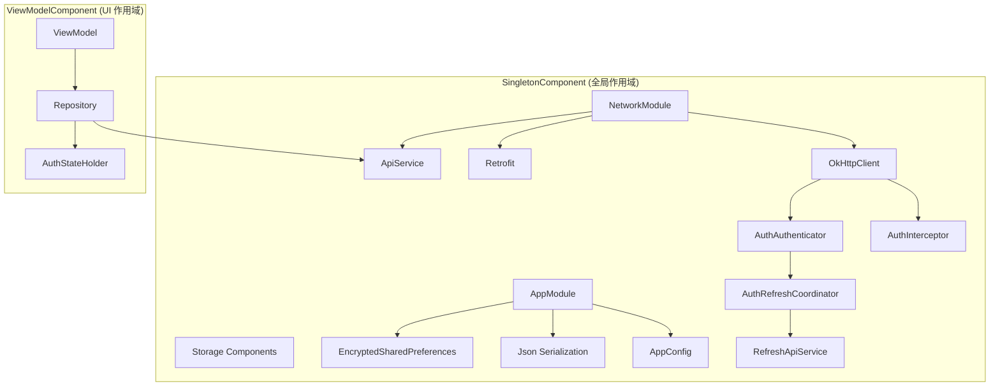
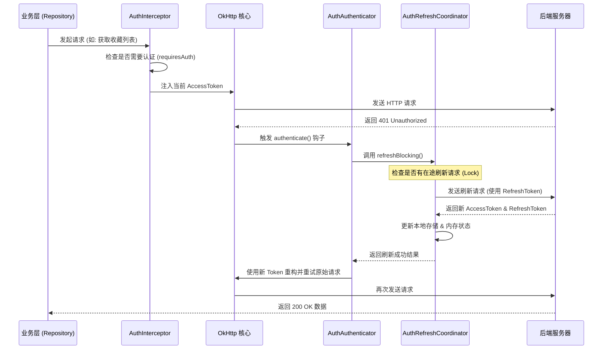
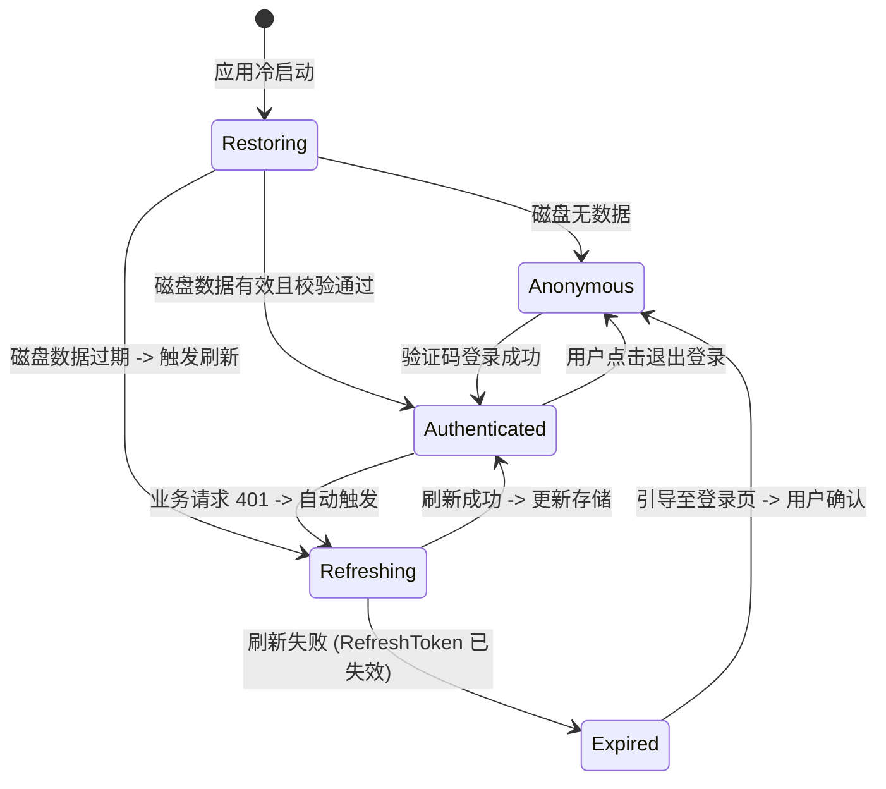

# 依赖注入与核心基础设施

## 目录
1. [模块概览](#模块概览)
2. [依赖注入 (DI) 架构深度解析](#依赖注入-di-架构深度解析)
   - [Hilt 组件作用域与单例管理策略](#hilt-组件作用域与单例管理策略)
   - [自定义限定符 (Qualifiers) 的精准注入](#自定义限定符-qualifiers-的精准注入)
   - [依赖注入架构图谱](#依赖注入架构图谱)
3. [网络层 (Network) 基础设施](#网络层-network-基础设施)
   - [基于 Retrofit 与 OkHttp 的双客户端架构](#基于-retrofit-与-okhttp-的双客户端架构)
   - [ApiResult 统一响应包装与解耦](#apiresult-统一响应包装与解耦)
   - [认证拦截器与 401 自动刷新机制](#认证拦截器与-401-自动刷新机制)
   - [网络请求生命周期时序图](#网络请求生命周期时序图)
4. [持久化存储层 (Storage) 方案](#持久化存储层-storage-方案)
   - [Jetpack DataStore 的响应式持久化](#jetpack-datastore-的响应式持久化)
   - [EncryptedSharedPreferences 与 Android Keystore 安全实践](#encryptedsharedpreferences-与-android-keystore-安全实践)
   - [存储方案对比与选型逻辑](#存储方案对比与选型逻辑)
5. [认证核心 (Auth) 与状态机](#认证核心-auth-与状态机)
   - [AuthStateHolder 全局登录态管理](#authstateholder-全局登录态管理)
   - [AuthBootstrapper 启动恢复与静默刷新流程](#authbootstrapper-启动恢复与静默刷新流程)
   - [认证状态机转换图](#认证状态机转换图)
6. [配置管理 (Config) 与环境隔离](#配置管理-config-与环境隔离)
7. [错误处理与弹性设计](#错误处理与弹性设计)
8. [核心组件职责表](#核心组件职责表)
9. [文件参考](#文件参考)

## 模块概览

本模块（`core`）是整个 Android 应用程序的底层支柱，承载了应用启动、依赖管理、网络通信、数据持久化以及安全认证等核心功能。它位于架构的最底层，为上层所有业务 Feature 模块（如剧集播放、用户中心、搜索等）提供统一的 API 契约和基础能力支持。

通过对 `core` 目录的深度扫描，我们识别出以下核心能力：
- **文件规模**：共计 24 个 Kotlin 文件，实现了高度模块化和关注点分离的底层架构。
- **子模块划分**：
  - `di/`：基于 Hilt 的依赖注入配置，定义了全局单例的生命周期与作用域，是组件间通信的纽带。
  - `network/`：封装了健壮的网络请求链路，实现了 Token 自动刷新、并发请求去重以及统一的错误包装。
  - `storage/`：结合了 `Jetpack DataStore` 的高性能响应式存储与 `EncryptedSharedPreferences` 的硬件级加密存储。
  - `auth/`：维护全局身份认证状态，确保应用在各种生命周期阶段（启动、前后台切换、Token 过期）都能正确处理用户会话。
  - `config/`：抽象化编译期配置，实现了环境参数的解耦，方便进行多渠道打包与自动化测试。

本章节将从实现细节、架构设计决策以及核心流程三个维度，对这些底层设施进行全方位的剖析。

## 依赖注入 (DI) 架构深度解析

依赖注入（Dependency Injection）是本项目解耦的核心手段。我们选择了 Google 推荐的 **Hilt** 框架，它在 Dagger 的基础上提供了更简洁的 API 和预定义的 Android 组件作用域。

### Hilt 组件作用域与单例管理策略

在 `AppModule.kt` 和 `NetworkModule.kt` 中，我们大量使用了 `@Singleton` 作用域。这意味着受管对象在整个 `Application` 的生命周期内是唯一的。这种设计确保了像 `Retrofit`、`OkHttpClient` 和 `AuthStateHolder` 这样的重型对象不会被重复创建，从而节省了系统资源并保证了状态的一致性。

- **AppModule**：主要负责提供 Android 系统相关的组件，例如 `ApplicationContext`、加密的 `SharedPreferences` 实例以及各种用途的 `DataStore`。
- **NetworkModule**：专注于网络协议栈的构建。它将网络请求细分为“普通业务请求”和“Token 刷新请求”，并为两者提供了不同的配置。

### 自定义限定符 (Qualifiers) 的精准注入

在复杂的应用中，经常会遇到“同类型不同实例”的情况。例如，应用中有四个不同的 `DataStore<Preferences>` 实例，分别用于存储：通用偏好、验证码冷却时间、播放进度和签到状态。

为了解决这个问题，我们在 `StorageQualifiers.kt` 中定义了多个自定义限定符：
- `@AppPreferencesDataStore`
- `@AuthCooldownDataStore`
- `@PlaybackSessionDataStore`
- `@CheckInDataStore`

通过这种方式，Hilt 能够在编译期精确地将正确的实例注入到对应的仓库类中，彻底消除了注入歧义。

### 依赖注入架构图谱

下面的架构图展示了 Hilt 容器中核心组件的层级关系与依赖流向。



该图清晰地展示了依赖的层级结构。底层组件（如 `AppConfig` 和 `Json`）被注入到网络层和存储层，而网络层和存储层又共同支撑起业务仓库层。这种单向依赖流确保了架构的整洁性和可测试性。

**Section sources**:
- [AppModule.kt](android/app/src/main/java/com/djs66256/short_drama/core/di/AppModule.kt)
- [NetworkModule.kt](android/app/src/main/java/com/djs66256/short_drama/core/di/NetworkModule.kt)
- [NetworkQualifiers.kt](android/app/src/main/java/com/djs66256/short_drama/core/di/NetworkQualifiers.kt)
- [StorageQualifiers.kt](android/app/src/main/java/com/djs66256/short_drama/core/di/StorageQualifiers.kt)

## 网络层 (Network) 基础设施

网络层不仅是数据的搬运工，更是应用安全与稳定性的第一道防线。我们基于 Retrofit 2 和 OkHttp 4 构建了一套高度自动化的请求处理系统。

### 基于 Retrofit 与 OkHttp 的双客户端架构

我们在 `NetworkModule` 中实现了双客户端设计，以解决 Token 刷新时的死循环问题：
1. **主客户端 (Default OkHttpClient)**：挂载了 `AuthInterceptor` 和 `AuthAuthenticator`。它负责处理 99% 的业务请求，自动注入 Token 并在失效时触发刷新。
2. **刷新客户端 (@RefreshOkHttpClient)**：是一个精简版的客户端，仅包含日志拦截器。它专门用于调用 `/auth/session-refreshes` 接口。由于它不包含认证拦截器，因此即使刷新请求本身失败，也不会再次触发 `Authenticator`，从而避免了无限递归。

### ApiResult 统一响应包装与解耦

为了让上层业务逻辑（ViewModel/UseCase）不需要处理底层的 HTTP 状态码或 IOException，我们定义了 `ApiResult` 密封类：

```kotlin
sealed class ApiResult<out T> {
    data class Success<T>(val data: T) : ApiResult<T>()
    data class Error(val code: String, val message: String) : ApiResult<Nothing>()
    data class Exception(val throwable: Throwable) : ApiResult<Nothing>()
}
```

- **Success**：代表请求成功且业务逻辑正常。
- **Error**：代表服务器返回了 4xx/5xx 错误，或者业务逻辑报错（如“余额不足”）。
- **Exception**：代表发生了非预期的错误，如网络断开或 JSON 解析失败。

这种包装机制使得业务代码可以使用 `when` 表达式优雅地处理各种结果，提高了代码的健壮性。

### 认证拦截器与 401 自动刷新机制

这是本项目网络层最复杂也最核心的部分。
- **AuthInterceptor**：在每个请求发出前，检查其是否需要认证（通过 `requiresAuth()`），如果需要则从 `AuthStateHolder` 获取最新的 AccessToken 并注入 Header。
- **AuthAuthenticator**：当服务器返回 401 时，OkHttp 会自动触发此组件。它会调用 `AuthRefreshCoordinator.refreshBlocking()`。
- **AuthRefreshCoordinator**：这是刷新逻辑的“指挥官”。它使用 `CompletableFuture` 实现了一个同步锁机制。当多个并发请求同时返回 401 时，它们会在此排队。第一个到达的请求会发起真正的刷新网络调用，后续请求则直接等待并复用第一个请求的结果。

### 网络请求生命周期时序图

下图详细描述了一个受保护的 API 请求在遇到 Token 过期时的处理流程。



通过这套机制，用户在 Token 过期时几乎感知不到任何异常，应用会自动完成“失效 -> 刷新 -> 重试”的全过程，极大地提升了用户体验。

**Section sources**:
- [ApiService.kt](android/app/src/main/java/com/djs66256/short_drama/core/network/ApiService.kt)
- [AuthInterceptor.kt](android/app/src/main/java/com/djs66256/short_drama/core/network/AuthInterceptor.kt)
- [AuthRefreshCoordinator.kt](android/app/src/main/java/com/djs66256/short_drama/core/network/AuthRefreshCoordinator.kt)
- [AuthAuthenticator.kt](android/app/src/main/java/com/djs66256/short_drama/core/network/AuthAuthenticator.kt)
- [ApiResult.kt](android/app/src/main/java/com/djs66256/short_drama/core/network/ApiResult.kt)

## 持久化存储层 (Storage) 方案

本项目摒弃了传统的原生 `SharedPreferences`（因为其同步 API 可能导致界面卡顿），转而采用了 `Jetpack DataStore` 和 `EncryptedSharedPreferences` 的组合方案。

### Jetpack DataStore 的响应式持久化

对于非敏感的业务数据，我们使用了 `Preferences DataStore`。它的核心优势在于：
1. **全异步操作**：基于 Kotlin 协程，不会阻塞主线程。
2. **响应式更新**：通过 `Flow` 暴露数据，当底层文件发生变化时，UI 可以实时收到通知。
3. **事务性保证**：在 `edit` 块中修改数据是原子性的，避免了多线程并发导致的数据损坏。

例如，`AuthCooldownStore` 记录了验证码发送的冷却时间，UI 层可以直接订阅 `cooldownDeadlineEpochSeconds` 流来实时更新倒计时按钮的状态。

### EncryptedSharedPreferences 与 Android Keystore 安全实践

对于 `AuthSession`（包含 Token 和用户信息），安全性是第一优先级。我们使用了 `EncryptedSharedPreferences`，它在底层利用了 Android 系统的硬件安全模块（Keystore）：
- **密钥管理**：密钥存储在硬件支持的 Keystore 中，无法被外部提取。
- **双重加密**：文件中的 Key（键名）使用 AES-256 SIV 加密，Value（键值）使用 AES-256 GCM 加密。
- **完整性校验**：GCM 模式提供了内置的完整性校验，防止数据被恶意篡改。

### 存储方案对比与选型逻辑

| 维度 | Jetpack DataStore | EncryptedSharedPreferences |
| :--- | :--- | :--- |
| **安全性** | 依赖文件系统权限 (低) | **硬件级加密 (极高)** |
| **读写性能** | **极快 (异步/非阻塞)** | 较慢 (同步加密/解密开销) |
| **数据流支持** | **原生支持 Flow (响应式)** | 不支持 (需手动封装) |
| **错误恢复** | 强 (支持数据迁移与清理) | 弱 (密钥损坏时数据不可恢复) |
| **适用数据** | 播放进度、签到状态、配置项 | **AccessToken、RefreshToken、个人隐私** |

这种“分级存储”策略在性能和安全性之间取得了完美的平衡。

**Section sources**:
- [AuthSessionStore.kt](android/app/src/main/java/com/djs66256/short_drama/core/storage/AuthSessionStore.kt)
- [EncryptedPrefsAuthSessionStore.kt](android/app/src/main/java/com/djs66256/short_drama/core/storage/EncryptedPrefsAuthSessionStore.kt)
- [AuthCooldownStore.kt](android/app/src/main/java/com/djs66256/short_drama/core/storage/AuthCooldownStore.kt)
- [DataStorePlaybackSessionStore.kt](android/app/src/main/java/com/djs66256/short_drama/core/storage/PlaybackSessionStore.kt)

## 认证核心 (Auth) 与状态机

认证模块不仅管理 Token，更重要的是它定义了应用的“身份语义”。

### AuthStateHolder 全局登录态管理

`AuthStateHolder` 是整个应用登录态的唯一事实来源。它持有一个 `AuthStatus` 状态流，定义了以下几种状态：
- `Anonymous`：游客模式，未登录。
- `Restoring`：启动时的中间态，正在读取磁盘数据。
- `Authenticated`：已登录，持有有效的用户信息和 Token。
- `Refreshing`：Token 正在续期中。
- `Expired`：登录已过期，需要引导用户重新登录。

这种显式的状态定义避免了在代码中到处判断 `token != null`，而是直接根据 `AuthStatus` 驱动 UI 表现。

### AuthBootstrapper 启动恢复与静默刷新流程

在 `Application.onCreate` 时，`AuthBootstrapper` 会启动一个异步任务：
1. **恢复本地数据**：从加密存储中读取 `AuthSession`。
2. **主动校验**：如果存在 Session，立即调用 `/users/me` 接口。
3. **策略决策**：
   - 如果接口返回 200，说明 Token 有效，直接进入 `Authenticated` 状态。
   - 如果接口返回 401，则尝试使用 RefreshToken 进行一次静默刷新。
   - 如果刷新也失败，则标记为 `Expired` 并清除本地数据。

### 认证状态机转换图



通过这个清晰的状态机，我们确保了应用在任何极端情况下（如网络抖动导致刷新失败、用户手动清理缓存等）都能表现出可预期的行为。

**Section sources**:
- [AuthStateHolder.kt](android/app/src/main/java/com/djs66256/short_drama/core/auth/AuthStateHolder.kt)
- [AuthBootstrapper.kt](android/app/src/main/java/com/djs66256/short_drama/core/auth/AuthBootstrapper.kt)

## 配置管理 (Config) 与环境隔离

为了支持多环境（Dev/Staging/Prod）的灵活切换，我们定义了 `AppConfig` 接口。

```kotlin
interface AppConfig {
    val isDebug: Boolean
    val apiBaseUrl: String
    val appName: String
    val appVersion: String
}
```

- **BuildConfigAppConfig**：是正式环境的实现，它直接映射 Gradle 的 `BuildConfig` 字段。
- **MockAppConfig**：在单元测试中，我们可以通过 DI 注入一个 Mock 实现，将 `apiBaseUrl` 指向本地的 MockWebServer，从而实现完全脱离后端环境的自动化测试。

这种抽象化设计使得底层设施能够适应不同的运行上下文，增强了系统的灵活性。

**Section sources**:
- [AppConfig.kt](android/app/src/main/java/com/djs66256/short_drama/core/config/AppConfig.kt)
- [BuildConfigAppConfig.kt](android/app/src/main/java/com/djs66256/short_drama/core/config/BuildConfigAppConfig.kt)

## 错误处理与弹性设计

在底层设施中，我们遵循“快速失败且优雅降级”的原则：
1. **网络重试**：`AuthAuthenticator` 提供了最多 2 次的自动重试机制（一次使用原 Token，一次使用刷新后的 Token）。
2. **存储降级**：当 `EncryptedSharedPreferences` 因为密钥损坏无法解密时，系统会自动捕获异常并调用 `clear()`，引导用户重新登录，而不是让应用直接崩溃。
3. **超时控制**：所有网络请求统一配置了 30 秒的连接、读取和写入超时，防止因为后端响应过慢导致的应用无响应（ANR）。

## 核心组件职责表

| 组件 | 核心职责 | 注入限定符 |
| :--- | :--- | :--- |
| `AppModule` | 全局基础组件供应 (Context, Json) | - |
| `NetworkModule` | 网络协议栈构建 (OkHttp, Retrofit) | `@RefreshOkHttpClient` |
| `ApiService` | API 终点定义与契约声明 | `@RefreshApiService` |
| `AuthInterceptor` | 自动注入身份令牌 (Bearer Token) | - |
| `AuthAuthenticator` | 监听 401 错误并触发自动重试 | - |
| `AuthRefreshCoordinator` | Token 刷新的并发控制与原子化操作 | - |
| `AuthStateHolder` | 全局认证状态的“单一事实来源” | - |
| `AuthBootstrapper` | 应用启动时的会话恢复与一致性校验 | - |
| `AuthSessionStore` | 敏感身份信息的安全持久化抽象 | - |
| `EncryptedPrefsAuthSessionStore` | 基于 AES-256 加密的存储具体实现 | `@AuthSessionPreferences` |

## 文件参考

以下是本章节涉及的核心源文件列表，建议开发者在深入研究代码时以此为索引：

- [android/app/src/main/java/com/djs66256/short_drama/core/di/AppModule.kt](android/app/src/main/java/com/djs66256/short_drama/core/di/AppModule.kt)
- [android/app/src/main/java/com/djs66256/short_drama/core/di/NetworkModule.kt](android/app/src/main/java/com/djs66256/short_drama/core/di/NetworkModule.kt)
- [android/app/src/main/java/com/djs66256/short_drama/core/di/NetworkQualifiers.kt](android/app/src/main/java/com/djs66256/short_drama/core/di/NetworkQualifiers.kt)
- [android/app/src/main/java/com/djs66256/short_drama/core/di/StorageQualifiers.kt](android/app/src/main/java/com/djs66256/short_drama/core/di/StorageQualifiers.kt)
- [android/app/src/main/java/com/djs66256/short_drama/core/network/ApiService.kt](android/app/src/main/java/com/djs66256/short_drama/core/network/ApiService.kt)
- [android/app/src/main/java/com/djs66256/short_drama/core/network/AuthInterceptor.kt](android/app/src/main/java/com/djs66256/short_drama/core/network/AuthInterceptor.kt)
- [android/app/src/main/java/com/djs66256/short_drama/core/network/AuthRefreshCoordinator.kt](android/app/src/main/java/com/djs66256/short_drama/core/network/AuthRefreshCoordinator.kt)
- [android/app/src/main/java/com/djs66256/short_drama/core/network/AuthAuthenticator.kt](android/app/src/main/java/com/djs66256/short_drama/core/network/AuthAuthenticator.kt)
- [android/app/src/main/java/com/djs66256/short_drama/core/network/ApiResult.kt](android/app/src/main/java/com/djs66256/short_drama/core/network/ApiResult.kt)
- [android/app/src/main/java/com/djs66256/short_drama/core/storage/AuthSessionStore.kt](android/app/src/main/java/com/djs66256/short_drama/core/storage/AuthSessionStore.kt)
- [android/app/src/main/java/com/djs66256/short_drama/core/storage/EncryptedPrefsAuthSessionStore.kt](android/app/src/main/java/com/djs66256/short_drama/core/storage/EncryptedPrefsAuthSessionStore.kt)
- [android/app/src/main/java/com/djs66256/short_drama/core/storage/AuthCooldownStore.kt](android/app/src/main/java/com/djs66256/short_drama/core/storage/AuthCooldownStore.kt)
- [android/app/src/main/java/com/djs66256/short_drama/core/auth/AuthStateHolder.kt](android/app/src/main/java/com/djs66256/short_drama/core/auth/AuthStateHolder.kt)
- [android/app/src/main/java/com/djs66256/short_drama/core/auth/AuthBootstrapper.kt](android/app/src/main/java/com/djs66256/short_drama/core/auth/AuthBootstrapper.kt)
- [android/app/src/main/java/com/djs66256/short_drama/core/config/AppConfig.kt](android/app/src/main/java/com/djs66256/short_drama/core/config/AppConfig.kt)
