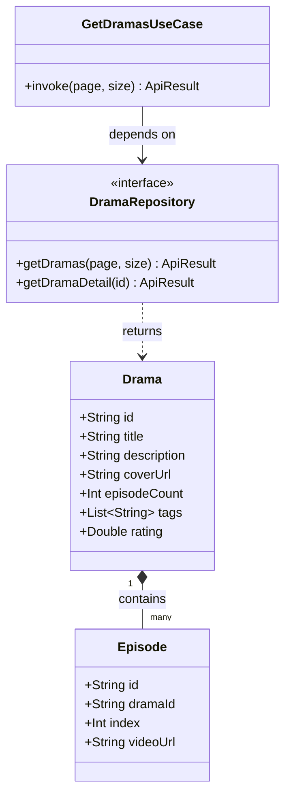
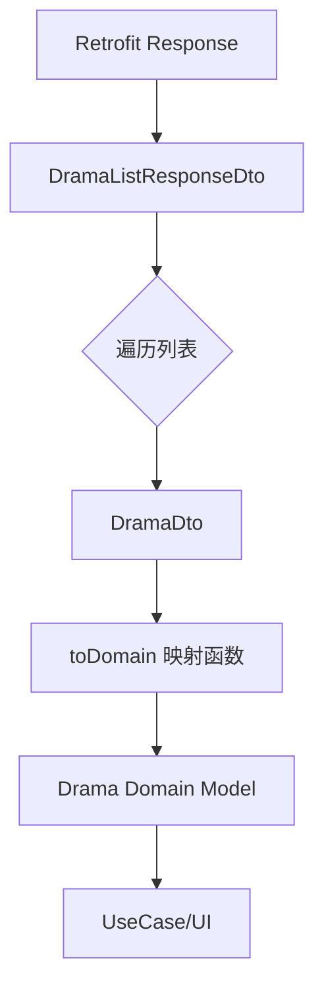
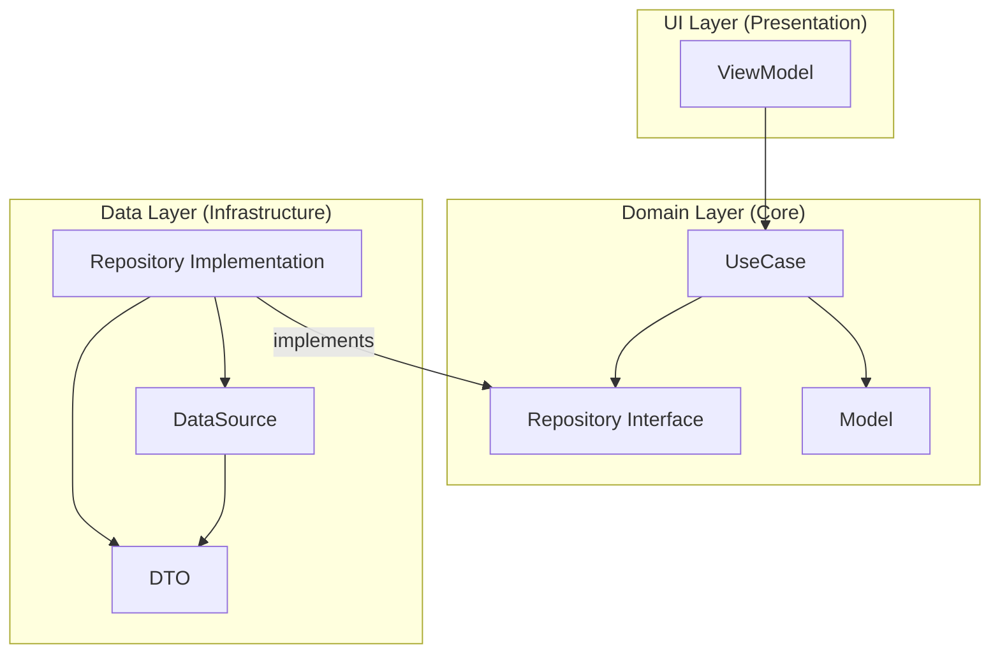
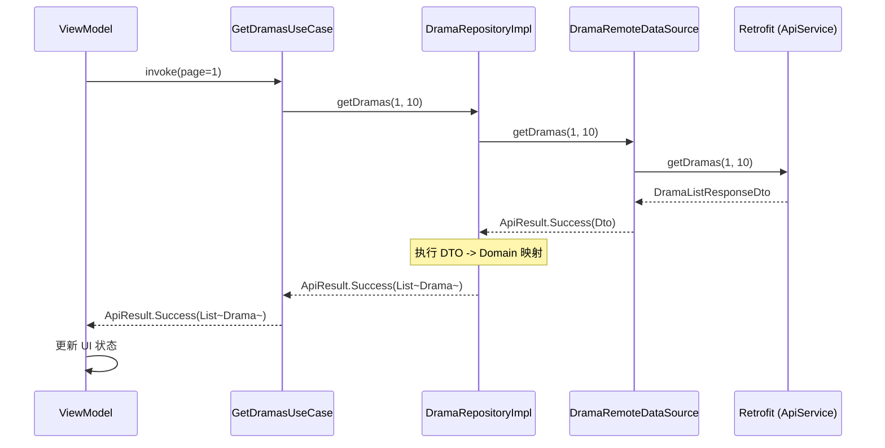
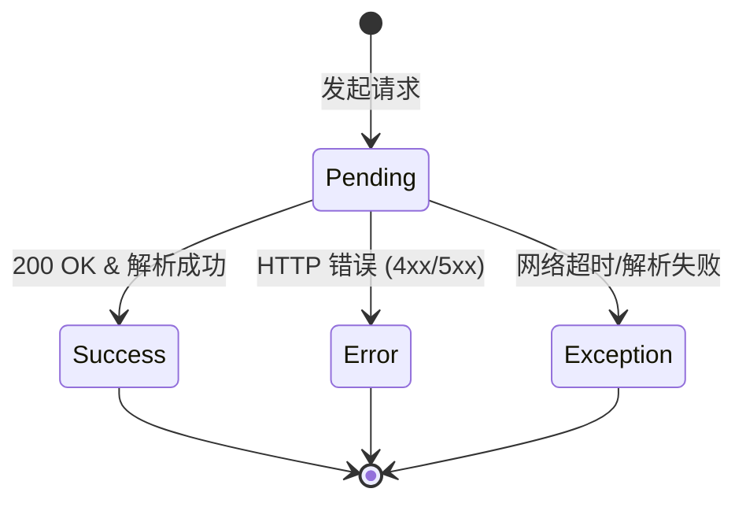

# 领域层与数据层实现

## 目录
1. [模块概览](#模块概览)
2. [引言](#引言)
3. [领域层设计 (Domain Layer)](#领域层设计-domain-layer)
   - [业务模型 (Models)](#业务模型-models)
   - [业务用例 (UseCases)](#业务用例-usecases)
   - [仓库接口 (Repository Interfaces)](#仓库接口-repository-interfaces)
4. [数据层实现 (Data Layer)](#数据层实现-data-layer)
   - [仓库实现 (Repository Implementations)](#仓库实现-repository-implementations)
   - [远程数据源 (Remote DataSources)](#远程数据源-remote-datasources)
   - [本地数据源 (Local DataSources)](#本地数据源-local-datasources)
   - [数据传输对象与映射 (DTOs & Mappers)](#数据传输对象与映射-dtos--mappers)
5. [核心业务模块解析](#核心业务模块解析)
   - [认证与会话管理 (Auth)](#认证与会话管理-auth)
   - [搜索逻辑与历史记录 (Search)](#搜索逻辑与历史记录-search)
   - [短剧与剧集管理 (Drama & Episode)](#短剧与剧集管理-drama--episode)
6. [架构深度解析：依赖倒置与解耦](#架构深度解析依赖倒置与解耦)
7. [数据流转链路：从网络到 UI](#数据流转链路从网络到-ui)
8. [错误处理机制：ApiResult 范式](#错误处理机制-apiresult-范式)
9. [性能考量与最佳实践](#性能考量与最佳实践)
10. [测试策略](#测试策略)
11. [关键文件参考](#关键文件参考)

## 模块概览

本模块构成了 Android 端业务逻辑的核心，遵循 Clean Architecture 架构原则，将业务规则与技术实现完全解耦。

- **总文件数**: 114 个 Kotlin 文件
- **领域层 (Domain)**: 71 个文件
  - `model/`: 30 个文件，定义纯业务实体，如 `Drama`、`AuthUser`、`Comment` 等。
  - `repository/`: 12 个文件，定义数据访问契约，如 `DramaRepository`、`AuthRepository` 等。
  - `usecase/`: 29 个文件，封装单一业务逻辑，如 `GetDramasUseCase`、`LoginUseCase` 等。
- **数据层 (Data)**: 43 个文件
  - `datasource/`: 10 个文件，封装底层网络（Retrofit）操作，如 `DramaRemoteDataSource`。
  - `dto/`: 22 个文件，定义 API 响应结构及映射逻辑，如 `DramaDto`、`AuthDtos`。
  - `local/`: 1 个文件，管理本地持久化数据，目前主要为 `SearchHistoryLocalDataSource`。
  - `repository/`: 10 个文件，实现领域层定义的接口，如 `DramaRepositoryImpl`。

本章节将深入探讨这两层的设计哲学、实现细节以及它们如何协同工作以支持复杂的短剧业务场景。

## 引言

在现代 Android 开发中，随着业务复杂度的增加，传统的 MVC 或简单的 MVVM 架构往往会导致 Activity 或 ViewModel 变得臃肿不堪，难以维护和测试。为了解决这一痛点，本项目采用了 **Clean Architecture (整洁架构)**。

领域层 (Domain Layer) 是架构的最核心部分，它不依赖于任何外部框架（如 Android SDK、Retrofit 或 Room）。它只包含业务实体和业务逻辑，确保了业务核心的稳定性。数据层 (Data Layer) 则负责具体的实现细节，如如何从网络获取数据、如何缓存数据到本地等。

通过这种分层设计，我们可以轻松地更换数据源（例如从 Retrofit 切换到 Ktor），而无需修改任何业务逻辑。同时，这也极大地提高了代码的可测试性，因为领域层的所有组件都可以通过纯 JUnit 测试进行验证。

## 领域层设计 (Domain Layer)

领域层是应用的心脏，它定义了“业务是什么”以及“业务如何运作”。

### 业务模型 (Models)

领域模型是纯粹的 Kotlin 数据类，它们反映了业务领域中的实体。例如，`Drama` 类代表了一部短剧，其字段严格遵循业务定义，而不受后端接口字段命名的限制。

```kotlin
// domain/model/Drama.kt
data class Drama(
    val id: String,
    val title: String,
    val description: String,
    val coverUrl: String,
    val category: String,
    val episodeCount: Int,
    val tags: List<String>,
    val rating: Double,
    val createdAt: String,
    val updatedAt: String
)
```

这些模型在整个应用中作为通用的语言。无论是 UI 层显示数据，还是领域层处理逻辑，都使用这些模型。它们不包含任何 JSON 注解或持久化注解，保持了极高的纯净度。

### 业务用例 (UseCases)

UseCase 是领域层中最小的逻辑单元，遵循 **单一职责原则 (Single Responsibility Principle)**。每个 UseCase 通常只负责一个特定的动作。

```kotlin
// domain/usecase/GetDramasUseCase.kt
class GetDramasUseCase @Inject constructor(
    private val dramaRepository: DramaRepository,
) {
    suspend operator fun invoke(
        page: Int = 1,
        pageSize: Int = 10,
    ): ApiResult<List<Drama>> {
        return dramaRepository.getDramas(page, pageSize)
    }
}
```

UseCase 的存在有几个重要意义：
1. **逻辑复用**: 不同的 ViewModel 可以调用同一个 UseCase。
2. **隐藏细节**: ViewModel 不需要知道数据是从哪个 Repository 获取的，也不需要知道分页的具体实现。
3. **流程控制**: UseCase 可以组合多个 Repository 的操作来完成复杂的业务流程。

### 仓库接口 (Repository Interfaces)

领域层定义了 Repository 接口，这是一种 **契约**。它告诉外部层级：“我需要这些数据操作，但我不关心你怎么实现它们。”

```kotlin
// domain/repository/DramaRepository.kt
interface DramaRepository {
    suspend fun getDramas(page: Int, pageSize: Int): ApiResult<List<Drama>>
    suspend fun getDramaDetail(id: String): ApiResult<Drama>
    suspend fun getTheaterFeed(query: TheaterQuery): ApiResult<TheaterPage>
    suspend fun getBookingAssets(query: BookingAssetsQuery): ApiResult<BookingAssetsPage>
}
```

下列类图展示了领域层核心实体之间的关系：



在上述类图中，`Drama` 是核心实体，它包含了短剧的基本信息。`Episode` 与 `Drama` 存在组合关系，表示一部剧包含多个剧集。`GetDramasUseCase` 通过依赖 `DramaRepository` 接口来获取 `Drama` 列表。这种结构确保了 UseCase 始终面向接口编程，而不是面向实现，从而实现了层级间的解耦。

**Section sources**:
- [Drama.kt](android/app/src/main/java/com/djs66256/short_drama/domain/model/Drama.kt)
- [GetDramasUseCase.kt](android/app/src/main/java/com/djs66256/short_drama/domain/usecase/GetDramasUseCase.kt)
- [DramaRepository.kt](android/app/src/main/java/com/djs66256/short_drama/domain/repository/DramaRepository.kt)

## 数据层实现 (Data Layer)

数据层负责提供领域层所需的数据。它处理网络请求、数据库存储、缓存策略以及数据格式的转换。

### 仓库实现 (Repository Implementations)

`DramaRepositoryImpl` 是领域层接口的具体实现。它的主要职责是协调不同的数据源（Remote 和 Local），并执行 DTO 到 Domain Model 的映射。

```kotlin
// data/repository/DramaRepositoryImpl.kt
@Singleton
class DramaRepositoryImpl @Inject constructor(
    private val remoteDataSource: DramaRemoteDataSource,
) : DramaRepository {

    override suspend fun getDramas(page: Int, pageSize: Int): ApiResult<List<Drama>> {
        return when (val result = remoteDataSource.getDramas(page, pageSize)) {
            is ApiResult.Success -> {
                val domainDramas = result.data.data.map(DramaDto::toDomain)
                ApiResult.Success(domainDramas)
            }
            is ApiResult.Error -> result
            is ApiResult.Exception -> result
        }
    }
}
```

### 远程数据源 (Remote DataSources)

远程数据源封装了网络客户端（如 Retrofit）的调用。它通过 `execute` 模板函数统一处理异常。

```kotlin
// data/datasource/DramaRemoteDataSource.kt
@Singleton
class DramaRemoteDataSource @Inject constructor(
    private val apiService: ApiService,
    private val json: Json,
) {
    suspend fun getDramas(page: Int, pageSize: Int): ApiResult<DramaListResponseDto> = execute {
        apiService.getDramas(page, pageSize)
    }

    private suspend fun <T> execute(request: suspend () -> T): ApiResult<T> {
        return try {
            ApiResult.Success(request())
        } catch (exception: Exception) {
            ApiResult.Exception(exception)
        }
    }
}
```

### 本地数据源 (Local DataSources)

本地数据源负责持久化存储。`SearchHistoryLocalDataSource` 使用了 **Jetpack DataStore**。

```kotlin
// data/local/SearchHistoryLocalDataSource.kt
@Singleton
class SearchHistoryLocalDataSource @Inject constructor(
    @AppPreferencesDataStore private val dataStore: DataStore<Preferences>,
    private val json: Json,
) {
    val history: Flow<List<SearchHistoryItem>> = dataStore.data
        .map { preferences ->
            decodeSearchHistory(preferences[SEARCH_HISTORY_KEY], json)
        }
}
```

### 数据传输对象与映射 (DTOs & Mappers)

DTO (Data Transfer Object) 的结构与后端接口完全一致。我们通过扩展函数实现转换。

```kotlin
// data/dto/DramaDto.kt
@Serializable
data class DramaDto(
    val id: String,
    val title: String,
    @SerialName("cover_url")
    val coverUrl: String? = null,
    // ...
) {
    fun toDomain(): Drama = Drama(
        id = id,
        title = title,
        coverUrl = coverUrl.orEmpty(),
        // ...
    )
}
```

下图展示了数据从网络 DTO 转换为领域实体的流程：



流程图描绘了从接收到 Retrofit 原始响应到最终交付给 UI 的完整转换链条。关键点在于 `toDomain` 映射函数，它不仅转换了数据结构，还负责处理了字段缺失、默认值填充等数据清洗工作，确保了领域层接收到的数据是完整且符合业务要求的。

**Section sources**:
- [DramaRepositoryImpl.kt](android/app/src/main/java/com/djs66256/short_drama/data/repository/DramaRepositoryImpl.kt)
- [DramaRemoteDataSource.kt](android/app/src/main/java/com/djs66256/short_drama/data/datasource/DramaRemoteDataSource.kt)
- [SearchHistoryLocalDataSource.kt](android/app/src/main/java/com/djs66256/short_drama/data/local/SearchHistoryLocalDataSource.kt)

## 核心业务模块解析

本节将深入探讨几个关键业务模块在 Domain 和 Data 层的具体实现。

### 认证与会话管理 (Auth)

认证模块涉及复杂的 Token 管理和用户信息同步。

- **Domain 层**: 定义了 `AuthUser` 模型和 `AuthRepository` 接口。`CreateSessionUseCase` 封装了登录逻辑。
- **Data 层**: `AuthRemoteDataSource` 处理登录、刷新 Token 和登出请求。`AuthRepositoryImpl` 负责在登录成功后将 `AuthSession` 传递给 `AuthSessionProvider` 进行持久化。

```kotlin
// data/dto/AuthDtos.kt 中的映射逻辑
fun AuthSessionPayloadDto.toDomain(): AuthSession = AuthSession(
    accessToken = accessToken,
    refreshToken = refreshToken,
    expiresAtIso = expiresAt,
    user = user.toDomain(),
)
```

### 搜索逻辑与历史记录 (Search)

搜索模块展示了 Remote 和 Local 数据源的协同工作。

- **Domain 层**: `SearchDramasUseCase` 用于执行网络搜索，而 `ObserveSearchHistoryUseCase` 用于实时观察本地搜索历史的变化。
- **Data 层**: `SearchRepositoryImpl` 同时持有 `SearchRemoteDataSource` 和 `SearchHistoryLocalDataSource`。当用户执行搜索时，它不仅从网络获取结果，还会异步调用本地数据源保存搜索词。

### 短剧与剧集管理 (Drama & Episode)

这是应用的核心业务逻辑。

- **Domain 层**: `GetDramaEpisodesUseCase` 负责获取某部短剧的所有剧集。它依赖 `EpisodeRepository`。
- **Data 层**: 剧集数据通常较大，`EpisodeDto` 包含了视频播放地址、试看时长等关键字段。映射逻辑需要处理不同清晰度的视频链接。

## 架构深度解析：依赖倒置与解耦

本项目最核心的设计模式是 **依赖倒置原则 (DIP)**。所有的依赖箭头都指向 `Domain Layer`。



该架构图展示了 Clean Architecture 的经典分层。`Domain Layer` 处于中心位置，不依赖任何外部组件。`Data Layer` 通过实现 `RepositoryInterface` 来反转依赖，使得业务逻辑可以独立于具体的数据存储技术进行演进和测试。

## 数据流转链路：从网络到 UI

当用户触发一个动作时，数据会经历一个完整的闭环流转。



序列图描绘了从 UI 发起请求到最终数据返回并渲染的完整生命周期。在 `DramaRepositoryImpl` 这一层，原始的 DTO 被转换为领域模型，这一步是确保 UI 层不被后端数据结构污染的关键。

## 错误处理机制：ApiResult 范式

为了统一处理网络请求的各种结果，本项目引入了 `ApiResult` 密封类。

```kotlin
// core/network/ApiResult.kt
sealed class ApiResult<out T> {
    data class Success<T>(val data: T) : ApiResult<T>()
    data class Error(val code: String, val message: String) : ApiResult<Nothing>()
    data class Exception(val throwable: Throwable) : ApiResult<Nothing>()
}
```



状态图展示了请求可能的最终状态。通过这种密封类设计，我们可以在 ViewModel 中使用 `when` 表达式强制处理所有分支，从而避免了遗漏错误处理导致的崩溃或 UI 异常状态。

## 性能考量与最佳实践

1. **多级缓存**: 优先从内存读取，其次是本地存储，最后是网络。
2. **并发控制**: 使用 `Dispatchers.IO` 执行所有阻塞式操作。
3. **内存优化**: 在映射阶段进行数据过滤，减少传递到 UI 层的数据量。
4. **依赖注入**: 使用 Hilt 确保 Repository 和 DataSource 的单例性，减少对象创建开销。

## 测试策略

- **Domain 层**: 纯 JUnit 测试，使用 Mockito 模拟 Repository。
- **Data 层**: 使用 `MockWebServer` 进行集成测试，确保 DTO 解析和映射逻辑无误。

## 关键文件参考

| 类别 | 文件路径 | 说明 |
| :--- | :--- | :--- |
| **Domain Model** | `domain/model/Drama.kt` | 短剧核心业务实体 |
| **Domain UseCase** | `domain/usecase/GetDramasUseCase.kt` | 获取短剧列表的业务逻辑封装 |
| **Domain Repo** | `domain/repository/DramaRepository.kt` | 数据访问契约定义 |
| **Data Repo** | `data/repository/DramaRepositoryImpl.kt` | 仓库实现与模型映射核心逻辑 |
| **Data Source** | `data/datasource/DramaRemoteDataSource.kt` | 远程 API 调用与错误解析 |
| **Data DTO** | `data/dto/DramaDto.kt` | 后端响应结构与转换函数 |
| **Data Local** | `data/local/SearchHistoryLocalDataSource.kt` | 基于 DataStore 的本地持久化实现 |
| **Core Network** | `core/network/ApiResult.kt` | 统一的结果包装器 |

**Section sources**:
- [Drama.kt](android/app/src/main/java/com/djs66256/short_drama/domain/model/Drama.kt)
- [GetDramasUseCase.kt](android/app/src/main/java/com/djs66256/short_drama/domain/usecase/GetDramasUseCase.kt)
- [DramaRepository.kt](android/app/src/main/java/com/djs66256/short_drama/domain/repository/DramaRepository.kt)
- [DramaRepositoryImpl.kt](android/app/src/main/java/com/djs66256/short_drama/data/repository/DramaRepositoryImpl.kt)
- [DramaRemoteDataSource.kt](android/app/src/main/java/com/djs66256/short_drama/data/datasource/DramaRemoteDataSource.kt)
- [SearchHistoryLocalDataSource.kt](android/app/src/main/java/com/djs66256/short_drama/data/local/SearchHistoryLocalDataSource.kt)
- [ApiResult.kt](android/app/src/main/java/com/djs66256/short_drama/core/network/ApiResult.kt)
