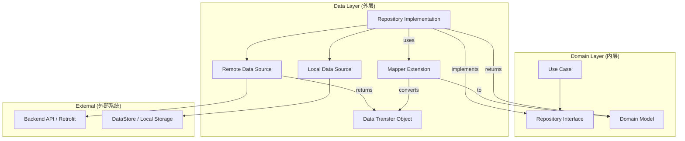
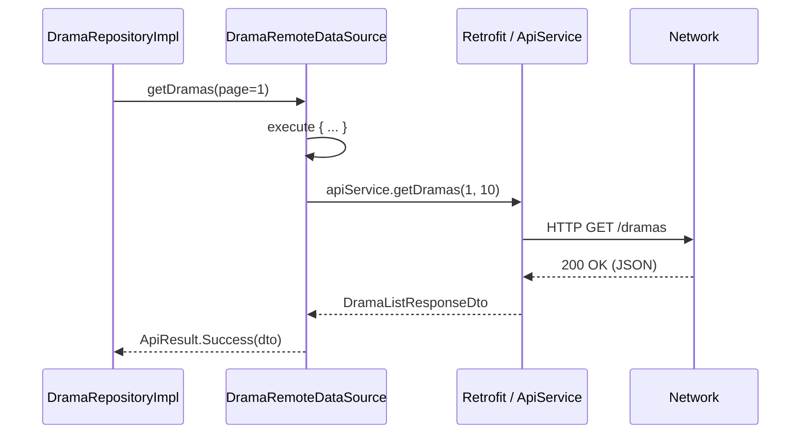
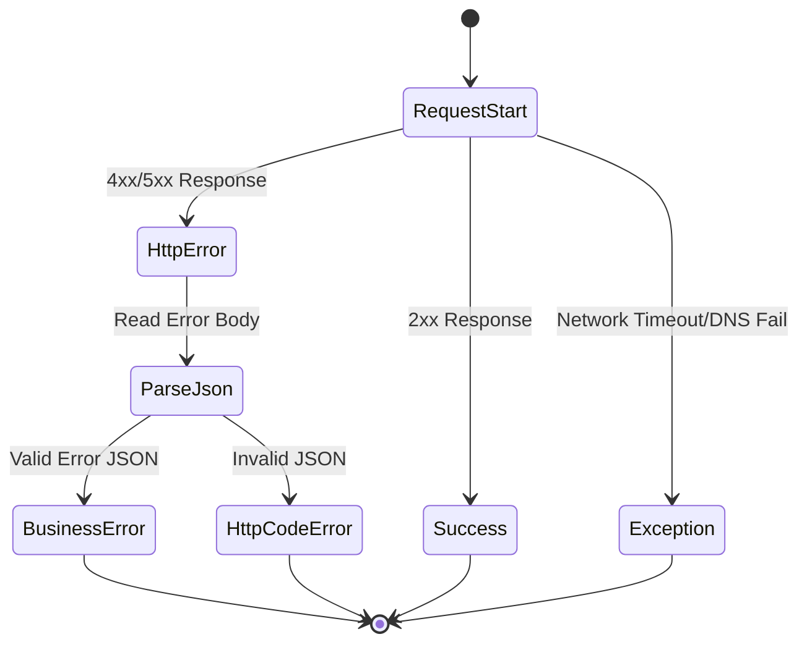

# 数据层实现：仓库、数据源与 DTO

## 目录
1. [模块概览](#模块概览)
2. [引言](#引言)
3. [架构设计与数据流](#架构设计与数据流)
4. [数据传输对象 (DTOs) 深度解析](#数据传输对象-dtos-深度解析)
5. [映射器 (Mappers) 的设计与实现](#映射器-mappers-的设计与实现)
6. [远程数据源 (Remote Data Sources) 机制](#远程数据源-remote-data-sources-机制)
7. [本地持久化 (Local Data Sources) 方案](#本地持久化-local-data-sources-方案)
8. [仓库模式实现 (Repository Implementations)](#仓库模式实现-repository-implementations)
9. [错误处理与结果转换策略](#错误处理与结果转换策略)
10. [核心组件列表](#核心组件列表)
11. [文件引用](#文件引用)

## 模块概览

本章节深入探讨 Android 端的数据层（Data Layer）实现。数据层是 Clean Architecture 架构中最底层的一部分，直接负责与外部世界（网络 API、本地数据库、缓存等）进行交互。它的核心目标是为上层提供稳定、类型安全且业务无关的数据访问接口。

在本项目中，数据层主要包含以下子模块：

- **`datasource/`**: 包含 10 个远程数据源实现，负责封装 Retrofit 的 API 调用。这些类充当了网络请求的直接发起者，并负责将 Retrofit 的响应转换为更高级别的 `ApiResult` 包装类。
- **`dto/`**: 包含 22 个数据传输对象（Data Transfer Objects），定义了与后端 API 契约完全一致的数据结构。这些对象是网络通信的载体，通常使用 Kotlin Serialization 进行注解。
- **`local/`**: 包含本地数据存储实现，目前主要使用 Jetpack DataStore 管理搜索历史。这部分负责处理磁盘 I/O，确保在离线或弱网环境下应用仍能提供基本功能。
- **`repository/`**: 包含 10 个仓库接口的实现类，作为业务逻辑与数据获取之间的中介。它们是数据层的“大脑”，负责决策数据的来源并执行复杂的映射逻辑。

**统计信息**：
- **总文件数**：43 个 Kotlin 文件。
- **核心目录**：`android/app/src/main/java/com/djs66256/short_drama/data/`。
- **覆盖范围**：涵盖了从网络请求发起、原始数据解析、本地持久化到领域模型转换的完整链路。

## 引言

数据层在 Android 应用程序中扮演着“数据守门员”的角色。它的主要职责是屏蔽数据来源的复杂性，为领域层（Domain Layer）提供统一、干净的业务实体。在 Clean Architecture 的语境下，数据层属于外层（Outer Layer），它通过接口实现的方式为内层（Inner Layer）提供服务。

在本项目中，数据层的设计遵循了以下核心原则：

1.  **单一事实来源 (Single Source of Truth)**：仓库层（Repository）负责决定数据是来自网络还是本地缓存。例如，当用户请求剧集列表时，仓库可能会先尝试从网络获取，如果失败则回退到本地缓存。这种设计确保了 UI 层始终从一个地方获取数据，避免了状态不一致的问题。
2.  **关注点分离 (Separation of Concerns)**：数据源（DataSource）只负责原始数据的获取，不关心业务逻辑；DTO 只负责数据结构的定义；Mapper 只负责类型转换。这种解耦使得每个组件都非常易于测试和维护。
3.  **强类型契约**：使用 Kotlin Serialization 进行 JSON 解析，确保 API 返回的数据与 DTO 定义严格匹配。相比于 GSON，Kotlin Serialization 提供了更好的空安全性支持，这对于处理后端可能返回的 null 值至关重要。
4.  **健壮的错误处理**：通过 `ApiResult` 包装类，将底层的网络异常（如 `HttpException`, `SocketTimeoutException`）转换为上层可感知的业务错误。这使得 ViewModel 可以根据错误类型（如 `Success`, `Error`, `Exception`）来决定是显示数据、错误提示还是重试按钮。

通过这种分层设计，系统能够轻松应对后端 API 的变更。例如，如果后端将 `cover_url` 改名为 `thumbnail`，我们只需要修改对应的 DTO 字段名和注解，而不需要改动任何 UI 代码。

**引言参考资料**:
- [Clean Architecture 原则](https://blog.cleancoder.com/uncle-bob/2012/08/13/the-clean-architecture.html)
- 项目结构定义：`android/app/src/main/java/com/djs66256/short_drama/data/`

## 架构设计与数据流

数据层位于架构的最外层，它依赖于领域层定义的接口，但不被领域层依赖。这种依赖倒置原则确保了核心业务逻辑的独立性。数据层内部的协作非常紧密，通常由 Repository 统一调度。

下面的架构图展示了数据层内部组件之间的交互关系，以及它们如何与领域层连接。



在上述流程中，`RepositoryImpl` 是核心协调者。当上层（通常是 UseCase）请求数据时，`RepositoryImpl` 会调用 `RemoteDataSource` 获取 `DTO`。随后，`RepositoryImpl` 调用 `Mapper` 函数将 `DTO` 转换为 `Domain Model`，最后将结果返回给调用者。

对于需要缓存的场景，`RepositoryImpl` 还会负责将获取到的数据保存到 `LocalDataSource` 中，或者在断网时从 `LocalDataSource` 读取数据。

**数据流向说明**：
1.  **请求发起**：UI -> ViewModel -> UseCase -> Repository (Interface)。
2.  **数据获取**：Repository (Impl) -> DataSource -> 网络/本地。
3.  **数据转换**：DataSource 返回 DTO -> Repository 使用 Mapper 转换为 Domain Model。
4.  **结果返回**：Repository 返回 `ApiResult<DomainModel>` -> UI 显示。

**架构设计参考**:
- [DramaRepositoryImpl.kt](android/app/src/main/java/com/djs66256/short_drama/data/repository/DramaRepositoryImpl.kt)
- [DramaRemoteDataSource.kt](android/app/src/main/java/com/djs66256/short_drama/data/datasource/DramaRemoteDataSource.kt)

## 数据传输对象 (DTOs) 深度解析

DTO（Data Transfer Object）是后端 API 返回数据的直接映射。它们在本项目中扮演着“数据契约”的角色，确保客户端与服务器之间的数据交换具有明确的结构。

### DTO 的定义原则

1.  **字段匹配**：DTO 的字段名应尽可能与 API 返回的 JSON 键名一致。如果不一致，必须使用 `@SerialName` 进行重命名。
2.  **空安全性**：这是 DTO 定义中最关键的部分。对于 API 可能返回 null 的字段，DTO 中必须声明为可空类型（`?`）。如果漏掉，反序列化时会抛出异常。
3.  **不可变性**：DTO 通常定义为 `data class`，字段设为 `val`。这保证了数据在从网络层传递到业务层的过程中不会被意外篡改。

### 核心 DTO 示例：DramaDto

`DramaDto` 展示了如何处理复杂的短剧数据结构，包括嵌套列表和需要重命名的字段。

```kotlin
@Serializable
data class DramaDto(
    val id: String,
    val title: String,
    val description: String,
    @SerialName("cover_url")
    val coverUrl: String? = null,
    val category: String,
    @SerialName("episode_count")
    val episodeCount: Int,
    val tags: List<String> = emptyList(),
    val rating: Double? = null,
    @SerialName("created_at")
    val createdAt: String,
    @SerialName("updated_at")
    val updatedAt: String
)
```

在上面的代码中：
- `coverUrl` 被映射为 `cover_url`，并且是可空的。
- `tags` 提供了一个默认值 `emptyList()`，即使 API 没返回该字段，解析也不会报错。
- `episodeCount` 映射为 `episode_count`，这是一个必填字段。

### 认证 DTO 示例：AuthDtos

认证相关的 DTO 通常包含更复杂的嵌套结构，例如 `ApiEnvelopeDto` 作为一个通用的包装器。

```kotlin
@Serializable
data class ApiEnvelopeDto<T>(
    @SerialName("code") val code: Int,
    @SerialName("data") val data: T,
    @SerialName("message") val message: String,
)

@Serializable
data class AuthSessionPayloadDto(
    @SerialName("accessToken") val accessToken: String,
    @SerialName("refreshToken") val refreshToken: String,
    @SerialName("expiresAt") val expiresAt: String,
    @SerialName("user") val user: AuthUserDto,
)
```

这种泛型包装器的设计使得我们可以复用外层的 `code` 和 `message` 处理逻辑，而将核心业务数据放在 `data` 字段中。

**本节源码参考**:
- [DramaDto.kt](android/app/src/main/java/com/djs66256/short_drama/data/dto/DramaDto.kt)
- [AuthDtos.kt](android/app/src/main/java/com/djs66256/short_drama/data/dto/AuthDtos.kt)

## 映射器 (Mappers) 的设计与实现

Mapper 的职责是将原始的 DTO 转换为领域层（Domain Layer）能够理解的业务实体（Domain Model）。这种转换不仅仅是字段名的改变，往往还涉及到数据清洗、格式转换和逻辑处理。

### Mapper 的实现策略

在本项目中，Mapper 统一实现为 DTO 类的扩展函数 `toDomain()`。这种方式的优点是：
- **可读性强**：调用 `dto.toDomain()` 非常符合直觉。
- **解耦**：Mapper 逻辑在数据层内部，领域层完全感知不到 DTO 的存在。
- **易于测试**：可以针对 Mapper 编写单元测试，验证转换逻辑的正确性。

### 转换逻辑详解

以下是 `DramaDto` 的 Mapper 实现，它展示了如何处理默认值和数据清洗：

```kotlin
fun DramaDto.toDomain(): Drama = Drama(
    id = id,
    title = title,
    description = description,
    coverUrl = coverUrl.orEmpty(), // 将 null 转换为 ""
    category = category,
    episodeCount = episodeCount,
    tags = tags,
    rating = rating ?: 0.0, // 处理可空分数为默认值 0.0
    createdAt = createdAt,
    updatedAt = updatedAt
)
```

对于更复杂的转换，例如枚举类型，Mapper 会调用辅助函数：

```kotlin
fun AuthUserDto.toDomain(): AuthUser = AuthUser(
    id = id,
    phone = phone,
    displayName = displayName,
    avatarUrl = avatarUrl,
    role = role.toAuthRole(), // 内部辅助函数处理字符串到枚举的映射
    isNewUser = isNewUser,
)

private fun String.toAuthRole(): AuthRole = when (lowercase()) {
    "admin" -> AuthRole.ADMIN
    "editor" -> AuthRole.EDITOR
    else -> AuthRole.VIEWER // 兜底逻辑
}
```

通过这种方式，领域层看到的 `AuthRole` 是一个类型安全的枚举，而不是一个随意的字符串。这极大地减少了业务逻辑中的 `if-else` 判断和潜在的运行时错误。

**Mapper 实现参考**:
- [DramaDto.kt:L24-L35](android/app/src/main/java/com/djs66256/short_drama/data/dto/DramaDto.kt#L24-L35)
- [AuthDtos.kt:L66-L86](android/app/src/main/java/com/djs66256/short_drama/data/dto/AuthDtos.kt#L66-L86)

## 远程数据源 (Remote Data Sources) 机制

远程数据源是与后端 API 通信的直接入口。它封装了 Retrofit 接口（`ApiService`），并负责将底层的网络响应包装成统一的 `ApiResult` 类型。

### ApiService 接口定义

`ApiService` 是整个应用与后端通信的契约。它定义了所有的 HTTP 方法、路径、查询参数和请求体。

```kotlin
interface ApiService {
    @GET("dramas")
    suspend fun getDramas(
        @Query("page") page: Int = 1,
        @Query("pageSize") pageSize: Int = 10,
    ): DramaListResponseDto

    @GET("dramas/{id}/episodes")
    suspend fun getDramaEpisodes(
        @Path("id") dramaId: String,
    ): EpisodeListResponseDto
}
```

### 统一执行器：execute 函数

为了避免在每个数据源方法中重复编写 `try-catch` 逻辑，`RemoteDataSource` 实现了一个通用的 `execute` 辅助函数。

```kotlin
private suspend fun <T> execute(request: suspend () -> T): ApiResult<T> {
    return try {
        ApiResult.Success(request())
    } catch (cancellationException: CancellationException) {
        // 关键：必须重新抛出取消异常，否则协程无法正常停止
        throw cancellationException
    } catch (httpException: HttpException) {
        // 处理 4xx/5xx 错误
        parseErrorResult(httpException)
    } catch (exception: Exception) {
        // 处理网络超时、DNS 失败等
        ApiResult.Exception(exception)
    }
}
```

这个函数的工作流程如下：
1.  **尝试执行**：调用传入的挂起函数 `request()`。
2.  **成功返回**：如果请求成功，将结果包装在 `ApiResult.Success` 中。
3.  **异常捕获**：
    - 如果是 `CancellationException`，直接抛出，以符合协程的结构化并发原则。
    - 如果是 `HttpException`（如 404, 500），调用 `parseErrorResult` 解析错误 Body。
    - 如果是其他异常（如 `IOException`），包装在 `ApiResult.Exception` 中。

### 数据源类交互



**远程数据源参考**:
- [DramaRemoteDataSource.kt](android/app/src/main/java/com/djs66256/short_drama/data/datasource/DramaRemoteDataSource.kt)
- [ApiService.kt](android/app/src/main/java/com/djs66256/short_drama/core/network/ApiService.kt)

## 本地持久化 (Local Data Sources) 方案

本地数据源负责数据的持久化存储。在本项目中，我们采用了现代化的 Jetpack DataStore 方案，取代了传统的 SharedPreferences。

### 为什么选择 DataStore？

1.  **响应式支持**：DataStore 基于 Flow，数据变化时会自动通知订阅者。
2.  **线程安全**：它在后台线程执行 I/O 操作，不会阻塞主线程。
3.  **强一致性**：支持事务处理，避免了 SharedPreferences 常见的并发写入冲突。

### 搜索历史实现：SearchHistoryLocalDataSource

该类负责管理用户的搜索关键词历史。它将历史记录列表序列化为 JSON 字符串存储在 Preferences DataStore 中。

```kotlin
@Singleton
class SearchHistoryLocalDataSource @Inject constructor(
    @AppPreferencesDataStore private val dataStore: DataStore<Preferences>,
    private val json: Json,
) {
    // 获取历史记录的 Flow
    val history: Flow<List<SearchHistoryItem>> = dataStore.data
        .catch { emit(emptyPreferences()) }
        .map { preferences ->
            decodeSearchHistory(preferences[SEARCH_HISTORY_KEY], json)
        }

    // 保存新的搜索词
    suspend fun save(keyword: String) {
        val normalizedKeyword = normalizeSearchQueryOrNull(keyword) ?: return
        dataStore.edit { preferences ->
            val currentItems = decodeSearchHistory(preferences[SEARCH_HISTORY_KEY], json)
            // 合并逻辑：去重、排序、截断
            val updatedItems = mergeSearchHistory(currentItems, normalizedKeyword, System.currentTimeMillis())
            preferences[SEARCH_HISTORY_KEY] = encodeSearchHistory(updatedItems, json)
        }
    }
}
```

### 数据处理逻辑

在存取过程中，我们执行了以下关键操作：
- **标准化 (Normalization)**：通过 `normalizeSearchQueryOrNull` 去除首尾空格、转换大小写，确保“Action”和“action”被视为同一个词。
- **合并与排序**：`mergeSearchHistory` 函数确保新搜索的词排在最前面，并且列表长度不超过预设的最大值（10 条）。
- **序列化与反序列化**：使用 `json.encodeToString` 和 `json.decodeFromString` 处理 DTO 与字符串之间的转换。

**本地数据源参考**:
- [SearchHistoryLocalDataSource.kt](android/app/src/main/java/com/djs66256/short_drama/data/local/SearchHistoryLocalDataSource.kt)

## 仓库模式实现 (Repository Implementations)

仓库模式是数据层的核心。它通过实现领域层定义的接口，为上层提供了一个统一的数据访问层。

### 仓库的职责分工

1.  **接口实现**：实现 `DramaRepository`, `AuthRepository` 等接口。
2.  **数据路由**：决定数据是来自 `RemoteDataSource` 还是 `LocalDataSource`。
3.  **模型映射**：将 DTO 转换为 Domain Model。
4.  **业务副作用**：处理如 Token 存储、缓存更新等与数据获取相关的副作用。

### 典型实现：DramaRepositoryImpl

```kotlin
@Singleton
class DramaRepositoryImpl @Inject constructor(
    private val remoteDataSource: DramaRemoteDataSource,
) : DramaRepository {

    override suspend fun getDramas(page: Int, pageSize: Int): ApiResult<List<Drama>> {
        // 1. 调用数据源获取原始数据
        return when (val result = remoteDataSource.getDramas(page, pageSize)) {
            is ApiResult.Success -> {
                // 2. 执行映射逻辑
                val domainDramas = result.data.data.map(DramaDto::toDomain)
                // 3. 返回转换后的成功结果
                ApiResult.Success(domainDramas)
            }
            // 4. 透明地传递错误和异常
            is ApiResult.Error -> result
            is ApiResult.Exception -> result
        }
    }
}
```

### 状态同步：AuthRepositoryImpl

`AuthRepositoryImpl` 不仅负责网络请求，还负责维护全局的认证状态。它依赖于 `AuthStateHolder` 来同步 Token 信息。

```kotlin
override suspend fun createSession(countryCode: String, phone: String, code: String): ApiResult<AuthSession> {
    return when (val result = remoteDataSource.createSession(countryCode, phone, code)) {
        is ApiResult.Success -> {
            val session = result.data.data.toDomain()
            // 关键：在返回给 UI 之前，先持久化登录状态
            authStateHolder.updateSession(session)
            ApiResult.Success(session)
        }
        is ApiResult.Error -> result
        is ApiResult.Exception -> result
    }
}
```

这种设计体现了仓库作为“单一事实来源”的作用：无论登录是通过验证码还是第三方授权，最终的 Token 状态都由仓库统一管理。

**仓库实现参考**:
- [DramaRepositoryImpl.kt](android/app/src/main/java/com/djs66256/short_drama/data/repository/DramaRepositoryImpl.kt)
- [AuthRepositoryImpl.kt](android/app/src/main/java/com/djs66256/short_drama/data/repository/AuthRepositoryImpl.kt)

## 错误处理与结果转换策略

健壮的错误处理是高质量 Android 应用的标志。数据层通过 `ApiResult` 和 `parseErrorResult` 机制，确保了错误信息的准确传递。

### 错误分类

我们根据错误的性质将其分为三类：

1.  **业务错误 (ApiResult.Error)**：后端返回的逻辑错误，如“账号不存在”、“余额不足”。这些错误通常带有特定的 `code`。
2.  **网络/系统异常 (ApiResult.Exception)**：如网络断开、超时、JSON 解析错误。这些是底层的技术故障。
3.  **取消异常 (CancellationException)**：当用户离开页面导致协程取消时触发。

### 错误解析流程

当 API 返回非 2xx 状态码时，Retrofit 会抛出 `HttpException`。`RemoteDataSource` 会捕获它并解析其内容。



### parseErrorResult 实现细节

```kotlin
private fun parseErrorResult(httpException: HttpException): ApiResult.Error {
    // 1. 获取原始错误 Body 字符串
    val errorBody = httpException.response()?.errorBody()?.string().orEmpty()
    
    // 2. 尝试解析为 ErrorDto
    val parsedError = runCatching {
        json.decodeFromString(ErrorDto.serializer(), errorBody)
    }.getOrNull()

    // 3. 构造 ApiResult.Error，提供合理的兜底消息
    return ApiResult.Error(
        code = parsedError?.error?.code.orEmpty().ifBlank { "HTTP_${httpException.code()}" },
        message = parsedError?.error?.message.orEmpty().ifBlank {
            httpException.message().orEmpty().ifBlank { "请求失败，请重试" }
        },
    )
}
```

这种机制的优势在于：即使后端没有按照约定的格式返回错误 JSON，前端也能显示出 HTTP 状态码（如 `HTTP_502`），这对于排查生产环境问题非常有帮助。

**错误处理参考**:
- [DramaRemoteDataSource.kt:L60-L72](android/app/src/main/java/com/djs66256/short_drama/data/datasource/DramaRemoteDataSource.kt#L60-L72)
- [ErrorDto.kt](android/app/src/main/java/com/djs66256/short_drama/data/dto/ErrorDto.kt)

## 核心组件列表

以下是数据层中最重要的类及其职责说明：

| 类名 | 职责 | 核心技术 |
| :--- | :--- | :--- |
| `DramaRepositoryImpl` | 短剧业务的单一事实来源，协调网络与领域模型映射。 | Dagger/Hilt, Coroutines |
| `DramaRemoteDataSource` | 封装短剧相关的网络调用，处理 HTTP 异常。 | Retrofit, ApiResult |
| `SearchHistoryLocalDataSource` | 持久化搜索历史记录，支持响应式数据流。 | Jetpack DataStore, Flow |
| `AuthRepositoryImpl` | 管理用户登录、登出及 Token 刷新。 | AuthStateHolder |
| `DramaDto` | 短剧数据的原始 JSON 映射对象。 | Kotlin Serialization |
| `ApiService` | 定义所有后端 API 端点的 Retrofit 接口。 | Retrofit Annotations |
| `AuthRemoteDataSource` | 处理认证相关的网络请求，如发送验证码、创建会话。 | Retrofit |
| `EpisodeDto` | 剧集信息的原始数据结构，包含视频链接和时长。 | Kotlin Serialization |

## 文件引用

以下是本章节分析的核心源文件列表：

**仓库实现**:
- [DramaRepositoryImpl.kt](android/app/src/main/java/com/djs66256/short_drama/data/repository/DramaRepositoryImpl.kt)
- [AuthRepositoryImpl.kt](android/app/src/main/java/com/djs66256/short_drama/data/repository/AuthRepositoryImpl.kt)
- [SearchRepositoryImpl.kt](android/app/src/main/java/com/djs66256/short_drama/data/repository/SearchRepositoryImpl.kt)

**数据源**:
- [DramaRemoteDataSource.kt](android/app/src/main/java/com/djs66256/short_drama/data/datasource/DramaRemoteDataSource.kt)
- [AuthRemoteDataSource.kt](android/app/src/main/java/com/djs66256/short_drama/data/datasource/AuthRemoteDataSource.kt)
- [SearchHistoryLocalDataSource.kt](android/app/src/main/java/com/djs66256/short_drama/data/local/SearchHistoryLocalDataSource.kt)

**数据传输对象 (DTOs)**:
- [DramaDto.kt](android/app/src/main/java/com/djs66256/short_drama/data/dto/DramaDto.kt)
- [AuthDtos.kt](android/app/src/main/java/com/djs66256/short_drama/data/dto/AuthDtos.kt)
- [EpisodeDto.kt](android/app/src/main/java/com/djs66256/short_drama/data/dto/EpisodeDto.kt)
- [ErrorDto.kt](android/app/src/main/java/com/djs66256/short_drama/data/dto/ErrorDto.kt)

**网络基础**:
- [ApiService.kt](android/app/src/main/java/com/djs66256/short_drama/core/network/ApiService.kt)
