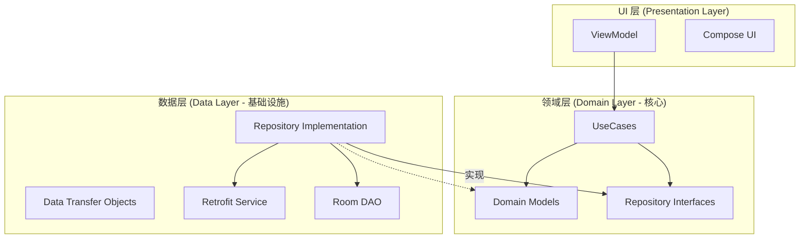
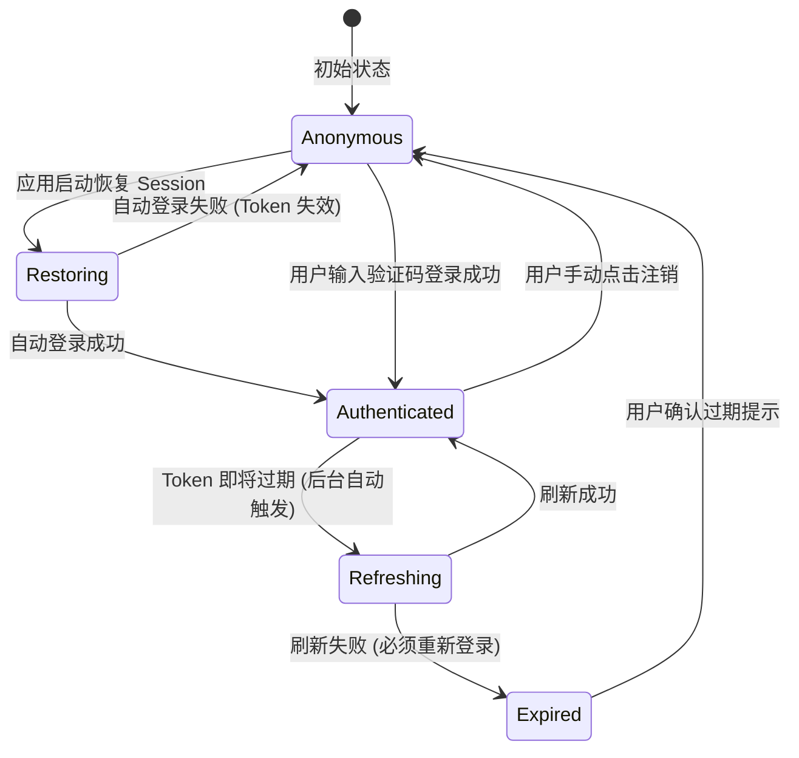
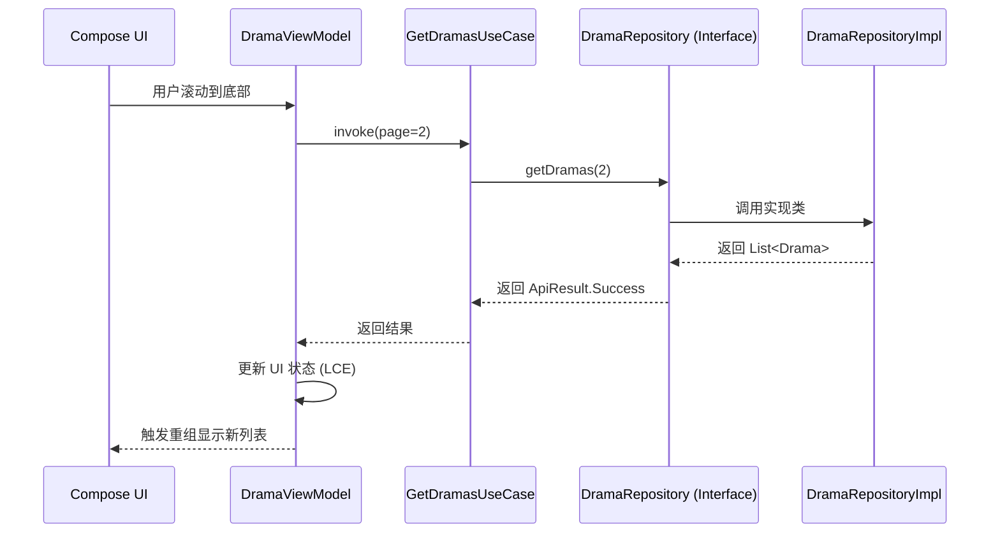
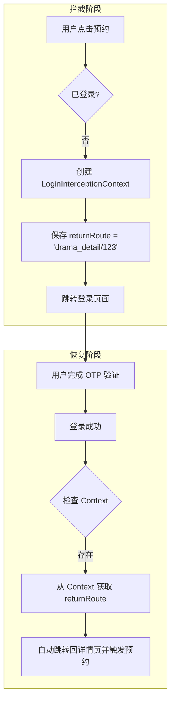

# 领域层设计：业务模型与用例

## 目录
1. [模块概览](#模块概览)
2. [引言：领域驱动设计与纯净架构](#引言领域驱动设计与纯净架构)
3. [架构设计：以领域为中心的依赖倒置](#架构设计以领域为中心的依赖倒置)
4. [领域模型 (Domain Models)：业务实体的精确建模](#领域模型-domain-models-业务实体的精确建模)
   - [核心实体：Drama 与 Episode 的关联设计](#核心实体drama-与-episode-的关联设计)
   - [认证领域模型：AuthUser 与 AuthStatus 的状态机](#认证领域模型authuser-与-authstatus-的状态机)
   - [播放领域模型：PlaybackProgress 的业务闭环](#播放领域模型playbackprogress-的业务闭环)
   - [业务规则的内聚：SearchQueryRules 案例分析](#业务规则的内聚searchqueryrules-案例分析)
5. [业务用例 (Use Cases)：业务逻辑的最小执行单元](#业务用例-use-cases-业务逻辑的最小执行单元)
   - [单一职责原则 (SRP) 在用例中的实践](#单一职责原则-srp-在用例中的实践)
   - [Invoke 模式：简化调用与提升可读性](#invoke-模式简化调用与提升可读性)
   - [数据流分析：从 ViewModel 到 Repository 的中转](#数据流分析从-viewmodel-到-repository-的中转)
6. [仓库契约 (Repository Interfaces)：定义数据交互的边界](#仓库契约-repository-interfaces-定义数据交互的边界)
   - [抽象的价值：屏蔽数据源的复杂性](#抽象的价值屏蔽数据源的复杂性)
   - [ApiResult：统一的领域响应规范](#apiresult统一的领域响应规范)
7. [复杂业务流程处理：上下文与拦截机制](#复杂业务流程处理上下文与拦截机制)
   - [登录拦截上下文 (LoginInterceptionContext) 的深度解析](#登录拦截上下文-logininterceptioncontext-的深度解析)
   - [预约与资产管理的业务逻辑建模](#预约与资产管理的业务逻辑建模)
8. [领域层的纯净性维护与测试策略](#领域层的纯净性维护与测试策略)
   - [为何严禁依赖 Android 框架](#为何严禁依赖-android-框架)
   - [领域层的单元测试范式](#领域层的单元测试范式)
9. [集成与调用规范](#集成与调用规范)
10. [文件参考](#文件参考)

## 模块概览

本章节详细解析 Android 端的领域层（Domain Layer）。作为 Clean Architecture 的核心，领域层承载了系统的核心业务逻辑和数据模型，是整个应用中最为稳定且独立的部分。

- **总文件数**：68 个 Kotlin 文件，全部位于 `com.djs66256.short_drama.domain` 包下。
- **子模块分布**：
  - **`model/`** (27 个文件)：定义了系统中所有的业务实体（Entity）、值对象（Value Object）、状态枚举以及内聚的业务规则。它是系统名词的集合。
  - **`repository/`** (12 个文件)：定义了数据操作的契约（Interface）。它规定了“能做什么”，但不关心“怎么做”。
  - **`usecase/`** (29 个文件)：实现了具体的业务操作流程。它是系统动词的集合，协调模型和仓库完成特定的用户目标。

本指南将深入探讨领域层的设计哲学，通过对核心实体、用例模式及复杂业务上下文的剖析，展示如何构建一个健壮、可扩展且易于测试的 Android 业务内核。

## 引言：领域驱动设计与纯净架构

在短剧应用这种业务逻辑相对复杂的项目中，领域层（Domain Layer）扮演着“真理来源”的角色。它不仅是代码的集合，更是业务需求的数字化建模。

**核心原则：纯净性 (Purity)**
领域层被设计为一个**纯 Kotlin 模块**。这意味着在该目录下的 68 个文件中，你不会看到 `import android.*`。这种设计的优势是多维度的：
1.  **确定性**：业务逻辑的行为只取决于输入数据和算法，不受 Android 系统版本、配置更改（如旋转屏幕）或生命周期的影响。
2.  **可移植性**：如果未来需要开发桌面版或 KMP（Kotlin Multiplatform）版本，领域层代码可以几乎无缝地迁移。
3.  **测试友好**：开发者可以在不启动模拟器的情况下，利用 JUnit 极速运行业务逻辑测试。

## 架构设计：以领域为中心的依赖倒置

领域层通过“依赖倒置原则（Dependency Inversion Principle）”确保其核心地位。在传统的层级架构中，业务层依赖数据层；而在 Clean Architecture 中，数据层（实现类）依赖领域层（接口）。



这种架构确保了领域层是“被动”的——它不主动去寻找数据，而是定义好数据的形状，等待外层（Data Layer）注入实现。这种关系使得业务逻辑成为了整个系统的“锚点”，无论外部技术栈如何变迁，内核始终保持稳定。

**Diagram sources**:
- [DramaRepository.kt](android/app/src/main/java/com/djs66256/short_drama/domain/repository/DramaRepository.kt)
- [GetDramasUseCase.kt](android/app/src/main/java/com/djs66256/short_drama/domain/usecase/GetDramasUseCase.kt)

## 领域模型 (Domain Models)：业务实体的精确建模

领域模型不仅仅是 POJO（Plain Old Java Object），它们是业务语言的载体。

### 核心实体：Drama 与 Episode 的关联设计

短剧（`Drama`）和剧集（`Episode`）构成了应用的基础数据结构。

```kotlin
// Drama.kt - 核心短剧实体
data class Drama(
    val id: String,
    val title: String,
    val description: String,
    val coverUrl: String,
    val category: String,
    val episodeCount: Int,
    val tags: List<String>,
    val rating: Double,
    val createdAt: String,
    val updatedAt: String
)
```

在设计上，`Drama` 实体包含了如 `episodeCount` 和 `rating` 等关键业务指标。这些字段直接对应于后端 Zod Schema，确保了前后端在业务概念上的一致性。`Episode` 实体则通过 `dramaId` 与 `Drama` 建立逻辑关联，支持分页加载和按需获取。

### 认证领域模型：AuthUser 与 AuthStatus 的状态机

用户认证是应用中最复杂的状态管理之一。领域层通过 `AuthStatus` 这一密封接口（Sealed Interface）精确描述了用户的生命周期。



通过这种建模方式，`AuthStatus.Authenticated` 可以携带 `AuthSession` 对象，而 `AuthStatus.Anonymous` 则不携带任何敏感信息。编译器会强制开发者处理所有状态，消除了潜在的空指针风险。

### 播放领域模型：PlaybackProgress 的业务闭环

为了实现“跨设备续播”，领域层定义了精细的播放进度模型。

```kotlin
data class PlaybackProgress(
    val dramaId: String,
    val hasHistory: Boolean,
    val episodeId: String?,
    val startTime: Double,
    val updatedAt: String?,
)
```

`startTime` 字段代表了用户上次离开时的精确秒数。当用户点击播放时，`StartPlaybackUseCase` 会获取此模型，并将其转化为 `StartPlaybackParams` 发送给播放器引擎。这种设计将“播放历史”这一抽象概念具象化为可操作的领域对象。

### 业务规则的内聚：SearchQueryRules 案例分析

领域层也承载了细碎但重要的业务规则。例如，搜索词的合法性校验：

```kotlin
// SearchQueryRules.kt
fun normalizeSearchQueryOrNull(rawQuery: String): String? {
    val normalized = rawQuery.trim()
    return normalized.takeIf { it.isNotEmpty() && it.length <= 50 }
}
```

将此类逻辑放在领域层而不是 ViewModel 中，是因为“搜索词不能超过 50 字符”是一个**业务规则**，而不是一个 **UI 限制**。如果未来增加了语音搜索入口，该规则可以被直接复用。

**Section sources**:
- [Drama.kt](android/app/src/main/java/com/djs66256/short_drama/domain/model/Drama.kt)
- [AuthStatus.kt](android/app/src/main/java/com/djs66256/short_drama/domain/model/AuthStatus.kt)
- [PlayerModels.kt](android/app/src/main/java/com/djs66256/short_drama/domain/model/PlayerModels.kt)
- [SearchQueryRules.kt](android/app/src/main/java/com/djs66256/short_drama/domain/model/SearchQueryRules.kt)

## 业务用例 (Use Cases)：业务逻辑的最小执行单元

UseCase 是领域层对外的窗口。它描述了“系统能为用户做什么”。

### 单一职责原则 (SRP) 在用例中的实践

本项目严格遵守“一个类一个操作”的原则。例如，`GetDramasUseCase` 仅负责获取列表，即使它目前只是简单的透传调用。

这种设计的深度价值在于**可维护性**。假设未来业务要求：如果用户是 VIP，则在获取列表时自动过滤掉广告剧集。此时，我们只需要修改 `GetDramasUseCase` 的内部逻辑，注入一个 `VipService` 即可，而无需触动 `DramaRepository` 或 `ViewModel`。

### Invoke 模式：简化调用与提升可读性

通过 Kotlin 的 `operator fun invoke`，UseCase 的使用变得极为简洁：

```kotlin
class GetDramasUseCase @Inject constructor(
    private val dramaRepository: DramaRepository,
) {
    suspend operator fun invoke(page: Int, pageSize: Int) = 
        dramaRepository.getDramas(page, pageSize)
}

// 在 ViewModel 中调用
val result = getDramasUseCase(1, 20)
```

这种模式消除了冗余的方法名（如 `execute()` 或 `run()`），使代码读起来更像自然语言：“执行获取短剧的操作”。

### 数据流分析：从 ViewModel 到 Repository 的中转

以下序列图展示了一个典型的业务流转过程：



在这个链路中，`UseCase` 充当了指挥官的角色，确保数据以正确的格式从仓库流向视图模型。

**Section sources**:
- [GetDramasUseCase.kt](android/app/src/main/java/com/djs66256/short_drama/domain/usecase/GetDramasUseCase.kt)
- [StartPlaybackUseCase.kt](android/app/src/main/java/com/djs66256/short_drama/domain/usecase/StartPlaybackUseCase.kt)

## 仓库契约 (Repository Interfaces)：定义数据交互的边界

仓库接口是领域层对外部世界的“订单”。它声明了业务逻辑运行所需的所有数据支持。

### 抽象的价值：屏蔽数据源的复杂性

`DramaRepository` 接口屏蔽了底层是使用 Retrofit 请求网络，还是使用 Room 读取缓存的细节。

```kotlin
interface DramaRepository {
    suspend fun getDramas(page: Int, pageSize: Int): ApiResult<List<Drama>>
    suspend fun getDramaDetail(id: String): ApiResult<Drama>
}
```

这种抽象使得领域层变得极其稳定。即使后端 API 从 REST 迁移到 GraphQL，或者我们决定增加一级内存缓存，领域层的代码都无需改动，只需要在数据层提供一个新的 `DramaRepositoryImpl` 即可。

### ApiResult：统一的领域响应规范

为了处理异步操作的各种结果，领域层定义了 `ApiResult` 密封类。

```kotlin
sealed class ApiResult<out T> {
    data class Success<T>(val data: T) : ApiResult<T>()
    data class Error(val code: String, val message: String) : ApiResult<Nothing>()
    data class Exception(val throwable: Throwable) : ApiResult<Nothing>()
}
```

这种设计将错误处理提升到了业务逻辑的高度。开发者在 UseCase 中可以根据不同的错误码（如 `USER_NOT_LOGGED_IN`）执行不同的分支逻辑，而不是简单的抛出异常。

**Section sources**:
- [DramaRepository.kt](android/app/src/main/java/com/djs66256/short_drama/domain/repository/DramaRepository.kt)
- [ApiResult.kt](android/app/src/main/java/com/djs66256/short_drama/core/network/ApiResult.kt)

## 复杂业务流程处理：上下文与拦截机制

有些业务逻辑跨越了多个页面，需要持久化某些状态。

### 登录拦截上下文 (LoginInterceptionContext) 的深度解析

当用户在未登录状态下执行敏感操作（如“预约短剧”）时，系统需要拦截该操作，引导用户登录，并在登录后自动恢复之前的操作。



`LoginInterceptionContext` 作为一个纯领域模型，不包含任何 Android `Parcelable` 或 `Intent` 逻辑，这使得拦截逻辑可以在纯单元测试环境下进行模拟和验证。

### 预约与资产管理的业务逻辑建模

短剧应用涉及“资产（Assets）”概念，即用户拥有的剧集权限。领域层通过 `BookingAsset` 和 `BookingAssetStatus` 建立了精细的模型，支持“已预约”、“已解锁”、“已过期”等状态的流转。这些逻辑被封装在 `GetBookingAssetsUseCase` 中，确保了资产显示的准确性。

**Section sources**:
- [LoginInterceptionContext.kt](android/app/src/main/java/com/djs66256/short_drama/domain/model/LoginInterceptionContext.kt)
- [BookingAsset.kt](android/app/src/main/java/com/djs66256/short_drama/domain/model/BookingAsset.kt)

## 领域层的纯净性维护与测试策略

维护领域层的纯净性是一项长期的工程实践。

### 为何严禁依赖 Android 框架

如果在领域层引入了 `android.content.Context`，那么在运行 JUnit 测试时，该对象将为 null，导致测试崩溃。为了解决这个问题，开发者不得不使用 Robolectric 等重量级框架，这会使测试运行速度从几毫秒降低到几秒。对于拥有 68 个文件的领域层，这种速度差异是不可接受的。

### 领域层的单元测试范式

由于领域层是纯 Kotlin，我们可以编写极其优雅的测试：

```kotlin
@Test
fun `when search query is too long, should return null`() {
    val longQuery = "a".repeat(51)
    val result = normalizeSearchQueryOrNull(longQuery)
    assert(result == null)
}
```

这种测试不仅运行快，而且充当了业务逻辑的“活文档”。

## 集成与调用规范

为了确保架构不腐化，团队制定了以下集成准则：

1.  **ViewModel 只与 UseCase 对话**：严禁在 ViewModel 中直接注入 Repository。这防止了 ViewModel 变得臃肿，并确保了业务逻辑在 UseCase 中的高度聚合。
2.  **DTO 转换原则**：所有来自网络或数据库的原始数据（DTO）必须在 Data 层转换为 Domain Model。领域层永远不应该看到像 `@SerializedName` 这样的注解。
3.  **无状态 UseCase**：UseCase 应该是无状态的。它们不应该持有任何成员变量来保存中间状态，所有的状态应该由 Repository 或 ViewModel 管理。

## 文件参考

以下是领域层中关键的源文件，建议在深入研究时优先阅读：

- **核心模型**：
  - [Drama.kt](android/app/src/main/java/com/djs66256/short_drama/domain/model/Drama.kt)：短剧实体定义。
  - [Episode.kt](android/app/src/main/java/com/djs66256/short_drama/domain/model/Episode.kt)：剧集实体定义。
  - [AuthStatus.kt](android/app/src/main/java/com/djs66256/short_drama/domain/model/AuthStatus.kt)：认证状态机模型。
  - [PlayerModels.kt](android/app/src/main/java/com/djs66256/short_drama/domain/model/PlayerModels.kt)：播放进度与参数模型。
- **业务用例**：
  - [GetDramasUseCase.kt](android/app/src/main/java/com/djs66256/short_drama/domain/usecase/GetDramasUseCase.kt)：列表获取逻辑。
  - [StartPlaybackUseCase.kt](android/app/src/main/java/com/djs66256/short_drama/domain/usecase/StartPlaybackUseCase.kt)：播放启动逻辑。
  - [CreateSessionUseCase.kt](android/app/src/main/java/com/djs66256/short_drama/domain/usecase/CreateSessionUseCase.kt)：登录会话创建逻辑。
- **数据契约**：
  - [DramaRepository.kt](android/app/src/main/java/com/djs66256/short_drama/domain/repository/DramaRepository.kt)：短剧数据访问接口。
  - [AuthRepository.kt](android/app/src/main/java/com/djs66256/short_drama/domain/repository/AuthRepository.kt)：用户认证数据接口。
- **辅助逻辑**：
  - [SearchQueryRules.kt](android/app/src/main/java/com/djs66256/short_drama/domain/model/SearchQueryRules.kt)：内聚的搜索业务规则。
  - [LoginInterceptionContext.kt](android/app/src/main/java/com/djs66256/short_drama/domain/model/LoginInterceptionContext.kt)：登录拦截状态模型。
