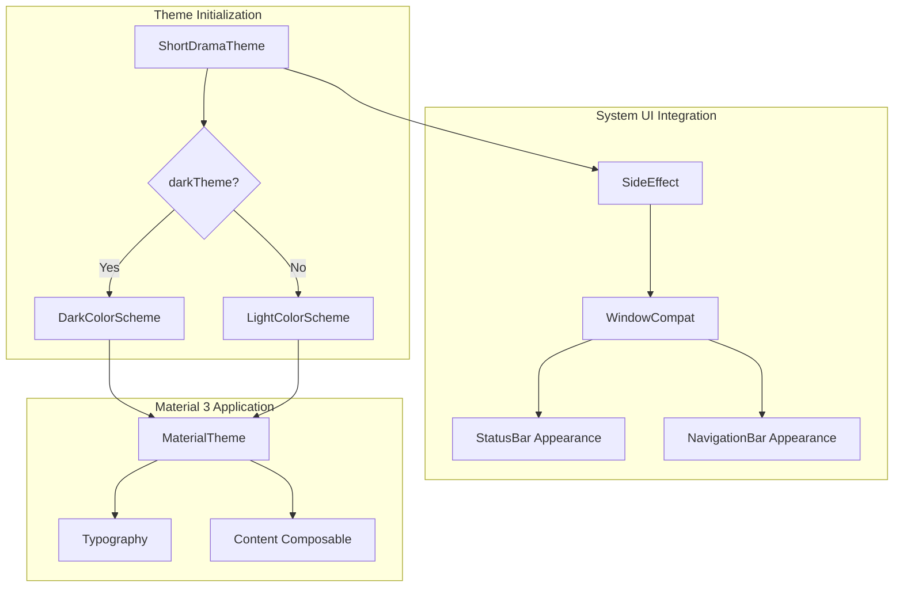
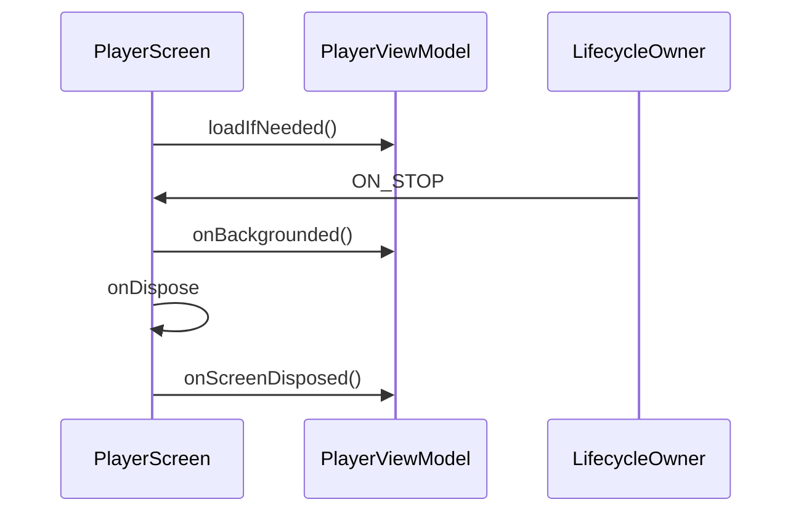
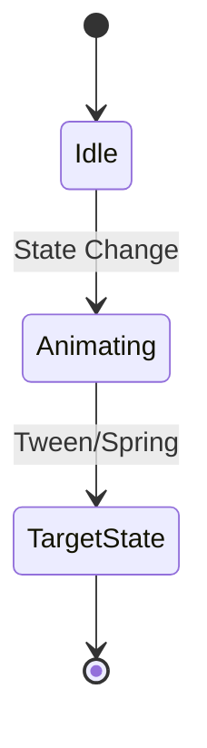

# Jetpack Compose UI 体系

## 目录
1. [模块概览](#模块概览)
2. [主题配置体系](#主题配置体系)
   - [颜色系统与多场景调色板](#颜色系统与多场景调色板)
   - [字体系统与排版规范](#字体系统与排版规范)
   - [动态主题切换与系统 UI 配置](#动态主题切换与系统-ui-配置)
3. [状态管理与数据流架构](#状态管理与数据流架构)
   - [UI 状态建模 (UiState)](#ui-状态建模-uistate)
   - [单向数据流与副作用处理](#单向数据流与副作用处理)
   - [生命周期感知与资源管理](#生命周期感知与资源管理)
4. [组合项构建最佳实践](#组合项构建最佳实践)
   - [CompositionLocal 的深度应用](#compositionlocal-的深度应用)
   - [复杂布局与自定义绘图技巧](#复杂布局与自定义绘图技巧)
   - [响应式动画与交互反馈](#响应式动画与交互反馈)
5. [组件复用与 Feature 隔离策略](#组件复用与-feature-隔离策略)
   - [跨模块通用组件设计](#跨模块通用组件设计)
   - [模块内高内聚组件开发](#模块内高内聚组件开发)
6. [Compose Preview 调试与性能优化](#compose-preview-调试与性能优化)
7. [核心组件列表](#核心组件列表)
8. [文件参考](#文件参考)

## 模块概览

本模块深度探讨了短剧应用的 Android 端 UI 构建体系。基于 **Jetpack Compose**，我们构建了一个响应式、高性能且视觉高度统一的界面系统。

- **总文件数**: 约 45 个核心 UI 相关文件。
- **子模块划分**:
  - `core/theme`: 包含 `Color.kt`、`Type.kt` 和 `Theme.kt`，定义了全局视觉规范。
  - `feature/*/ui/components`: 模块化组件库，确保业务逻辑与 UI 渲染的解耦。
  - `feature/common/ui`: 存放如 `PlaceholderScreen` 等跨业务通用的基础 UI。

本指南旨在为开发者提供从基础主题配置到复杂交互实现的全面指导，确保在快速迭代的同时保持 UI 的一致性和流畅度。

## 主题配置体系

### 颜色系统与多场景调色板

在 `Color.kt` 中，我们不仅定义了标准的 Material 3 配色，还根据业务需求扩展了多个场景的调色板。这种设计允许我们在不同的 Feature 模块中轻松应用特定的视觉风格。

```kotlin
// 剧场页面调色板：强调简洁与卡片感
val TheaterPageBackground = Color(0xFFF6F6F6)
val TheaterCardSurface = Color(0xFFFFFFFF)
val TheaterWarmChipBackground = Color(0xFFFFF3E7)

// 播放器页面调色板：强调沉浸式黑场体验
private val PlayerSurfaceBlack = Color(0xFF000000)
private val PlayerTextPrimary = Color(0xFFF8F8F8)
```

### 字体系统与排版规范

`Type.kt` 封装了标准的 `Typography` 配置，通过 `TextStyle` 定义了从 `headlineLarge` 到 `labelLarge` 的完整文字层级。这确保了应用在不同屏幕尺寸下都能保持良好的易读性。

### 动态主题切换与系统 UI 配置

`Theme.kt` 中的 `ShortDramaTheme` 是整个 UI 树的根节点。它不仅负责应用颜色和字体，还通过 `SideEffect` 动态调整系统状态栏和导航栏的颜色，以匹配当前页面的沉浸式需求。



**Section sources**:
- [Color.kt](android/app/src/main/java/com/djs66256/short_drama/core/theme/Color.kt)
- [Theme.kt](android/app/src/main/java/com/djs66256/short_drama/core/theme/Theme.kt)

## 状态管理与数据流架构

### UI 状态建模 (UiState)

我们采用数据类（Data Class）来建模 UI 状态，将所有的显示逻辑封装在 `UiState` 中。这使得 Composable 函数保持纯净，仅负责根据状态进行渲染。

```kotlin
data class PlayerUiState(
    val screenState: PlayerScreenState = PlayerScreenState.IDLE,
    val currentEpisode: Episode? = null,
    val interactionState: PlayerInteractionState = PlayerInteractionState(),
    // ...
) {
    val canRenderPlayerChrome: Boolean
        get() = screenState in listOf(READY, PLAYING, PAUSED, SWITCHING_EPISODE)
}
```

### 单向数据流与副作用处理

在 `PlayerScreen` 中，我们严格遵循单向数据流。ViewModel 暴露 `StateFlow<PlayerUiState>`，UI 通过 `collectAsState` 订阅。同时，对于 Toast 提示、登录跳转等一次性事件，我们使用 `Channel` 配合 `LaunchedEffect` 进行处理。

```kotlin
LaunchedEffect(viewModel) {
    viewModel.effects.collect { effect ->
        when (effect) {
            is PlayerEffect.RequireLogin -> // 处理登录跳转
            is PlayerEffect.ShowMessage -> // 显示 Toast
        }
    }
}
```

### 生命周期感知与资源管理

对于需要感知生命周期的组件（如播放器引擎），我们使用 `DisposableEffect` 来管理资源的初始化与释放，确保不会发生内存泄漏。



**Section sources**:
- [PlayerUiState.kt](android/app/src/main/java/com/djs66256/short_drama/feature/player/viewmodel/PlayerUiState.kt)
- [PlayerScreen.kt](android/app/src/main/java/com/djs66256/short_drama/feature/player/ui/PlayerScreen.kt)

## 组合项构建最佳实践

### CompositionLocal 的深度应用

除了系统提供的 `LocalContext` 和 `LocalView`，我们在主题配置中利用 `CompositionLocal` 隐式传递关键的 UI 环境参数。这避免了在组合树中进行繁琐的参数透传。

### 复杂布局与自定义绘图技巧

在剧场模块中，为了实现精美的剧集卡片，我们结合了 `LazyVerticalGrid` 的 `GridItemSpan` 和自定义的渐变绘图。

```kotlin
// 剧场卡片的光晕背景实现
@Composable
private fun GradientPosterBackdrop(palette: TheaterPosterPalette) {
    Box(modifier = Modifier.fillMaxSize()) {
        Box(
            modifier = Modifier
                .size(126.dp)
                .offset(x = (-18).dp, y = (-12).dp)
                .clip(CircleShape)
                .background(palette.glowStart.copy(alpha = 0.48f)),
        )
        // 通过多层叠加实现柔和的光影效果
    }
}
```

### 响应式动画与交互反馈

我们大量使用 `animateFloatAsState` 和 `AnimatedVisibility` 来增强界面的动效感。例如，播放器控制栏的显隐动画通过 `graphicsLayer` 的 `alpha` 属性进行平滑过渡，这比直接控制可见性性能更优。



**Section sources**:
- [TheaterComponents.kt](android/app/src/main/java/com/djs66256/short_drama/feature/theater/ui/TheaterComponents.kt)
- [MenuPanelDrawer.kt](android/app/src/main/java/com/djs66256/short_drama/feature/menu/ui/MenuPanelDrawer.kt)

## 组件复用与 Feature 隔离策略

### 跨模块通用组件设计

`feature/common/ui` 目录下定义的组件应具备极高的通用性。例如 `PlaceholderScreen` 接受 `title` 和 `description` 作为参数，不依赖于任何具体的业务模型，只依赖于 `MaterialTheme`。

### 模块内高内聚组件开发

对于特定业务逻辑强相关的 UI 片段，我们将其封装在模块内部的 `components` 目录下。例如播放器的 `PlayerProgressBar`，它封装了进度计算和拖拽反馈逻辑，但通过回调将最终的进度变更通知给父组件。

这种“高内聚、低耦合”的设计模式使得 UI 体系既能保持一致，又能灵活应对各业务线的差异化需求。

## Compose Preview 调试与性能优化

为了提升开发效率，我们为所有关键组件编写了预览函数。

> ⚠️ **注意**: 在编写 Preview 时，请务必包裹在 `ShortDramaTheme` 中，以确保预览效果与真机运行一致。

**性能优化建议**:
1. **减少重组**: 使用 `remember` 缓存计算结果，对于频繁变动的状态（如滚动位置），使用 `derivedStateOf`。
2. **Lambda 稳定性**: 尽量将回调函数声明为 `val` 或使用 `remember` 包装，避免不必要的重组。
3. **布局扁平化**: 充分利用 `Box` 和 `ConstraintLayout` 减少布局嵌套深度。

## 核心组件列表

| 组件名称 | 核心职责 | 关键特性 |
| :--- | :--- | :--- |
| `ShortDramaTheme` | 全局视觉包装 | 支持深色模式，自动适配系统 UI 颜色 |
| `PlayerScreen` | 播放器主界面 | 复杂的生命周期管理，多层级交互状态 |
| `TheaterContent` | 剧场列表容器 | 基于 `LazyVerticalGrid` 的高性能网格布局 |
| `MenuPanelDrawer` | 侧边导航抽屉 | 贝塞尔曲线平滑动画，支持手势关闭 |
| `PlaceholderScreen` | 通用异常/空态页 | 响应式布局，自动适配屏幕中心 |

## 文件参考

- [core/theme/Theme.kt](android/app/src/main/java/com/djs66256/short_drama/core/theme/Theme.kt) - 全局主题入口
- [core/theme/Color.kt](android/app/src/main/java/com/djs66256/short_drama/core/theme/Color.kt) - 视觉调色板定义
- [feature/player/ui/PlayerScreen.kt](android/app/src/main/java/com/djs66256/short_drama/feature/player/ui/PlayerScreen.kt) - 播放器核心实现
- [feature/player/ui/components/PlayerComponents.kt](android/app/src/main/java/com/djs66256/short_drama/feature/player/ui/components/PlayerComponents.kt) - 播放器子组件库
- [feature/theater/ui/TheaterComponents.kt](android/app/src/main/java/com/djs66256/short_drama/feature/theater/ui/TheaterComponents.kt) - 剧场 UI 实现
- [feature/menu/ui/MenuPanelDrawer.kt](android/app/src/main/java/com/djs66256/short_drama/feature/menu/ui/MenuPanelDrawer.kt) - 动画抽屉组件
- [feature/common/ui/PlaceholderScreen.kt](android/app/src/main/java/com/djs66256/short_drama/feature/common/ui/PlaceholderScreen.kt) - 通用 UI 基础库
