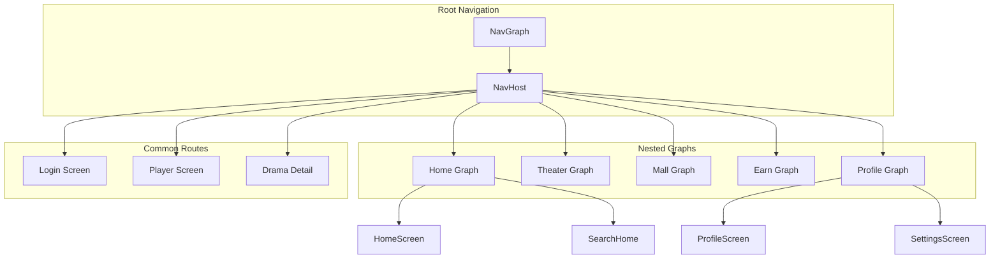
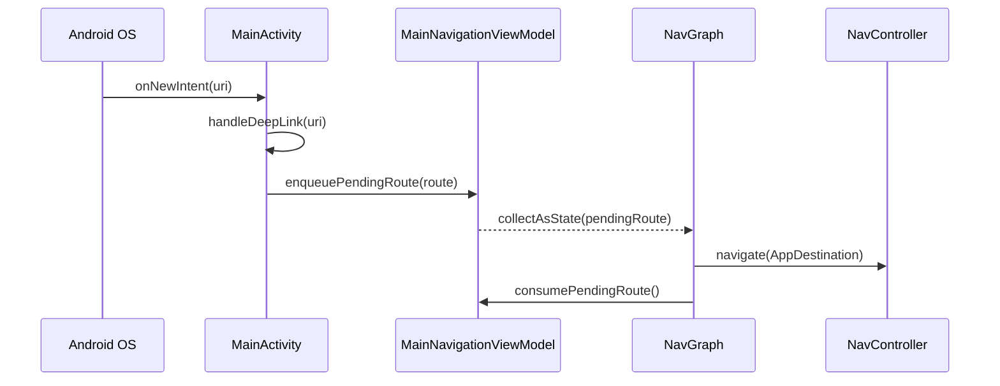
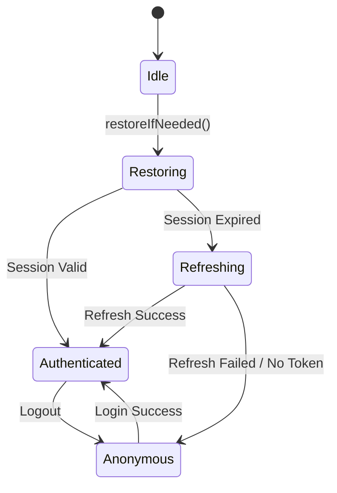
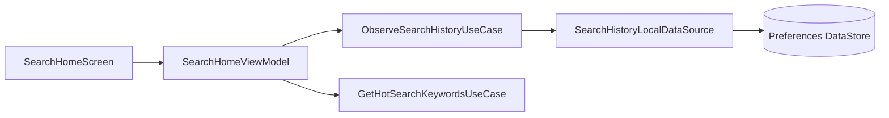
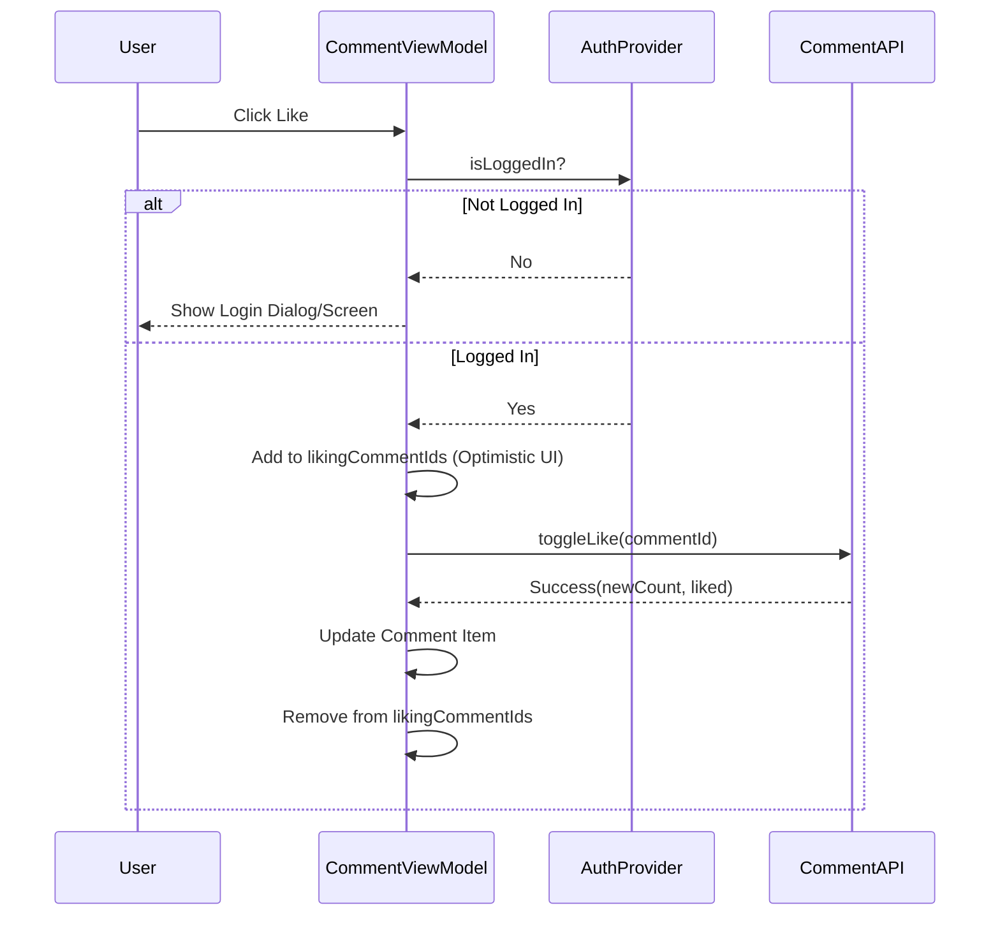

# 业务模块与导航体系

## 目录
1. [模块概览](#模块概览)
2. [导航架构](#导航架构)
   - [路由定义与 NavGraph](#路由定义与-navgraph)
   - [深层链接 (DeepLink) 处理](#深层链接-deeplink-处理)
   - [全局导航状态管理](#全局导航状态管理)
3. [认证流程](#认证流程)
   - [登录页面实现](#登录页面实现)
   - [验证码发送与冷却逻辑](#验证码发送与冷却逻辑)
   - [AuthBootstrapper 登录态恢复](#authbootstrapper-登录态恢复)
4. [搜索与分类](#搜索与分类)
   - [搜索历史管理](#搜索历史管理)
   - [热门搜索与分类联动](#热门搜索与分类联动)
5. [评论系统](#评论系统)
   - [CommentBottomSheet 交互设计](#commentbottomsheet-交互设计)
   - [分页加载与点赞逻辑](#分页加载与点赞逻辑)
6. [应用入口与生命周期](#应用入口与生命周期)
   - [MainActivity 职责](#mainactivity-职责)
7. [模块间解耦方式](#模块间解耦方式)
8. [文件参考](#文件参考)

## 模块概览

本章节深入探讨了 Android 客户端中除核心播放器之外的关键业务模块及其支撑体系。这些模块构成了应用的用户交互核心，涵盖了从基础的导航流转到复杂的社交互动与认证安全。

**规模评估与范围**：
- **涉及目录**：主要包括 `feature/auth`（认证）、`feature/search`（搜索）、`feature/comments`（评论）、`feature/profile`（个人中心）以及 `navigation`（导航控制）。此外，还涉及 `core/auth` 中的底层状态管理和 `data/local` 中的持久化数据源。
- **文件总数**：该范围内包含约 80 个 Kotlin 源文件，涵盖了 UI 组件、ViewModel、领域模型及数据访问对象。
- **覆盖深度**：深度分析（Deep）。本指南不仅描述功能实现，还详细剖析了导航图的构建逻辑、认证状态的自动恢复机制、搜索历史的去重算法以及评论系统的分页与登录拦截策略。

通过本章节的学习，开发者将能够理解 Android 端是如何通过 Compose Navigation 实现多层级嵌套路由的，以及各业务模块如何通过 Hilt 依赖注入和领域层接口实现高度解耦。

## 导航架构

应用的导航体系是基于 Jetpack Compose Navigation 构建的单 Activity 架构。它通过集中化的路由管理和响应式的状态分发，确保了页面流转的高效与一致。

### 路由定义与 NavGraph

所有的路由路径和参数键值都集中在 `AppDestination.kt` 中定义。这种集中化管理避免了硬编码字符串散落在各处，提高了代码的可维护性。`AppDestination` 对象不仅定义了常量，还提供了类型安全的路由构建函数，例如 `play(videoId: String)` 和 `login(returnRoute: String?)`。

`NavGraph.kt` 是导航系统的核心配置类。它定义了一个 `NavHost`，其中包含多个嵌套导航图（Nested Graphs），每个图层对应一个底部导航栏标签：

```kotlin
// NavGraph.kt 中的核心路由构建片段
NavHost(
    navController = navController,
    startDestination = AppDestination.Graph.HOME,
    modifier = Modifier.padding(innerPadding),
) {
    navigation(
        startDestination = AppDestination.Route.HOME,
        route = AppDestination.Graph.HOME,
    ) {
        composable(route = AppDestination.Route.HOME) {
            HomeScreen(/* ... */)
        }
        composable(route = AppDestination.Route.SEARCH) {
            SearchHomeScreen(/* ... */)
        }
        // 其他主页相关的子路由
    }
    // 其他业务图层：THEATER, MALL, EARN, PROFILE
}
```

下面的架构图展示了导航系统的层级结构与模块分布：



在 `NavGraph` 中，根部的 `Scaffold` 负责管理底部导航栏的显示逻辑。通过 `shouldShowBottomBar` 函数，系统会根据当前路由的路径特征（如是否包含 `play/` 或 `login`）动态决定是否隐藏底部栏，从而为全屏播放或登录操作提供更好的沉浸感。

### 深层链接 (DeepLink) 处理

应用支持通过 `djsdrama://` 协议进行深层链接跳转。这一功能对于营销推广和通知唤起至关重要。`DeeplinkRouteParser` 负责将原始的 URI 字符串解析为 `PendingRoute` 密封接口。

解析逻辑遵循严格的 Scheme 校验和 Host 匹配规则。例如，`djsdrama://play/123` 会被解析为 `PendingRoute.Play(videoId = "123")`。解析后的路由会被存入 `MainNavigationViewModel` 的待处理队列中。



这种“解析-入队-消费”的模式实现了 DeepLink 解析逻辑与 UI 导航逻辑的完全解耦。无论应用是在前台运行还是从后台唤起，`NavGraph` 都能通过 `LaunchedEffect` 观察到 `pendingRoute` 的变化并执行跳转，确保了跳转行为的可靠性。

### 全局导航状态管理

`MainNavigationViewModel` 扮演着导航控制器的大脑角色。除了处理 DeepLink，它还负责管理侧边栏菜单（`MenuPanel`）的状态。由于侧边栏的开关通常伴随着页面的切换，ViewModel 提供了 `closeMenuThenNavigate` 等辅助方法，确保在执行页面跳转前，侧边栏能够平滑地关闭，避免 UI 遮挡或冲突。

**Section sources**:
- [NavGraph.kt:L71-L640](android/app/src/main/java/com/djs66256/short_drama/navigation/NavGraph.kt#L71-L640)
- [AppDestination.kt:L70-L183](android/app/src/main/java/com/djs66256/short_drama/navigation/AppDestination.kt#L70-L183)
- [DeeplinkRouteParser.kt:L9-L65](android/app/src/main/java/com/djs66256/short_drama/navigation/DeeplinkRouteParser.kt#L9-L65)

## 认证流程

认证模块（`feature/auth`）是应用的安全基石，负责管理用户的登录态、Session 刷新以及敏感操作的权限校验。

### 登录页面实现

`LoginScreen.kt` 采用了简洁的手机号验证码登录方案。UI 层面使用了 `OutlinedTextField` 提供友好的交互反馈，包括实时的手机号格式校验和验证码长度校验。

```kotlin
// LoginViewModel.kt 中的提交逻辑
fun submitLogin() {
    val state = _uiState.value
    // 执行本地校验：手机号格式、验证码长度、协议勾选
    if (!validateInputs(state)) return

    viewModelScope.launch {
        _uiState.update { it.copy(isSubmitting = true) }
        val result = createSessionUseCase(state.phone, state.code)
        when (result) {
            is ApiResult.Success -> {
                // 登录成功，清除冷却倒计时并发送成功事件
                authCooldownStore.clear()
                _events.emit(LoginEvent.LoginSucceeded(resolveSuccessRoute(returnRoute)))
            }
            is ApiResult.Error -> {
                _uiState.update { it.copy(globalError = mapSubmitError(result.code)) }
            }
        }
        _uiState.update { it.copy(isSubmitting = false) }
    }
}
```

### 验证码发送与冷却逻辑

为了平衡用户体验与接口安全，应用实现了一套严谨的验证码冷却（Cooldown）机制。`LoginViewModel` 并不直接管理倒计时数值，而是将“冷却截止时间戳”持久化到 `AuthCooldownStore` 中。

这种设计的优势在于：
1. **进程无关性**：即便用户在等待验证码期间强杀应用，重新进入后倒计时依然能根据系统时间准确恢复。
2. **状态一致性**：通过 `syncCooldown` 方法，ViewModel 会根据持久化的时间戳启动一个协程 Job，每秒更新一次 UI 状态。

### AuthBootstrapper 登录态恢复

`AuthBootstrapper` 是应用启动时的关键组件。它在 `MainActivity.onStart()` 中被调用，负责在用户感知不到的情况下恢复或刷新登录态。



恢复逻辑分为三个阶段：
1. **本地恢复**：从加密存储中读取 Token。
2. **在线校验**：调用 `me` 接口获取用户信息。如果返回 `AUTH_UNAUTHORIZED`，则进入刷新阶段。
3. **自动刷新**：利用 `refreshToken` 尝试获取新的 Access Token。如果刷新失败（如 Token 已彻底失效），则清除本地 Session 并将用户状态置为未登录。

**Section sources**:
- [LoginScreen.kt:L45-L176](android/app/src/main/java/com/djs66256/short_drama/feature/auth/ui/LoginScreen.kt#L45-L176)
- [LoginViewModel.kt:L83-L210](android/app/src/main/java/com/djs66256/short_drama/feature/auth/viewmodel/LoginViewModel.kt#L83-L210)
- [AuthBootstrapper.kt:L15-L41](android/app/src/main/java/com/djs66256/short_drama/core/auth/AuthBootstrapper.kt#L15-L41)

## 搜索与分类

搜索模块（`feature/search`）不仅仅是一个输入框，它是一个整合了历史记录、热门趋势和快速分类导航的综合性入口。

### 搜索历史管理

搜索历史的持久化由 `SearchHistoryLocalDataSource` 负责。为了保证读写性能，它选用了 `Preferences DataStore` 配合 `Kotlinx Serialization`。

**核心算法：搜索记录归一化与去重**
当用户发起搜索时，系统会执行以下逻辑：
1. **归一化**：去除首尾空格，统一字符格式。
2. **置顶与去重**：如果该关键字已存在，则将其从旧位置移除并插入到列表头部，同时更新时间戳。
3. **容量控制**：通过 `take(MAX_SEARCH_HISTORY_COUNT)` 确保列表始终维持在 10 条以内，避免占用过多存储空间。

### 热门搜索与分类联动

`SearchHomeScreen` 的 UI 结构采用了 `LazyColumn` 配合分块设计（Sections）。`SearchHomeViewModel` 负责聚合来自不同数据源的数据：
- **快速入口**：展示预定义的分类标签（如“都市”、“玄幻”），点击后通过路由参数传递分类 ID。
- **热门搜索**：从服务端拉取当前的流行关键字，并提供重试机制。
- **猜你喜欢**：基于热门数据的个性化推荐展示。



这种架构确保了搜索页面的响应速度。历史记录作为本地流（Flow）被实时观察，当用户在搜索结果页返回或手动清除历史时，`SearchHomeScreen` 会立即反映这些变化。

**Section sources**:
- [SearchHomeScreen.kt:L32-L101](android/app/src/main/java/com/djs66256/short_drama/feature/search/ui/SearchHomeScreen.kt#L32-L101)
- [SearchHistoryLocalDataSource.kt:L33-L113](android/app/src/main/java/com/djs66256/short_drama/data/local/SearchHistoryLocalDataSource.kt#L33-L113)
- [SearchHomeViewModel.kt:L61-L155](android/app/src/main/java/com/djs66256/short_drama/feature/search/viewmodel/SearchHomeViewModel.kt#L61-L155)

## 评论系统

评论系统（`feature/comments`）展示了应用在处理复杂 UI 交互和权限拦截方面的设计思路。

### CommentBottomSheet 交互设计

评论组件以 `ModalBottomSheet` 的形式呈现，允许用户在观看视频的同时查看和发表评论。为了提升性能，列表部分采用了分页加载，并且在 `ViewModel` 中管理了精细的加载状态（`CommentListState`）。

### 分页加载与点赞逻辑

`CommentSheetViewModel` 封装了所有的业务逻辑，包括分页控制、排序切换（最新/最热）以及点赞操作。

**点赞操作的权限拦截机制**：
当用户点击点赞按钮时，ViewModel 会首先通过 `AuthSessionProvider` 检查登录状态。如果用户未登录，ViewModel 会发出一个 `RequireLogin` 副作用。



在点赞请求进行中，对应的评论 ID 会被临时存入 `likingCommentIds` 集合。UI 层面可以利用这一状态展示 Loading 动画或禁用按钮，从而实现良好的交互反馈并防止重复提交。

**Section sources**:
- [CommentBottomSheet.kt:L25-L108](android/app/src/main/java/com/djs66256/short_drama/feature/comments/ui/CommentBottomSheet.kt#L25-L108)
- [CommentSheetViewModel.kt:L109-L184](android/app/src/main/java/com/djs66256/short_drama/feature/comments/viewmodel/CommentSheetViewModel.kt#L109-L184)

## 应用入口与生命周期

### MainActivity 职责

`MainActivity` 作为应用的唯一 Activity，承担了宿主和协调者的多重角色：
1. **依赖注入宿主**：通过 `@AndroidEntryPoint` 标记，成为 Hilt 依赖树的根节点。
2. **UI 容器**：配置 Compose 环境，定义全局主题，并初始化 `NavHost`。
3. **DeepLink 分发**：在 `onCreate` 和 `onNewIntent` 中解析 Intent 携带的 URI，并将其转换为内部导航指令。
4. **登录态引导**：在 `onStart` 生命周期中触发 `AuthBootstrapper` 的恢复逻辑，确保用户进入应用时数据已就绪。
5. **调试与演示支持**：内置了 `rankingShowcaseMode`，允许开发人员通过特定的 Intent 参数直接进入排行榜演示模式，方便 UI 调试和功能展示。

**Section sources**:
- [MainActivity.kt:L39-L119](android/app/src/main/java/com/djs66256/short_drama/MainActivity.kt#L39-L119)

## 模块间解耦方式

为了实现业务模块的独立开发与测试，项目采用了以下解耦策略：
- **路由抽象**：模块之间不直接引用具体的 Screen 函数，而是通过 `AppDestination` 提供的常量路径进行跳转。
- **依赖倒置**：业务模块仅依赖于 `domain` 层定义的接口。例如，评论模块通过注入 `AuthSessionProvider` 来判断登录状态，而不需要知道认证模块的具体实现。
- **UI 副作用隔离**：ViewModel 不持有 `NavController`。所有的导航请求都通过 `SharedFlow` 以事件的形式发送到 UI 层，由 Composable 函数执行实际的跳转动作。

## 文件参考

本章节涉及的主要源文件及其在工作区中的位置如下：

| 模块 | 关键文件路径 | 职责描述 |
| :--- | :--- | :--- |
| **导航** | `android/app/src/main/java/com/djs66256/short_drama/navigation/NavGraph.kt` | 全局导航图构建与路由配置 |
| | `android/app/src/main/java/com/djs66256/short_drama/navigation/AppDestination.kt` | 路由路径定义与参数构建器 |
| | `android/app/src/main/java/com/djs66256/short_drama/navigation/DeeplinkRouteParser.kt` | 深层链接 URI 解析逻辑 |
| **认证** | `android/app/src/main/java/com/djs66256/short_drama/feature/auth/ui/LoginScreen.kt` | 登录页面 UI 实现 |
| | `android/app/src/main/java/com/djs66256/short_drama/feature/auth/viewmodel/LoginViewModel.kt` | 登录逻辑与验证码冷却管理 |
| | `android/app/src/main/java/com/djs66256/short_drama/core/auth/AuthBootstrapper.kt` | 启动时的登录态恢复与刷新 |
| **搜索** | `android/app/src/main/java/com/djs66256/short_drama/feature/search/ui/SearchHomeScreen.kt` | 搜索首页 UI 布局 |
| | `android/app/src/main/java/com/djs66256/short_drama/data/local/SearchHistoryLocalDataSource.kt` | 搜索历史 DataStore 持久化 |
| **评论** | `android/app/src/main/java/com/djs66256/short_drama/feature/comments/ui/CommentBottomSheet.kt` | 评论列表半屏弹窗交互 |
| | `android/app/src/main/java/com/djs66256/short_drama/feature/comments/viewmodel/CommentSheetViewModel.kt` | 评论分页、点赞与登录拦截逻辑 |
| **入口** | `android/app/src/main/java/com/djs66256/short_drama/MainActivity.kt` | 应用主入口与生命周期管理 |
