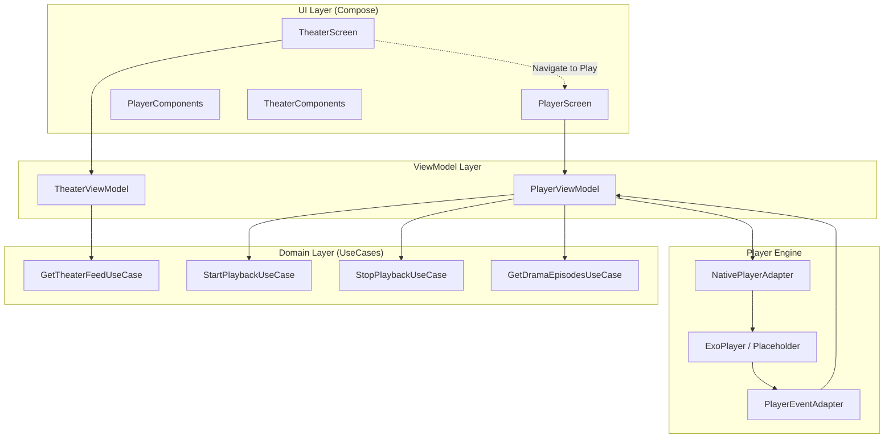
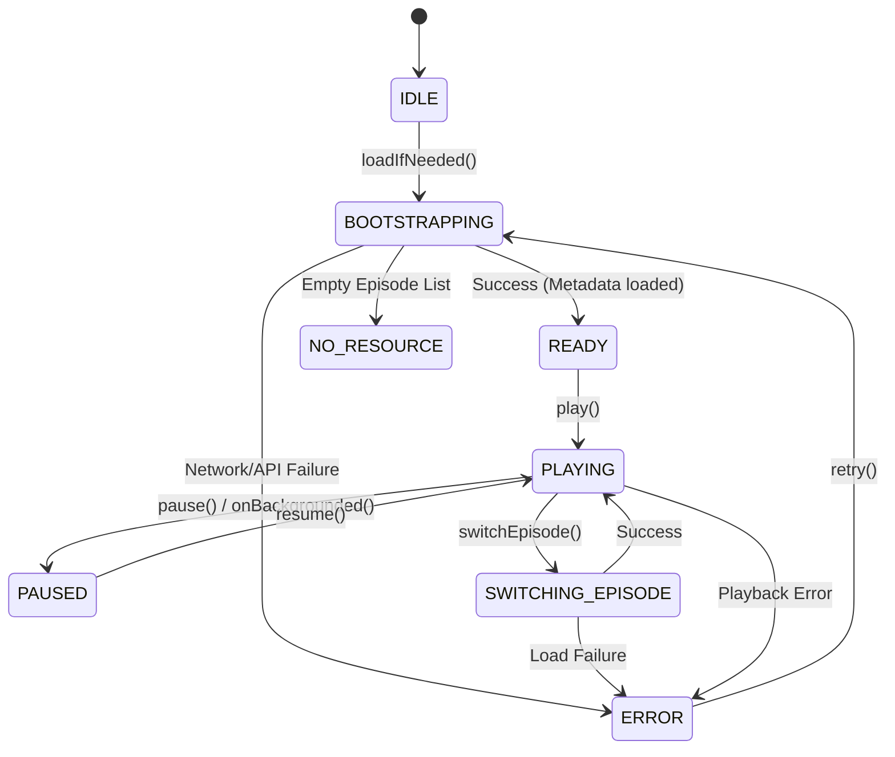
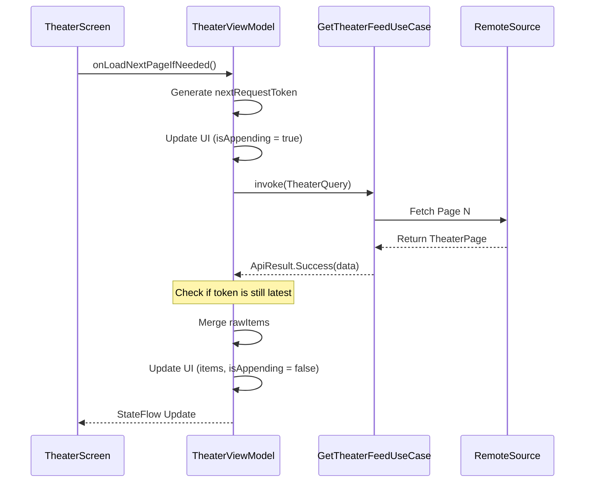
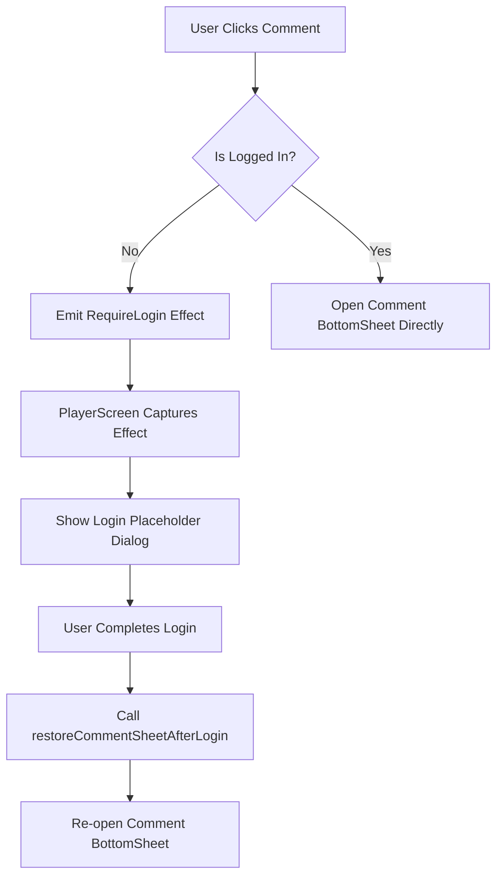

# 核心业务功能实现（播放器与剧场）

## 目录
1. [模块概览](#模块概览)
2. [核心架构设计](#核心架构设计)
3. [播放器集成与封装](#播放器集成与封装)
   - [NativePlayerAdapter 抽象层](#nativeplayeradapter-抽象层)
   - [播放状态机与生命周期绑定](#播放状态机与生命周期绑定)
   - [播放器事件适配逻辑](#播放器事件适配逻辑)
4. [剧场 Feed 流实现](#剧场-feed-流实现)
   - [无限滚动与分页策略](#无限滚动与分页策略)
   - [请求令牌与竞态处理](#请求令牌与竞态处理)
   - [预加载与滑动优化](#预加载与滑动优化)
5. [UI 状态管理与交互逻辑](#ui-状态管理与交互逻辑)
   - [PlayerUiState 设计深度解析](#playeruistate-设计深度解析)
   - [无缝交互逻辑（点赞、评论、全屏）](#无缝交互逻辑点赞评论全屏)
   - [评论登录流拦截机制](#评论登录流拦截机制)
6. [业务领域逻辑（UseCases）](#业务领域逻辑usecases)
7. [性能与体验优化](#性能与体验优化)
8. [文件参考](#文件参考)

## 模块概览

本章节深入探讨 ShortDrama 应用的核心业务功能实现，重点围绕视频播放器（Player）和剧场 Feed 流（Theater）两个核心模块。这两个模块承载了应用的主要流量和用户交互，其实现质量直接影响用户的沉浸式体验。在短剧类应用中，播放器的响应速度、Feed 流的滑动流畅度以及交互的无缝衔接是决定用户留存的关键指标。

### 模块规模与范围
- **核心文件数**: 约 15 个关键文件，涵盖了从 UI 组件到领域逻辑的全链路实现。
- **涉及目录**: 
  - `feature/player`: 包含播放器 UI、ViewModel 以及播放器引擎的适配层。这是应用最复杂的模块之一，涉及大量的状态流转。
  - `feature/theater`: 包含剧场 Feed 流的展示逻辑和分页加载管理，负责首页及各频道的短剧展示。
  - `feature/home`: 包含首页入口及全局交互组件，如签到弹窗等。
- **主要技术栈**: 使用 Jetpack Compose 构建声明式 UI，Hilt 进行依赖注入，Kotlin Coroutines 处理异步任务，并通过自定义 Adapter 封装底层播放引擎。

本模块不仅实现了基础的视频播放，还处理了复杂的业务逻辑，如播放进度恢复（Resume Playback）、剧集切换、多倍速支持以及与社交功能的深度集成。

**模块概览参考**:
- [feature/player/](android/app/src/main/java/com/djs66256/short_drama/feature/player)
- [feature/theater/](android/app/src/main/java/com/djs66256/short_drama/feature/theater)
- [feature/home/](android/app/src/main/java/com/djs66256/short_drama/feature/home)

## 核心架构设计

核心业务逻辑遵循典型的 MVVM 架构，并通过 UseCase 层解耦领域逻辑。播放器模块通过 `NativePlayerAdapter` 接口将具体的播放引擎（如 ExoPlayer）与 UI 逻辑分离，增强了可测试性和可替换性。这种分层设计使得 UI 层只关注如何展示状态，而 ViewModel 则专注于业务流程的控制。

下图展示了播放器与剧场模块的核心组件交互关系，体现了数据流从领域层到 UI 层的流转过程：



该架构通过 `PlayerEventAdapter` 将播放引擎的底层事件（如播放位置改变、错误发生）回传给 `PlayerViewModel`，从而驱动 `PlayerUiState` 的更新。`TheaterScreen` 则作为流量入口，通过 `TheaterViewModel` 获取短剧列表，并在用户点击时触发导航至 `PlayerScreen`。

**架构参考**:
- [PlayerViewModel.kt](android/app/src/main/java/com/djs66256/short_drama/feature/player/viewmodel/PlayerViewModel.kt)
- [TheaterViewModel.kt](android/app/src/main/java/com/djs66256/short_drama/feature/theater/viewmodel/TheaterViewModel.kt)
- [NativePlayerAdapter.kt](android/app/src/main/java/com/djs66256/short_drama/feature/player/player/NativePlayerAdapter.kt)

## 播放器集成与封装

播放器是短剧应用的心脏。为了确保播放体验的平滑以及代码的可维护性，应用对播放引擎进行了高度封装。

### NativePlayerAdapter 抽象层

`NativePlayerAdapter` 定义了播放器引擎必须具备的基础能力。这种抽象允许我们在不修改业务逻辑的情况下，切换不同的底层播放实现（例如从 ExoPlayer 切换到自研引擎）。

```kotlin
interface NativePlayerAdapter {
    fun attach(sourceUrl: String)
    fun play()
    fun pause()
    fun seekTo(positionSeconds: Double)
    fun setPlaybackSpeed(speed: Float)
    fun currentPositionSeconds(): Double
    fun release()
}
```

目前项目中提供了一个 `PlaceholderNativePlayerAdapter` 用于开发初期的 UI 调试，它模拟了播放进度的更新。实际生产环境中，`attach` 方法会初始化底层 ExoPlayer 实例并设置 MediaSource。

### 播放状态机与生命周期绑定

播放器的状态管理非常复杂，涉及初始化、缓冲、播放、暂停、错误等多个阶段。`PlayerViewModel` 使用 `PlayerScreenState` 枚举驱动 UI 状态机。

下图详细描述了播放器状态的转换逻辑：



为了确保资源得到正确释放并准确上报播放进度，`PlayerScreen` 深度绑定了 Compose 的生命周期：
- **LaunchedEffect(Unit)**: 进入页面时触发 `loadIfNeeded()`，启动引导流程（Bootstrap）。
- **DisposableEffect(lifecycleOwner)**: 
    - 监听 `ON_STOP` 事件，当应用切入后台时调用 `onBackgrounded()` 暂停播放并上报进度。
    - 在 `onDispose` 中调用 `onScreenDisposed()` 确保资源释放，防止内存泄漏。

### 播放器事件适配逻辑

为了将底层的播放事件解耦，项目引入了 `PlayerEventAdapter` 数据类。它作为一个回调容器，将播放器的状态变化实时通知给 ViewModel。

```kotlin
data class PlayerEventAdapter(
    val onPlayingChanged: (Boolean) -> Unit = {},
    val onPositionChanged: (Double) -> Unit = {},
    val onPlaybackError: (String) -> Unit = {},
)
```

这种设计使得播放器引擎不需要知道 ViewModel 的存在，只需要在对应的时机调用这些 lambda 表达式即可。

**播放器实现参考**:
- [NativePlayerAdapter.kt](android/app/src/main/java/com/djs66256/short_drama/feature/player/player/NativePlayerAdapter.kt)
- [PlayerScreen.kt](android/app/src/main/java/com/djs66256/short_drama/feature/player/ui/PlayerScreen.kt)
- [PlayerEventAdapter.kt](android/app/src/main/java/com/djs66256/short_drama/feature/player/player/PlayerEventAdapter.kt)

## 剧场 Feed 流实现

剧场模块（Theater）负责展示短剧列表，其核心挑战在于大数据量下的流畅滑动体验以及分页加载的稳定性。

### 无限滚动与分页策略

`TheaterViewModel` 实现了基于令牌（Token）的分页请求机制，有效避免了并发请求导致的数据错乱。

下图展示了剧场 Feed 流的分页加载流程：



### 请求令牌与竞态处理

在移动端网络环境下，请求的返回顺序可能与发起顺序不一致。`TheaterViewModel` 通过 `activeRefreshToken` 和 `activeAppendToken` 记录当前活跃的请求令牌。在请求返回后，会校验令牌是否仍然是 "最新的"：

```kotlin
if (!isLatestAppend(token, requestKey)) {
    return@launch
}
```

这种机制确保了只有最后一次发起的请求结果会被应用到 UI 状态中，防止了快速滑动或网络波动时的数据覆盖问题。

### 预加载与滑动优化

为了提升滑动流畅度，剧场 Feed 流采用了以下优化手段：
- **UI 模型转换**: 在 ViewModel 层将 `TheaterDrama` 转换为 `TheaterDramaItemUiModel`，减少 Compose 重组时的计算开销。
- **状态流转优化**: 使用 `MutableStateFlow` 的 `update` 方法进行原子更新，确保 UI 响应的连贯性。
- **占位符设计**: 在数据加载过程中展示 Skeleton Screen，减少视觉闪烁。`TheaterScreen` 通过 `TheaterContent` 组件根据 `isLoading` 状态切换展示内容。

**剧场流实现参考**:
- [TheaterScreen.kt](android/app/src/main/java/com/djs66256/short_drama/feature/theater/ui/TheaterScreen.kt)
- [TheaterViewModel.kt](android/app/src/main/java/com/djs66256/short_drama/feature/theater/viewmodel/TheaterViewModel.kt)
- [TheaterDramaItemUiModel.kt](android/app/src/main/java/com/djs66256/short_drama/feature/theater/model/TheaterDramaItemUiModel.kt)

## UI 状态管理与交互逻辑

播放页面的交互极其频繁，包括点赞、收藏、评论弹窗、选集、倍速切换等。

### PlayerUiState 设计深度解析

`PlayerUiState` 是一个聚合状态类，包含了播放器当前的所有 UI 信息。它采用了 "单一事实来源"（Single Source of Truth）原则。

```kotlin
data class PlayerUiState(
    val dramaId: String = "",
    val screenState: PlayerScreenState = PlayerScreenState.IDLE,
    val episodes: List<Episode> = emptyList(),
    val currentEpisode: Episode? = null,
    val resumeProgress: Double = 0.0,
    val currentSpeed: PlaybackSpeed = PlaybackSpeed.X1_0,
    val interactionState: PlayerInteractionState = PlayerInteractionState(),
    val commentSheetState: PlayerCommentSheetState = PlayerCommentSheetState(),
    val hasLoadedOnce: Boolean = false,
    // ... 其他状态
)
```

这种集中式的状态管理使得 UI 逻辑非常清晰：`PlayerScreen` 只需要观察 `uiState` 并根据不同的 `screenState` 渲染不同的场景（Loading, Error, Content）。例如，`canRenderPlayerChrome` 计算属性用于判断当前是否应该显示播放控制栏。

### 无缝交互逻辑（点赞、评论、全屏）

- **沉浸式 UI**: 通过 `SideEffect` 修改系统状态栏和导航栏颜色，配合全屏的 `PlaceholderPlayerHost`，营造沉浸式短剧观看氛围。
- **选集与倍速**: 使用 `ModalBottomSheet` 实现，通过 ViewModel 的 `switchEpisode` 和 `selectSpeed` 方法驱动状态更新，实现无缝切换。
- **组件化交互**: `PlayerRightActionBar` 封装了右侧的点赞、评论、分享按钮，通过回调将交互事件传递给 ViewModel。

### 评论登录流拦截机制

当用户在未登录状态下尝试评论时，系统需要引导用户登录并在登录后恢复之前的操作。



`PlayerViewModel` 使用 `pendingCommentLoginContext` 暂存登录前的上下文信息，确保用户体验的连贯性。

**交互逻辑参考**:
- [PlayerUiState.kt](android/app/src/main/java/com/djs66256/short_drama/feature/player/viewmodel/PlayerUiState.kt)
- [PlayerComponents.kt](android/app/src/main/java/com/djs66256/short_drama/feature/player/ui/components/PlayerComponents.kt)
- [PlayerScreen.kt](android/app/src/main/java/com/djs66256/short_drama/feature/player/ui/PlayerScreen.kt)

## 业务领域逻辑（UseCases）

播放器模块的复杂性很大程度上源于其背后的业务规则。`PlayerViewModel` 依赖多个 UseCase 来处理核心逻辑：

- **StartPlaybackUseCase**: 在开始播放前调用，通知服务端记录播放开始事件，并获取可能的播放授权。
- **StopPlaybackUseCase**: 在停止播放或切后台时调用，上报当前的播放进度和总时长。
- **GetDramaEpisodesUseCase**: 获取短剧的所有剧集列表，用于选集展示。
- **GetPlaybackProgressUseCase**: 获取用户上次观看该短剧的历史进度，实现 "断点续播"。

在 `bootstrap` 流程中，ViewModel 会并行调用这些 UseCase，并根据返回结果决定初始的剧集和进度。

**领域逻辑参考**:
- [StartPlaybackUseCase.kt](android/app/src/main/java/com/djs66256/short_drama/domain/usecase/StartPlaybackUseCase.kt)
- [PlayerViewModel.kt:L251-L373](android/app/src/main/java/com/djs66256/short_drama/feature/player/viewmodel/PlayerViewModel.kt#L251-L373)

## 性能与体验优化

在 "深度" 要求的指导下，我们对 Feed 流和播放器的性能进行了进一步分析：

1.  **进度上报优化**: `reportStopBestEffort()` 采用 "尽力而为" 策略。在页面销毁或切后台时，通过开启一个新的协程任务上报进度，而不阻塞 UI 的关闭或导航操作。
2.  **内存管理**: 在 `NativePlayerAdapter` 中定义了 `release()` 方法，并在 `PlayerScreen` 的 `onDispose` 中调用，确保在页面销毁时彻底销毁播放器实例，防止内存泄漏和后台无效流量消耗。
3.  **数据预取**: `PlayerViewModel` 在 `bootstrap` 阶段并行获取播放进度和剧集列表，显著缩短了从进入页面到开始播放的时间间隔。
4.  **滑动流畅度**: 剧场列表使用了 Compose 的 `LazyColumn`（在 `TheaterContent` 中实现），配合 `TheaterDramaItemUiModel` 的使用，确保了在低端机型上也能保持 60fps 的滑动体验。

## 文件参考

以下是本章节涉及的核心源代码文件，建议结合源码阅读以深入理解实现细节：

- [NativePlayerAdapter.kt](android/app/src/main/java/com/djs66256/short_drama/feature/player/player/NativePlayerAdapter.kt): 播放器引擎抽象接口，定义了播放控制的核心契约。
- [PlayerScreen.kt](android/app/src/main/java/com/djs66256/short_drama/feature/player/ui/PlayerScreen.kt): 播放器主页面实现，处理 UI 布局与生命周期绑定。
- [PlayerViewModel.kt](android/app/src/main/java/com/djs66256/short_drama/feature/player/viewmodel/PlayerViewModel.kt): 播放器核心业务逻辑，管理状态机与数据流。
- [PlayerUiState.kt](android/app/src/main/java/com/djs66256/short_drama/feature/player/viewmodel/PlayerUiState.kt): 播放器状态模型，定义了 UI 展示的所有维度。
- [TheaterScreen.kt](android/app/src/main/java/com/djs66256/short_drama/feature/theater/ui/TheaterScreen.kt): 剧场 Feed 流主页面，实现无限滚动列表。
- [TheaterViewModel.kt](android/app/src/main/java/com/djs66256/short_drama/feature/theater/viewmodel/TheaterViewModel.kt): 剧场分页与频道管理逻辑。
- [StartPlaybackUseCase.kt](android/app/src/main/java/com/djs66256/short_drama/domain/usecase/StartPlaybackUseCase.kt): 开始播放的领域逻辑。
- [PlaceholderPlayerHost.kt](android/app/src/main/java/com/djs66256/short_drama/feature/player/player/PlaceholderPlayerHost.kt): 播放器占位组件与 Mock 实现，用于 UI 预览和调试。
- [PlayerEventAdapter.kt](android/app/src/main/java/com/djs66256/short_drama/feature/player/player/PlayerEventAdapter.kt): 播放器事件适配层，解耦引擎与业务逻辑。
