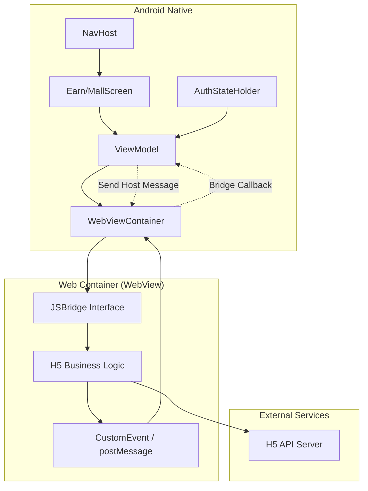
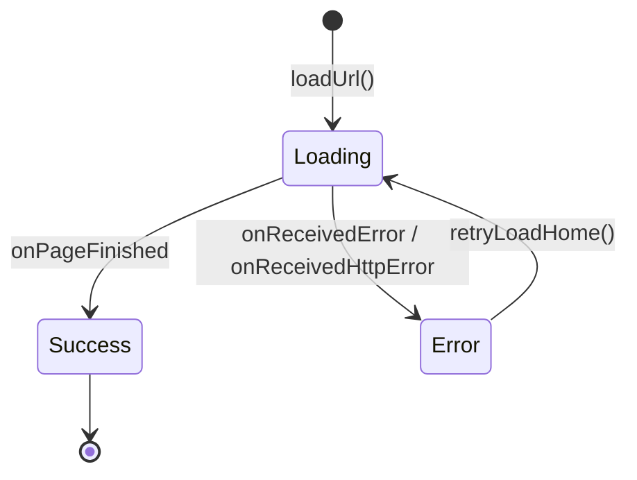
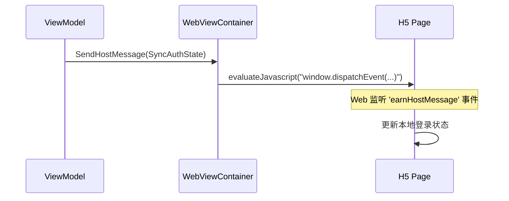
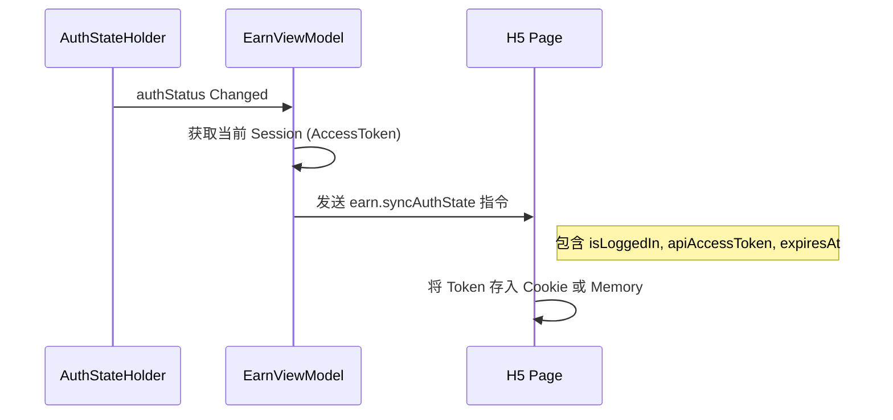

# 混合开发与 Web 容器集成

## 目录
1. [模块概览](#模块概览)
2. [混合开发架构](#混合开发架构)
3. [WebView 容器封装](#webview-容器封装)
   - [WebView 配置与安全](#webview-配置与安全)
   - [加载状态与错误处理](#加载状态与错误处理)
4. [JSBridge 交互机制](#jsbridge-交互机制)
   - [Web 到 Native (JavaScriptInterface)](#web-到-native-javascriptinterface)
   - [Native 到 Web (EvaluateJavascript)](#native-到-web-evaluatejavascript)
5. [登录态同步流程](#登录态同步流程)
6. [混合页面生命周期与交互](#混合页面生命周期与交互)
   - [返回逻辑与上下文恢复](#返回逻辑与上下文恢复)
   - [原生 UI 交互](#原生-ui-交互)
7. [核心组件](#核心组件)
8. [关键源文件](#关键源文件)

## 模块概览

在本项目中，`feature/mall`（商城）和 `feature/earn`（赚币中心）是两个典型的混合开发（Hybrid）业务模块。为了保证业务的灵活性和跨平台一致性，这两个模块的核心业务逻辑由 H5 实现，而 Android 端则提供高性能、高安全性的 Web 容器以及深度集成的原生能力支持。

**模块规模评估**：
- **总文件数**：约 18 个核心 Kotlin 文件。
- **主要子目录**：
  - `feature/earn`: 包含赚币中心的 UI 容器、ViewModel 以及复杂的 JSBridge 协议定义（如任务跳转、登录请求）。
  - `feature/mall`: 包含商城的 UI 容器，重点在于搜索跳转和登录态同步。
- **覆盖范围**：本章节将深入分析这两个子模块的实现细节，重点探讨 WebView 的封装、JSBridge 的通信协议以及原生登录态如何无缝同步至 Web 端。

通过这种混合架构，应用能够快速迭代 H5 业务，同时利用原生能力（如播放器、支付、登录）提供流畅的用户体验。

## 混合开发架构

本项目的混合开发架构采用了典型的“容器-协议-业务”三层模型。Android 端作为宿主，通过 `WebViewContainer` 承载 Web 页面，并通过 `ViewModel` 协调原生状态与 Web 指令之间的交互。

以下图表展示了混合开发模块中各组件之间的交互关系：



在该架构中，`ViewModel` 充当了“大脑”的角色。它不仅负责管理页面的加载状态（Loading, Success, Error），还负责监听全局的登录态变化（来自 `AuthStateHolder`），并将其转化为 Web 端可理解的指令。`WebViewContainer` 则是纯粹的展示与通信层，它封装了 WebView 的复杂配置，并提供了标准化的消息分发接口。

这种解耦设计使得 H5 页面不需要关心原生端的具体实现细节，只需要遵循约定的 JSBridge 协议即可调用原生能力。

**架构设计来源**:
- [EarnViewModel.kt](android/app/src/main/java/com/djs66256/short_drama/feature/earn/viewmodel/EarnViewModel.kt)
- [EarnWebViewContainer.kt](android/app/src/main/java/com/djs66256/short_drama/feature/earn/ui/EarnWebViewContainer.kt)

## WebView 容器封装

WebView 的封装是混合开发的基础。在 `EarnWebViewContainer` 和 `MallWebViewContainer` 中，我们针对业务需求进行了深度的定制化配置。

### WebView 配置与安全

为了确保 H5 页面能够正常运行并具备良好的性能，我们在 `configureWebView` 方法中开启了必要的功能，同时严格控制了安全设置。

```kotlin
@SuppressLint("SetJavaScriptEnabled")
private fun WebView.configureEarnWebView(
    onPageStateChanged: (EarnPageEvent) -> Unit,
    onBridgeMessage: (EarnBridgeMessage) -> Unit,
) {
    settings.javaScriptEnabled = true // 必须开启以支持 JSBridge
    settings.domStorageEnabled = true // 支持 Web 端的本地存储
    settings.loadsImagesAutomatically = true
    settings.cacheMode = WebSettings.LOAD_DEFAULT
    // 允许混合内容加载（HTTP/HTTPS 混合），在开发阶段较为常见
    settings.mixedContentMode = WebSettings.MIXED_CONTENT_COMPATIBILITY_MODE
    
    // 注入 JSBridge 接口
    addJavascriptInterface(EarnJavascriptBridge(onBridgeMessage), EARN_BRIDGE_NAME)
    webViewClient = EarnWebViewClient(onPageStateChanged)
}
```

**关键配置说明**：
1. **JavaScriptEnabled**: 混合开发的核心，必须开启。
2. **DomStorageEnabled**: 许多现代前端框架（如 Vue/React）依赖 `localStorage`，因此必须开启。
3. **JavascriptInterface**: 通过 `addJavascriptInterface` 将原生对象映射到 JS 环境中的 `window.earnBridge` 或 `window.mallBridge`。

### 加载状态与错误处理

为了提升用户体验，我们通过 `WebViewClient` 监听页面的加载进度，并将其反馈给 Compose UI 层展示进度条或错误页面。



当 `WebViewClient` 触发 `onPageStarted` 时，UI 层会显示 `CircularProgressIndicator`。如果发生网络错误（如 404 或无网络），`onReceivedError` 会捕获异常并回调 `EarnPageEvent.LoadFailed`，此时 UI 会切换到 `EarnErrorState`，提供重试按钮。

> 💡 **注意**：我们特别处理了 `isForMainFrame` 的判断，确保只有主页面的加载失败才会触发全屏错误页，避免因某个图片或广告加载失败导致整个页面无法显示。

**封装实现参考**:
- [EarnWebViewContainer.kt:L83-L152](android/app/src/main/java/com/djs66256/short_drama/feature/earn/ui/EarnWebViewContainer.kt#L83-L152)
- [MallWebViewContainer.kt:L91-L105](android/app/src/main/java/com/djs66256/short_drama/feature/mall/ui/MallWebViewContainer.kt#L91-L105)

## JSBridge 交互机制

JSBridge 是原生与 Web 通信的桥梁。本项目采用了双向通信机制：Web 到原生使用 `JavascriptInterface`，原生到 Web 使用 `evaluateJavascript`。

### Web 到 Native (JavaScriptInterface)

Web 端通过调用 `window.earnBridge.postMessage(json)` 向原生发送指令。原生端使用 `JSONObject` 解析消息类型和负载，并将其转化为 `EarnBridgeMessage` 密封类。

```kotlin
// 消息解析逻辑示例
private fun String?.toEarnBridgeMessage(): EarnBridgeMessage {
    val root = JSONObject(this)
    val type = root.optString("type")
    val payload = root.optJSONObject("payload")
    return when (type) {
        "earn.requestLogin" -> EarnBridgeMessage.RequestLogin(...)
        "earn.openTaskPlayer" -> EarnBridgeMessage.OpenTaskPlayer(...)
        else -> EarnBridgeMessage.Invalid(...)
    }
}
```

**常见指令集**：
- `requestLogin`: Web 端发现用户未登录或 Token 过期，请求原生弹出登录界面。
- `openTaskPlayer`: 赚币中心点击任务，请求原生启动短剧播放器。
- `openSearch`: 商城点击搜索框，跳转至原生搜索页。

### Native 到 Web (EvaluateJavascript)

原生端向 Web 发送事件时，通常采用注入 JS 代码并触发 `CustomEvent` 的方式。这样可以确保 Web 端能够以标准的消息机制监听原生状态。



以 `EarnWebViewContainer` 为例，它会将消息封装为 `CustomEvent`：
`window.dispatchEvent(new CustomEvent('earnHostMessage', { detail: $detail }));`

这种方式相比直接调用 JS 全局函数更加灵活，支持多个监听者且不会污染全局命名空间。

**交互机制来源**:
- [EarnBridgeMessage.kt](android/app/src/main/java/com/djs66256/short_drama/feature/earn/model/EarnBridgeMessage.kt)
- [EarnWebViewContainer.kt:L187-L234](android/app/src/main/java/com/djs66256/short_drama/feature/earn/ui/EarnWebViewContainer.kt#L187-L234)

## 登录态同步流程

由于 H5 业务（如商城下单、领取金币）需要调用后端 API，因此必须持有有效的用户 Session。本项目通过 `SyncAuthState` 指令实现登录态的实时同步。



**同步时机**：
1. **初始加载**：页面加载完成后（`onPageFinished`），立即同步一次当前状态。
2. **登录成功返回**：用户在原生登录页登录成功后，返回 H5 页面时触发同步。
3. **应用唤醒**：当用户从后台返回前台（`ON_RESUME`），为了防止 Token 过期，会自动触发一次同步。

通过这种方式，H5 页面始终能感知到原生的登录状态，避免了因状态不同步导致的业务异常。

**登录态同步参考**:
- [EarnViewModel.kt:L209-L225](android/app/src/main/java/com/djs66256/short_drama/feature/earn/viewmodel/EarnViewModel.kt#L209-L225)
- [AuthStateHolder.kt](android/app/src/main/java/com/djs66256/short_drama/core/auth/AuthStateHolder.kt)

## 混合页面生命周期与交互

混合页面的生命周期不仅包含 Android 原生的 Lifecycle，还包含 Web 页面的加载状态以及与原生组件（如 BottomBar）的协调。

### 返回逻辑与上下文恢复

当用户从 H5 页面跳转到原生页面（如登录、播放器）并返回时，H5 页面往往需要刷新数据或恢复之前的滚动位置。

我们引入了 `RestoreContext` 机制：
1. 原生页面关闭时，通过 `navController` 返回信号。
2. `ViewModel` 捕获信号，向 Web 注入 `restoreContext` 指令。
3. Web 端收到指令后，根据 `reason`（如 `LOGIN_RETURN`, `TASK_RETURN`）执行相应的业务逻辑（如刷新金币余额）。

```kotlin
fun onEarnLoginResult(result: EarnLoginResult) {
    // ... 处理登录结果
    emitHostAuthSync(authReason) // 同步最新登录态
    emitRestoreContext(EarnRestoreReason.LOGIN_RETURN) // 通知 Web 恢复上下文
}
```

### 原生 UI 交互

`EarnScreen` 和 `MallScreen` 作为一级 Tab 页面，需要与底部的 `NavigationBar` 配合。
- **可见性控制**：通过 `isVisible` 参数控制 WebView 的 `visibility`。当页面处于加载中或错误状态时，隐藏 WebView 以避免闪烁。
- **状态保持**：利用 Compose 的 `remember` 和 `AndroidView` 的 `update` 块，确保在 Tab 切换时 WebView 实例不被销毁，从而保持 H5 页面的状态（如已填写的表单、滚动位置）。

**生命周期处理参考**:
- [EarnScreen.kt:L74-L84](android/app/src/main/java/com/djs66256/short_drama/feature/earn/ui/EarnScreen.kt#L74-L84)
- [NavGraph.kt:L435-L456](android/app/src/main/java/com/djs66256/short_drama/navigation/NavGraph.kt#L435-L456)

## 核心组件

| 组件名称 | 职责描述 |
| :--- | :--- |
| `EarnWebViewContainer` | 赚币中心 WebView 封装，处理 `earnBridge` 交互与加载状态。 |
| `MallWebViewContainer` | 商城 WebView 封装，包含特殊的 `__MALL_NATIVE_BRIDGE__` 脚本注入。 |
| `EarnViewModel` | 赚币中心业务逻辑，管理登录、任务跳转及宿主消息分发。 |
| `EarnBridgeMessage` | 定义了 Web 到原生的所有指令协议。 |
| `EarnHostMessage` | 定义了原生到 Web 的所有事件协议。 |
| `AuthStateHolder` | 提供全局登录态，是登录态同步的数据源。 |

## 关键源文件

**赚币中心 (Earn)**:
- [EarnWebViewContainer.kt](android/app/src/main/java/com/djs66256/short_drama/feature/earn/ui/EarnWebViewContainer.kt): WebView 核心封装。
- [EarnViewModel.kt](android/app/src/main/java/com/djs66256/short_drama/feature/earn/viewmodel/EarnViewModel.kt): 业务逻辑与状态同步。
- [EarnBridgeMessage.kt](android/app/src/main/java/com/djs66256/short_drama/feature/earn/model/EarnBridgeMessage.kt): JSBridge 协议定义。
- [EarnScreen.kt](android/app/src/main/java/com/djs66256/short_drama/feature/earn/ui/EarnScreen.kt): Compose 承载页。

**商城 (Mall)**:
- [MallWebViewContainer.kt](android/app/src/main/java/com/djs66256/short_drama/feature/mall/ui/MallWebViewContainer.kt): 商城特化的 WebView 封装。
- [MallViewModel.kt](android/app/src/main/java/com/djs66256/short_drama/feature/mall/viewmodel/MallViewModel.kt): 商城业务逻辑。

**核心基础**:
- [AuthStateHolder.kt](android/app/src/main/java/com/djs66256/short_drama/core/auth/AuthStateHolder.kt): 登录态管理。
- [NavGraph.kt](android/app/src/main/java/com/djs66256/short_drama/navigation/NavGraph.kt): 导航与返回信号处理。
