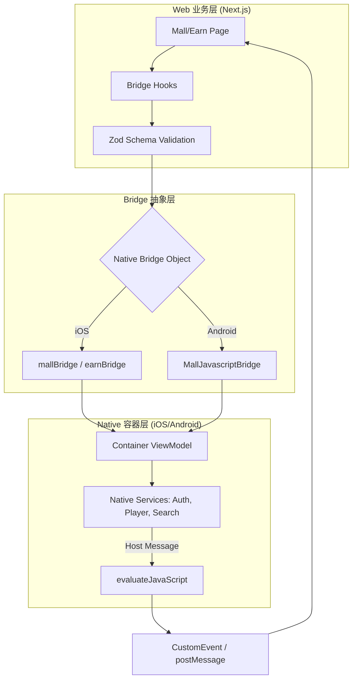
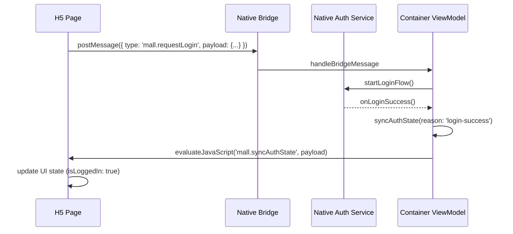

# H5 混合开发与 JSBridge 协议核心

 ## 目录
 1. [模块概览](#模块概览)
 2. [引言](#引言)
 3. [架构概览](#架构概览)
 4. [JSBridge 通信协议设计](#jsbridge-通信协议设计)
    - [通信原理与双向通道](#通信原理与双向通道)
    - [消息模型与数据格式](#消息模型与数据格式)
 5. [核心协议定义](#核心协议定义)
    - [身份认证同步 (Login & Auth)](#身份认证同步-login--auth)
    - [业务功能跳转 (Search & Task)](#业务功能跳转-search--task)
    - [上下文恢复 (Context Restoration)](#上下文恢复-context-restoration)
 6. [容器增强与优化](#容器增强与优化)
    - [注入与初始化策略](#注入与初始化策略)
    - [加载优化与错误处理](#加载优化与错误处理)
 7. [安全机制](#安全机制)
 8. [核心组件与代码实现](#核心组件与代码实现)
 9. [文件引用](#文件引用)

## 模块概览

本模块负责短剧应用中“商城”与“赚币”业务的混合开发（Hybrid）基础建设。通过自研的 JSBridge 协议，实现了原生端（iOS/Android）与 H5 页面之间的高效、安全通信。

**统计信息**：
- **涉及文件总数**：约 45 个
- **主要子模块**：
    - **iOS 容器层**：位于 `ios/ShortDrama/Sources/Features/{Mall,Earn}`，负责 `WKWebView` 封装与消息转发。
    - **Android 容器层**：位于 `android/app/src/main/java/com/djs66256/short_drama/feature/{mall,earn}`，负责 `WebView` 配置与接口注入。
    - **Web 桥接层**：位于 `web/src/features/{mall,earn}/bridge`，负责 JS 侧的协议封装与数据校验。

本章节将深度解析 JSBridge 的协议设计、容器实现细节以及跨端交互的时序逻辑。

## 引言

在短剧应用中，商城（Mall）和赚币（Earn）业务具有迭代频繁、逻辑复杂的特点，因此采用了 H5 混合开发方案。为了保证 H5 页面能够调用原生的核心能力（如登录、支付、播放器控制），并确保用户体验接近原生，我们设计了一套统一的 JSBridge 通信协议。

该协议的目标是：
1. **跨平台统一**：iOS、Android 和 Web 开发者基于同一套 JSON 协议定义进行协作。
2. **解耦业务逻辑**：H5 侧专注于 UI 展示和业务流程，原生侧提供底层能力支持。
3. **增强用户体验**：通过状态同步和上下文恢复机制，解决 H5 页面在登录跳转、返回后的状态丢失问题。

## 架构概览

Hybrid 架构由三个核心层级组成：Web 业务层、Bridge 抽象层和 Native 容器层。

下面的图表展示了请求从 H5 页面发出，经过 Bridge 传递到原生端处理，最后由原生端反馈结果的完整链路。



**架构解析**：
1. **Web 业务层**：使用 React Hooks (`useMallPage`, `useEarnPage`) 封装业务逻辑，在调用 Bridge 前使用 Zod 进行严格的数据结构校验，确保发送给原生的数据符合预期。
2. **Bridge 抽象层**：在 `window` 对象上注入 `__MALL_NATIVE_BRIDGE__` 和 `__EARN_NATIVE_BRIDGE__`。针对不同平台，分别封装了 `webkit.messageHandlers` (iOS) 和 `addJavascriptInterface` (Android) 的调用细节。
3. **Native 容器层**：原生端通过 ViewModel 处理来自 H5 的请求，并根据业务需求调用底层的通用服务（如登录中心、搜索组件）。处理完成后，通过 `evaluateJavaScript` 向 H5 发送“宿主消息”（Host Message），触发 H5 侧的状态更新。

**Diagram sources**:
- [MallWebView.swift](ios/ShortDrama/Sources/Features/Mall/Views/Components/MallWebView.swift)
- [MallWebViewContainer.kt](android/app/src/main/java/com/djs66256/short_drama/feature/mall/ui/MallWebViewContainer.kt)
- [mall-bridge.ts](web/src/features/mall/bridge/mall-bridge.ts)

## JSBridge 通信协议设计

### 通信原理与双向通道

JSBridge 采用双向异步通信机制，确保主线程不被阻塞。

1. **JS -> Native (Request)**:
   - **iOS**: 利用 `WKScriptMessageHandler`。H5 调用 `window.webkit.messageHandlers.mallBridge.postMessage(payload)`。
   - **Android**: 利用 `@JavascriptInterface`。H5 调用 `window.mallBridge.postMessage(JSON.stringify(payload))`。
   - **统一封装**：为了抹平平台差异，原生端会在 `documentStart` 阶段注入一段 Bootstrap 脚本，暴露出统一的 `window.__MALL_NATIVE_BRIDGE__.postMessage` 方法。

2. **Native -> JS (Callback/Event)**:
   - 原生端统一使用 `evaluateJavaScript` 执行 JS 代码。
   - **消息分发**：原生端向 JS 侧分发消息时，通常采用 `window.dispatchEvent(new CustomEvent(...))` 或 `window.postMessage(...)`。这允许 H5 侧有多个订阅者监听同一类消息。

### 消息模型与数据格式

所有通信消息均遵循统一的 JSON 结构，包含 `type`（消息类型）和 `payload`（负载数据）两个核心字段。

```json
{
  "type": "namespace.actionName",
  "payload": {
    "source": "mall",
    "returnTarget": "/mall",
    "..." : "..."
  }
}
```

**字段说明**：
- `type`: 命名空间格式，如 `mall.requestLogin` 或 `earn.openTaskPlayer`。
- `payload`: 具体的业务参数。
- `source`: 标识消息来源，用于原生端统计或路由。
- `returnTarget`: 标识处理完成后应返回的 H5 路由路径。

## 核心协议定义

### 身份认证同步 (Login & Auth)

身份认证是 Hybrid 开发中最关键的环节。当 H5 页面检测到用户未登录（或需要执行敏感操作）时，会触发 `requestLogin` 协议。

下面的时序图展示了登录同步的完整过程：



**流程解析**：
1. H5 发现用户点击了需要登录的商品，调用 `requestMallLogin`。
2. 原生容器接收到消息，拉起原生登录页面。
3. 用户完成登录后，原生 ViewModel 立即更新内部状态，并构造一条 `syncAuthState` 宿主消息。
4. 原生端通过 JS 注入，将最新的登录态（包括 `isLoggedIn` 标志位和 `apiAccessToken`）同步给 H5。
5. H5 接收到消息后，更新 React Context 或 Redux 状态，从而触发 UI 的重新渲染（如隐藏登录拦截弹窗）。

### 业务功能跳转 (Search & Task)

为了保持体验的一致性，H5 页面中的搜索和特定任务（如看剧赚币）会跳转到原生实现。

- **`mall.openSearch`**: 携带 `source` 和 `returnTarget`，原生端会推入（Push）原生搜索控制器。
- **`earn.openTaskPlayer`**: 这是一个深度集成的例子。H5 传递 `taskId` 和 `videoId`，原生端打开专用的“任务播放器”。

### 上下文恢复 (Context Restoration)

当用户从原生搜索页或登录页返回 H5 时，页面可能会因为容器重建或内存回收而丢失状态（如滚动位置）。

**`restoreContext` 协议**：
原生端在用户返回 H5 容器时，会发送此消息。
- `reason`: 恢复原因（`search-return`, `login-return`, `container-recreated`）。
- `preserveScroll`: 是否尝试保留滚动位置。

H5 侧通过监听此消息，可以决定是否需要重新拉取数据或执行特定的恢复逻辑。

## 容器增强与优化

### 注入与初始化策略

为了确保 Bridge 在 H5 脚本执行前就准备就绪，我们采用了不同的注入策略：

- **iOS (Pre-injection)**: 使用 `WKUserScript` 在 `.atDocumentStart` 阶段注入。这保证了 `window.__MALL_NATIVE_BRIDGE__` 在 `DOMContentLoaded` 之前就已存在。
- **Android (Post-injection)**: 在 `onPageFinished` 中再次调用 `injectMallNativeBridge`。这是因为 Android 的 `addJavascriptInterface` 在某些情况下可能因为页面重定向而失效，通过手动注入脚本可以增强稳定性。

### 加载优化与错误处理

1. **缓存策略**：Android 容器显式开启了 `LOAD_DEFAULT` 模式和 `domStorageEnabled`，利用 WebView 的磁盘缓存减少重复资源的加载。
2. **降级机制**：在 Web 侧，`mall-bridge.ts` 实现了降级逻辑。如果检测到 `isMallBridgeAvailable()` 为 `false`（例如用户在普通浏览器中打开），则会跳转到 `config.mall.searchFallbackRoute` 定义的 H5 搜索页，而不是直接报错。
3. **加载状态管理**：原生容器通过 `WebViewClient` 的回调（`onPageStarted`, `onPageFinished`, `onReceivedError`）向 ViewModel 发送 `MallPageEvent`。ViewModel 根据这些事件管理 `Loading`、`Success` 和 `Error` 状态，并在加载失败时展示原生占位图（`MallContainerStateView`）。

## 安全机制

Hybrid 通信的安全至关重要，防止恶意网页通过 Bridge 调用原生敏感接口。

1. **域名白名单**：原生端在加载 URL 前会进行规范化（`normalizeMallHomeUrl`），并检查是否属于 `AppConfig` 定义的合法业务域名。
2. **主帧限制**：在 iOS 中，`WKUserScript` 设置了 `forMainFrameOnly: true`，防止 iframe 中的第三方页面窃取 Bridge 权限。
3. **数据校验**：Web 侧使用 Zod Schema 对所有发出的消息进行强类型校验。
4. **权限分级**：敏感接口（如支付、获取 Token）在原生端会进行二次校验。例如，`syncAuthState` 只有在 `source == 'mall'` 或 `'earn'` 时才会包含敏感的 `apiAccessToken`。

## 核心组件与代码实现

### iOS: MallWebView.swift (桥接核心)

iOS 端利用 `Coordinator` 作为 `WKScriptMessageHandler` 的实现者。

```swift
final class Coordinator: NSObject, WKNavigationDelegate, WKScriptMessageHandler {
    static let bridgeChannel = "mallBridge"
    
    // 接收来自 JS 的消息
    func userContentController(
        _ userContentController: WKUserContentController,
        didReceive message: WKScriptMessage
    ) {
        guard message.name == Self.bridgeChannel,
              let bridgeMessage = MallBridgeMessage(body: message.body) else {
            return
        }
        onBridgeMessage(bridgeMessage)
    }
}
```

### Android: MallWebViewContainer.kt (注入逻辑)

Android 端通过 `evaluateJavascript` 注入 Bridge 对象。

```kotlin
private fun WebView.injectMallNativeBridge() {
    val script = """
        (function() {
            window.__MALL_NATIVE_BRIDGE__ = {
                postMessage: function(message) {
                    if (!window.$MALL_BRIDGE_NAME) return;
                    window.$MALL_BRIDGE_NAME.postMessage(JSON.stringify(message));
                }
            };
        })();
    """.trimIndent()
    evaluateJavascript(script, null)
}
```

### Web: mall-bridge.ts (调用封装)

Web 端通过 Zod 确保协议的一致性。

```typescript
export function requestMallLogin(payload: MallLoginContext): void {
  const bridge = getWindowBridge();
  if (bridge) {
    // 使用 Zod Schema 进行校验
    bridge.postMessage(MallBridgeMessageSchema.parse({
      type: 'mall.requestLogin',
      payload,
    }));
  }
}
```

## 文件引用

**核心实现**：
- [MallWebView.swift](ios/ShortDrama/Sources/Features/Mall/Views/Components/MallWebView.swift)
- [MallWebViewContainer.kt](android/app/src/main/java/com/djs66256/short_drama/feature/mall/ui/MallWebViewContainer.kt)
- [EarnWebViewContainer.kt](android/app/src/main/java/com/djs66256/short_drama/feature/earn/ui/EarnWebViewContainer.kt)

**协议与模型**：
- [MallBridgeMessage.swift](ios/ShortDrama/Sources/Features/Mall/Models/MallBridgeMessage.swift)
- [EarnBridgeMessage.kt](android/app/src/main/java/com/djs66256/short_drama/feature/earn/model/EarnBridgeMessage.kt)
- [schemas.ts](web/src/lib/schemas.ts)

**业务逻辑**：
- [MallContainerViewModel.swift](ios/ShortDrama/Sources/Features/Mall/ViewModels/MallContainerViewModel.swift)
- [MallViewModel.kt](android/app/src/main/java/com/djs66256/short_drama/feature/mall/viewmodel/MallViewModel.kt)
- [useMallPage.ts](web/src/features/mall/hooks/useMallPage.ts)

**Web 桥接层**：
- [mall-bridge.ts](web/src/features/mall/bridge/mall-bridge.ts)
- [earn-bridge.ts](web/src/features/earn/bridge/earn-bridge.ts)
- [mall-host-sync.ts](web/src/features/mall/bridge/mall-host-sync.ts)
