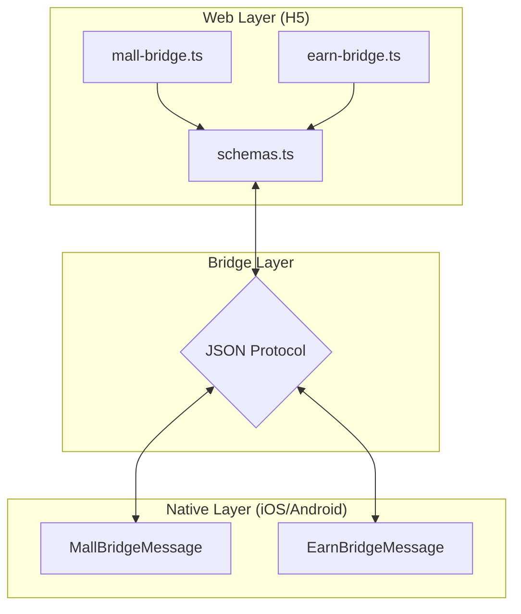
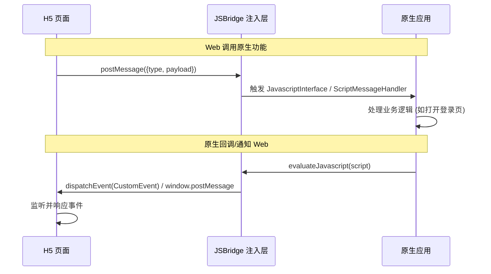
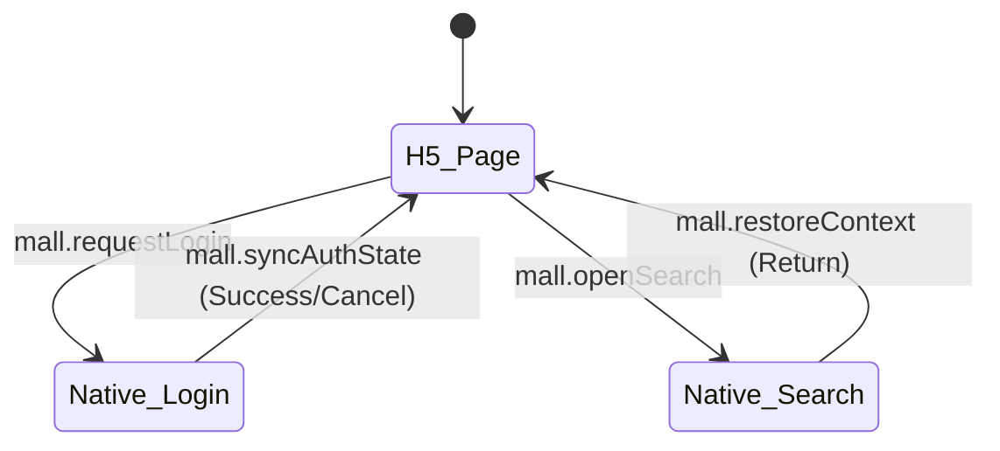
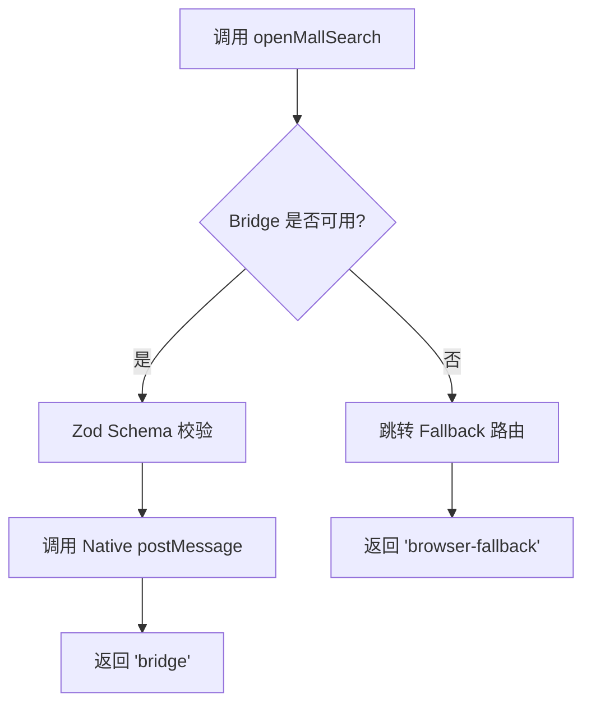
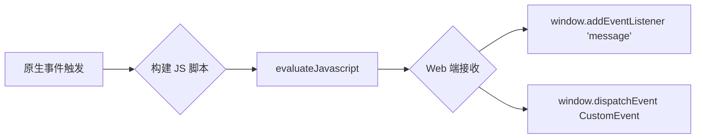

# JSBridge 通信协议与消息模型

## 目录
1. [模块概览](#模块概览)
2. [JSBridge 通信协议设计](#jsbridge-通信协议设计)
3. [消息结构规范](#消息结构规范)
4. [核心业务消息定义](#核心业务消息定义)
5. [跨端模型定义与序列化](#跨端模型定义与序列化)
6. [Web 端对接实现](#web-端对接实现)
7. [原生端注入与处理逻辑](#原生端注入与处理逻辑)
8. [错误处理与安全性](#错误处理与安全性)
9. [核心组件](#核心组件)
10. [文件引用](#文件引用)

## 模块概览
JSBridge 通信协议是连接原生应用（iOS/Android）与 H5 业务页面的核心契约。在本项目中，该协议主要应用于“商城（Mall）”和“福利（Earn）”两大核心业务模块。通过统一的消息模型和双向通信机制，实现了 H5 页面调用原生功能（如登录、搜索、播放器跳转）以及原生端向 H5 同步状态（如登录态同步、上下文恢复）的能力。

### 协议覆盖范围
本协议涵盖了三端的实现逻辑：
- **Web (TypeScript)**: 使用 Zod 进行强类型定义和运行时校验。
- **iOS (Swift)**: 利用 `enum` 和 `Dictionary` 进行消息解析与脚本构建。
- **Android (Kotlin)**: 使用 `sealed interface` 和 `JSONObject` 进行结构化处理。

### 模块规模统计
根据代码库扫描，核心协议相关文件分布如下：
- **原生协议定义**: 4 个核心文件（iOS/Android 各 2 个，分别对应 Mall 和 Earn）。
- **Web 协议定义**: 1 个全局 Schema 文件，2 个业务 Bridge 实现文件。
- **容器注入逻辑**: 2 个主要容器实现类。

**模块概览图**:

该架构图展示了 Web 层通过 Zod Schema 保证消息合法性，通过 JSON 协议与原生层进行双向通信。原生层则通过各自的业务消息模型（Mall/Earn）对 JSON 进行解析和响应。

**Section sources**:
- [web/src/lib/schemas.ts](web/src/lib/schemas.ts)
- [ios/ShortDrama/Sources/Features/Mall/Models/MallBridgeMessage.swift](ios/ShortDrama/Sources/Features/Mall/Models/MallBridgeMessage.swift)
- [android/app/src/main/java/com/djs66256/short_drama/feature/mall/model/MallLoginContext.kt](android/app/src/main/java/com/djs66256/short_drama/feature/mall/model/MallLoginContext.kt)

## JSBridge 通信协议设计
本项目的 JSBridge 采用了基于 **消息类型（Type）** 和 **负载数据（Payload）** 的标准 JSON 协议。这种设计模式确保了协议的可扩展性和跨平台一致性。

### 双向通信机制
1. **Web -> Native (调用)**:
   H5 通过调用原生注入的全局对象 `__MALL_NATIVE_BRIDGE__` 或 `__EARN_NATIVE_BRIDGE__` 的 `postMessage` 方法发送数据。
2. **Native -> Web (通知)**:
   原生端通过执行 JavaScript 脚本，触发 `CustomEvent` (iOS) 或 `window.postMessage` (Android) 来通知 H5 页面。

**通信时序图**:

时序图清晰地展示了从 Web 发起请求到原生处理，再到原生反向通知 Web 的完整闭环。注意，双端在 Native -> Web 的实现路径上略有差异，iOS 倾向于使用 `CustomEvent`，而 Android 采用了 `window.postMessage`。

**Section sources**:
- [web/src/features/mall/bridge/mall-bridge.ts](web/src/features/mall/bridge/mall-bridge.ts)
- [android/app/src/main/java/com/djs66256/short_drama/feature/mall/ui/MallWebViewContainer.kt](android/app/src/main/java/com/djs66256/short_drama/feature/mall/ui/MallWebViewContainer.kt)

## 消息结构规范
所有跨端通信的消息必须遵循以下 JSON 结构：

```json
{
  "type": "string",
  "payload": {
    "source": "string",
    "returnTarget": "string",
    "...": "any"
  }
}
```

### 字段说明
- **`type`**: 消息的唯一标识符，采用 `模块名.动作名` 的命名方式，例如 `mall.requestLogin`。
- **`payload`**: 业务负载数据。
    - **`source`**: 必须字段，标识消息来源模块（如 `mall` 或 `earn`）。
    - **`returnTarget`**: 必须字段，标识操作完成后应返回的 H5 路由路径（如 `/mall`）。
    - **其他业务字段**: 根据具体消息类型定义，如 `productId`、`taskId` 等。

### 强类型契约
在 Web 端，使用 Zod 对这一结构进行了严格定义：
```typescript
export const MallBridgeMessageSchema = z.discriminatedUnion('type', [
  z.object({
    type: z.literal('mall.openSearch'),
    payload: MallSearchContextSchema,
  }),
  z.object({
    type: z.literal('mall.requestLogin'),
    payload: MallLoginContextSchema,
  }),
]);
```
这种定义方式不仅提供了类型检查，还在运行时确保了接收到的数据完全符合预期。

**Section sources**:
- [web/src/lib/schemas.ts](web/src/lib/schemas.ts)

## 核心业务消息定义
协议针对商城和福利两大业务定义了多组核心消息。

### 1. 商城业务消息 (Mall)
| 消息类型 (`type`) | 描述 | Payload 关键参数 |
| :--- | :--- | :--- |
| `mall.openSearch` | 打开原生搜索页面 | `source`, `returnTarget` |
| `mall.requestLogin` | 请求原生登录 | `source`, `productId`, `returnTarget` |
| `mall.syncAuthState` | (Native->Web) 同步登录态 | `isLoggedIn`, `reason` |
| `mall.restoreContext` | (Native->Web) 恢复页面上下文 | `reason`, `preserveScroll` |

### 2. 福利业务消息 (Earn)
| 消息类型 (`type`) | 描述 | Payload 关键参数 |
| :--- | :--- | :--- |
| `earn.requestLogin` | 请求原生登录 | `source`, `returnTarget` |
| `earn.openTaskPlayer` | 打开任务播放器 | `taskId`, `videoId`, `source` |
| `earn.completeTask` | (Native->Web) 任务完成回调 | `taskId`, `completed`, `reason` |

**状态转换图**:

该图展示了用户在 H5 页面中触发登录或搜索时，系统在 H5 与原生页面之间的状态切换流程。

**Section sources**:
- [android/app/src/main/java/com/djs66256/short_drama/feature/mall/model/MallLoginContext.kt](android/app/src/main/java/com/djs66256/short_drama/feature/mall/model/MallLoginContext.kt)
- [ios/ShortDrama/Sources/Features/Mall/Models/MallBridgeMessage.swift](ios/ShortDrama/Sources/Features/Mall/Models/MallBridgeMessage.swift)

## 跨端模型定义与序列化
为了保证三端逻辑的高度一致性，代码中使用了强类型模型来映射 JSON 协议。

### iOS 实现 (Swift)
iOS 端采用 `enum` 配合 `init?(body: Any)` 的方式进行反序列化。这种方式虽然是手动解析，但通过严格的 `guard` 语句保证了安全性。

```swift
enum MallBridgeMessage: Equatable, Sendable {
    case openSearch(MallSearchContext)
    case requestLogin(MallLoginContext)

    init?(body: Any) {
        guard let dictionary = body as? [String: Any],
              let type = dictionary["type"] as? String,
              let payload = dictionary["payload"] as? [String: Any] else {
            return nil
        }
        // ... 根据 type 进行解析
    }
}
```

### Android 实现 (Kotlin)
Android 端使用 `sealed interface` 来定义消息模型，配合 `JSONObject` 进行解析。

```kotlin
sealed interface MallBridgeMessage {
    data class OpenSearch(
        val source: String,
        val returnTarget: String,
    ) : MallBridgeMessage

    data class RequestLogin(
        val context: MallLoginContext,
    ) : MallBridgeMessage
}
```

### Web 实现 (TypeScript)
Web 端通过 Zod 的 `z.infer` 直接生成类型定义，确保了从校验到使用的全链路类型安全。

**模型对比表**:
| 特性 | iOS (Swift) | Android (Kotlin) | Web (TypeScript) |
| :--- | :--- | :--- | :--- |
| **基础结构** | `enum` | `sealed interface` | `discriminatedUnion` |
| **解析方式** | 手动字典解析 | `JSONObject` 解析 | `Zod.parse()` |
| **安全性** | `guard` 校验 | `optString` + `isValid()` | 运行时 Schema 校验 |

**Section sources**:
- [ios/ShortDrama/Sources/Features/Mall/Models/MallBridgeMessage.swift](ios/ShortDrama/Sources/Features/Mall/Models/MallBridgeMessage.swift)
- [android/app/src/main/java/com/djs66256/short_drama/feature/mall/model/MallLoginContext.kt](android/app/src/main/java/com/djs66256/short_drama/feature/mall/model/MallLoginContext.kt)
- [web/src/lib/schemas.ts](web/src/lib/schemas.ts)

## Web 端对接实现
Web 端封装了统一的 Bridge 调用接口，隐藏了底层的全局变量判断和 Schema 校验细节。

### 桥接对象获取
Web 端会检查 `window.__MALL_NATIVE_BRIDGE__` 是否存在，并结合配置项决定是否启用：
```typescript
function getWindowBridge(): MallNativeBridge | null {
  const bridge = (window as any).__MALL_NATIVE_BRIDGE__;
  if (!config.mall.bridgeEnabled || !bridge) {
    return null;
  }
  return bridge;
}
```

### 降级策略
为了保证在普通浏览器中也能运行，Bridge 调用通常包含降级逻辑。例如 `openMallSearch`：
1. **优先使用 Bridge**: 如果原生注入的对象可用，则调用 `postMessage`。
2. **浏览器降级**: 如果不可用，则通过 `window.location.assign` 跳转到预设的兜底路由。

**调用流程图**:

该流程图展示了 Web 端在发起 Bridge 调用时的决策路径，体现了系统对环境兼容性的考虑。

**Section sources**:
- [web/src/features/mall/bridge/mall-bridge.ts](web/src/features/mall/bridge/mall-bridge.ts)

## 原生端注入与处理逻辑
原生端负责在 WebView 加载时注入 JS 对象，并监听来自 JS 的调用。

### Android 端的注入实现
Android 端通过 `addJavascriptInterface` 注入一个基础桥接对象，然后通过 `evaluateJavascript` 包装出符合协议的 `__MALL_NATIVE_BRIDGE__` 对象。

```kotlin
private fun WebView.injectMallNativeBridge() {
    val script = """
        (function() {
            window.__MALL_NATIVE_BRIDGE__ = {
                postMessage: function(message) {
                    window.mallBridge.postMessage(JSON.stringify(message));
                }
            };
        })();
    """.trimIndent()
    evaluateJavascript(script) { /* ... */ }
}
```

### 消息反向推送 (Native -> Web)
当原生端需要通知 Web 时，会构建一段 JS 代码并执行。
- **Android**: 发送 `window.postMessage` 事件。
- **iOS**: 发送 `CustomEvent` 事件。

**反向推送流程图**:

原生端通过执行动态生成的 JS 脚本，将状态信息推送到 Web 环境中，Web 端通过标准的事件监听机制获取数据。

**Section sources**:
- [android/app/src/main/java/com/djs66256/short_drama/feature/mall/ui/MallWebViewContainer.kt](android/app/src/main/java/com/djs66256/short_drama/feature/mall/ui/MallWebViewContainer.kt)

## 错误处理与安全性
在跨端通信中，错误处理和数据校验至关重要。

### 1. 消息校验
- **Web 端**: 发送前必须通过 `MallBridgeMessageSchema.parse()`。
- **原生端**: 接收后通过 `isValid()` 方法校验关键字段（如 `source` 必须匹配，`productId` 不能为空）。

### 2. 无效消息处理
原生模型中定义了 `Invalid` 状态，用于记录解析失败的情况，避免程序崩溃。
```kotlin
data class Invalid(
    val type: String?,
    val reason: String,
) : MallBridgeMessage
```

### 3. 并发保护
在 `MallViewModel` 中，针对登录请求做了并发保护，防止 H5 多次触发登录导致原生页面堆栈混乱：
```kotlin
if (_uiState.value.pendingLoginContext != null) {
    return // 如果已有登录请求在处理，则忽略后续请求
}
```

**Section sources**:
- [android/app/src/main/java/com/djs66256/short_drama/feature/mall/viewmodel/MallViewModel.kt](android/app/src/main/java/com/djs66256/short_drama/feature/mall/viewmodel/MallViewModel.kt)
- [android/app/src/main/java/com/djs66256/short_drama/feature/mall/model/MallLoginContext.kt](android/app/src/main/java/com/djs66256/short_drama/feature/mall/model/MallLoginContext.kt)

## 核心组件
以下是实现 JSBridge 协议的关键类和接口：

- **`MallNativeBridge` (TS)**: Web 端定义的桥接对象接口。
- **`MallBridgeMessage` (Swift/Kotlin)**: 原生端定义的消息模型基类/枚举。
- **`MallJavascriptBridge` (Kotlin)**: Android 端通过 `@JavascriptInterface` 暴露给 JS 的内部类。
- **`MallHostMessage` (Swift/Kotlin)**: 定义从原生发送到 H5 的消息结构。
- **`MallBridgeMessageSchema` (TS)**: 使用 Zod 定义的通信契约 Schema。

**Section sources**:
- [web/src/features/mall/bridge/mall-bridge.ts](web/src/features/mall/bridge/mall-bridge.ts)
- [android/app/src/main/java/com/djs66256/short_drama/feature/mall/ui/MallWebViewContainer.kt](android/app/src/main/java/com/djs66256/short_drama/feature/mall/ui/MallWebViewContainer.kt)

## 文件引用
以下是本协议涉及的核心源代码文件：

- [web/src/lib/schemas.ts](web/src/lib/schemas.ts): 全局 Zod Schema 定义。
- [web/src/features/mall/bridge/mall-bridge.ts](web/src/features/mall/bridge/mall-bridge.ts): 商城 Web 桥接实现。
- [web/src/features/earn/bridge/earn-bridge.ts](web/src/features/earn/bridge/earn-bridge.ts): 福利 Web 桥接实现。
- [ios/ShortDrama/Sources/Features/Mall/Models/MallBridgeMessage.swift](ios/ShortDrama/Sources/Features/Mall/Models/MallBridgeMessage.swift): iOS 商城消息模型。
- [ios/ShortDrama/Sources/Features/Earn/Models/EarnBridgeMessage.swift](ios/ShortDrama/Sources/Features/Earn/Models/EarnBridgeMessage.swift): iOS 福利消息模型。
- [android/app/src/main/java/com/djs66256/short_drama/feature/mall/model/MallLoginContext.kt](android/app/src/main/java/com/djs66256/short_drama/feature/mall/model/MallLoginContext.kt): Android 商城协议定义。
- [android/app/src/main/java/com/djs66256/short_drama/feature/earn/model/EarnBridgeMessage.kt](android/app/src/main/java/com/djs66256/short_drama/feature/earn/model/EarnBridgeMessage.kt): Android 福利协议定义。
- [android/app/src/main/java/com/djs66256/short_drama/feature/mall/ui/MallWebViewContainer.kt](android/app/src/main/java/com/djs66256/short_drama/feature/mall/ui/MallWebViewContainer.kt): Android 桥接注入逻辑。
- [android/app/src/main/java/com/djs66256/short_drama/feature/mall/viewmodel/MallViewModel.kt](android/app/src/main/java/com/djs66256/short_drama/feature/mall/viewmodel/MallViewModel.kt): 原生端业务处理逻辑。
