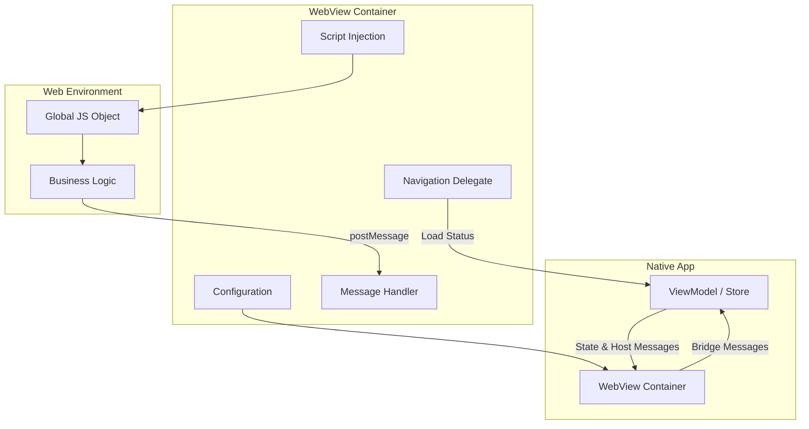
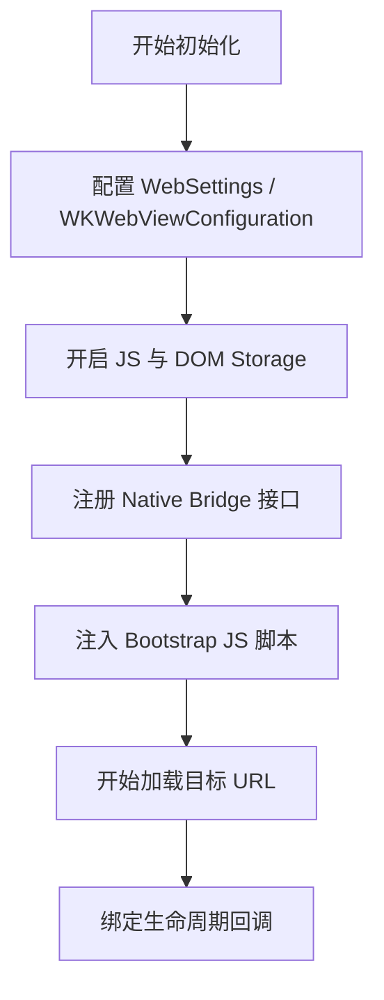
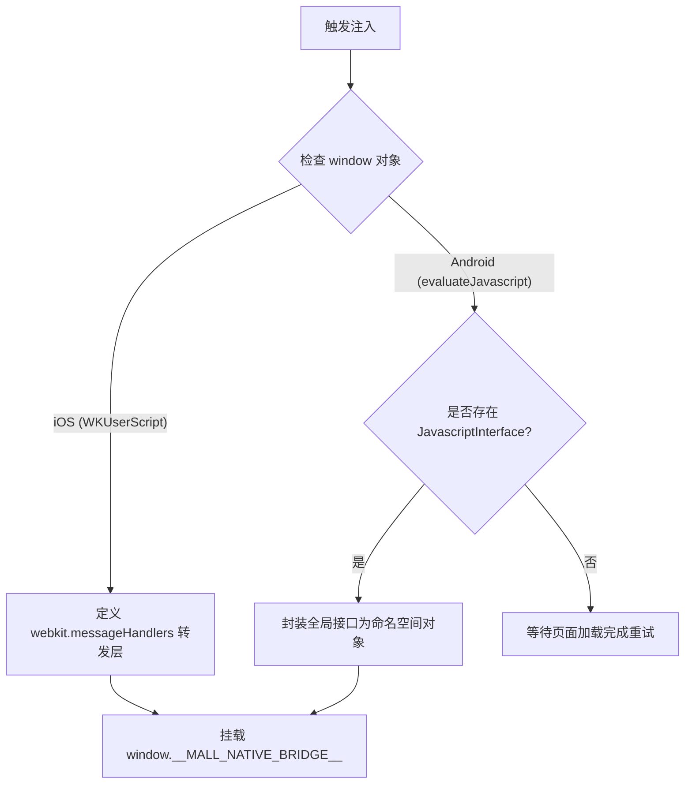
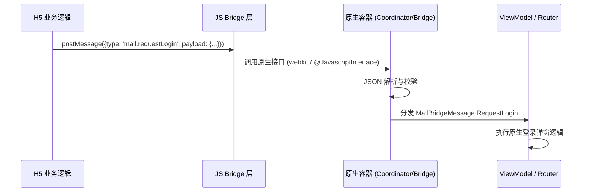
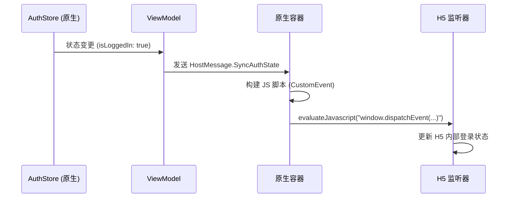
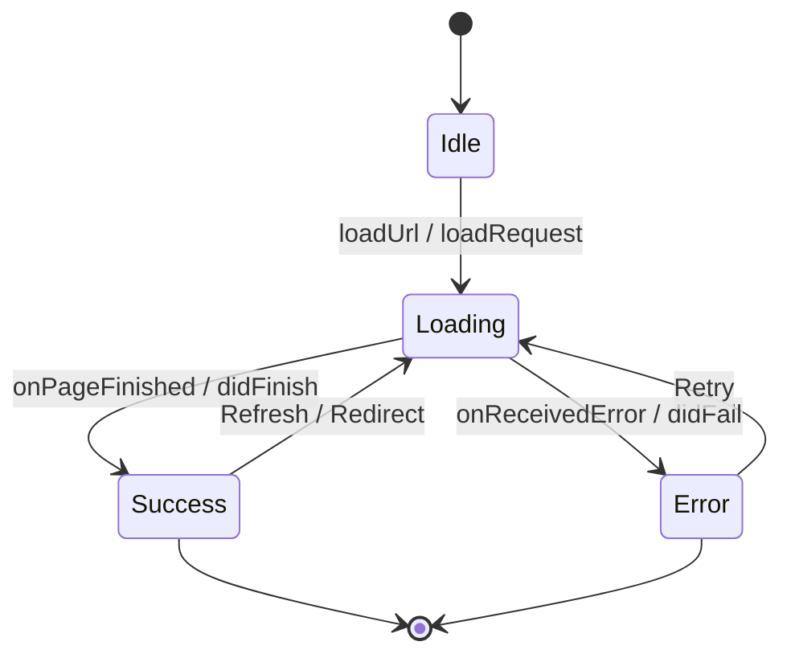
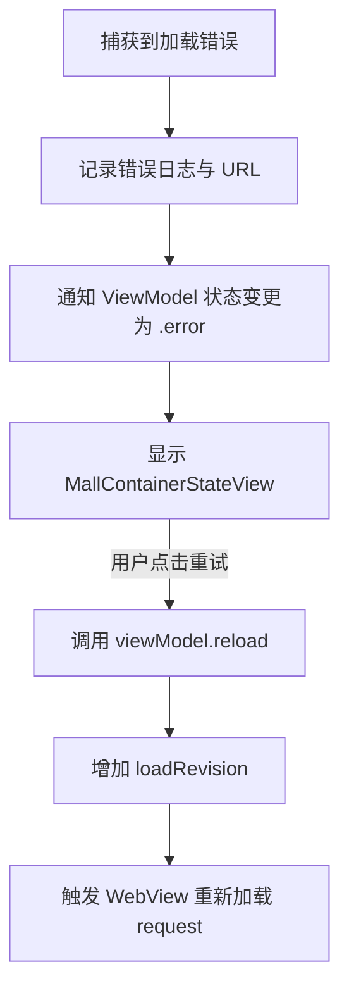

# 原生 WebView 容器封装与脚本注入

## 目录
1. [模块概览](#模块概览)
2. [容器配置与初始化](#容器配置与初始化)
   - [iOS WKWebView 配置](#ios-wkwebview-配置)
   - [Android WebView 配置](#android-webview-配置)
3. [脚本注入机制](#脚本注入机制)
   - [iOS 启动脚本注入](#ios-启动脚本注入)
   - [Android Bridge 动态注入](#android-bridge-动态注入)
4. [消息监听与双工通信](#消息监听与双工通信)
   - [JS 调用原生 (Bridge)](#js-调用原生-bridge)
   - [原生调用 JS (Host Message)](#原生调用-js-host-message)
5. [生命周期与加载状态管理](#生命周期与加载状态管理)
6. [错误处理与重试策略](#错误处理与重试策略)
7. [核心组件](#核心组件)
8. [文件参考](#文件参考)

## 模块概览

在 `ShortDrama` 项目中，原生 WebView 容器封装是连接原生 App 功能与 H5 业务逻辑（如商城、任务中心）的核心桥梁。该模块不仅负责展示网页内容，还承担了身份验证同步、路由跳转拦截、以及跨端消息通信等关键职责。

通过深度解析 iOS 的 `WKWebView` 实现和 Android 的 `WebView` 封装，我们可以看到一套高度对称且针对各平台特性优化的 Bridge 架构。iOS 端利用 `WKUserScript` 在文档开始时注入环境，而 Android 端则结合 `@JavascriptInterface` 与手动脚本注入来确保 Bridge 的可用性。

### 范围与覆盖
本章节涵盖了以下核心功能模块的 WebView 实现：
- **商城 (Mall)**: 处理复杂的登录同步、搜索跳转及上下文恢复。
- **任务中心 (Earn)**: 涉及视频任务完成状态的回传及登录态管理。

### 统计数据
- **涉及文件总数**: 约 73 个（包含 iOS 组件 44 个，Android UI 组件 29 个）。
- **核心容器实现**: 8 个关键文件。
- **覆盖子目录**:
  - `ios/ShortDrama/Sources/Features/Mall/Views/Components/`
  - `ios/ShortDrama/Sources/Features/Earn/Views/Components/`
  - `android/app/src/main/java/com/djs66256/short_drama/feature/mall/ui/`
  - `android/app/src/main/java/com/djs66256/short_drama/feature/earn/ui/`

下图展示了 WebView 容器在系统架构中的位置及其与业务逻辑层的交互关系：



该架构图清晰地描绘了原生端与 Web 环境之间的解耦设计。原生端通过 `ViewModel` 驱动 WebView 的状态，而 WebView 内部则通过配置、注入和监听三个维度构建起一个受控的运行环境。业务逻辑运行在 Web 环境中，通过全局 JS 对象与原生端进行异步通信。

**模块概览来源**:
- [MallWebView.swift](ios/ShortDrama/Sources/Features/Mall/Views/Components/MallWebView.swift)
- [MallWebViewContainer.kt](android/app/src/main/java/com/djs66256/short_drama/feature/mall/ui/MallWebViewContainer.kt)

## 容器配置与初始化

WebView 的性能与安全性高度依赖于初始化的配置参数。iOS 和 Android 采用了不同的 API，但目标一致：开启 JS 支持、优化存储性能、并确保跨域/混合内容的正确加载。

### iOS WKWebView 配置
iOS 端使用 `WKWebViewConfiguration` 进行全局配置。关键点在于 `userContentController` 的管理，它不仅用于注册 Bridge 频道，还负责管理注入的脚本。

```swift
func makeUIView(context: Context) -> WKWebView {
    let configuration = WKWebViewConfiguration()
    let controller = configuration.userContentController
    
    // 注册消息处理器
    controller.add(context.coordinator, name: Coordinator.bridgeChannel)
    
    // 注入启动脚本，确保在文档开始加载前 JS 环境已就绪
    controller.addUserScript(
        WKUserScript(
            source: Coordinator.bridgeBootstrapScript,
            injectionTime: .atDocumentStart,
            forMainFrameOnly: true
        )
    )

    let webView = WKWebView(frame: .zero, configuration: configuration)
    webView.navigationDelegate = context.coordinator
    webView.allowsBackForwardNavigationGestures = false // 禁用原生侧滑手势，由 H5 控制
    webView.load(request)
    return webView
}
```

### Android WebView 配置
Android 端通过 `WebSettings` 进行精细化调优。特别注意 `domStorageEnabled` 的开启，这对于现代单页应用（SPA）存储本地状态至关重要。

```kotlin
private fun WebView.configureMallWebView(
    onPageStateChanged: (MallPageEvent) -> Unit,
    onBridgeMessage: (MallBridgeMessage) -> Unit,
) {
    settings.apply {
        javaScriptEnabled = true
        domStorageEnabled = true // 开启 DOM Storage
        loadsImagesAutomatically = true
        cacheMode = WebSettings.LOAD_DEFAULT
        mixedContentMode = WebSettings.MIXED_CONTENT_COMPATIBILITY_MODE // 处理 HTTPS 页面加载 HTTP 资源
    }
    // 添加 Javascript 接口
    addJavascriptInterface(MallJavascriptBridge(onBridgeMessage), MALL_BRIDGE_NAME)
    webChromeClient = WebChromeClient()
    injectMallNativeBridge() // 初始注入
    webViewClient = MallWebViewClient(onPageStateChanged)
}
```

下图展示了 WebView 初始化的逻辑流转：



初始化流程确保了在页面内容开始解析之前，所有的安全策略和通信通道已经建立完毕。iOS 通过 `atDocumentStart` 保证了注入的原子性，而 Android 则需要在配置阶段和页面完成阶段多次确认注入状态，以应对复杂的页面跳转情况。

**容器配置来源**:
- [MallWebView.swift:L20-L39](ios/ShortDrama/Sources/Features/Mall/Views/Components/MallWebView.swift#L20-L39)
- [MallWebViewContainer.kt:L91-L105](android/app/src/main/java/com/djs66256/short_drama/feature/mall/ui/MallWebViewContainer.kt#L91-L105)

## 脚本注入机制

脚本注入是 Bridge 能够正常工作的基石。它在全局 `window` 对象下挂载约定的命名空间（如 `__MALL_NATIVE_BRIDGE__`），使得 H5 开发者可以像调用普通 JS 函数一样与原生交互。

### iOS 启动脚本注入
iOS 利用 `WKUserScript` 的特性，在页面生命周期的极早期注入代码。

```javascript
(function() {
  const postToNative = function(message) {
    try {
      window.webkit.messageHandlers.mallBridge.postMessage(message);
    } catch (error) {
      console.error('mallBridge unavailable', error);
    }
  };

  window.__MALL_NATIVE_BRIDGE__ = {
    postMessage: postToNative,
  };
  
  // 监听来自 window 的同步消息并转发给原生
  window.addEventListener('mall.syncAuthState', function(event) {
    window.postMessage({ type: 'mall.syncAuthState', payload: event.detail }, '*');
  });
})();
```

### Android Bridge 动态注入
Android 使用 `evaluateJavascript` 进行动态注入。由于 Android 的 `@JavascriptInterface` 注入的名称是全局的，我们需要在 JS 层做一层封装，以匹配 iOS 的调用接口。

```kotlin
private fun WebView.injectMallNativeBridge() {
    val script = """
        (function() {
            window.__MALL_NATIVE_BRIDGE__ = {
                postMessage: function(message) {
                    if (!window.$MALL_BRIDGE_NAME || typeof window.$MALL_BRIDGE_NAME.postMessage !== 'function') {
                        return;
                    }
                    window.$MALL_BRIDGE_NAME.postMessage(JSON.stringify(message));
                }
            };
        })();
    """.trimIndent()
    evaluateJavascript(script) { result ->
        Log.d(MALL_WEB_VIEW_TAG, "injectMallNativeBridge result=$result")
    }
}
```

下图详细描述了 Bridge 注入的逻辑判定过程：



注入机制的设计考虑了跨平台的一致性。通过在原生端抹平 API 差异，H5 业务代码只需要调用 `window.__MALL_NATIVE_BRIDGE__.postMessage` 即可实现跨端通信，极大地降低了前端开发的适配成本。

**脚本注入来源**:
- [MallWebView.swift:L60-L88](ios/ShortDrama/Sources/Features/Mall/Views/Components/MallWebView.swift#L60-L88)
- [MallWebViewContainer.kt:L117-L139](android/app/src/main/java/com/djs66256/short_drama/feature/mall/ui/MallWebViewContainer.kt#L117-L139)

## 消息监听与双工通信

双工通信是指 JS 可以主动调用原生方法，原生也可以主动向 JS 发送事件通知。

### JS 调用原生 (Bridge)
当 H5 需要请求登录或打开搜索页时，会通过 Bridge 发送消息。原生端接收到消息后，会将其解析为强类型的 `BridgeMessage` 对象，并转发给相应的 `ViewModel` 处理。



在 iOS 中，这是通过 `WKScriptMessageHandler` 实现的：
```swift
func userContentController(_ userContentController: WKUserContentController, didReceive message: WKScriptMessage) {
    guard message.name == Self.bridgeChannel,
          let bridgeMessage = MallBridgeMessage(body: message.body) else { return }
    onBridgeMessage(bridgeMessage)
}
```

### 原生调用 JS (Host Message)
当原生端的登录态发生变化（例如用户在原生页面完成了登录），原生端需要主动通知 WebView 更新。这通常通过 `evaluateJavaScript` 派发自定义事件来实现。



Android 端的实现示例：
```kotlin
private fun SyncAuthState.toJavascript(): String {
    val payload = JSONObject().apply { /* 构建 JSON */ }.toString()
    return """
        (function() {
            var payload = $payload;
            window.postMessage(payload, '*'); // 派发消息
            return JSON.stringify({ delivered: true });
        })();
    """.trimIndent()
}
```

这种基于事件的消息分发机制确保了通信的异步性和非阻塞性。原生端不需要等待 JS 的即时响应，而是通过派发事件的方式让 JS 在合适的时机处理状态同步。

**消息监听来源**:
- [MallWebView.swift:L126-L135](ios/ShortDrama/Sources/Features/Mall/Views/Components/MallWebView.swift#L126-L135)
- [MallWebViewContainer.kt:L107-L115](android/app/src/main/java/com/djs66256/short_drama/feature/mall/ui/MallWebViewContainer.kt#L107-L115)
- [EarnWebViewContainer.kt:L187-L234](android/app/src/main/java/com/djs66256/short_drama/feature/earn/ui/EarnWebViewContainer.kt#L187-L234)

## 生命周期与加载状态管理

WebView 的生命周期管理直接影响用户体验。我们需要监控页面加载的每一个阶段，以便在加载失败时显示占位图，或在加载成功后隐藏加载动画。



在 iOS 端，`WKNavigationDelegate` 承担了这一职责：
- `didFinish`: 页面加载完成，通知 ViewModel 切换到 `.success` 状态。
- `didFail` / `didFailProvisionalNavigation`: 记录错误信息并触发失败回调。

在 Android 端，`WebViewClient` 处理类似逻辑：
- `onPageStarted`: 开始加载，触发 `LoadStarted` 事件。
- `onPageFinished`: 完成加载，重新注入 Bridge 并触发 `LoadSucceeded`。
- `onReceivedError`: 主框架加载失败，触发 `LoadFailed`。

**生命周期管理来源**:
- [MallWebView.swift:L106-L125](ios/ShortDrama/Sources/Features/Mall/Views/Components/MallWebView.swift#L106-L125)
- [MallWebViewClient.kt:L141-L188](android/app/src/main/java/com/djs66256/short_drama/feature/mall/ui/MallWebViewContainer.kt#L141-L188)

## 错误处理与重试策略

网络波动是移动端常见的挑战。WebView 容器通过捕获网络错误（如 DNS 查找失败、超时、HTTP 4xx/5xx）并提供统一的重试机制来提升健壮性。

当 `WebViewClient` 或 `WKNavigationDelegate` 检测到致命错误时，会通知上层 UI。UI 层会覆盖一个 `StateView`（如 `MallContainerStateView`），提供“点击重试”按钮。



重试逻辑中引入了 `loadRevision` 计数器，这是为了在 SwiftUI 的 `updateUIView` 中能够精确识别出重试操作，从而强制执行 `webView.load(request)`。

**错误处理来源**:
- [MallWebView.swift:L41-L46](ios/ShortDrama/Sources/Features/Mall/Views/Components/MallWebView.swift#L41-L46)
- [MallContainerView.swift:L22-L24](ios/ShortDrama/Sources/Features/Mall/Views/MallContainerView.swift#L22-L24)
- [MallWebViewContainer.kt:L155-L187](android/app/src/main/java/com/djs66256/short_drama/feature/mall/ui/MallWebViewContainer.kt#L155-L187)

## 核心组件

以下是实现 WebView 容器的关键类和结构体：

### iOS 核心组件
- `MallWebView`: 实现 `UIViewRepresentable`，将 `WKWebView` 桥接到 SwiftUI。
- `MallWebView.Coordinator`: 充当代理，处理导航回调与脚本消息。
- `MallBridgeMessage`: 消息解析模型，负责将 `Any` 类型的消息体转换为强类型。

### Android 核心组件
- `MallWebViewContainer`: Compose 组件，使用 `AndroidView` 包裹原生 `WebView`。
- `MallJavascriptBridge`: 使用 `@JavascriptInterface` 注解的类，接收 JS 字符串消息。
- `MallWebViewClient`: 自定义 `WebViewClient`，处理页面生命周期与错误拦截。
- `MallHostMessageDispatcher`: 负责将 ViewModel 的消息分发给 WebView 实例。

**核心组件代码参考**:
```swift
// iOS Bridge 消息解析示例
struct MallBridgeMessage {
    enum MessageType: String {
        case openSearch = "mall.openSearch"
        case requestLogin = "mall.requestLogin"
    }
    
    let type: MessageType
    let payload: [String: Any]
    
    init?(body: Any) {
        guard let dict = body as? [String: Any],
              let typeStr = dict["type"] as? String,
              let type = MessageType(rawValue: typeStr) else { return nil }
        self.type = type
        self.payload = dict["payload"] as? [String: Any] ?? [:]
    }
}
```

```kotlin
// Android JavascriptInterface 示例
private class MallJavascriptBridge(
    private val onBridgeMessage: (MallBridgeMessage) -> Unit,
) {
    @JavascriptInterface
    fun postMessage(rawPayload: String?) {
        // 将 JSON 字符串解析为 MallBridgeMessage 对象
        onBridgeMessage(rawPayload.toMallBridgeMessage())
    }
}
```

**核心组件来源**:
- [MallWebView.swift:L4-L136](ios/ShortDrama/Sources/Features/Mall/Views/Components/MallWebView.swift#L4-L136)
- [MallWebViewContainer.kt:L32-L89](android/app/src/main/java/com/djs66256/short_drama/feature/mall/ui/MallWebViewContainer.kt#L32-L89)

## 文件参考

以下是本页面涉及的核心源文件：

- `ios/ShortDrama/Sources/Features/Mall/Views/Components/MallWebView.swift`: iOS 商城 WebView 容器实现。
- `android/app/src/main/java/com/djs66256/short_drama/feature/mall/ui/MallWebViewContainer.kt`: Android 商城 WebView 容器实现。
- `ios/ShortDrama/Sources/Features/Earn/Views/Components/EarnWebView.swift`: iOS 任务中心 WebView 容器实现。
- `android/app/src/main/java/com/djs66256/short_drama/feature/earn/ui/EarnWebViewContainer.kt`: Android 任务中心 WebView 容器实现。
- `ios/ShortDrama/Sources/Features/Mall/Views/MallContainerView.swift`: iOS 商城主容器，协调 WebView 与 ViewModel。
- `ios/ShortDrama/Sources/Features/Mall/Views/Components/MallContainerStateView.swift`: 商城加载状态 UI。
- `android/app/src/main/java/com/djs66256/short_drama/feature/mall/ui/MallScreen.kt`: Android 商城屏幕入口。
- `android/app/src/main/java/com/djs66256/short_drama/feature/earn/ui/EarnScreen.kt`: Android 任务中心屏幕入口。
