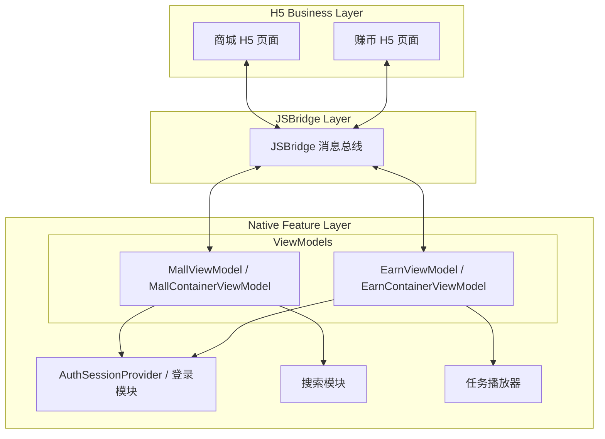
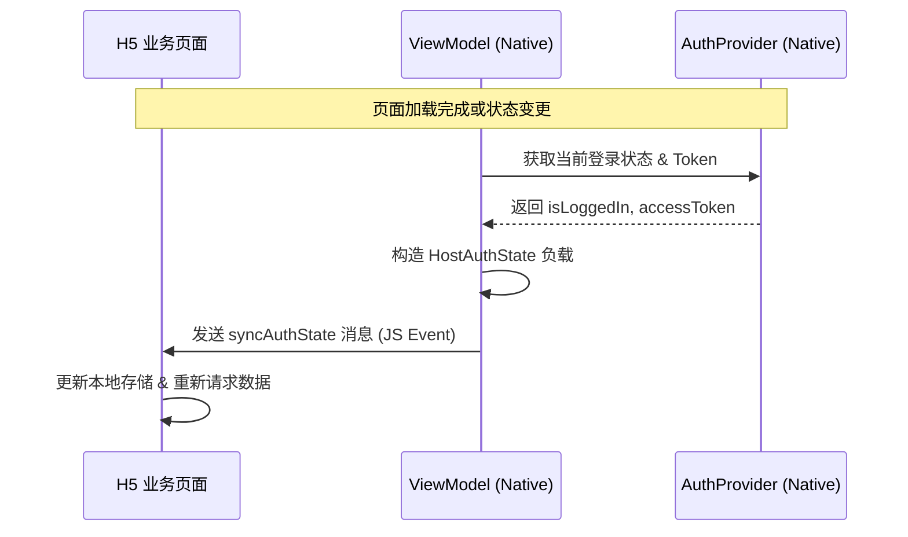
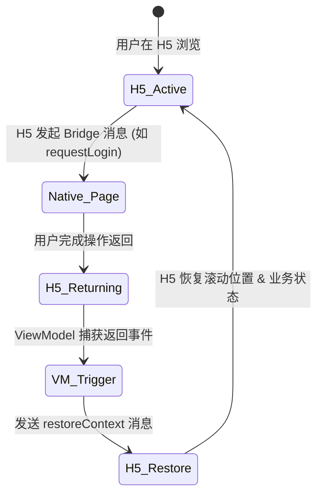
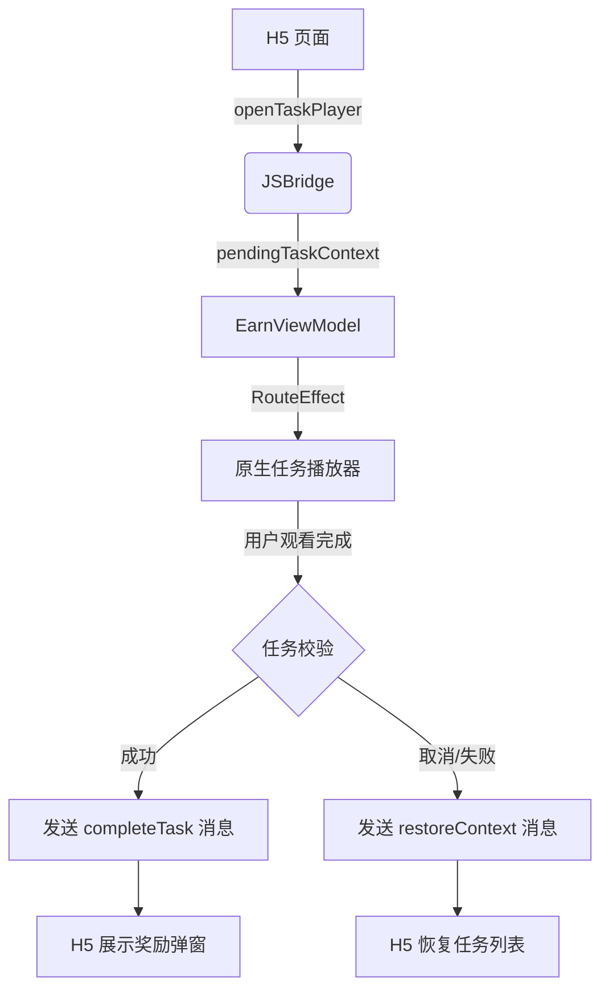
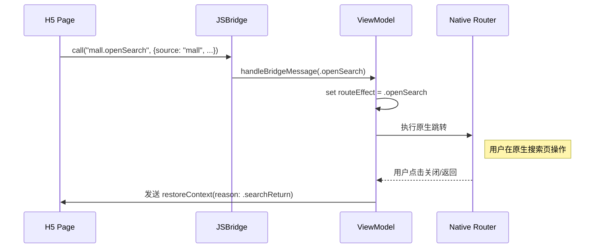
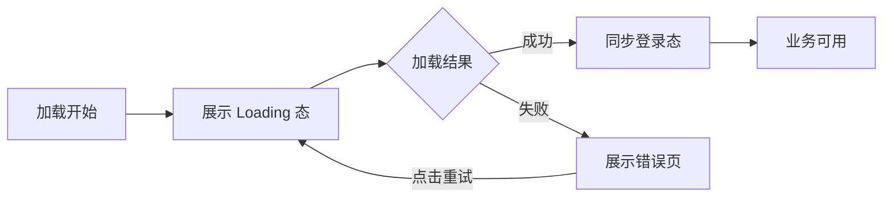

# 商城与赚币业务集成逻辑

## 目录
1. [模块概览](#模块概览)
2. [业务架构与集成模型](#业务架构与集成模型)
3. [登录态同步机制 (Auth Sync)](#登录态同步机制-auth-sync)
4. [上下文恢复机制 (Context Restore)](#上下文恢复机制-context-restore)
5. [赚币任务与奖励流程](#赚币任务与奖励流程)
6. [页面路由与交互逻辑](#页面路由与交互逻辑)
7. [集成要点与异常处理](#集成要点与异常处理)
8. [核心组件实现](#核心组件实现)
   - [iOS 端实现 (Swift)](#ios-端实现-swift)
   - [Android 端实现 (Kotlin)](#android-端实现-kotlin)
9. [文件参考](#文件参考)

## 模块概览

商城 (Mall) 与赚币 (Earn) 模块是应用中核心的业务板块，主要通过 H5 页面承载业务逻辑，并通过 JSBridge 与原生 App 进行深度集成。本章节详细解析了这两个模块在原生端的集成逻辑，重点在于 ViewModel 层的状态管理、登录态同步、上下文恢复以及任务奖励的发放流程。

通过对代码库的探索，我们识别出以下关键子模块和文件分布：

- **iOS 端 (ShortDrama/Sources/Features/)**:
    - `Mall/`: 包含商城容器 ViewModel、模型及视图组件（共 6 个文件）。
    - `Earn/`: 包含赚币容器 ViewModel、模型及视图组件（共 8 个文件）。
- **Android 端 (feature/)**:
    - `mall/`: 包含商城 ViewModel、模型及 UI 容器（共 5 个文件）。
    - `earn/`: 包含赚币 ViewModel、模型及 UI 容器（共 12 个文件）。

本次分析涵盖了全部 31 个相关文件，重点深入解析了 `MallContainerViewModel`、`MallViewModel`、`EarnContainerViewModel` 和 `EarnViewModel` 中的业务逻辑。这些 ViewModel 不仅负责 WebView 的加载控制，还承担了复杂的跨端状态协调任务。

## 业务架构与集成模型

商城与赚币模块采用了典型的“容器化”集成方案。原生 App 提供一个 WebView 容器，通过 JSBridge 建立双向通信通道。H5 负责 UI 展示和业务流程控制，而原生端负责处理敏感操作（如登录、支付）、系统级功能（如搜索、播放器）以及全局状态的维护。

下图展示了 H5 业务模块与原生 App 之间的核心交互架构：



在此架构中，`ViewModel` 扮演了“中转站”的角色。它监听来自 H5 的 `BridgeMessage`，并根据消息类型触发原生的 `RouteEffect`（如打开搜索或登录）。这种设计模式被称为“副作用驱动架构”，即 H5 的请求在原生端被转化为一个待处理的副作用，由 UI 层根据 ViewModel 的状态变化来执行具体的跳转逻辑。

同时，ViewModel 也监听原生的状态变化（如登录成功、应用切回前台），并通过 `HostMessage` 将最新的状态同步回 H5 页面。这种双向同步机制确保了 H5 能够实时感知原生的环境变化。例如，当用户在原生端完成了登录，商城页面能够立即获取到新的 Token 并刷新商品价格或库存信息，从而提供无缝的用户体验。

**Diagram sources**: 
- [MallContainerViewModel.swift](ios/ShortDrama/Sources/Features/Mall/ViewModels/MallContainerViewModel.swift)
- [EarnViewModel.kt](android/app/src/main/java/com/djs66256/short_drama/feature/earn/viewmodel/EarnViewModel.kt)

## 登录态同步机制 (Auth Sync)

登录态同步是商城与赚币业务的基础。由于 H5 页面需要调用后端接口，而 Token 管理在原生端，因此必须确保 H5 始终持有最新的 Token 和登录状态。如果同步不及时，可能会导致 H5 调用接口返回 401 错误，或者展示错误的会员权益。

### 同步触发时机
原生端会在以下关键节点触发 `syncAuthState` 消息：
1.  **页面初始加载完成**：当 WebView 报告 `LoadSucceeded` 时，立即同步一次。这是为了确保 H5 在首屏渲染完成后就能拿到用户信息。
2.  **登录操作返回**：无论用户是登录成功还是取消，从原生登录界面返回后都会触发同步。如果登录成功，同步的是新 Token；如果取消，同步的是旧状态（或未登录状态）。
3.  **应用切回前台**：用户可能在其他端登录或 Token 过期，切回应用时触发同步以确保数据新鲜。
4.  **容器重建**：在 Android 端，由于系统内存压力导致 Activity 被销毁重构后，ViewModel 会重新初始化并触发一次同步，确保 H5 能够恢复之前的会话。

### 交互时序图



在 `Earn` 模块中，同步的信息更为丰富，除了 `isLoggedIn` 外，还包含 `apiAccessToken` 和 `expiresAt`。这是因为赚币业务涉及金币奖励，对接口鉴权的要求更高。通过显式同步过期时间，H5 可以在 Token 即效前主动引导用户进行刷新或重新登录，避免业务中断。

**Section sources**:
- [MallContainerViewModel.swift:L116-L125](ios/ShortDrama/Sources/Features/Mall/ViewModels/MallContainerViewModel.swift#L116-L125)
- [EarnViewModel.kt:L209-L225](android/app/src/main/java/com/djs66256/short_drama/feature/earn/viewmodel/EarnViewModel.kt#L209-L225)

## 上下文恢复机制 (Context Restore)

当用户从 H5 页面跳转到原生页面（如登录、搜索、支付）并返回时，WebView 可能会因为页面刷新或组件重新挂载而丢失当前的业务上下文（如滚动位置、表单输入、临时状态）。为了解决这个问题，系统引入了 `restoreContext` 机制。

### 恢复逻辑流程
1.  **保存上下文**：H5 在发起跳转前，通过 Bridge 告知原生端跳转意图，并自行在 `localStorage` 或 `sessionStorage` 中保存必要的临时状态。
2.  **触发恢复**：原生端在用户完成操作（如搜索完毕点击返回）后，在回到 WebView 容器的第一时间发送 `restoreContext` 消息。
3.  **恢复执行**：H5 接收到消息后，根据消息中的 `reason`（如 `login-return`）和 `preserveScroll` 标志位，决定是否需要恢复之前的滚动位置或重新加载特定模块。



通过 `restoreContext` 消息中的 `returnTarget` 字段，原生端可以告知 H5 应该返回到哪个具体的业务路径（例如 `/mall` 或 `/earn`）。这在复杂的单页应用（SPA）中尤为重要，因为它能确保用户总是回到他们离开时的那个“逻辑位置”，而不是简单的页面刷新。

**Section sources**:
- [MallBridgeMessage.swift:L3-L7](ios/ShortDrama/Sources/Features/Mall/Models/MallBridgeMessage.swift#L3-L7)
- [MallViewModel.kt:L207-L221](android/app/src/main/java/com/djs66256/short_drama/feature/mall/viewmodel/MallViewModel.kt#L207-L221)

## 赚币任务与奖励流程

赚币模块的核心业务是引导用户完成特定任务（如观看视频、签到等）以获取奖励。这一流程涉及 H5 发起任务、原生播放器执行任务、以及原生端向 H5 反馈任务结果。

### 任务执行流程图



在 `EarnViewModel` 中，`onEarnTaskPlayerResult` 函数扮演了安全哨兵的角色。它不仅负责将播放器的结果透传给 H5，还负责校验任务的合法性。它会检查返回的 `taskId` 和 `videoId` 是否与发起请求时的 `pendingTaskContext` 一致。这种校验机制可以防止用户通过非法手段伪造任务完成消息。

如果任务被判定为“已完成”，原生端会通过 `EarnHostMessage.CompleteTask` 将结果回传给 H5。H5 接收到此消息后，通常会展示一个炫酷的奖励动画，并刷新用户的金币余额。如果用户中途退出播放器，原生端则会发送一个 `restoreContext` 消息，告知 H5 用户已返回，方便 H5 恢复任务列表的展示状态。

**Section sources**:
- [EarnContainerViewModel.swift:L113-L124](ios/ShortDrama/Sources/Features/Earn/ViewModels/EarnContainerViewModel.swift#L113-L124)
- [EarnViewModel.kt:L177-L192](android/app/src/main/java/com/djs66256/short_drama/feature/earn/viewmodel/EarnViewModel.kt#L177-L192)

## 页面路由与交互逻辑

H5 页面通过 Bridge 消息通知原生端进行页面跳转。这种设计允许 H5 利用原生的强大功能（如高性能的播放器或系统搜索）来增强用户体验。目前支持的路由动作包括：

-   **打开搜索 (`openSearch`)**：商城页面点击搜索框时触发。原生端会打开一个全屏的搜索界面，并支持语音搜索等原生特性。
-   **请求登录 (`requestLogin`)**：当 H5 检测到用户未登录（例如点击“立即购买”时）触发。原生端会弹出登录底板或跳转到登录页。
-   **打开任务播放器 (`openTaskPlayer`)**：赚币页面点击任务时触发。原生端会启动一个专门用于任务计时的播放器。

这些跳转请求通常携带 `source` 和 `returnTarget` 参数。`source` 用于标识来源模块，而 `returnTarget` 定义了操作完成后应该回到的 H5 路径。



这种模式确保了业务逻辑的解耦：H5 只需要知道“我想去搜索”，而不需要关心搜索页面是如何实现的；原生端只需要知道“搜完了该回哪”，而不需要关心 H5 当前的状态。这种高度抽象的接口设计极大地提高了跨端协作的效率。

**Section sources**:
- [MallBridgeMessage.swift:L39-L67](ios/ShortDrama/Sources/Features/Mall/Models/MallBridgeMessage.swift#L39-L67)
- [MallViewModel.kt:L124-L156](android/app/src/main/java/com/djs66256/short_drama/feature/mall/viewmodel/MallViewModel.kt#L124-L156)

## 集成要点与异常处理

在商城与赚币这种高频交互的模块中，异常处理和边界情况的覆盖至关重要。

### 常见异常场景
1.  **网络异常导致 H5 加载失败**：原生端通过 `handlePageLoadFailed` 捕获 WebView 的加载错误，并展示统一的错误占位图（`MallContainerStateView` / `EarnContainerStateView`），提供重试按钮。
2.  **JSBridge 注入延迟**：如果 H5 在 Bridge 尚未完全注入时就尝试调用 `requestLogin`，会导致调用失败。为此，原生端在页面加载完成后（`LoadSucceeded`）会主动推送一次 `syncAuthState`，作为 Bridge 可用的信号。
3.  **并发消息冲突**：例如用户快速点击两次“登录”，原生端通过 `pendingLoginContext` 状态位进行拦截，确保同一时间只有一个登录流程在运行。

### 性能优化建议
-   **预加载机制**：虽然目前代码中未显式体现，但通常建议在进入商城前预加载 WebView 容器，以减少白屏时间。
-   **状态快照**：原生端维护的 `isUserLoggedIn` 状态应尽可能保持最新，以便在容器初始化时就能通过 URL 参数或初始消息同步给 H5，减少一次异步往返。



**Section sources**:
- [MallContainerViewModel.swift:L64-L69](ios/ShortDrama/Sources/Features/Mall/ViewModels/MallContainerViewModel.swift#L64-L69)
- [EarnViewModel.kt:L111-L121](android/app/src/main/java/com/djs66256/short_drama/feature/earn/viewmodel/EarnViewModel.kt#L111-L121)

## 核心组件实现

### iOS 端实现 (Swift)

在 iOS 端，`MallContainerViewModel` 使用 `ObservableObject` 管理状态。它通过 `hostMessage` 发布需要发送给 H5 的指令，视图层会监听此属性并将消息注入 WebView。

```swift
// MallContainerViewModel.swift 中的状态同步逻辑
private func syncAuthState(reason: String) {
    // 构造下行消息负载，包含来源、登录状态、触发原因及返回目标
    hostMessage = .syncAuthState(
        MallHostAuthState(
            source: "mall",
            isLoggedIn: isUserLoggedIn,
            reason: reason,
            returnTarget: "/mall"
        )
    )
}

// 处理来自 H5 的 Bridge 消息
func handleBridgeMessage(_ message: MallBridgeMessage) {
    switch message {
    case .openSearch(let context):
        // 触发 UI 层的路由副作用
        routeEffect = .openSearch(context)
    case .requestLogin(let context):
        // 防止重复触发登录
        guard pendingLoginContext == nil else { return }
        pendingLoginContext = context
        routeEffect = .requestLogin(context)
    }
}
```

### Android 端实现 (Kotlin)

Android 端使用 Hilt 进行依赖注入，并利用 Kotlin Flow 管理 UI 状态和副作用（Effect）。这种响应式设计使得状态流转非常清晰。

```kotlin
// MallViewModel.kt 中的 Auth Sync 发送逻辑
private fun emitHostAuthSync(reason: MallHostAuthReason) {
    viewModelScope.launch {
        // 通过 SharedFlow 发送副作用，通知 UI 层执行 JS 注入
        _effects.emit(
            MallEffect.SendHostMessage(
                MallHostMessage.SyncAuthState(
                    MallHostAuthState(
                        isLoggedIn = authSessionProvider.isLoggedIn(),
                        reason = reason,
                    ),
                ),
            ),
        )
    }
}

// 赚币任务完成处理
fun onEarnTaskPlayerResult(result: EarnTaskPlayerResult) {
    val pendingTaskContext = _uiState.value.pendingTaskContext ?: return
    // 关键校验：确保返回的任务结果与发起的任务上下文匹配
    if (pendingTaskContext.taskId != result.taskId || pendingTaskContext.videoId != result.videoId) {
        return
    }
    _uiState.update { it.copy(pendingTaskContext = null) }
    if (result.completed) {
        emitTaskCompletion(result)
    }
    // 无论任务是否完成，都尝试恢复 H5 上下文
    emitRestoreContext(EarnRestoreReason.TASK_RETURN)
}
```

**Section sources**:
- [MallContainerViewModel.swift](ios/ShortDrama/Sources/Features/Mall/ViewModels/MallContainerViewModel.swift)
- [MallViewModel.kt](android/app/src/main/java/com/djs66256/short_drama/feature/mall/viewmodel/MallViewModel.kt)
- [EarnViewModel.kt](android/app/src/main/java/com/djs66256/short_drama/feature/earn/viewmodel/EarnViewModel.kt)

## 文件参考

以下是商城与赚币业务集成逻辑涉及的核心文件列表：

- **iOS 核心文件**:
    - `ios/ShortDrama/Sources/Features/Mall/ViewModels/MallContainerViewModel.swift`: 商城容器核心逻辑，负责状态同步与路由分发。
    - `ios/ShortDrama/Sources/Features/Mall/Models/MallBridgeMessage.swift`: 商城 JSBridge 消息定义及解析逻辑。
    - `ios/ShortDrama/Sources/Features/Earn/ViewModels/EarnContainerViewModel.swift`: 赚币容器核心逻辑，包含任务奖励处理。
    - `ios/ShortDrama/Sources/Features/Earn/Models/EarnBridgeMessage.swift`: 赚币 JSBridge 消息定义。
- **Android 核心文件**:
    - `android/app/src/main/java/com/djs66256/short_drama/feature/mall/viewmodel/MallViewModel.kt`: 商城 ViewModel 实现，采用 Flow 进行状态管理。
    - `android/app/src/main/java/com/djs66256/short_drama/feature/mall/model/MallHostMessage.kt`: 商城下行消息模型（Native -> H5）。
    - `android/app/src/main/java/com/djs66256/short_drama/feature/earn/viewmodel/EarnViewModel.kt`: 赚币 ViewModel 实现，处理复杂的任务校验逻辑。
    - `android/app/src/main/java/com/djs66256/short_drama/feature/earn/model/EarnBridgeMessage.kt`: 赚币上行消息模型（H5 -> Native）。
    - `android/app/src/main/java/com/djs66256/short_drama/feature/earn/model/EarnTaskPlayerResult.kt`: 任务执行结果模型，用于跨端校验。
