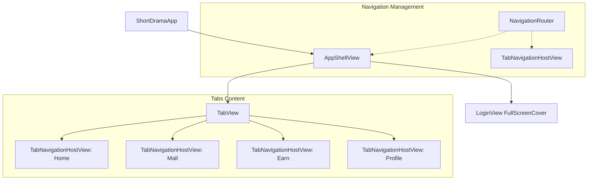
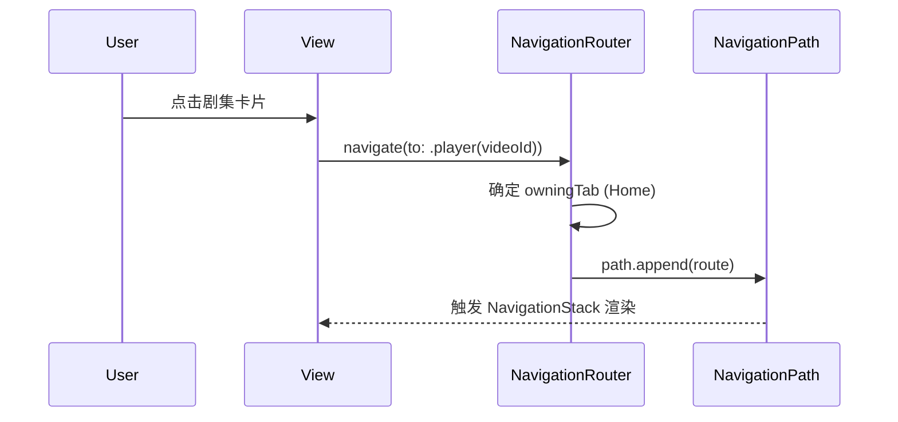
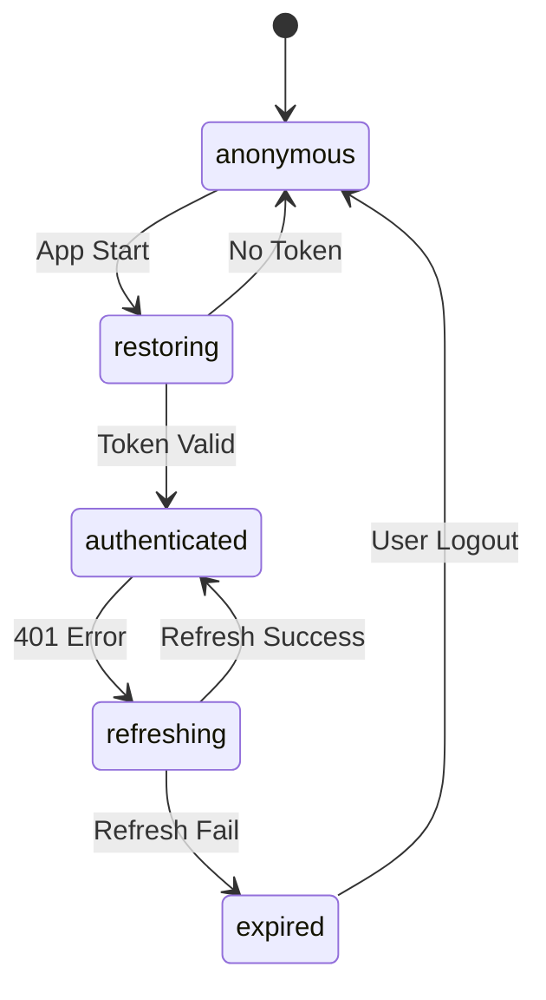
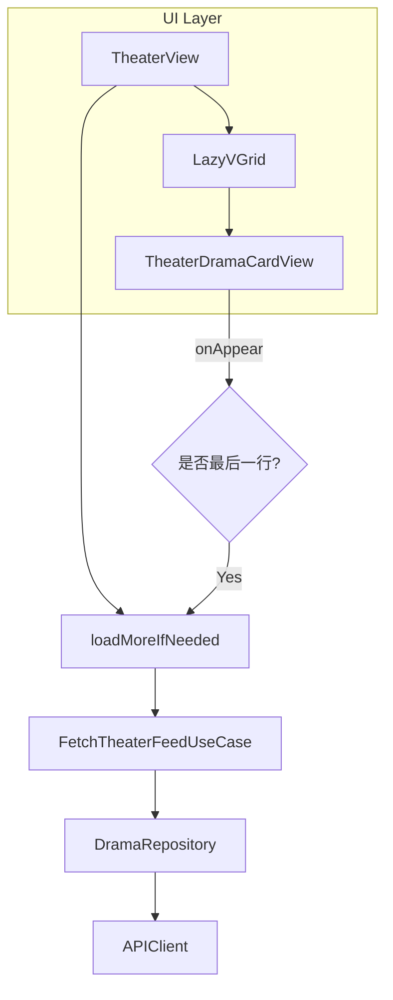

# iOS 客户端开发指南（SwiftUI）

## 目录
1. [模块概览](#模块概览)
2. [SwiftUI 架构设计](#swiftui-架构设计)
   - [AppShell 与 导航容器](#appshell-与-导航容器)
   - [NavigationRouter 导航路由](#navigationrouter-导航路由)
3. [导航与深度链接 (Deeplink)](#导航与深度链接-deeplink)
4. [用户认证与状态管理](#用户认证与状态管理)
5. [核心功能模块实现](#核心功能模块实现)
   - [沉浸式短剧播放器](#沉浸式短剧播放器)
   - [瀑布流剧场列表](#瀑布流剧场列表)
6. [响应式编程实践](#响应式编程实践)
   - [Async/Await 与 Combine 的结合](#asyncawait-与-combine-的结合)
   - [ViewModel 状态管理](#viewmodel-状态管理)
7. [数据层与领域驱动设计 (DDD)](#数据层与领域驱动设计-ddd)
8. [网络层设计与错误处理](#网络层设计与错误处理)
9. [依赖注入机制](#依赖注入机制)
10. [性能优化与内存管理](#性能优化与内存管理)
11. [关键源文件参考](#关键源文件参考)

## 模块概览

iOS 客户端采用了 SwiftUI 框架结合领域驱动设计（DDD）和整洁架构（Clean Architecture）的思想进行构建。代码库位于 `ios/ShortDrama/Sources/` 目录下，展现了高度模块化和解耦的设计风格。

**统计信息**：
- **文件总数**：约 200+ 个 Swift 源文件。
- **核心目录结构**：
  - `App/`：应用程序入口、全局路由管理与 Shell 容器。
  - `Core/`：底层基础设施，包括网络请求（APIClient）、存储（Keychain/UserDefaults）及设计系统（DesignTokens）。
  - `Domain/`：业务核心逻辑，包含实体（Entities）、存储库协议（Repository Protocols）及用例（UseCases）。
  - `Data/`：数据层实现，包含 DTO 定义、远程数据源（DataSources）及存储库实现（Repositories）。
  - `Features/`：功能模块 UI 与 ViewModel 实现，采用 MVVM 模式。

本指南将深入探讨 SwiftUI 在复杂业务场景下的应用，特别是如何处理深度嵌套的导航、高性能的视频播放以及响应式数据流。

---

## SwiftUI 架构设计

### AppShell 与 导航容器

应用采用了 `AppShell` 模式作为 UI 的根容器。`AppShellView` 负责管理底部的 `TabView` 以及全局的弹窗（如登录拦截）。



`AppShellView` 通过 `@EnvironmentObject` 注入 `NavigationRouter`，实现了跨层级的导航控制。

**代码片段：AppShellView 的结构**
```swift
struct AppShellView: View {
    @EnvironmentObject private var router: NavigationRouter
    
    var body: some View {
        ZStack(alignment: .leading) {
            TabView(selection: $router.selectedTab) {
                ForEach(AppTab.allCases) { tab in
                    TabNavigationHostView(tab: tab)
                        .tabItem { Label(tab.title, systemImage: tab.systemImage) }
                        .tag(tab)
                }
            }
            
            // 侧边栏/菜单面板覆盖层
            if router.selectedTab == .home && router.isMenuPanelVisible {
                MenuPanelContainerView(router: router, viewModel: menuPanelViewModel)
                    .transition(.opacity)
                    .zIndex(1)
            }
        }
        .fullScreenCover(item: presentedLoginContextBinding) { context in
            LoginView(context: context, ...)
        }
    }
}
```

### NavigationRouter 导航路由

`NavigationRouter` 是整个应用导航的核心。它利用了 SwiftUI 4.0 引入的 `NavigationPath` 来管理每个 Tab 的独立堆栈，支持深度链接（Deeplink）和复杂的页面跳转逻辑。



`NavigationRouter` 的设计允许逻辑层（如 ViewModel）通过简单的枚举值触发跳转，而无需持有具体的 View 对象，实现了 UI 与逻辑的彻底分离。

**Section sources**:
- [AppShellView.swift](ios/ShortDrama/Sources/App/AppShellView.swift)
- [NavigationRouter.swift](ios/ShortDrama/Sources/App/NavigationRouter.swift)
- [AppRoute.swift](ios/ShortDrama/Sources/App/AppRoute.swift)

---

## 导航与深度链接 (Deeplink)

项目通过 `DeeplinkHandler` 统一处理外部 URL 跳转。支持 `djsdrama://` 协议，能够精确跳转到播放页、剧集详情、排行榜等核心页面。

**路由解析流程**：
1. **URL 解析**：`DeeplinkHandler` 解析 URL Scheme 和 Host。
2. **路由映射**：将 URL 路径转换为 `AppRoute` 枚举。
3. **导航分发**：`NavigationRouter` 根据 `AppRoute` 自动切换 Tab 并推入对应页面。

**代码片段：Deeplink 处理**
```swift
enum DeeplinkHandler {
    static func handleDeepLink(_ url: URL) -> AppRoute? {
        guard let components = URLComponents(url: url, ...),
              components.scheme == "djsdrama" else { return nil }
              
        switch components.host {
        case "play":
            return .player(videoId: videoId)
        case "ranking":
            return .rankingHome
        // ... 其他路由映射
        }
    }
}
```

**Section sources**:
- [DeeplinkHandler.swift](ios/ShortDrama/Sources/App/DeeplinkHandler.swift)
- [ShortDramaApp.swift](ios/ShortDrama/Sources/App/ShortDramaApp.swift)

---

## 用户认证与状态管理

`AuthStore` 是应用全局的状态中心，负责管理用户的登录状态、令牌（Token）刷新以及持久化。



**关键特性**：
- **安全存储**：使用 `KeychainAuthSessionStore` 将敏感的 Access Token 和 Refresh Token 存储在 iOS 系统钥匙串中。
- **自动恢复**：应用启动时自动调用 `restoreIfNeeded()`，尝试从本地恢复会话并验证有效性。
- **无感刷新**：结合网络层拦截器，在 Token 过期时自动触发刷新逻辑，减少用户被迫重新登录的频率。

**Section sources**:
- [AuthStore.swift](ios/ShortDrama/Sources/Features/Auth/AuthStore.swift)
- [KeychainAuthSessionStore.swift](ios/ShortDrama/Sources/Core/Storage/KeychainAuthSessionStore.swift)

---

## 核心功能模块实现

### 沉浸式短剧播放器

播放器是短剧应用的核心组件。项目通过封装 `AVKit` 的 `VideoPlayer` 实现了沉浸式的播放体验。

**设计特点**：
1. **状态驱动**：`PlayerViewModel` 定义了 `UiState` 枚举（idle, bootstrapping, playing, paused, error），UI 根据状态自动切换展示。
2. **生命周期管理**：播放器能够响应 `scenePhase` 变化，在进入后台时自动暂停并上报进度。
3. **交互解耦**：播放控制（进度更新、倍速切换）通过闭包回调与底层 `AVPlayer` 交互。

**代码片段：NativeVideoPlayerView 的封装**
```swift
struct NativeVideoPlayerView: View {
    let url: URL?
    @State private var player = AVPlayer()
    
    var body: some View {
        VideoPlayer(player: player)
            .onAppear { configurePlayer() }
            .onChange(of: url) { _, _ in configurePlayer() }
            .onDisappear {
                player.pause()
                removePlaybackObservers()
            }
    }
    
    private func configurePlayer() {
        guard let url else { return }
        let item = AVPlayerItem(url: url)
        player.replaceCurrentItem(with: item)
        player.playImmediately(atRate: playbackRate)
    }
}
```

### 瀑布流剧场列表

剧场频道使用了 `LazyVGrid` 实现高性能的瀑布流列表。配合 `onAppear` 触发的分页加载逻辑，确保了在大数据量下的流畅体验。



**Section sources**:
- [PlayerViewModel.swift](ios/ShortDrama/Sources/Features/Player/ViewModels/PlayerViewModel.swift)
- [NativeVideoPlayerView.swift](ios/ShortDrama/Sources/Features/Player/Views/Components/NativeVideoPlayerView.swift)
- [TheaterFeedGridView.swift](ios/ShortDrama/Sources/Features/Theater/Views/TheaterFeedGridView.swift)

---

## 响应式编程实践

### Async/Await 与 Combine 的结合

项目广泛使用了 Swift 的结构化并发（Structured Concurrency）。ViewModel 中的业务逻辑通常由 `async` 函数承载，而状态更新则通过 `@Published` 属性通知 UI。

**典型模式**：
1. **Task 管理**：使用 `Task` 启动异步操作，并保存引用以便在页面销毁或重新触发时调用 `cancel()`。
2. **防重触发**：通过 `requestToken` 或 `Task` 引用防止并发请求导致的数据竞争。

```swift
func loadMoreIfNeeded() async {
    guard !isAppending && currentPage < totalPages else { return }
    isAppending = true
    
    let token = requestToken // 用于校验请求有效性
    do {
        let response = try await fetchTheaterFeedUseCase.execute(...)
        guard token == requestToken else { return } // 丢弃过时请求
        
        currentItems.append(contentsOf: response.items)
        viewState = .content(currentItems)
    } catch {
        // 错误处理
    }
}
```

### ViewModel 状态管理

ViewModel 负责将复杂的领域模型转换为 UI 可直接使用的 ViewState。通过 `enum ViewState` 强制处理加载中、空数据、错误等边界情况，减少了 View 中的逻辑判断。

**Section sources**:
- [PlayerViewModel.swift](ios/ShortDrama/Sources/Features/Player/ViewModels/PlayerViewModel.swift)
- [TheaterViewModel.swift](ios/ShortDrama/Sources/Features/Theater/ViewModels/TheaterViewModel.swift)

---

## 数据层与领域驱动设计 (DDD)

项目严格遵循 DDD 模式，将数据处理分为三个层次：

1. **DTO (Data Transfer Objects)**：与后端接口一一对应的结构体，位于 `Data/DTOs`。
2. **Entities**：业务层使用的纯净模型，位于 `Domain/Entities`。
3. **Mappers**：通过扩展 DTO 实现 `toEntity()` 方法，完成从网络数据到业务模型的转换。

这种设计确保了后端接口的变动不会直接渗透到 UI 层，增强了系统的健壮性。

**代码片段：DTO 到 Entity 的映射**
```swift
extension DramaDTO {
    func toEntity() -> Drama {
        Drama(
            id: self.id,
            title: self.title,
            coverUrl: self.coverUrl,
            // ... 字段映射逻辑
        )
    }
}
```

**Section sources**:
- [DramaDTO.swift](ios/ShortDrama/Sources/Data/DTOs/DramaDTO.swift)
- [Drama.swift](ios/ShortDrama/Sources/Domain/Entities/Drama.swift)

---

## 网络层设计与错误处理

`APIClient` 是基于 `URLSession` 的底层封装，提供了类型安全的请求接口。

**核心逻辑**：
- **泛型请求**：通过 `request<T: Decodable>(_ endpoint: some APIEndpoint)` 实现自动反序列化。
- **错误分类**：将网络错误细分为 `network`, `server`, `business`, `decodingFailed` 等，便于 UI 层进行针对性提示。
- **取消机制**：支持结构化并发下的自动取消，避免无效的网络开销。

**Section sources**:
- [APIClient.swift](ios/ShortDrama/Sources/Core/Network/APIClient.swift)
- [APIError.swift](ios/ShortDrama/Sources/Core/Network/APIError.swift)

---

## 依赖注入机制

虽然 iOS 端没有使用类似 Android Hilt 的编译时 DI 框架，但通过**构造函数注入（Constructor Injection）**实现了高度的可测试性。

**实现方式**：
1. **协议先行**：所有存储库都定义了 `Protocol`（位于 `Domain/RepositoryProtocols`）。
2. **默认参数**：在 ViewModel 的构造函数中为依赖项提供默认实现，方便生产环境使用，同时允许测试环境注入 Mock。

```swift
final class PlayerViewModel: ObservableObject {
    init(
        videoId: String,
        fetchPlayerProgressUseCase: FetchPlayerProgressUseCase = .init(repository: PlayerRepository()),
        // ... 其他依赖
    ) {
        self.videoId = videoId
        self.fetchPlayerProgressUseCase = fetchPlayerProgressUseCase
    }
}
```

这种模式在保持代码简洁的同时，确保了模块间的松耦合。

**Section sources**:
- [PlayerViewModel.swift](ios/ShortDrama/Sources/Features/Player/ViewModels/PlayerViewModel.swift)
- [DramaRepositoryProtocol.swift](ios/ShortDrama/Sources/Domain/RepositoryProtocols/DramaRepositoryProtocol.swift)

---

## 性能优化与内存管理

### 内存泄漏防护

在 SwiftUI 中，ViewModel 通常是 `@StateObject` 或 `@EnvironmentObject`，其生命周期与视图树挂钩。为了防止循环引用和内存泄漏，项目严格遵守以下原则：
- **[weak self]**：在所有的异步 `Task` 或闭包中访问 ViewModel 属性时，必须使用弱引用。
- **Task 取消**：在 `onDisappear` 或对象销毁时，显式取消正在进行的异步任务。

```swift
private var bootstrapTask: Task<Void, Never>?

private func bootstrap() async {
    bootstrapTask?.cancel() // 取消前一次任务
    bootstrapTask = Task { [weak self] in
        guard let self = self else { return }
        await self.performBootstrap()
    }
}
```

### UI 渲染性能优化

1. **Lazy 容器**：大量列表数据强制使用 `LazyVStack` 或 `LazyVGrid`，确保只有可见区域的 View 被实例化。
2. **视图打散**：将复杂的页面拆分为多个细粒度的子组件（如 `PlayerBottomInfoView`），利用 SwiftUI 的差异化渲染机制减少不必要的重绘。
3. **Equatability**：ViewModel 的 `ViewState` 实现 `Equatable` 协议，配合 `.animation()` 仅在状态真正改变时触发动画。

---

## 关键源文件参考

本章节涉及的核心源文件如下，建议开发者深入阅读以掌握实现细节：

- **架构与路由**：
  - `ios/ShortDrama/Sources/App/AppShellView.swift`：UI 根容器实现。
  - `ios/ShortDrama/Sources/App/NavigationRouter.swift`：全局路由管理器。
  - `ios/ShortDrama/Sources/App/AppRoute.swift`：页面路径定义。
  - `ios/ShortDrama/Sources/App/DeeplinkHandler.swift`：深度链接解析逻辑。
- **核心组件**：
  - `ios/ShortDrama/Sources/Features/Player/ViewModels/PlayerViewModel.swift`：播放器业务逻辑。
  - `ios/ShortDrama/Sources/Features/Player/Views/Components/NativeVideoPlayerView.swift`：AVKit 封装层。
  - `ios/ShortDrama/Sources/Features/Theater/Views/TheaterFeedGridView.swift`：瀑布流列表实现。
- **用户认证**：
  - `ios/ShortDrama/Sources/Features/Auth/AuthStore.swift`：全局认证状态中心。
  - `ios/ShortDrama/Sources/Core/Storage/KeychainAuthSessionStore.swift`：钥匙串存储实现。
- **网络与基础设施**：
  - `ios/ShortDrama/Sources/Core/Network/APIClient.swift`：基于 URLSession 的网络客户端。
  - `ios/ShortDrama/Sources/Core/DesignSystem/DesignTokens.swift`：UI 规范常量定义。
