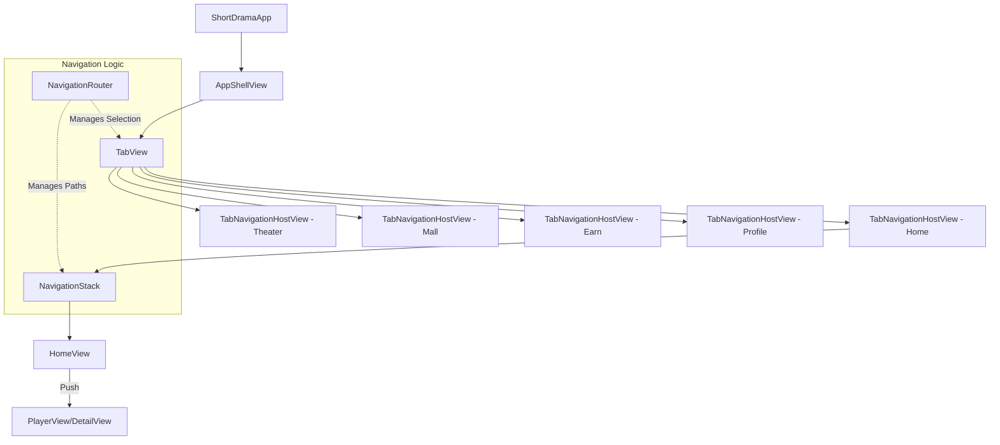
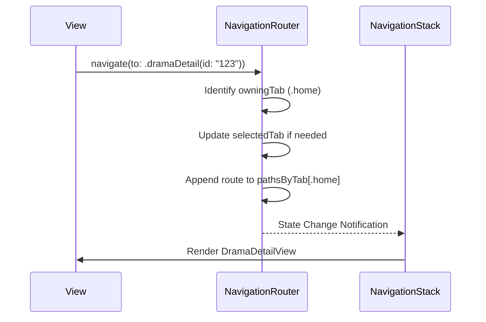
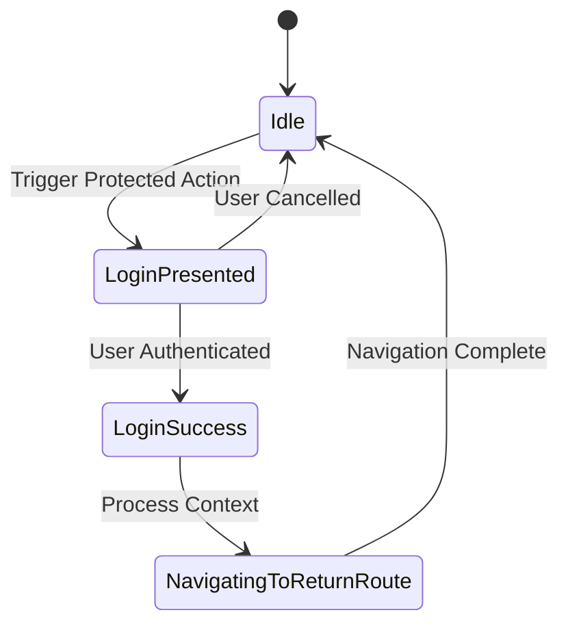
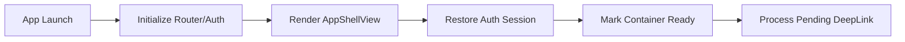

# SwiftUI UI 体系与导航架构

## 目录
1. [模块概览](#模块概览)
2. [引言](#引言)
3. [核心组件](#核心组件)
   - [ShortDramaApp：应用入口](#shortdramaapp应用入口)
   - [AppShellView：根视图容器](#appshellview根视图容器)
   - [NavigationRouter：路由中心](#navigationrouter路由中心)
   - [AppRoute：路由定义](#approute路由定义)
   - [TabNavigationHostView：导航宿主](#tabnavigationhostview导航宿主)
4. [架构设计](#架构设计)
   - [视图层级架构](#视图层级架构)
   - [导航状态管理](#导航状态管理)
5. [导航管理机制](#导航管理机制)
   - [多 Tab 路径隔离](#多-tab-路径隔离)
   - [登录拦截与恢复](#登录拦截与恢复)
   - [深度链接处理](#深度链接处理)
6. [设计系统与 UI 规范](#设计系统与-ui-规范)
   - [设计令牌 (Design Tokens)](#设计令牌-design-tokens)
   - [视图扩展 (View Extensions)](#视图扩展-view-extensions)
7. [启动流程](#启动流程)
8. [文件引用](#文件引用)

## 模块概览

本模块负责 ShortDrama iOS 端的 UI 基础设施构建与全局导航架构实现。它定义了应用如何启动、主界面如何组织以及页面之间如何跳转的核心逻辑。

- **总文件数**：约 10 个核心 Swift 文件。
- **主要目录**：
  - `ios/ShortDrama/Sources/App/`：包含应用入口、根视图、路由管理及 Tab 切换逻辑。
  - `ios/ShortDrama/Sources/Core/DesignSystem/`：包含全局设计规范、颜色、间距等 UI 令牌。
  - `ios/ShortDrama/Sources/Core/Extensions/`：包含对 SwiftUI 视图的便捷扩展。

本章节将深入探讨这些组件如何协同工作，构建出一个高性能、解耦且易于维护的 SwiftUI 应用架构。

## 引言

在现代 iOS 开发中，尤其是使用 SwiftUI 时，构建一个健壮的导航系统是至关重要的。ShortDrama 采用了基于 `NavigationStack` 和集中式路由管理器 `NavigationRouter` 的架构。这种设计旨在解决以下核心问题：

1.  **状态驱动导航**：通过单一事实源（Single Source of Truth）管理导航状态，使得页面跳转不再依赖于具体的 View 层级，而是通过逻辑代码触发。
2.  **多 Tab 独立路径**：每个 Tab（首页、剧场、商城等）拥有独立的导航堆栈，用户在不同 Tab 间切换时能够保留各自的浏览进度。
3.  **解耦跳转逻辑**：通过 `AppRoute` 枚举定义所有可能的跳转目标，避免了视图之间直接的强耦合。
4.  **统一设计语言**：通过 `DesignTokens` 确保全站 UI 风格的高度统一，降低样式维护成本。

## 核心组件

### ShortDramaApp：应用入口

`ShortDramaApp` 是整个应用的起点，符合 SwiftUI 的 `App` 协议。它负责初始化全局状态对象并配置根视图。

```swift
@main
struct ShortDramaApp: App {
    @StateObject private var router = NavigationRouter()
    @StateObject private var authStore = AuthStore()

    var body: some Scene {
        WindowGroup {
            rootView
                .environmentObject(router)
                .environmentObject(authStore)
                .onOpenURL { url in
                    // 处理深度链接逻辑
                }
        }
    }
}
```

在启动时，它创建了 `NavigationRouter` 和 `AuthStore` 的实例，并通过 `.environmentObject` 将其注入到整个视图层级中。这种依赖注入模式使得底层视图可以轻松访问路由和认证状态。

### AppShellView：根视图容器

`AppShellView` 构成了应用的主体框架，它利用 `TabView` 实现了底部导航栏。

```swift
struct AppShellView: View {
    @EnvironmentObject private var router: NavigationRouter

    var body: some View {
        ZStack(alignment: .leading) {
            TabView(selection: $router.selectedTab) {
                ForEach(AppTab.allCases) { tab in
                    TabNavigationHostView(tab: tab)
                        .tabItem {
                            Label(tab.title, systemImage: tab.systemImage)
                        }
                        .tag(tab)
                }
            }
            // ... 其他覆盖层如侧边栏菜单
        }
    }
}
```

`AppShellView` 不仅负责 Tab 的切换，还处理了 TabBar 的外观配置（通过 `UITabBarAppearance`）以及全局的全屏弹窗（如登录界面）。

### NavigationRouter：路由中心

`NavigationRouter` 是本架构的核心，它是一个 `ObservableObject`，管理着应用中所有的导航状态。

- **`pathsByTab`**：一个字典，为每个 `AppTab` 存储一个 `NavigationPath`。这是实现多堆栈隔离的关键。
- **`selectedTab`**：当前选中的底部标签。
- **`navigate(to:)`**：统一的跳转入口，根据传入的 `AppRoute` 自动切换 Tab 并推入新页面。

### AppRoute：路由定义

`AppRoute` 是一个枚举，详尽列举了应用内所有可触达的路由。

```swift
enum AppRoute: Hashable, Sendable {
    case home
    case player(videoId: String)
    case dramaDetail(dramaId: String)
    case settings
    // ...
}
```

它还定义了 `owningTab` 属性，用于标识某个路由默认属于哪个 Tab。例如，`settings` 路由属于 `.profile` Tab，而 `player` 路由则属于 `.home` Tab。

### TabNavigationHostView：导航宿主

每个 Tab 都有一个 `TabNavigationHostView` 作为其实际的内容容器。它包装了 SwiftUI 的 `NavigationStack`。

```swift
struct TabNavigationHostView: View {
    let tab: AppTab
    @EnvironmentObject private var router: NavigationRouter

    var body: some View {
        NavigationStack(path: router.pathBinding(for: tab)) {
            rootView // 根据 tab 显示初始视图
                .navigationDestination(for: AppRoute.self) { route in
                    // 根据 route 返回对应的 View 实例
                }
        }
    }
}
```

这种设计确保了每个 Tab 都有自己独立的 `NavigationStack`，而跳转逻辑则通过 `navigationDestination` 集中处理。

## 架构设计

### 视图层级架构

下图展示了应用从入口到具体页面的视图嵌套关系。



该架构通过 `NavigationRouter` 作为中介，解耦了视图层级与导航逻辑。`AppShellView` 负责静态的骨架结构，而动态的页面流转则由 `NavigationRouter` 驱动。

### 导航状态管理

`NavigationRouter` 内部维护的状态流转如下：



这种流程确保了导航动作是响应式的。开发者只需调用 `router.navigate(to:)`，UI 会自动根据状态的变化进行更新。

## 导航管理机制

### 多 Tab 路径隔离

在传统的 iOS 开发中，处理多个 Tab 独立的导航堆栈往往比较复杂。在 ShortDrama 中，我们通过 `pathsByTab: [AppTab: NavigationPath]` 完美解决了这个问题。

当用户在“首页” Tab 深入浏览到某个短剧详情页，然后切换到“我的” Tab 查看设置，再切回“首页”时，详情页依然保留在屏幕上。这是因为“首页”的 `NavigationStack` 绑定的是 `pathsByTab[.home]`，其状态在 Tab 切换过程中被完整保留。

### 登录拦截与恢复

应用中许多操作需要登录权限。`NavigationRouter` 提供了一套优雅的拦截机制：

1.  **拦截**：当用户触发需要登录的操作时，调用 `presentLogin(context:)`。
2.  **存储上下文**：`LoginInterceptionContext` 记录了触发来源以及登录成功后需要返回的路由（`returnRoute`）。
3.  **恢复**：登录成功后，`NavigationRouter.completeLogin()` 会读取上下文，自动跳转到预定的返回路由。



### 深度链接处理

`ShortDramaApp` 监听 `onOpenURL` 事件，并将其委托给 `DeeplinkHandler`。

```swift
.onOpenURL { url in
    guard let route = DeeplinkHandler.handleDeepLink(url) else { return }
    if router.containerReady {
        router.navigate(to: route)
    } else {
        router.enqueueDeepLink(route)
    }
}
```

这里有一个关键的设计：**深度链接排队**。如果应用尚未准备好（例如正在启动中），深度链接路由会被放入 `pendingRoute` 队列中，待 `AppShellView` 标记 `containerReady` 后再执行跳转。这避免了在视图层级未就绪时尝试导航导致的失效问题。

## 设计系统与 UI 规范

### 设计令牌 (Design Tokens)

为了保证视觉一致性，项目在 `DesignTokens.swift` 中定义了一系列常量。

-   **Spacing**：定义了从 `xs` (4pt) 到 `xxl` (32pt) 的标准间距，所有视图的 Padding 和 Margin 应优先使用这些常量。
-   **IconSize**：规范了图标的大小，确保不同页面的图标视觉重量一致。
-   **CornerRadius**：定义了圆角标准，如卡片通常使用 `md` (8pt) 或 `lg` (12pt)。
-   **HomeChrome**：专门为首页沉浸式体验设计的颜色集。

```swift
enum DesignTokens {
    enum Spacing {
        static let md: CGFloat = 12
        static let lg: CGFloat = 16
    }
    // ...
}
```

### 视图扩展 (View Extensions)

`View+Extensions.swift` 提供了一些实用的工具方法。例如 `debugBackground()`，它在 DEBUG 模式下为视图添加随机背景色，极大地方便了开发者调试复杂的布局边界问题。

## 启动流程

应用的启动经历以下几个关键阶段：

1.  **实例创建**：`ShortDramaApp` 初始化 `NavigationRouter`。
2.  **环境注入**：通过 `.environmentObject` 将路由实例分发。
3.  **根视图选择**：根据环境变量（如截图测试模式）或正常逻辑选择展示 `AppShellView`。
4.  **状态恢复**：在 `AppShellView` 的 `.task` 中，调用 `authStore.restoreIfNeeded()` 恢复登录状态。
5.  **就绪标记**：调用 `router.markContainerReady()`，触发可能存在的待处理深度链接。



## 文件引用

以下是本模块涉及的核心源文件：

-   `ios/ShortDrama/Sources/App/ShortDramaApp.swift`：应用入口。
-   `ios/ShortDrama/Sources/App/AppShellView.swift`：主框架视图。
-   `ios/ShortDrama/Sources/App/NavigationRouter.swift`：导航逻辑管理。
-   `ios/ShortDrama/Sources/App/AppRoute.swift`：路由枚举定义。
-   `ios/ShortDrama/Sources/App/TabNavigationHostView.swift`：Tab 导航容器。
-   `ios/ShortDrama/Sources/App/AppTab.swift`：Tab 类型定义。
-   `ios/ShortDrama/Sources/Core/DesignSystem/DesignTokens.swift`：设计规范令牌。
-   `ios/ShortDrama/Sources/Core/Extensions/View+Extensions.swift`：视图工具扩展。

**Section sources**:
- [ShortDramaApp.swift](ios/ShortDrama/Sources/App/ShortDramaApp.swift)
- [AppShellView.swift](ios/ShortDrama/Sources/App/AppShellView.swift)
- [NavigationRouter.swift](ios/ShortDrama/Sources/App/NavigationRouter.swift)
- [AppRoute.swift](ios/ShortDrama/Sources/App/AppRoute.swift)
- [TabNavigationHostView.swift](ios/ShortDrama/Sources/App/TabNavigationHostView.swift)
- [DesignTokens.swift](ios/ShortDrama/Sources/Core/DesignSystem/DesignTokens.swift)
