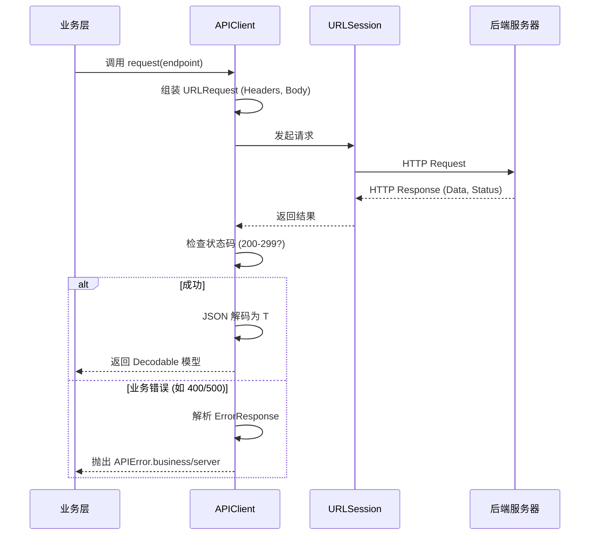
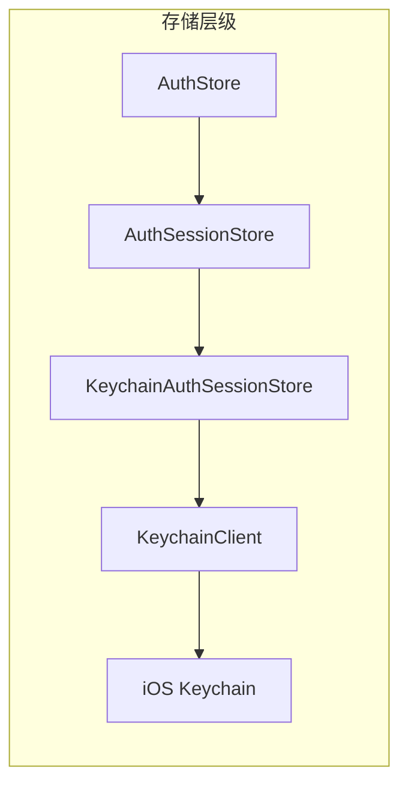
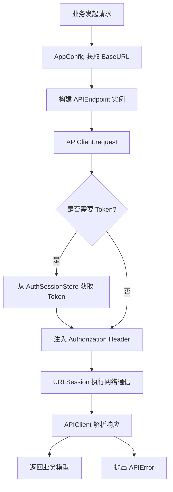
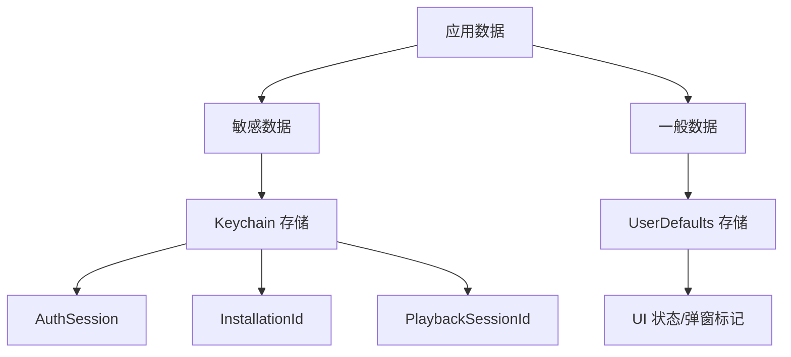

# iOS 基础能力与网络层封装逻辑

## 目录
1. [模块概览](#模块概览)
2. [引言](#引言)
3. [网络层封装逻辑](#网络层封装逻辑)
   - [APIClient 核心实现](#apiclient-核心实现)
   - [APIEndpoint 协议化请求](#apiendpoint-协议化请求)
   - [统一错误处理机制](#统一错误处理机制)
   - [响应拦截与业务错误解析](#响应拦截与业务错误解析)
4. [认证与持久化存储](#认证与持久化存储)
   - [KeychainClient 安全存储基石](#keychainclient-安全存储基石)
   - [AuthSessionStore 会话管理](#authsessionstore-会话管理)
   - [播放进度与安装 ID 存储](#播放进度与安装-id-存储)
5. [全局配置管理](#全局配置管理)
   - [AppConfig 环境隔离与元数据](#appconfig-环境隔离与元数据)
6. [架构设计与数据流](#架构设计与数据流)
   - [网络请求生命周期](#网络请求生命周期)
   - [存储层级结构](#存储层级结构)
7. [集成与最佳实践](#集成与最佳实践)
8. [文件引用](#文件引用)

## 模块概览

本模块负责 iOS 客户端的基础支撑能力，为上层业务提供稳定、安全且易用的底层接口。

- **文件总数**：共发现 8 个核心 Swift 文件。
- **子模块分布**：
  - `Network/`：包含 3 个文件，负责 RESTful 请求封装、协议定义及错误处理。
  - `Storage/`：包含 4 个文件，负责基于 Keychain 的安全存储和基于 UserDefaults 的普通配置存储。
  - `Config/`：包含 1 个文件，负责全局配置与环境管理。

本页面将深度解析网络层的 `APIClient` 设计、存储层的安全加密方案以及全局配置的读取机制。

## 引言

在移动应用开发中，底层基础设施的健壮性直接决定了应用的稳定性与安全性。iOS 端的底层能力主要由网络层、存储层和配置层组成。

网络层通过对 `URLSession` 的深度封装，实现了类型安全的异步请求模式，并通过协议化定义（`APIEndpoint`）极大降低了接口调用的复杂度。存储层则重点关注用户隐私与敏感数据的安全，通过对 iOS Keychain 的封装，确保了 `AuthSession`、`InstallationId` 等关键信息在设备层面的加密存储。配置层则作为全局的“真理来源”，管理着 API 地址、H5 页面路径等环境相关信息。

这些能力的有机结合，为 ShortDrama 应用提供了坚实的运行基础，使得开发者能够专注于业务功能的实现，而不必担心底层通信与存储的细节。

## 网络层封装逻辑

网络层是应用与服务器通信的桥梁。ShortDrama 采用了基于 `async/await` 的现代化 Swift 网络封装方案。

### APIClient 核心实现

`APIClient` 是网络请求的唯一入口，采用单例模式设计。它封装了 `URLSession` 的配置、JSON 解码策略以及请求的执行逻辑。

```swift
final class APIClient: @unchecked Sendable {
    static let shared = APIClient()
    private let session: URLSession
    private let baseURL: String
    private let decoder: JSONDecoder = {
        let decoder = JSONDecoder()
        decoder.keyDecodingStrategy = .convertFromSnakeCase
        return decoder
    }()

    private init() {
        let config = URLSessionConfiguration.default
        config.timeoutIntervalForRequest = 15
        self.session = URLSession(configuration: config)
        self.baseURL = AppConfig.apiBaseURL()
    }

    func request<T: Decodable>(_ endpoint: some APIEndpoint) async throws -> T {
        // 构建 URLComponents, 设置 Path 和 QueryItems
        // 构建 URLRequest, 设置 Method, Headers 和 Body
        // 调用 perform 执行请求
    }
}
```

其核心优势在于使用了 Swift 的泛型和协议系统，使得 `request` 方法能够自动推断返回类型，并利用 `JSONDecoder` 的 `convertFromSnakeCase` 策略自动处理模型字段的命名转换。

### APIEndpoint 协议化请求

为了避免在业务代码中硬编码 URL 字符串和请求参数，系统定义了 `APIEndpoint` 协议。每个具体的 API 请求都是一个遵循该协议的结构体。

```swift
protocol APIEndpoint {
    associatedtype Response: Decodable
    var path: String { get }
    var method: HTTPMethod { get }
    var queryItems: [URLQueryItem]? { get }
    var headers: [String: String] { get }
    var body: Encodable? { get }
}
```

这种设计实现了“请求即模型”，将请求的元数据（路径、方法、参数）与执行逻辑（`APIClient`）完全解耦。

### 统一错误处理机制

`APIError` 枚举定义了整个应用中可能出现的网络相关错误，包括无效 URL、网络连接失败、数据解析异常以及业务逻辑错误。

```swift
enum APIError: LocalizedError, Equatable {
    case invalidURL
    case decodingFailed(Error)
    case business(statusCode: Int, businessCode: String, message: String)
    case server(code: Int, message: String)
    case network(underlying: Error)
    // ...
}
```

通过遵循 `LocalizedError`，`APIError` 可以直接提供用户可读的错误描述，简化了 UI 层的错误展示逻辑。

### 响应拦截与业务错误解析

虽然代码中没有显式的 `Interceptor` 类，但 `APIClient` 的 `perform` 方法承担了响应拦截器的职责。它会检查 HTTP 状态码，并尝试将非 2xx 响应解析为业务错误模型。



在 `perform` 方法中，系统会根据状态码进行分支处理。例如，当状态码为 501 时，会映射为 `notImplemented` 错误；对于其他非成功状态码，会尝试解析后端返回的 `ErrorResponse` 结构，提取业务错误码（`businessCode`）和提示信息（`message`）。

**Section sources**:
- [APIClient.swift](ios/ShortDrama/Sources/Core/Network/APIClient.swift)
- [APIEndpoint.swift](ios/ShortDrama/Sources/Core/Network/APIEndpoint.swift)
- [APIError.swift](ios/ShortDrama/Sources/Core/Network/APIError.swift)

## 认证与持久化存储

存储层负责管理应用生命周期内的持久化数据，其核心原则是“按需加密”。

### KeychainClient 安全存储基石

对于敏感数据（如 Token、Session ID），系统使用 iOS Keychain 进行存储。`KeychainClient` 协议及其实现 `SystemKeychainClient` 封装了复杂的 `SecItem` 系列 C API。

```swift
protocol KeychainClient: Sendable {
    func read(service: String, account: String, accessGroup: String?) throws -> String?
    func write(value: String, service: String, account: String, accessGroup: String?) throws
    func delete(service: String, account: String, accessGroup: String?) throws
}
```

**加密方案说明**：
Keychain 存储的数据由系统层级进行加密，且在应用卸载后依然可以保留（取决于配置），这为实现“卸载重装后自动登录”或“唯一设备标识”提供了可能。`SystemKeychainClient` 使用 `kSecClassGenericPassword` 类别，确保数据以最高安全等级存储。

### AuthSessionStore 会话管理

`AuthSessionStore` 负责管理用户的登录会话（`AuthSession`）。其实现类 `KeychainAuthSessionStore` 将 `AuthSession` 模型序列化为 JSON 字符串后存入 Keychain。



当应用启动时，`AuthStore` 会通过 `load()` 方法尝试恢复会话。如果 Keychain 中的数据损坏或无法解析，系统会自动调用 `clear()` 清除异常数据，确保应用状态的一致性。

### 播放进度与安装 ID 存储

除了认证信息，系统还利用 Keychain 存储了两个关键的标识符：
1.  **InstallationId**：设备安装 ID，用于统计和风控。即使应用重装，该 ID 也能保持不变。
2.  **PlaybackSessionId**：播放会话 ID。虽然具体的视频播放进度（分钟/秒）存储在服务器端，但客户端会通过 `PlaybackSessionStore` 生成并持久化一个唯一的会话 ID，并在每次调用播放进度 API 时通过 `X-Playback-Session-Id` 请求头发送给后端。

对于非敏感的 UI 状态（如“签到弹窗是否已关闭”），系统则使用 `UserDefaultsCheckInPopupDismissStore` 进行存储，以平衡性能与开发便捷性。

**Section sources**:
- [KeychainClient.swift](ios/ShortDrama/Sources/Core/Storage/PlaybackSessionStore.swift)
- [AuthSessionStore.swift](ios/ShortDrama/Sources/Core/Storage/AuthSessionStore.swift)
- [InstallationIdStore.swift](ios/ShortDrama/Sources/Core/Storage/InstallationIdStore.swift)

## 全局配置管理

`AppConfig` 是应用配置的中心化管理类，它通过读取 `Info.plist` 中的注入值来实现环境隔离。

### AppConfig 环境隔离与元数据

在 iOS 项目中，通常会根据 Debug、Release 等不同的 Build Configuration 注入不同的 `API_BASE_URL`。`AppConfig` 提供了静态方法来统一访问这些值。

```swift
enum AppConfig {
    static func apiBaseURL(bundle: Bundle = .main) -> String {
        bundle.infoDictionary?["API_BASE_URL"] as? String ?? ""
    }
    
    static func appVersion(bundle: Bundle = .main) -> String {
        bundle.infoDictionary?["CFBundleShortVersionString"] as? String ?? ""
    }
    // ...
}
```

这种方式的优点在于：
- **编译期解耦**：业务代码不需要知道当前是开发环境还是生产环境，只需调用 `AppConfig.apiBaseURL()`。
- **易于测试**：通过注入自定义的 `Bundle`，可以轻松对配置读取逻辑进行单元测试。

**Section sources**:
- [AppConfig.swift](ios/ShortDrama/Sources/Core/Config/AppConfig.swift)

## 架构设计与数据流

本节展示各底层组件如何协同工作，完成一个典型的业务流程。

### 网络请求生命周期

当一个业务请求发起时，它会经历从配置读取到数据持久化的完整链路。



在上述流程中，`APIClient` 充当了协调者的角色，它整合了配置（`AppConfig`）、请求定义（`APIEndpoint`）和错误处理逻辑。

### 存储层级结构

系统采用了分层存储架构，根据数据的敏感程度选择不同的存储介质。



这种分层设计既保证了核心数据的安全性（Keychain 加密），又兼顾了普通配置的读写效率（UserDefaults）。

## 集成与最佳实践

在开发新功能或接入新接口时，应遵循以下最佳实践：

1.  **定义 Endpoint**：为每个 API 创建独立的结构体，并明确指定 `Response` 类型。
2.  **使用异步接口**：优先使用 `async/await` 版本的 `request` 方法，避免回调地狱。
3.  **错误处理**：在 UI 层捕获 `APIError`，并利用其 `errorDescription` 展示友好的提示。
4.  **安全存储**：任何涉及用户身份、令牌或设备唯一标识的数据，必须通过 `KeychainClient` 存储。
5.  **配置注入**：不要在代码中硬编码任何 URL 或第三方 Key，应统一在 `Info.plist` 中配置并通过 `AppConfig` 访问。

## 文件引用

以下是本模块涉及的核心源文件：

- [ios/ShortDrama/Sources/Core/Network/APIClient.swift](ios/ShortDrama/Sources/Core/Network/APIClient.swift)：网络请求核心引擎。
- [ios/ShortDrama/Sources/Core/Network/APIEndpoint.swift](ios/ShortDrama/Sources/Core/Network/APIEndpoint.swift)：请求协议定义。
- [ios/ShortDrama/Sources/Core/Network/APIError.swift](ios/ShortDrama/Sources/Core/Network/APIError.swift)：统一错误模型。
- [ios/ShortDrama/Sources/Core/Storage/AuthSessionStore.swift](ios/ShortDrama/Sources/Core/Storage/AuthSessionStore.swift)：认证会话接口。
- [ios/ShortDrama/Sources/Core/Storage/KeychainAuthSessionStore.swift](ios/ShortDrama/Sources/Core/Storage/KeychainAuthSessionStore.swift)：认证会话 Keychain 实现。
- [ios/ShortDrama/Sources/Core/Storage/PlaybackSessionStore.swift](ios/ShortDrama/Sources/Core/Storage/PlaybackSessionStore.swift)：播放会话管理及 Keychain 客户端。
- [ios/ShortDrama/Sources/Core/Storage/InstallationIdStore.swift](ios/ShortDrama/Sources/Core/Storage/InstallationIdStore.swift)：安装 ID 存储。
- [ios/ShortDrama/Sources/Core/Config/AppConfig.swift](ios/ShortDrama/Sources/Core/Config/AppConfig.swift)：全局配置管理。
