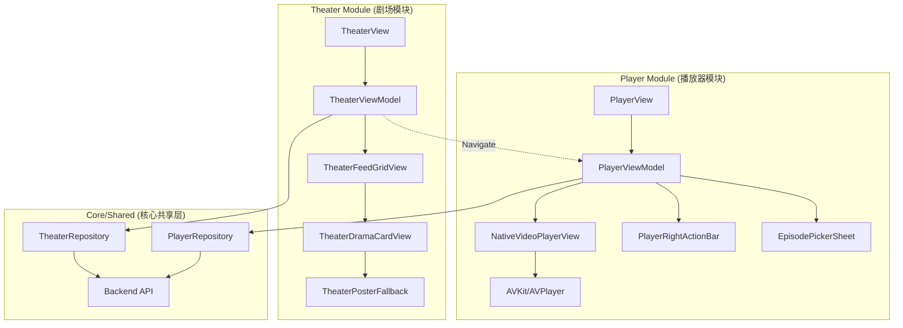
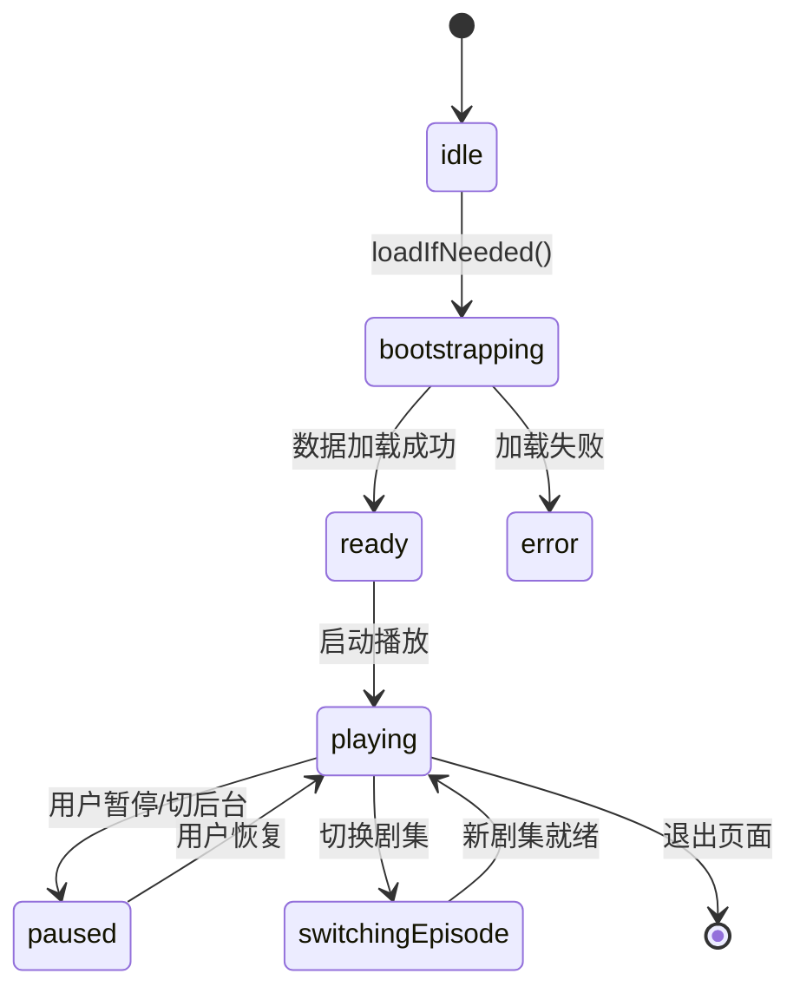
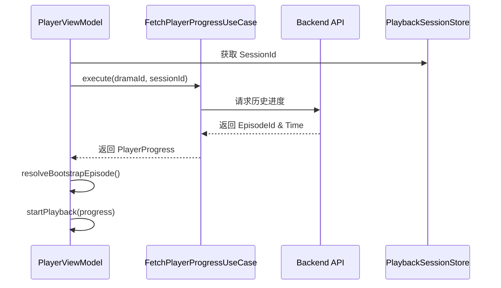
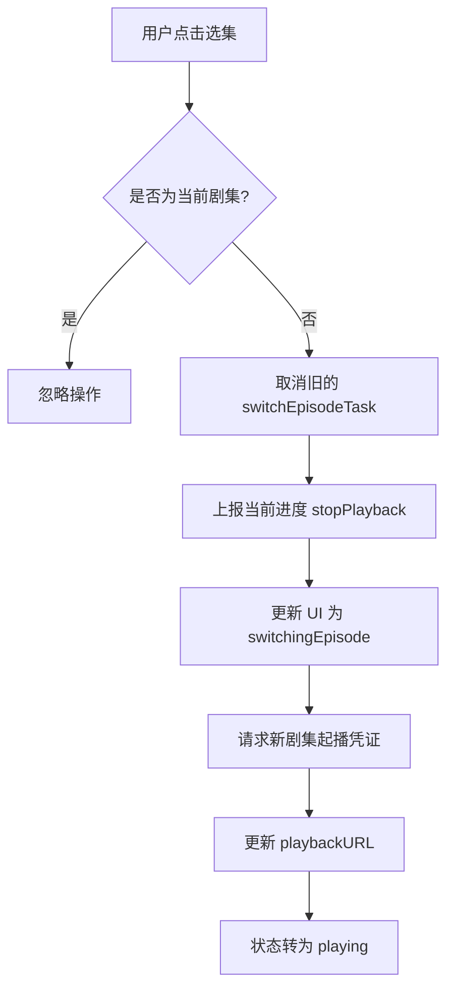
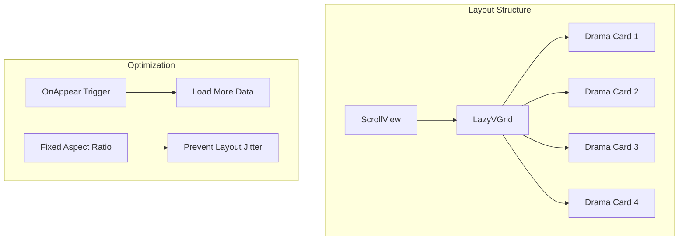
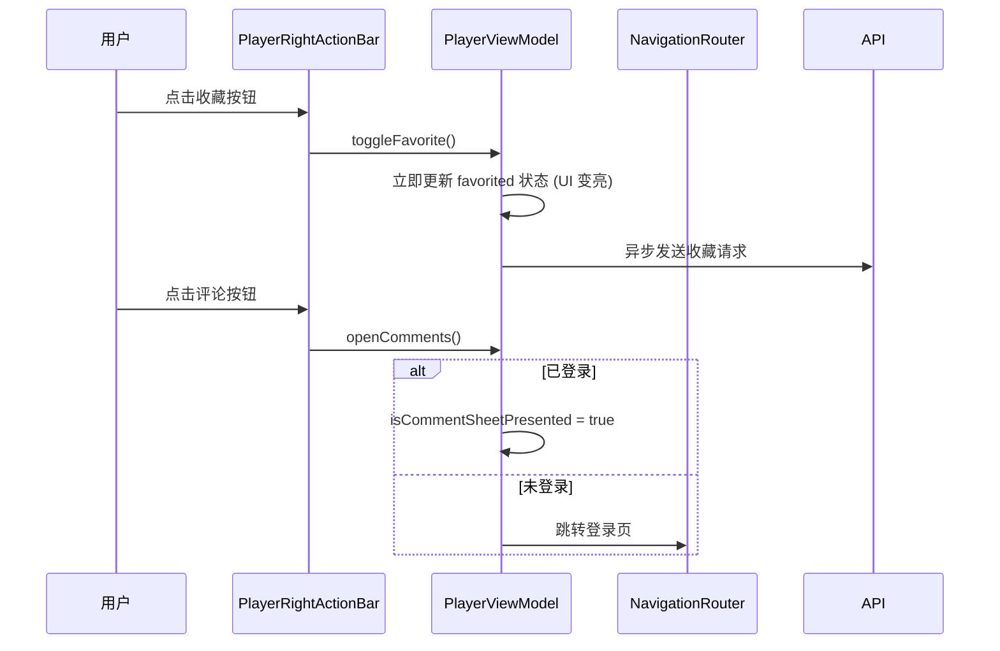

# 核心功能：沉浸式播放器与剧场流实现

## 目录
1. [模块概览](#模块概览)
2. [架构设计](#架构设计)
3. [沉浸式播放器实现](#沉浸式播放器实现)
   - [AVKit 封装与视频渲染](#avkit-封装与视频渲染)
   - [播放器状态机管理](#播放器状态机管理)
   - [播放进度同步逻辑](#播放进度同步逻辑)
   - [选集与剧集切换流程](#选集与剧集切换流程)
4. [剧场瀑布流实现](#剧场瀑布流实现)
   - [数据管理与分页加载](#数据管理与分页加载)
   - [LazyVGrid 布局与性能优化](#lazyvgrid-布局与性能优化)
   - [剧目卡片精细化渲染](#剧目卡片精细化渲染)
   - [海报兜底与视觉一致性](#海报兜底与视觉一致性)
5. [交互逻辑与操作栏](#交互逻辑与操作栏)
6. [状态管理与 Combine 应用](#状态管理与-combine-应用)
7. [性能优化技巧](#性能优化技巧)
   - [并发任务生命周期管理](#并发任务生命周期管理)
   - [UI 渲染优化与防抖](#ui-渲染优化与防抖)
8. [文件参考](#文件参考)

## 模块概览

在 ShortDrama 项目中，播放器（Player）与剧场（Theater）是两个最核心的业务模块。播放器模块负责提供沉浸式的短剧观看体验，其核心在于视频渲染的流畅性与状态管理的严谨性；而剧场模块则负责海量内容的展示与分发，其核心在于瀑布流的加载性能与视觉呈现的多样性。

本章节详细解析了 `ios/ShortDrama/Sources/Features/Player/` 和 `ios/ShortDrama/Sources/Features/Theater/` 目录下的核心实现，涵盖了约 20 个 Swift 文件。

- **子模块划分**:
  - **Player**: 包含播放器视图（`PlayerView`）、状态管理（`PlayerViewModel`）、底层渲染（`NativeVideoPlayerView`）及交互组件（右侧操作栏、选集面板）。
  - **Theater**: 包含剧场主页（`TheaterView`）、频道切换（`TheaterChannelTabBar`）、瀑布流展示（`TheaterFeedGridView`）及精细化的卡片渲染（`TheaterDramaCardView`）。
- **覆盖范围**: 深度解析 `PlayerViewModel` 的复杂状态机、`NativeVideoPlayerView` 对 `AVKit` 的底层封装、`TheaterViewModel` 的防竞态分页机制以及剧场卡片的视觉补偿逻辑。

## 架构设计

ShortDrama 的核心业务架构遵循严格的 MVVM 模式。播放器与剧场模块通过 `NavigationRouter` 进行解耦跳转，同时共享底层的 Repository 层进行数据获取。

下面的图表展示了播放器与剧场模块的组件关系及数据流向：



**图表说明**：
该架构图展示了两个核心模块的内部层级。在播放器模块中，`PlayerViewModel` 作为中枢，驱动 `NativeVideoPlayerView` 进行视频渲染，并同步管理 `PlayerRightActionBar` 和 `EpisodePickerSheet` 的交互。在剧场模块中，`TheaterViewModel` 负责从 `TheaterRepository` 获取分页数据并驱动 `TheaterFeedGridView` 进行列表渲染。模块间通过路由机制（虚线所示）实现从剧场卡片到播放器的无缝跳转。

**Diagram sources**: 
- [PlayerViewModel.swift](ios/ShortDrama/Sources/Features/Player/ViewModels/PlayerViewModel.swift)
- [TheaterViewModel.swift](ios/ShortDrama/Sources/Features/Theater/ViewModels/TheaterViewModel.swift)
- [TheaterFeedGridView.swift](ios/ShortDrama/Sources/Features/Theater/Views/TheaterFeedGridView.swift)

## 沉浸式播放器实现

播放器是短剧应用的核心，其实现的稳定性直接决定了用户的观看时长。

### AVKit 封装与视频渲染

`NativeVideoPlayerView` 是对苹果 `AVKit` 框架的深度封装。它没有简单地使用 SwiftUI 的 `VideoPlayer`，而是通过直接操作 `AVPlayer` 实现了更精细的控制。

```swift
struct NativeVideoPlayerView: View {
    let url: URL?
    let playbackRate: Float
    
    @State private var player = AVPlayer()
    
    var body: some View {
        VideoPlayer(player: player)
            .onAppear { configurePlayer() }
            .onChange(of: url) { _, _ in configurePlayer() }
            .onChange(of: playbackRate) { _, newValue in
                if player.currentItem != nil { player.rate = newValue }
            }
            // ...
    }
}
```

**核心职责解析**：
1. **渲染控制**: 通过 `configurePlayer` 方法，在 URL 变化时动态替换 `AVPlayerItem`。
2. **进度追踪**: 利用 `addPeriodicTimeObserver` 以 1 秒为粒度捕获播放进度，并通过 `onProgressChange` 回调通知 ViewModel。
3. **状态监听**: 注册 `NotificationCenter` 监听播放结束（`AVPlayerItemDidPlayToEndTime`）和播放失败（`AVPlayerItemFailedToPlayToEndTime`）事件。
4. **资源释放**: 在 `onDisappear` 中显式调用 `player.pause()` 并移除所有观察者，防止内存泄漏。

### 播放器状态机管理

`PlayerViewModel` 采用状态机模式来管理播放器的各种生命周期状态，确保 UI 逻辑的严密性。



**状态说明**：
- `bootstrapping`: 关键的引导状态，此时会并行获取剧集列表、历史进度和起播凭证。
- `switchingEpisode`: 切换剧集时的中间态，用于清理旧的播放会话并初始化新会话。
- `error`: 包含错误信息的关联状态，用于触发 UI 层的错误提示和重试按钮。

### 播放进度同步逻辑

进度同步涉及本地 UI 更新与远端数据上报。`PlayerViewModel` 在初始化时会通过 `FetchPlayerProgressUseCase` 获取上次观看的进度。



**流程解析**：
引导加载流程首先从 `PlaybackSessionStore`（通常是 Keychain）获取当前会话 ID，然后向后端请求历史记录。如果存在历史记录且对应的剧集在当前剧集列表中，播放器将自动定位到该位置；否则从第一集起播。

### 选集与剧集切换流程

切换剧集是一个高频且敏感的操作。`PlayerViewModel` 通过 `switchEpisodeTask` 管理切换任务的生命周期。



**逻辑重点**：
- **防抖处理**: 通过取消旧任务，防止用户快速连续点击导致多次起播请求重叠。
- **数据一致性**: 在切换前强制执行一次 `stopPlayback`，确保每一集的观看时长都能准确记录。

**Section sources**:
- [NativeVideoPlayerView.swift](ios/ShortDrama/Sources/Features/Player/Views/Components/NativeVideoPlayerView.swift)
- [PlayerViewModel.swift](ios/ShortDrama/Sources/Features/Player/ViewModels/PlayerViewModel.swift)
- [PlayerViewModelTypes.swift](ios/ShortDrama/Sources/Features/Player/ViewModels/PlayerViewModelTypes.swift)

## 剧场瀑布流实现

剧场模块是内容曝光的门户，其核心在于如何高效地展示海量剧目卡片。

### 数据管理与分页加载

`TheaterViewModel` 负责处理频道切换和无限滚动逻辑。为了应对复杂的网络环境，它引入了 `requestToken` 机制来解决异步回调的竞态问题。

```swift
private var requestToken = UUID()

private func reloadFirstPage(for channel: TheaterChannel) async {
    requestToken = UUID()
    let token = requestToken
    // ... 发起请求
    do {
        let response = try await fetchTheaterFeedUseCase.execute(...)
        guard token == requestToken else { return } // 校验 Token 是否过期
        // ... 更新 viewState
    } catch {
        guard token == requestToken else { return }
        // ... 处理错误
    }
}
```

**机制说明**：
当用户快速切换频道时，多个 `reloadFirstPage` 任务会并发执行。通过在每个任务开始前生成唯一的 `UUID`，并在回调中校验，可以确保只有最后一次操作的结果会被渲染到 UI 上，避免了界面闪烁或数据错乱。

### LazyVGrid 布局与性能优化

`TheaterFeedGridView` 采用了两列瀑布流设计，利用 SwiftUI 的 `LazyVGrid` 实现高效渲染。



**优化细节**：
- **视口外剔除**: `LazyVGrid` 自动处理视口外组件的销毁与重建，保持内存占用在合理范围。
- **预加载策略**: 在 `ForEach` 的最后一个元素上挂载 `.onAppear` 回调，触发 `loadMoreIfNeeded`。这种方式比监听滚动偏移量更简单且性能更优。
- **布局稳定性**: 为海报容器设置固定的宽高比（0.735），避免图片加载前后的高度塌陷导致的列表跳动。

### 剧目卡片精细化渲染

`TheaterDramaCardView` 是剧场中最复杂的视图组件，它集成了多种视觉元素：
- **热度标签**: 显示“千万热度”等格式化后的数据。
- **角标系统**: 根据剧目属性显示“新剧”、“红果首发”等不同样式的线性渐变角标。
- **奖励标识**: 针对带有金币奖励的剧目，渲染复杂的 `coinOverlayView`（包含旋转动画和径向渐变）。

### 海报兜底与视觉一致性

由于后端配置的封面图可能存在延迟或格式问题，`TheaterPosterFallback` 提供了一套视觉补偿方案：
1. **关键词匹配**: 扫描剧名中的敏感词（如“逆袭”、“豪门”），匹配最贴合风格的本地预置海报。
2. **索引轮询**: 如果无关键词匹配，则根据卡片在列表中的索引循环分配本地海报。
这确保了即使在弱网或测试数据环境下，剧场界面依然能保持高水准的视觉呈现。

**Section sources**:
- [TheaterViewModel.swift](ios/ShortDrama/Sources/Features/Theater/ViewModels/TheaterViewModel.swift)
- [TheaterFeedGridView.swift](ios/ShortDrama/Sources/Features/Theater/Views/TheaterFeedGridView.swift)
- [TheaterDramaCardView.swift](ios/ShortDrama/Sources/Features/Theater/Views/TheaterDramaCardView.swift)
- [TheaterPosterFallback.swift](ios/ShortDrama/Sources/Features/Theater/Models/TheaterPosterFallback.swift)

## 交互逻辑与操作栏

播放器右侧的操作栏（`PlayerRightActionBar`）是用户互动的核心区域。它采用了垂直堆叠设计，并对每个按钮进行了精细的样式定制。



**交互策略解析**：
- **乐观更新 (Optimistic UI)**: 点赞和收藏操作优先更新本地 UI 状态，随后在后台静默同步服务端数据。如果请求失败，再进行回滚或提示。
- **登录拦截**: 对于评论等社交属性较强的操作，ViewModel 会拦截点击并触发 `routeEffect` 跳转登录，确保业务流程的合规性。

**Section sources**:
- [PlayerRightActionBar.swift](ios/ShortDrama/Sources/Features/Player/Views/Components/PlayerRightActionBar.swift)
- [PlayerViewModel.swift](ios/ShortDrama/Sources/Features/Player/ViewModels/PlayerViewModel.swift)

## 状态管理与 Combine 应用

ShortDrama 广泛使用 Combine 框架来实现 ViewModel 与 View 之间的响应式绑定。

在 `PlayerViewModel` 中，状态更新的链路如下：
1. **输入**: 用户点击、播放器通知、网络回调。
2. **处理**: ViewModel 内部的 `Task` 或 `Publisher` 处理逻辑。
3. **输出**: 通过 `@Published` 属性通知 SwiftUI 重新渲染受影响的局部视图。

```swift
// 示例：监听进度并自动触发任务上报
$currentProgress
    .throttle(for: 5, scheduler: RunLoop.main, latest: true)
    .sink { [weak self] progress in
        self?.reportProgressToBackend(progress)
    }
    .store(in: &cancellables)
```

这种模式极大地简化了复杂状态下的 UI 同步工作，减少了手动调用 `objectWillChange.send()` 的需求。

**Section sources**:
- [PlayerViewModel.swift](ios/ShortDrama/Sources/Features/Player/ViewModels/PlayerViewModel.swift)
- [TheaterViewModel.swift](ios/ShortDrama/Sources/Features/Theater/ViewModels/TheaterViewModel.swift)

## 性能优化技巧

### 并发任务生命周期管理

在 Swift Concurrency 中，`Task` 的生命周期管理至关重要。`PlayerViewModel` 展示了如何通过显式取消来优化性能：

```swift
private var bootstrapTask: Task<Void, Never>?

private func bootstrap() async {
    bootstrapTask?.cancel() // 关键：取消之前的引导任务
    bootstrapTask = Task { [weak self] in
        guard let self else { return }
        await self.performBootstrap()
    }
    await bootstrapTask?.value
}
```

这种模式确保了在用户频繁进出页面或快速切换剧集时，不会有多个重复的初始化任务在后台竞争资源。

### UI 渲染优化与防抖

1. **视图拆分**: 将 `PlayerView` 拆分为多个细粒度组件。SwiftUI 的差异化算法可以只重绘进度条（`PlayerEpisodeDock`）而不触及顶部的标题栏（`PlayerTopBar`）。
2. **图片异步化**: `TheaterDramaCardView` 使用 `AsyncImage` 配合自定义的 `placeholder` 和 `fallback` 系统，确保海报加载不会阻塞主线程滑动。
3. **数据防抖**: 在分页加载时，通过 `isAppending` 标志位防止重复触发 `loadMore` 请求。

**Section sources**:
- [PlayerViewModel.swift](ios/ShortDrama/Sources/Features/Player/ViewModels/PlayerViewModel.swift)
- [TheaterDramaCardView.swift](ios/ShortDrama/Sources/Features/Theater/Views/TheaterDramaCardView.swift)

## 文件参考

以下是本页面涉及的核心源文件：

| 文件路径 | 核心职责 |
| :--- | :--- |
| `ios/ShortDrama/Sources/Features/Player/ViewModels/PlayerViewModel.swift` | 播放器核心逻辑、状态机与任务管理 |
| `ios/ShortDrama/Sources/Features/Player/Views/Components/NativeVideoPlayerView.swift` | 基于 AVKit 的视频渲染与事件封装 |
| `ios/ShortDrama/Sources/Features/Player/Views/PlayerView.swift` | 播放器主容器视图与布局编排 |
| `ios/ShortDrama/Sources/Features/Player/Views/Components/PlayerRightActionBar.swift` | 右侧交互操作栏实现 |
| `ios/ShortDrama/Sources/Features/Theater/ViewModels/TheaterViewModel.swift` | 剧场频道管理、分页逻辑与竞态处理 |
| `ios/ShortDrama/Sources/Features/Theater/Views/TheaterFeedGridView.swift` | 瀑布流列表渲染与预加载触发 |
| `ios/ShortDrama/Sources/Features/Theater/Views/TheaterDramaCardView.swift` | 剧目卡片精细化渲染逻辑 |
| `ios/ShortDrama/Sources/Features/Theater/Models/TheaterPosterFallback.swift` | 海报视觉补偿与兜底策略 |
| `ios/ShortDrama/Sources/Features/Player/ViewModels/PlayerViewModelTypes.swift` | 播放器状态枚举与倍速定义 |
| `ios/ShortDrama/Sources/Features/Theater/Models/TheaterCardDisplayStyle.swift` | 剧场卡片视觉样式定义 |
| `ios/ShortDrama/Sources/Features/Player/Views/Components/EpisodePickerSheet.swift` | 选集面板交互实现 |
| `ios/ShortDrama/Sources/Features/Theater/Views/TheaterChannelTabBar.swift` | 剧场频道切换组件 |
