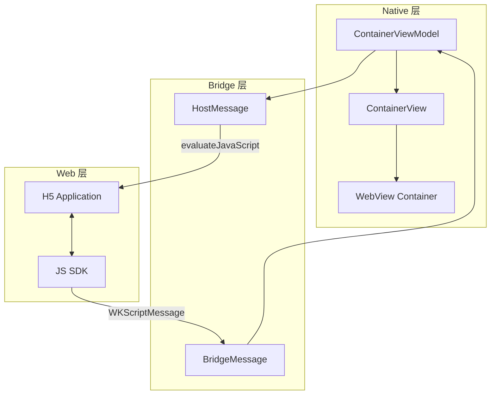
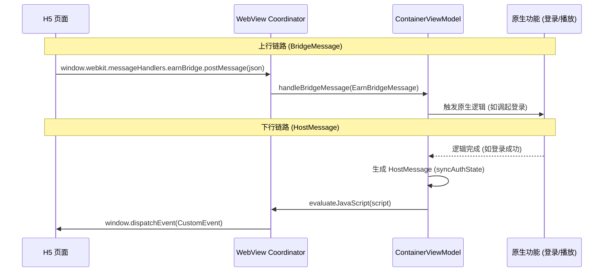
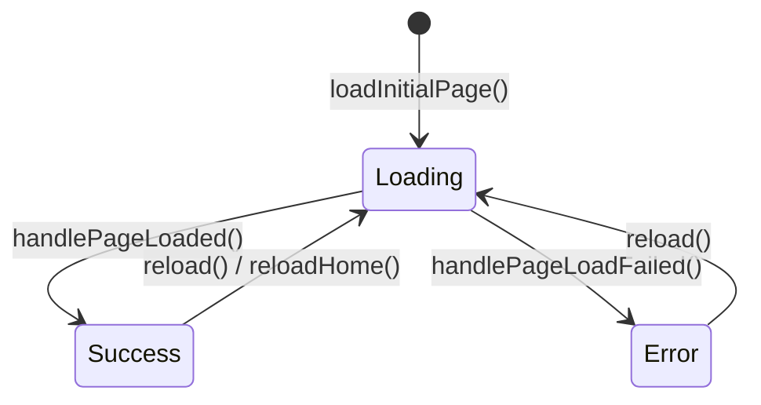
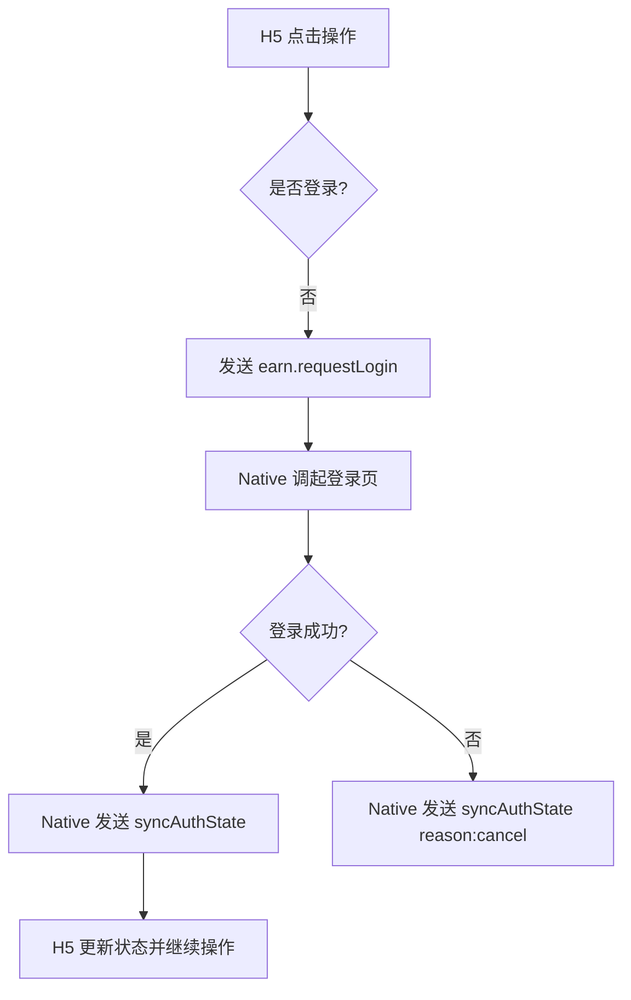
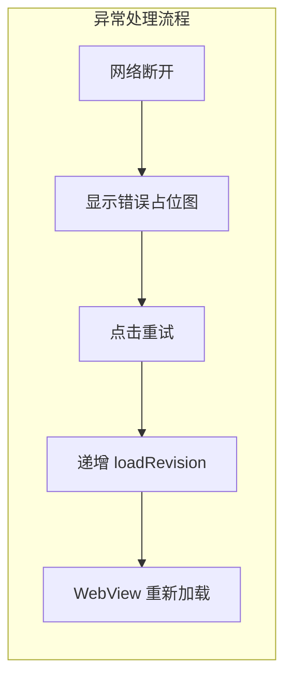

# 混合业务与 JSBridge 通信实现

## 目录
1. [模块概览](#模块概览)
2. [混合架构设计](#混合架构设计)
   - [容器分层职责](#容器分层职责)
   - [通信链路拓扑](#通信链路拓扑)
3. [核心组件实现](#核心组件实现)
   - [WebView 容器封装](#webview-容器封装)
   - [容器状态管理](#容器状态管理)
4. [JSBridge 通信协议](#jsbridge-通信协议)
   - [Web 到 Native 消息 (BridgeMessage)](#web-到-native-消息-bridgemessage)
   - [Native 到 Web 消息 (HostMessage)](#native-到-web-消息-hostmessage)
5. [业务逻辑集成](#业务逻辑集成)
   - [登录拦截与鉴权同步](#登录拦截与鉴权同步)
   - [任务系统集成](#任务系统集成)
   - [上下文恢复机制](#上下文恢复机制)
6. [异常处理与用户体验](#异常处理与用户体验)
7. [关键文件参考](#关键文件参考)

## 模块概览

本模块负责短剧应用中“赚币”（Earn）和“商城”（Mall）两个核心 H5 业务的 iOS 端集成。通过深度定制的 WebView 容器和高效的 JSBridge 通信协议，实现了 H5 页面与 Native 原生能力（如登录、视频播放、支付等）的无缝衔接。

**模块规模评估**：
- **总文件数**：13 个 Swift 文件
- **覆盖目录**：
  - `ios/ShortDrama/Sources/Features/Earn/`：赚币业务逻辑与视图（7 个文件）
  - `ios/ShortDrama/Sources/Features/Mall/`：商城业务逻辑与视图（6 个文件）
- **核心职责**：
  - 提供统一的 WebView 容器，支持 UserAgent 定制和 Cookie 同步。
  - 定义双向通信协议，支持 Web 调用 Native 功能及 Native 向 Web 推送状态更新。
  - 管理 H5 页面的生命周期，处理加载、失败、重试及页面间的上下文恢复。

本章节将深入探讨其架构设计、通信协议及核心业务逻辑的实现细节。

## 混合架构设计

混合业务架构采用了典型的“容器-模型-视图模型”（Container-Model-ViewModel）模式，确保了 Web 环境与 Native 环境的解耦。

### 容器分层职责

在 iOS 端，WebView 不仅仅是一个显示组件，它扮演着 Native 能力代理的角色。



如上图所示，架构分为三个主要层次。**Web 层**运行 H5 应用程序，通过 JS SDK 与 Native 交互。**Bridge 层**定义了标准的消息格式，`BridgeMessage` 负责解析 Web 发来的请求，`HostMessage` 负责封装 Native 发出的指令。**Native 层**则包含 `ViewModel` 和 `View`，负责处理业务逻辑（如登录拦截）和渲染 UI 状态。这种分层设计使得 Web 开发人员无需关心 Native 的具体实现，只需遵循预定义的协议即可。

### 通信链路拓扑

通信链路分为“上行”（Web to Native）和“下行”（Native to Web）两条路径。



通信链路的闭环由 `WKUserContentController` 和 `evaluateJavaScript` 共同完成。当 H5 需要调用原生能力时，通过 `postMessage` 发送 JSON 载荷，由 `Coordinator` 拦截并转换为强类型的 `BridgeMessage`。反之，当 Native 状态发生变化（如用户完成登录或完成视频任务）时，`ViewModel` 会生成对应的 `HostMessage`，通过注入 JavaScript 代码触发 H5 侧的 `CustomEvent`。

**Section sources**:
- [EarnWebView.swift](ios/ShortDrama/Sources/Features/Earn/Views/Components/EarnWebView.swift)
- [EarnContainerViewModel.swift](ios/ShortDrama/Sources/Features/Earn/ViewModels/EarnContainerViewModel.swift)

## 核心组件实现

### WebView 容器封装

`EarnWebView` 和 `MallWebView` 是基于 `UIViewRepresentable` 封装的 `WKWebView`。它们不仅负责加载网页，还集成了 Bridge 通道的初始化和生命周期管理。

```swift
// ios/ShortDrama/Sources/Features/Earn/Views/Components/EarnWebView.swift

struct EarnWebView: UIViewRepresentable {
    let request: URLRequest
    let loadRevision: Int
    let hostMessage: EarnHostMessage?
    let onBridgeMessage: (EarnBridgeMessage) -> Void

    func makeUIView(context: Context) -> WKWebView {
        let configuration = WKWebViewConfiguration()
        // 注册 Bridge 通道
        configuration.userContentController.add(context.coordinator, name: Coordinator.bridgeChannel)
        
        let webView = WKWebView(frame: .zero, configuration: configuration)
        webView.navigationDelegate = context.coordinator
        webView.load(request)
        return webView
    }

    func updateUIView(_ webView: WKWebView, context: Context) {
        // 处理 Native 向 Web 发送的消息
        if let hostMessage {
            webView.evaluateJavaScript(hostMessage.script)
        }
    }
}
```

容器的一个关键设计是 `loadRevision`。当 `ViewModel` 需要强制刷新 WebView 时（例如在登录状态发生重大变更后），会递增该计数器，触发 `updateUIView` 中的重新加载逻辑。此外，`Coordinator` 作为 `WKScriptMessageHandler`，负责将非结构化的 `message.body` 转换为业务层的 `EarnBridgeMessage` 模型。

### 容器状态管理

容器的状态由 `EarnContainerState` 枚举定义，涵盖了 `loading`、`success` 和 `error` 三种典型场景。



状态流转逻辑实现在 `EarnContainerViewModel` 中。当页面开始加载时，状态切换为 `loading`；`WKNavigationDelegate` 回调 `didFinish` 时切换为 `success`；若发生网络错误或超时，则切换为 `error` 并携带错误信息。这种清晰的状态机设计确保了 UI 层（`EarnContainerStateView`）能够根据当前状态渲染正确的占位图或错误重试界面。

**Section sources**:
- [EarnWebView.swift](ios/ShortDrama/Sources/Features/Earn/Views/Components/EarnWebView.swift)
- [EarnContainerState.swift](ios/ShortDrama/Sources/Features/Earn/Models/EarnContainerState.swift)
- [EarnContainerViewModel.swift](ios/ShortDrama/Sources/Features/Earn/ViewModels/EarnContainerViewModel.swift)

## JSBridge 通信协议

通信协议是混合架构的核心灵魂。为了保证灵活性和可扩展性，协议采用了基于 JSON 的消息格式。

### Web 到 Native 消息 (BridgeMessage)

Web 端通过统一的 `postMessage` 接口发送消息。每个消息包含 `type` 和 `payload` 两个核心字段。

**JSON 示例 (赚币业务请求登录)**：
```json
{
  "type": "earn.requestLogin",
  "payload": {
    "source": "earn",
    "returnTarget": "/earn"
  }
}
```

在 Swift 端，`EarnBridgeMessage` 使用枚举关联值来承载这些载荷：

```swift
enum EarnBridgeMessage: Equatable, Sendable {
    case requestLogin(EarnLoginContext)
    case openTaskPlayer(EarnTaskContext)

    init?(body: Any) {
        guard let dictionary = body as? [String: Any],
              let type = dictionary["type"] as? String,
              let payload = dictionary["payload"] as? [String: Any] else {
            return nil
        }
        // 根据 type 解析 payload 并构造枚举实例
        // ...
    }
}
```

### Native 到 Web 消息 (HostMessage)

Native 向 Web 发送消息时，通过 `evaluateJavaScript` 派发一个自定义事件（`CustomEvent`）。Web 端只需监听对应的事件名即可获取数据。

**JSON 示例 (同步登录态)**：
```json
{
  "type": "earn.syncAuthState",
  "payload": {
    "isLoggedIn": true,
    "apiAccessToken": "ey...",
    "reason": "login-success",
    "returnTarget": "/earn"
  }
}
```

`EarnHostMessage` 负责生成执行脚本：
```swift
var script: String {
    let payload: [String: Any] = [
        "type": "earn.syncAuthState",
        "payload": authState.jsonObject
    ]
    return "window.dispatchEvent(new CustomEvent('earn.hostMessage', { detail: \(payload.jsonString) }));"
}
```

这种基于事件的机制相比于直接调用 JS 函数，具有更好的容错性——即使 JS 侧尚未准备好监听器，也不会导致脚本执行报错。

**Section sources**:
- [EarnBridgeMessage.swift](ios/ShortDrama/Sources/Features/Earn/Models/EarnBridgeMessage.swift)
- [EarnHostMessage.swift](ios/ShortDrama/Sources/Features/Earn/Models/EarnHostMessage.swift)
- [MallBridgeMessage.swift](ios/ShortDrama/Sources/Features/Mall/Models/MallBridgeMessage.swift)

## 业务逻辑集成

### 登录拦截与鉴权同步

混合业务中最复杂的逻辑之一是登录态的同步。当 H5 页面检测到用户未登录且需要执行敏感操作时，会通过 `requestLogin` 消息请求 Native 调起登录。



在 `EarnContainerViewModel` 中，`handleLoginSuccess` 会被调用，随后它会构造一个 `syncAuthState` 消息发送给 WebView。这个消息包含了最新的 `apiAccessToken`，H5 收到后会将其存入本地存储或 Cookie，从而实现无缝的登录态衔接。

### 任务系统集成

“赚币”业务包含看视频领奖励的任务。当用户点击 H5 上的任务时，Native 会拦截 `openTaskPlayer` 消息并打开原生的视频播放器。

1. **触发任务**：Web 发送 `earn.openTaskPlayer`，包含 `taskId` 和 `videoId`。
2. **执行任务**：Native 切换到播放器界面，用户观看视频。
3. **完成反馈**：播放器关闭后，ViewModel 调用 `handleTaskPlayerResult`。
4. **状态回传**：通过 `completeTask` 消息将任务完成结果告知 H5。

### 上下文恢复机制

当用户从 H5 跳转到原生页面（如登录、播放器）再返回时，为了保证用户体验，需要恢复 H5 的上下文。

```swift
private func restoreContext(reason: EarnRestoreContextReason, preserveScroll: Bool) {
    hostMessage = .restoreContext(
        EarnRestoreContextPayload(
            source: "earn",
            reason: reason,
            returnTarget: "/earn",
            preserveScroll: preserveScroll
        )
    )
}
```

`restoreContext` 消息会告知 H5 页面它是从哪个场景返回的（`loginReturn` 或 `taskReturn`），以及是否应该保持之前的滚动位置。这对于长列表页面的体验至关重要，避免了用户返回后页面重新加载导致的位置丢失。

**Section sources**:
- [EarnContainerViewModel.swift](ios/ShortDrama/Sources/Features/Earn/ViewModels/EarnContainerViewModel.swift)
- [MallContainerViewModel.swift](ios/ShortDrama/Sources/Features/Mall/ViewModels/MallContainerViewModel.swift)

## 异常处理与用户体验

为了应对复杂的网络环境，容器内置了完善的异常处理机制。

1. **加载超时与重试**：如果页面在规定时间内未加载完成，`EarnContainerStateView` 会显示错误界面。用户点击“重试”按钮会触发 `reload()`，这会递增 `loadRevision` 并重新发起请求。
2. **UserAgent 标识**：在 `WKWebViewConfiguration` 中，通常会追加特定的字符串（如 `ShortDrama/1.0.0`），以便 H5 侧识别当前处于原生 App 环境，从而启用 JSBridge 逻辑。
3. **登录占位图**：对于必须登录才能访问的 H5 区域，`EarnLoginPlaceholderView` 提供了一个原生的引导登录界面，避免了 H5 侧复杂的未登录态处理逻辑。



这种原生级别的异常处理，使得 H5 业务在表现上更接近原生页面，提升了整体应用的品质感。

**Section sources**:
- [EarnContainerStateView.swift](ios/ShortDrama/Sources/Features/Earn/Views/Components/EarnContainerStateView.swift)
- [EarnLoginPlaceholderView.swift](ios/ShortDrama/Sources/Features/Earn/Views/EarnLoginPlaceholderView.swift)

## 关键文件参考

以下是实现混合业务与 JSBridge 通信的关键源文件：

- `ios/ShortDrama/Sources/Features/Earn/Views/Components/EarnWebView.swift`：赚币 WebView 容器实现。
- `ios/ShortDrama/Sources/Features/Earn/Models/EarnBridgeMessage.swift`：赚币 Web-to-Native 协议定义。
- `ios/ShortDrama/Sources/Features/Earn/Models/EarnHostMessage.swift`：赚币 Native-to-Web 协议定义。
- `ios/ShortDrama/Sources/Features/Earn/ViewModels/EarnContainerViewModel.swift`：赚币业务逻辑与状态管理。
- `ios/ShortDrama/Sources/Features/Earn/Views/Components/EarnContainerStateView.swift`：赚币容器加载与错误状态视图。
- `ios/ShortDrama/Sources/Features/Mall/Views/Components/MallWebView.swift`：商城 WebView 容器实现。
- `ios/ShortDrama/Sources/Features/Mall/Models/MallBridgeMessage.swift`：商城 Web-to-Native 协议定义。
- `ios/ShortDrama/Sources/Features/Mall/ViewModels/MallContainerViewModel.swift`：商城业务逻辑与状态管理。
- `ios/ShortDrama/Sources/Features/Earn/Models/EarnContainerState.swift`：赚币容器状态枚举。
- `ios/ShortDrama/Sources/Features/Mall/Models/MallContainerState.swift`：商城容器状态枚举。
