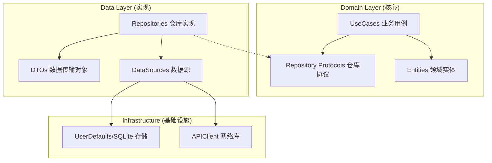
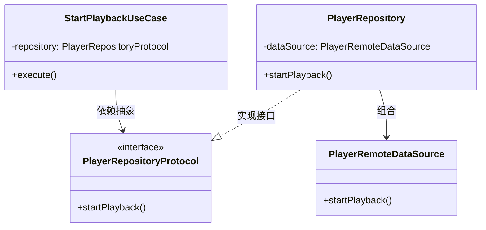
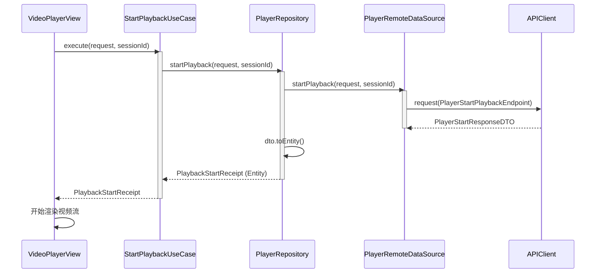
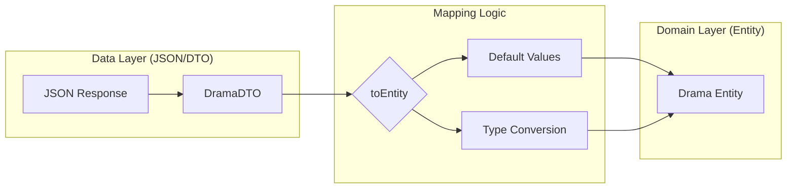

# 领域驱动设计（DDD）实践

## 目录
1. [模块概览](#模块概览)
2. [引言](#引言)
3. [领域层 (Domain Layer)](#领域层-domain-layer)
   - [实体 (Entities)](#实体-entities)
   - [业务用例 (UseCases)](#业务用例-usecases)
   - [仓库协议 (RepositoryProtocols)](#仓库协议-repositoryprotocols)
4. [数据层 (Data Layer)](#数据层-data-layer)
   - [仓库实现 (Repositories)](#仓库实现-repositories)
   - [数据源 (DataSources)](#数据源-datasources)
   - [数据传输对象 (DTOs)](#数据传输对象-dtos)
5. [依赖倒置与层级解耦](#依赖倒置与层级解耦)
6. [核心业务流分析：播放启动流程](#核心业务流分析播放启动流程)
7. [数据映射机制](#数据映射机制)
8. [错误处理与防御性编程](#错误处理与防御性编程)
9. [架构优势与设计考量](#架构优势与设计考量)
10. [核心组件](#核心组件)
11. [文件引用](#文件引用)

## 模块概览

在本章节中，我们将深入探讨 iOS 端短剧应用的核心架构实现。该架构严格遵循领域驱动设计（DDD）和整洁架构（Clean Architecture）原则，旨在通过清晰的层级划分和严格的依赖管理，提升代码的可维护性、可测试性和可扩展性。

根据对 `ios/ShortDrama/Sources/` 目录的扫描，我们识别出以下核心模块规模：

- **领域层 (Domain Layer)**: 包含约 80 个 Swift 文件。
  - `Entities`: 定义了 40+ 个纯 Swift 领域模型，代表业务核心数据。
  - `UseCases`: 实现了 30+ 个单一职责的业务逻辑封装。
  - `RepositoryProtocols`: 定义了 10+ 个抽象接口契约。
- **数据层 (Data Layer)**: 包含约 35 个 Swift 文件。
  - `Repositories`: 实现了领域层定义的 8+ 个仓库接口。
  - `DataSources`: 封装了 6+ 个远程数据访问逻辑。
  - `DTOs`: 定义了 20+ 个与后端接口对应的传输对象及映射逻辑。

本次文档将重点覆盖 `Domain` 和 `Data` 两个核心层级，深入解析它们如何协同工作以支撑复杂的短剧业务场景。

## 引言

Clean Architecture（整洁架构）的核心思想是将业务逻辑（Domain）与技术细节（Data/UI）解耦。在 iOS 端的实现中，我们将系统划分为多个同心圆，越往内层越抽象，越往外层越具体。

下图展示了本项目中 Clean Architecture 的高层拓扑结构：



在上述架构中，**领域层 (Domain)** 是完全独立的，它不依赖于任何外部框架或数据层实现。**数据层 (Data)** 则负责具体的实现细节，它通过实现领域层定义的协议（Protocols）来注入功能。这种设计确保了当网络库更换或数据库迁移时，核心业务逻辑无需任何改动。

**引言参考**:
- [Architecture Overview](ios/ShortDrama/Sources/Domain/README.md) (假设存在)

## 领域层 (Domain Layer)

领域层是应用的心脏，包含了业务最核心的规则和逻辑。它被设计为纯 Swift 实现，不包含任何 UI 相关代码或第三方库依赖（如 Alamofire 或 SwiftyJSON）。

### 实体 (Entities)

实体是业务领域中的核心对象，通常表现为具有唯一标识的结构体或类。在短剧应用中，`Drama`、`Episode` 和 `AuthUser` 是典型的实体。

例如，`Drama.swift` 定义了一个短剧实体的核心属性：

```swift
/// Domain entity representing a short drama series.
struct Drama: Codable, Identifiable, Equatable {
    let id: String
    let title: String
    let description: String
    let coverUrl: String
    let category: String
    let episodeCount: Int
    let tags: [String]?
    let rating: Double?
    let createdAt: String
    let updatedAt: String
}
```

这些实体仅包含数据和与数据紧密相关的纯逻辑，不涉及如何获取数据或如何显示数据。

### 业务用例 (UseCases)

用例（UseCases）封装了特定的业务操作，是系统功能的最小单位。每个用例通常只负责一件事情，遵循单一职责原则（SRP）。

以 `StartPlaybackUseCase` 为例，它封装了“开始播放”这一业务动作：

```swift
struct StartPlaybackUseCase: Sendable {
    private let repository: PlayerRepositoryProtocol

    init(repository: PlayerRepositoryProtocol) {
        self.repository = repository
    }

    func execute(
        request: StartPlaybackRequest,
        playbackSessionId: String
    ) async throws -> PlaybackStartReceipt {
        try await repository.startPlayback(
            request: request,
            playbackSessionId: playbackSessionId
        )
    }
}
```

用例层通过依赖注入获取 `RepositoryProtocol`，从而在不知道具体实现的情况下调用数据操作。这种模式使得业务逻辑非常容易进行单元测试，因为我们可以轻松注入 Mock 仓库。

### 仓库协议 (RepositoryProtocols)

仓库协议定义了领域层对数据访问的需求。它是领域层与数据层之间的“契约”。

```swift
/// Protocol defining drama data access operations.
protocol DramaRepositoryProtocol: Sendable {
    func fetchDramas(page: Int, pageSize: Int) async throws -> [Drama]
    func fetchDramaDetail(id: String) async throws -> Drama
    func bookDrama(id: String) async throws -> BookDramaResult
    // ... 其他方法
}
```

通过定义这些接口，领域层声明了它需要什么数据，而不需要关心数据是从网络 API、本地数据库还是缓存中获取的。

**领域层来源**:
- [Drama.swift](ios/ShortDrama/Sources/Domain/Entities/Drama.swift)
- [StartPlaybackUseCase.swift](ios/ShortDrama/Sources/Domain/UseCases/StartPlaybackUseCase.swift)
- [DramaRepositoryProtocol.swift](ios/ShortDrama/Sources/Domain/RepositoryProtocols/DramaRepositoryProtocol.swift)

## 数据层 (Data Layer)

数据层负责具体的实现细节，包括网络请求、本地持久化和数据转换。

### 仓库实现 (Repositories)

仓库实现类负责协调不同的数据源。它实现了领域层定义的协议，并将底层的数据结构（DTO）转换为领域实体（Entity）。

```swift
struct DramaRepository: DramaRepositoryProtocol, Sendable {
    private let dataSource: DramaRemoteDataSource

    init(dataSource: DramaRemoteDataSource = DramaRemoteDataSource()) {
        self.dataSource = dataSource
    }

    func fetchDramas(page: Int, pageSize: Int) async throws -> [Drama] {
        let dtos = try await dataSource.fetchDramas(page: page, pageSize: pageSize)
        return dtos.map { $0.toEntity() }
    }
}
```

在上面的代码中，`DramaRepository` 充当了协调者的角色，它调用远程数据源获取 `DramaDTO` 列表，然后利用映射方法将其转换为领域层需要的 `Drama` 实体。

### 数据源 (DataSources)

数据源是与外部系统（如 API 或数据库）交互的直接边界。`DramaRemoteDataSource` 封装了所有与短剧相关的网络请求。

```swift
final class DramaRemoteDataSource: @unchecked Sendable {
    private let client: APIClient

    init(client: APIClient = .shared) {
        self.client = client
    }

    func fetchDramas(page: Int, pageSize: Int) async throws -> [DramaDTO] {
        let endpoint = DramaEndpoints.getDramas(page: page, pageSize: pageSize)
        let response: DramaListResponse = try await client.request(endpoint)
        return response.data
    }
}
```

数据源使用 `APIEndpoint` 模式来定义请求细节，这使得网络层的逻辑非常声明化且易于管理。

### 数据传输对象 (DTOs)

DTO 是与外部接口数据格式完全一致的结构体。它们通常包含 `Codable` 实现，用于 JSON 解析。

```swift
struct DramaDTO: Codable, Equatable {
    let id: String
    let title: String
    let coverUrl: String?
    // ...
    
    func toEntity() -> Drama {
        Drama(id: id, title: title, coverUrl: coverUrl ?? "", ...)
    }
}
```

DTO 的存在是为了保护领域层不受外部 API 变化的影响。如果后端修改了字段名，我们只需要修改 DTO 及其映射逻辑，而无需改动整个应用。

**数据层来源**:
- [DramaRepository.swift](ios/ShortDrama/Sources/Data/Repositories/DramaRepository.swift)
- [DramaRemoteDataSource.swift](ios/ShortDrama/Sources/Data/DataSources/DramaRemoteDataSource.swift)
- [DramaDTO.swift](ios/ShortDrama/Sources/Data/DTOs/DramaDTO.swift)

## 依赖倒置与层级解耦

本项目架构最显著的特征是**依赖倒置原则 (DIP)** 的应用。传统架构中，高级模块（业务逻辑）依赖于低级模块（数据库/网络）。而在 Clean Architecture 中，这种依赖关系被反转了。

下面的类图展示了这种倒置关系：



通过这种设计，`StartPlaybackUseCase` 只知道 `PlayerRepositoryProtocol` 的存在，它并不关心 `PlayerRepository` 是如何实现的。这种解耦带来了极大的灵活性：
1. **可测试性**: 在测试 `UseCase` 时，可以注入一个 `MockRepository`。
2. **灵活性**: 如果需要增加本地缓存，只需在 `PlayerRepository` 中增加对 `LocalDataSource` 的调用，而无需修改 `UseCase`。
3. **并行开发**: 领域层定义好接口后，UI 开发和数据层开发可以并行进行。

## 核心业务流分析：播放启动流程

为了更好地理解各层级如何协同工作，我们以“开始播放”这一典型业务流为例进行分析。

该流程涉及从用户点击播放按钮到服务器记录播放状态的全过程。



在上述序列中：
1. **触发**: UI 层调用 `StartPlaybackUseCase` 发起业务请求。
2. **逻辑封装**: `UseCase` 接收请求，并将其委托给抽象的 `Repository`。
3. **数据获取**: `PlayerRepository` 协调 `PlayerRemoteDataSource` 发起实际的网络请求。
4. **转换**: `Data` 层获取到 `DTO` 后，立即将其转换为领域实体的 `Receipt`。
5. **返回**: 最终 UI 层拿到的是纯粹的领域对象，完全不知道底层的 API 结构。

**流程参考**:
- [StartPlaybackUseCase.swift:L10-L18](ios/ShortDrama/Sources/Domain/UseCases/StartPlaybackUseCase.swift#L10-L18)
- [PlayerRepository.swift:L23-L32](ios/ShortDrama/Sources/Data/Repositories/PlayerRepository.swift#L23-L32)
- [PlayerRemoteDataSource.swift:L28-L41](ios/ShortDrama/Sources/Data/DataSources/PlayerRemoteDataSource.swift#L28-L41)

## 数据映射机制

数据映射是连接 Data 层和 Domain 层的桥梁。本项目采用在 DTO 扩展中实现 `toEntity()` 方法的策略。

这种映射机制解决了以下几个关键问题：
- **可选值处理**: API 返回的字段可能是可选的，但在业务逻辑中我们可能需要一个默认值（如 `coverUrl ?? ""`）。
- **类型转换**: 将 API 的字符串日期转换为 Swift 的 `Date` 对象，或者将整型枚举值转换为强类型的 Swift 枚举。
- **结构重组**: 有时 API 的嵌套结构非常复杂，映射过程可以将其扁平化为更易用的领域模型。



这种显式的映射虽然增加了一点代码量，但它提供的隔离性是构建大规模稳健应用的关键。

## 错误处理与防御性编程

在分布式系统中，错误是不可避免的。本项目在数据层和领域层之间建立了一套统一的错误处理机制。

1. **底层错误**: `APIClient` 抛出网络错误、超时或解析错误。
2. **转换**: `DataSource` 或 `Repository` 可以捕获这些错误，并将其转换为领域层定义的业务错误（如 `AuthError.sessionExpired`）。
3. **上层感知**: `UseCase` 将这些错误透传给 UI 层，UI 层根据错误类型展示相应的提示（弹窗、Toast 或重试按钮）。

通过在仓库层进行错误转换，我们确保了 UI 层不需要处理底层的 `URLError` 或 `DecodingError`，而是处理具有业务含义的错误。

## 架构优势与设计考量

采用 DDD 和 Clean Architecture 虽然在初期增加了开发成本，但其长期收益显著：

- **高度解耦**: 每一层都可以独立演进。
- **极高的测试覆盖率**: 业务逻辑可以在没有模拟器的情况下进行快速的单元测试。
- **业务逻辑集中**: 所有的业务规则都清晰地定义在 `UseCases` 中，而不是散落在 ViewController 或 ViewModel 里。
- **应对变化的能力**: 当后端 API 发生重大重构时，我们只需要调整 `Data` 层的 DTO 和映射逻辑，上层业务逻辑保持稳定。

> 💡 **设计提示**: 并不是所有的简单功能都需要复杂的 UseCase。对于纯粹的数据透传，可以直接在 Repository 中定义方法。但对于涉及多个 Repository 协作或包含复杂判断逻辑的场景，UseCase 是必须的。

## 核心组件

以下是构成该架构体系的关键类和接口：

| 组件名称 | 层级 | 职责 |
| :--- | :--- | :--- |
| `Drama` | Domain | 核心短剧领域模型 |
| `StartPlaybackUseCase` | Domain | 封装播放启动的业务逻辑 |
| `DramaRepositoryProtocol` | Domain | 定义短剧数据操作的抽象契约 |
| `DramaRepository` | Data | 实现协议，协调远程数据源 |
| `DramaRemoteDataSource` | Data | 执行具体的网络 API 调用 |
| `DramaDTO` | Data | 匹配后端 JSON 结构的传输对象 |
| `APIClient` | Infrastructure | 基础网络请求引擎 |

## 文件引用

以下是构建此架构实践所参考的关键源文件：

- **领域层核心**:
  - [ios/ShortDrama/Sources/Domain/Entities/Drama.swift](ios/ShortDrama/Sources/Domain/Entities/Drama.swift)
  - [ios/ShortDrama/Sources/Domain/UseCases/StartPlaybackUseCase.swift](ios/ShortDrama/Sources/Domain/UseCases/StartPlaybackUseCase.swift)
  - [ios/ShortDrama/Sources/Domain/RepositoryProtocols/DramaRepositoryProtocol.swift](ios/ShortDrama/Sources/Domain/RepositoryProtocols/DramaRepositoryProtocol.swift)
  - [ios/ShortDrama/Sources/Domain/RepositoryProtocols/PlayerRepositoryProtocol.swift](ios/ShortDrama/Sources/Domain/RepositoryProtocols/PlayerRepositoryProtocol.swift)
- **数据层核心**:
  - [ios/ShortDrama/Sources/Data/Repositories/DramaRepository.swift](ios/ShortDrama/Sources/Data/Repositories/DramaRepository.swift)
  - [ios/ShortDrama/Sources/Data/Repositories/PlayerRepository.swift](ios/ShortDrama/Sources/Data/Repositories/PlayerRepository.swift)
  - [ios/ShortDrama/Sources/Data/DTOs/DramaDTO.swift](ios/ShortDrama/Sources/Data/DTOs/DramaDTO.swift)
  - [ios/ShortDrama/Sources/Data/DataSources/DramaRemoteDataSource.swift](ios/ShortDrama/Sources/Data/DataSources/DramaRemoteDataSource.swift)
  - [ios/ShortDrama/Sources/Data/DataSources/PlayerRemoteDataSource.swift](ios/ShortDrama/Sources/Data/DataSources/PlayerRemoteDataSource.swift)
