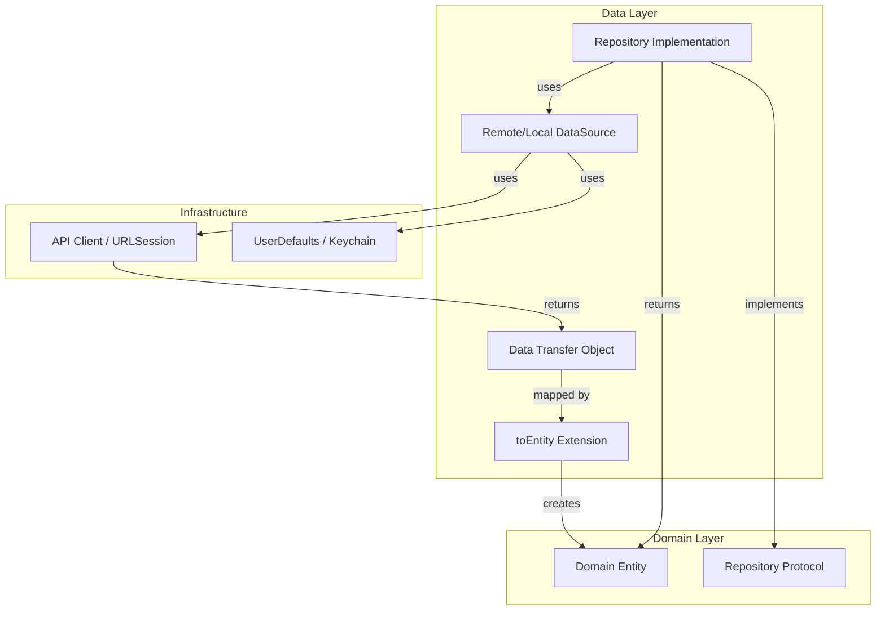
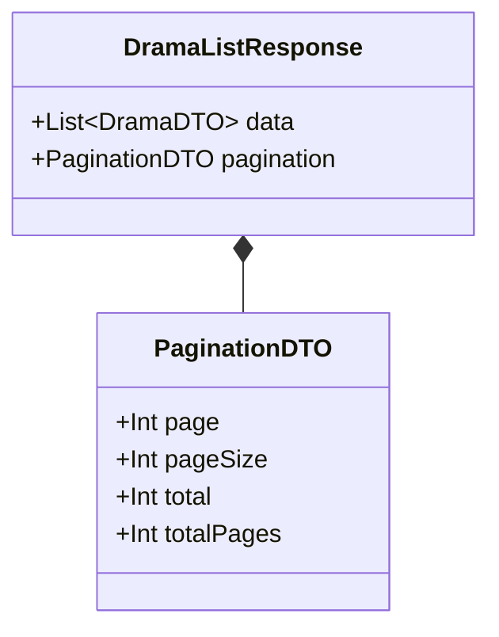
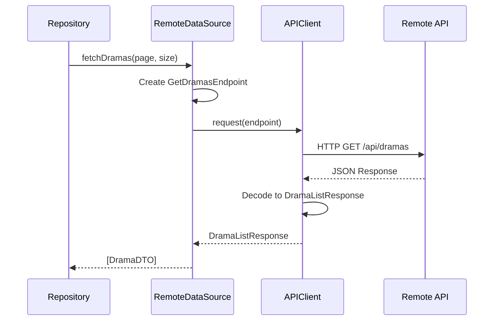
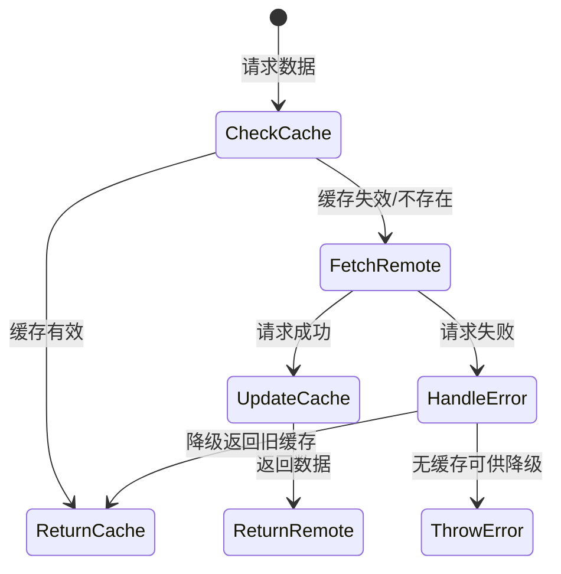
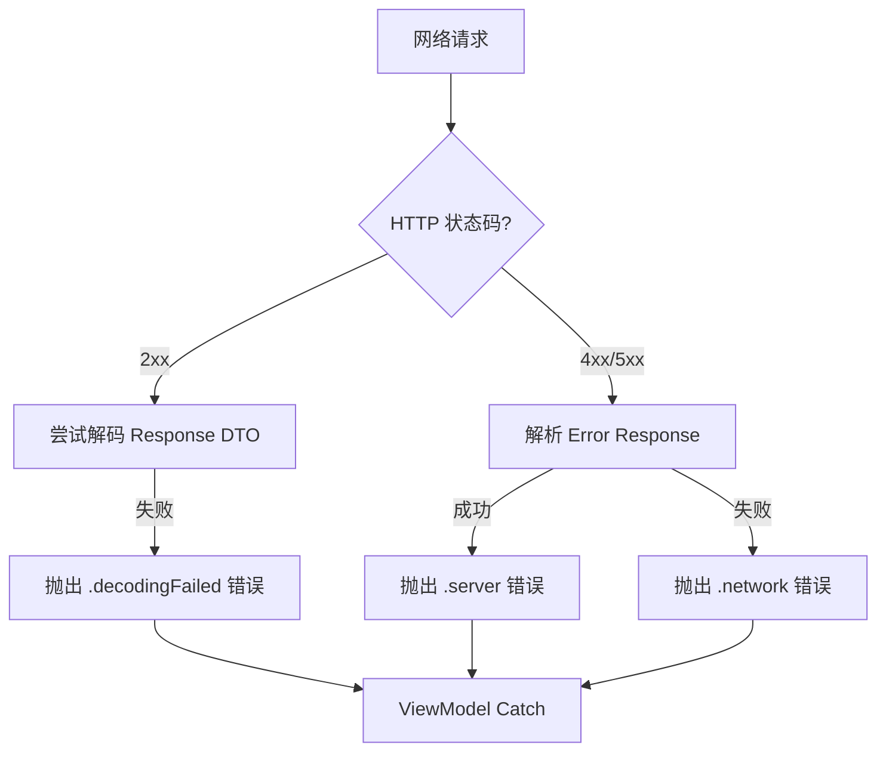

# 数据层实现与持久化策略

## 目录
1. [模块概览](#模块概览)
2. [引言](#引言)
3. [架构设计](#架构设计)
4. [数据传输对象 (DTOs)](#数据传输对象-dtos)
5. [映射机制与领域纯净性](#映射机制与领域纯净性)
6. [数据源实现 (DataSources)](#数据源实现-datasources)
7. [仓库层实现 (Repositories)](#仓库层实现-repositories)
8. [错误处理与状态转换](#错误处理与状态转换)
9. [持久化策略](#持久化策略)
10. [核心组件](#核心组件)
11. [文件参考](#文件参考)

## 模块概览

本章节详细解析了 iOS 端的数据层（Data Layer）实现。数据层是应用程序中负责数据获取、转换和持久化的核心部分，它作为 Domain 层（领域层）与外部数据源（如 REST API 和本地存储）之间的桥梁。

**范围评估**：
- **总文件数**：约 35 个 Swift 文件。
- **子目录结构**：
  - `DTOs/` (21 个文件)：定义与后端 API 匹配的网络模型。
  - `DataSources/` (6 个文件)：封装底层的网络请求逻辑。
  - `Repositories/` (8 个文件)：实现领域层协议，协调数据源并执行模型转换。
- **核心入口**：
  - `Repositories/DramaRepository.swift`：短剧业务的核心仓库。
  - `DTOs/DramaDTO.swift`：短剧基础数据模型。
  - `DataSources/DramaRemoteDataSource.swift`：短剧远程数据源。

本指南将深入探讨这些组件的实现细节，包括 DTO 到 Entity 的转换逻辑、网络异常的处理机制以及本地缓存策略。

## 引言

在 ShortDrama iOS 项目的架构中，数据层遵循了 Clean Architecture 的设计原则，确保了业务逻辑（Domain 层）与具体的数据获取实现（Data 层）之间的解耦。数据层的主要职责是屏蔽外部数据的复杂性，为上层提供统一、纯净的领域对象（Entities）。

数据层不仅负责通过网络请求获取数据，还处理了数据的序列化与反序列化（Codable）、分页逻辑的封装、以及本地持久化（如搜索历史）。通过引入 Repository 模式，我们可以在不影响业务逻辑的前提下，灵活地切换或增加数据源（例如从网络切换到本地缓存）。

**关键术语**：
- **DTO (Data Transfer Object)**：数据传输对象，直接映射自 API 响应的结构。
- **Entity**：领域实体，Domain 层使用的纯业务模型。
- **DataSource**：数据源，负责与具体的外部系统（网络、数据库）进行原始通信。
- **Repository**：仓库，协调多个数据源并返回领域实体的组件。

## 架构设计

iOS 端的数据层采用了典型的分层设计，确保了职责的单一性和代码的可测试性。数据流从外部 API 开始，经过解析、映射，最终以领域实体的形式交付给 Use Case 或 ViewModel。

以下图表展示了数据层内部组件的交互关系及数据流向：



在上述架构中，`Repository Implementation` 是核心协调者。它调用 `DataSource` 获取 `DTO`，然后利用 `Mapper`（通常是 DTO 的扩展方法）将 `DTO` 转换为 `Entity`。这种设计保证了 `Domain Layer` 完全不感知 `DTO` 的存在，从而避免了后端接口变动对业务逻辑的直接冲击。`Infrastructure` 层则提供了底层的通信和存储能力，被 `DataSource` 所封装。

**架构设计来源**：
- [DramaRepository.swift](ios/ShortDrama/Sources/Data/Repositories/DramaRepository.swift)
- [DramaRemoteDataSource.swift](ios/ShortDrama/Sources/Data/DataSources/DramaRemoteDataSource.swift)

## 数据传输对象 (DTOs)

数据传输对象（DTOs）是数据层与外部 API 之间的契约。在 iOS 项目中，所有的 DTO 都遵循 `Codable` 协议，以便利用 Swift 原生的 JSON 解析能力。

### 通用响应包装 (Envelopes)

为了处理后端统一的响应格式，项目采用了泛型包装器 `AuthEnvelopeDTO`。这种设计减少了重复代码，并统一了错误码和消息的处理逻辑。

```swift
struct AuthEnvelopeDTO<T: Decodable>: Decodable, Equatable where T: Equatable {
    let code: Int
    let data: T
    let message: String
}
```

通过 `typealias`，我们可以快速定义具体的响应类型，例如 `AuthSessionEnvelopeDTO`。

### 分页处理 (Pagination)

分页是移动端常见的需求。`PaginationDTO` 定义了标准的分页元数据，包括当前页码、每页大小、总记录数和总页数。



在 `DramaListResponse` 中，`PaginationDTO` 与数据列表并列，确保了每次请求都能获取到完整的分页上下文。这种结构化的设计使得 ViewModel 能够轻松实现上拉加载更多等逻辑。

**DTOs 相关源码**：
- [AuthDTOs.swift](ios/ShortDrama/Sources/Data/DTOs/AuthDTOs.swift)
- [PaginationDTO.swift](ios/ShortDrama/Sources/Data/DTOs/PaginationDTO.swift)
- [DramaDTO.swift](ios/ShortDrama/Sources/Data/DTOs/DramaDTO.swift)

## 映射机制与领域纯净性

映射机制是数据层中最关键的一环，它负责将带有后端特性的 `DTO` 转换为业务友好的 `Entity`。这种转换通常通过在 DTO 上定义 `toEntity()` 或 `toDomain()` 扩展方法来实现。

### 为什么需要映射？

1.  **字段解耦**：后端可能使用 `snake_case`（如 `cover_url`），而 Swift 习惯使用 `camelCase`（如 `coverUrl`）。映射层可以处理这种风格转换。
2.  **类型转换**：后端可能返回字符串格式的日期，映射层可以将其解析为 `Date` 对象。
3.  **默认值处理**：对于可选字段，映射层可以提供合理的业务默认值，减少上层的判空逻辑。

以下是一个典型的转换逻辑示例：

```swift
extension DramaDTO {
    func toEntity() -> Drama {
        Drama(
            id: id,
            title: title,
            description: description,
            coverUrl: coverUrl ?? "", // 处理可选值
            category: category,
            episodeCount: episodeCount,
            tags: tags,
            rating: rating,
            createdAt: createdAt,
            updatedAt: updatedAt
        )
    }
}
```

通过这种方式，`Drama` 实体保持了纯净性，它不依赖于 `Codable` 协议，也不感知任何网络传输的细节。当后端接口字段发生变化时，我们只需要修改 `DramaDTO` 和 `toEntity()` 方法，而不需要触及任何 UI 或 Use Case 代码。

**映射机制来源**：
- [DramaDTO.swift](ios/ShortDrama/Sources/Data/DTOs/DramaDTO.swift)
- [AuthDTOs.swift](ios/ShortDrama/Sources/Data/DTOs/AuthDTOs.swift)

## 数据源实现 (DataSources)

数据源（DataSources）是直接与外部环境交互的组件。在 ShortDrama 项目中，主要存在两种类型的数据源：远程数据源（RemoteDataSource）和本地数据源。

### 远程数据源与 APIEndpoint

远程数据源封装了基于 `URLSession` 的网络请求。为了提高可复用性和可测试性，项目引入了 `APIEndpoint` 协议来定义请求的细节（路径、方法、参数、Header 等）。



`DramaRemoteDataSource` 并不直接处理映射逻辑，它只负责发起请求并返回解码后的 DTO。这种职责划分使得数据源非常轻量，易于通过 Mock 进行单元测试。

### 本地数据源

本地数据源负责持久化存储。例如，`UserDefaultsSearchHistoryRepository` 虽然在命名上是 Repository，但其实际角色更接近于本地数据源，它直接操作 `UserDefaults` 来存储和检索搜索历史记录。

**数据源相关源码**：
- [DramaRemoteDataSource.swift](ios/ShortDrama/Sources/Data/DataSources/DramaRemoteDataSource.swift)
- [AuthRemoteDataSource.swift](ios/ShortDrama/Sources/Data/DataSources/AuthRemoteDataSource.swift)

## 仓库层实现 (Repositories)

仓库（Repositories）是数据层的对外接口。它们实现了在 Domain 层定义的协议，是 ViewModel 获取数据的唯一途径。

### 职责协调

Repository 的核心职责是“协调”。它可以根据策略决定是从远程数据源获取数据，还是从本地缓存获取数据。在 `DramaRepository` 的实现中，它目前主要协调远程数据源，并执行从 DTO 到 Entity 的映射。

```swift
struct DramaRepository: DramaRepositoryProtocol, Sendable {
    private let dataSource: DramaRemoteDataSource

    func fetchDramas(page: Int, pageSize: Int) async throws -> [Drama] {
        let dtos = try await dataSource.fetchDramas(page: page, pageSize: pageSize)
        return dtos.map { $0.toEntity() } // 执行映射
    }
}
```

### 多数据源协调策略

在更复杂的场景中，Repository 可以实现复杂的缓存策略，如下面的状态图所示：



虽然目前的 `DramaRepository` 实现较为直接，但这种架构为未来引入磁盘缓存（如 CoreData 或 SQLite）预留了充足的扩展空间。

**仓库层相关源码**：
- [DramaRepository.swift](ios/ShortDrama/Sources/Data/Repositories/DramaRepository.swift)
- [AuthRepository.swift](ios/ShortDrama/Sources/Data/Repositories/AuthRepository.swift)

## 错误处理与状态转换

在数据层中，错误处理不仅是捕获异常，更重要的是将底层的网络错误转换为上层可理解的业务错误。

### APIError 模型

项目定义了统一的 `APIError` 类型，用于承载不同维度的错误信息：
- **网络错误**：如超时、无连接。
- **服务端错误**：后端返回的业务错误码（Business Code）。
- **解码错误**：JSON 解析失败。
- **未实现错误**：501 状态码映射。

### 错误映射流程

当 `APIClient` 收到非 2xx 的响应时，它会尝试解析错误体。如果后端返回了标准的错误结构（如 `{"error": {"code": "...", "message": "..."}}`），`APIClient` 会将其封装进 `.server(code, message)` 中抛出。



这种机制确保了 ViewModel 可以根据 `APIError` 的类型来决定 UI 展示：是显示一个全局的错误页面，还是弹出一个轻量的 Toast 提示。

**错误处理相关参考**：
- [design-ios.md](docs/specs/2026-07-26-prd-04-search-discovery/design-ios.md)

## 持久化策略

持久化策略决定了数据在应用关闭后如何保留。在 ShortDrama 项目中，目前主要使用了 `UserDefaults` 进行轻量级数据的持久化。

### UserDefaults 存储实现

`UserDefaultsSearchHistoryRepository` 是持久化策略的一个典型应用。它负责管理用户的搜索历史，包括去重、限额（最多 10 条）以及序列化存储。

```swift
func save(keyword: String) {
    guard let normalized = Self.normalize(keyword) else { return }
    var items = load().filter { $0.keyword != normalized }
    items.insert(SearchHistoryItem(keyword: normalized), at: 0)
    items = Array(items.prefix(10)) // 限额策略

    if let data = try? JSONEncoder().encode(items) {
        userDefaults.set(data, forKey: storageKey)
    }
}
```

### 存储安全性

对于敏感数据（如用户 Token），项目在设计规约中提到了使用 `Keychain` 进行存储。虽然在 `Data/` 目录下未直接看到 Keychain 的具体实现文件，但 `AuthRepository` 的接口设计已经考虑了 Token 的传递，确保了认证状态的持久化。

**持久化相关源码**：
- [UserDefaultsSearchHistoryRepository.swift](ios/ShortDrama/Sources/Data/Repositories/UserDefaultsSearchHistoryRepository.swift)

## 核心组件

以下是数据层中几个核心类及其关键实现细节的展示。

### 1. DramaRemoteDataSource

负责定义 API 端点并执行请求。

```swift
final class DramaRemoteDataSource: @unchecked Sendable {
    private let client: APIClient

    func fetchDramas(page: Int, pageSize: Int) async throws -> [DramaDTO] {
        let endpoint = DramaEndpoints.getDramas(page: page, pageSize: pageSize)
        let response: DramaListResponse = try await client.request(endpoint)
        return response.data
    }
}
```

### 2. DramaRepository

协调数据源并将 DTO 转换为 Entity。

```swift
struct DramaRepository: DramaRepositoryProtocol, Sendable {
    private let dataSource: DramaRemoteDataSource

    func fetchDramaDetail(id: String) async throws -> Drama {
        let dto = try await dataSource.fetchDrama(id: id)
        return dto.toEntity()
    }
}
```

### 3. AuthEnvelopeDTO

通用的 API 响应包装器。

```swift
struct AuthEnvelopeDTO<T: Decodable>: Decodable, Equatable where T: Equatable {
    let code: Int
    let data: T
    let message: String
}
```

## 文件参考

以下是本章节涉及的核心源文件列表，所有路径均相对于项目根目录：

- **DTOs (数据传输对象)**:
  - `ios/ShortDrama/Sources/Data/DTOs/DramaDTO.swift`
  - `ios/ShortDrama/Sources/Data/DTOs/AuthDTOs.swift`
  - `ios/ShortDrama/Sources/Data/DTOs/PaginationDTO.swift`
  - `ios/ShortDrama/Sources/Data/DTOs/EpisodeDTO.swift`
  - `ios/ShortDrama/Sources/Data/DTOs/HotSearchDTO.swift`

- **DataSources (数据源)**:
  - `ios/ShortDrama/Sources/Data/DataSources/DramaRemoteDataSource.swift`
  - `ios/ShortDrama/Sources/Data/DataSources/AuthRemoteDataSource.swift`
  - `ios/ShortDrama/Sources/Data/DataSources/PlayerRemoteDataSource.swift`

- **Repositories (仓库)**:
  - `ios/ShortDrama/Sources/Data/Repositories/DramaRepository.swift`
  - `ios/ShortDrama/Sources/Data/Repositories/AuthRepository.swift`
  - `ios/ShortDrama/Sources/Data/Repositories/UserDefaultsSearchHistoryRepository.swift`
  - `ios/ShortDrama/Sources/Data/Repositories/CommentRepository.swift`
