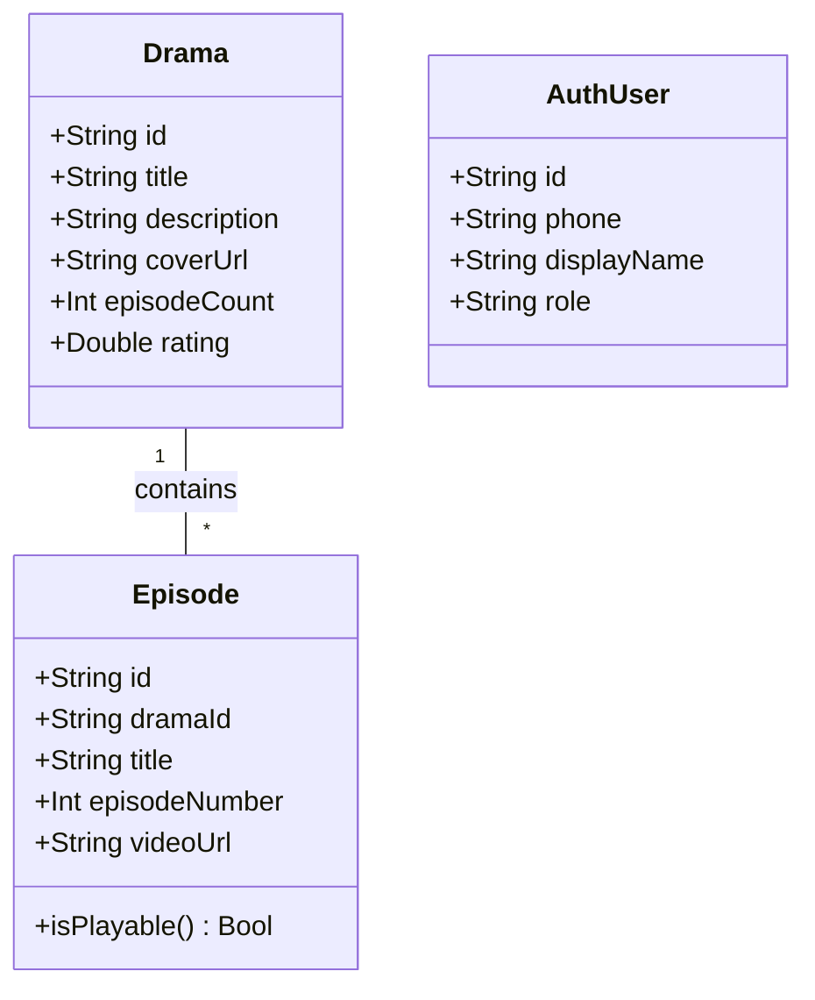
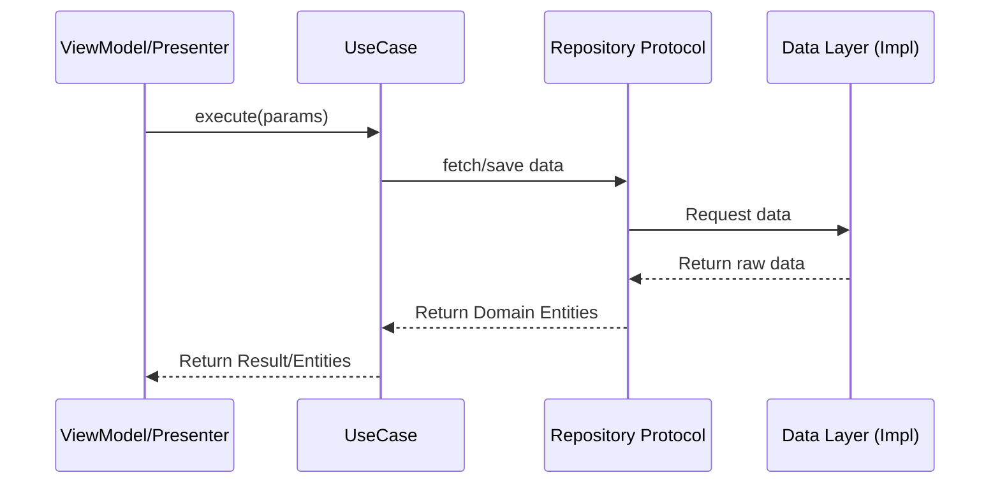
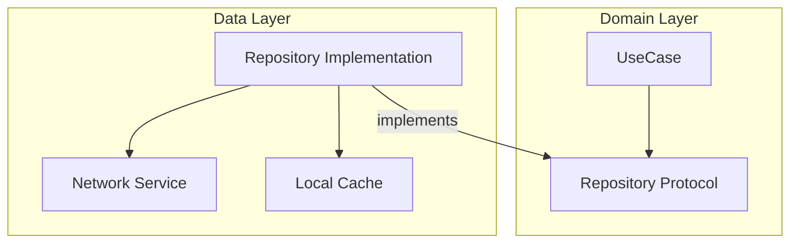
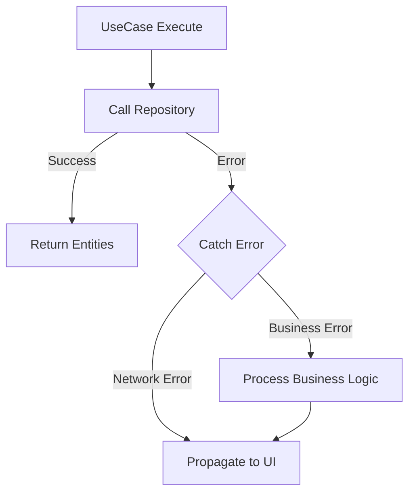
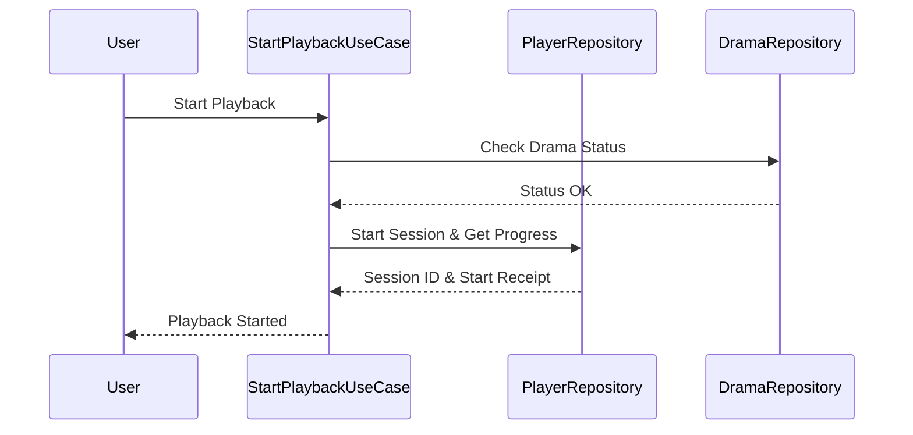

# 领域层实现与业务逻辑封装

## 目录
1. [模块概览](#模块概览)
2. [领域实体 (Entities)：业务模型的真相来源](#领域实体-entities业务模型的真相来源)
   - [实体的纯粹性与不可变性](#实体的纯粹性与不可变性)
   - [核心实体解析：Drama 与 Episode](#核心实体解析drama-与-episode)
3. [业务用例 (UseCases)：逻辑封装的核心单元](#业务用例-usecases逻辑封装的核心单元)
   - [单一职责原则的应用](#单一职责原则的应用)
   - [UseCase 通用设计模式](#usecase-通用设计模式)
4. [仓库协议 (Repository Protocols)：解耦与契约](#仓库协议-repository-protocols解耦与契约)
   - [依赖倒置原则的实践](#依赖倒置原则的实践)
   - [领域驱动的接口定义](#领域驱动的接口定义)
5. [错误处理与业务逻辑流转](#错误处理与业务逻辑流转)
   - [业务错误的定义与传递](#业务错误的定义与传递)
   - [UseCase 中的异常控制](#usecase-中的异常控制)
6. [复杂业务场景深度解析：播放控制流](#复杂业务场景深度解析播放控制流)
   - [跨 Repository 的逻辑组合](#跨-repository-的逻辑组合)
   - [状态管理与副作用处理](#状态管理与副作用处理)
7. [核心组件与设计模式总结](#核心组件与设计模式总结)
8. [关键源文件参考](#关键源文件参考)

## 模块概览

领域层（Domain Layer）是 ShortDrama 项目中 Clean Architecture 架构的核心。它位于架构的最内层，代表了应用程序的核心业务逻辑和业务规则。该层级最大的特点是其**纯粹性**：它不依赖于任何外部框架（如 UIKit、SwiftUI）、数据库（如 CoreData、Realm）或网络库（如 Alamofire）。这种设计确保了业务逻辑在技术栈更迭或外部环境变化时能够保持稳定，同时也极大地提升了代码的可测试性。

在 `ios/ShortDrama/Sources/Domain/` 目录下，共包含约 80 个 Swift 源文件，这些文件被严谨地划分为三个子模块：

1.  **Entities (领域实体)**：约 40 个文件。定义了业务领域的核心模型，如剧集 (`Drama`)、集数 (`Episode`)、用户信息 (`AuthUser`) 等。它们是系统中“真相的来源”。
2.  **UseCases (业务用例)**：约 30 个文件。封装了具体的业务操作，如“开始播放”、“获取剧集列表”、“登录”等。每个 UseCase 通常只负责一个单一的业务动作。
3.  **Repository Protocols (仓库协议)**：约 10 个文件。定义了数据访问的契约，规定了 Domain 层需要什么样的数据，而不关心数据是如何从网络或本地缓存中获取的。

通过这种分层，Domain 层成功地将“做什么”（业务逻辑）与“怎么做”（技术实现）分离开来。

下表展示了领域层的主要组成部分及其职责：

| 子模块 | 职责 | 依赖关系 | 核心文件示例 |
| :--- | :--- | :--- | :--- |
| **Entities** | 定义业务模型和基本逻辑 | 无依赖 | `Drama.swift`, `Episode.swift` |
| **UseCases** | 封装具体的业务流程和规则 | 依赖 Entities 和 Repository Protocols | `StartPlaybackUseCase.swift` |
| **Protocols** | 定义数据获取和持久化的接口 | 依赖 Entities | `DramaRepositoryProtocol.swift` |

## 领域实体 (Entities)：业务模型的真相来源

领域实体是 ShortDrama 业务逻辑的基石。在 Swift 实现中，所有的实体都使用 `struct` 定义，这不仅利用了 Swift 结构体的性能优势，更重要的是通过值语义保证了数据的不可变性和线程安全性。

### 实体的纯粹性与不可变性

在 Domain 层中，实体被设计为纯粹的数据容器，有时会包含一些与数据本身紧密相关的辅助逻辑（如 `Episode` 的播放状态判断）。实体不包含任何与持久化或网络请求相关的逻辑，这使得它们可以在不同的层级间自由传递而不会产生副作用。



上图展示了核心领域实体之间的关系。`Drama` 作为短剧的主体，包含了剧集的基本信息，而 `Episode` 则代表了具体的每一集。这种清晰的层级关系直接反映了短剧业务的自然结构。

### 核心实体解析：Drama 与 Episode

以 `Drama` 和 `Episode` 为例，它们的设计体现了领域驱动设计的思想。

```swift
/// Domain entity representing a short drama series.
struct Drama: Codable, Identifiable, Equatable {
    let id: String
    let title: String
    let description: String
    let coverUrl: String
    let category: String
    let episodeCount: Int
    let tags: [String]?
    let rating: Double?
    let createdAt: String
    let updatedAt: String
}

/// Domain entity representing an episode within a drama series.
struct Episode: Codable, Identifiable, Equatable, Sendable {
    let id: String
    let dramaId: String
    let title: String
    let episodeNumber: Int
    let videoUrl: String
    let duration: Int
    let thumbnailUrl: String
    let description: String?
    
    // 领域逻辑：判断剧集是否可播放
    var isPlayable: Bool {
        !videoUrl.trimmingCharacters(in: .whitespacesAndNewlines).isEmpty
    }
}
```

在 `Episode` 实体中，`isPlayable` 计算属性是一个典型的领域逻辑示例。它不依赖于播放器框架，仅根据实体内部的数据状态来决定业务上的“可播放性”。这种逻辑放在实体中，可以确保在整个应用中对“可播放”的定义保持一致。

**Section sources**:
- [Drama.swift](ios/ShortDrama/Sources/Domain/Entities/Drama.swift)
- [Episode.swift](ios/ShortDrama/Sources/Domain/Entities/Episode.swift)
- [AuthUser.swift](ios/ShortDrama/Sources/Domain/Entities/AuthUser.swift)

## 业务用例 (UseCases)：逻辑封装的核心单元

UseCases 是 Domain 层的“大脑”，它们协调 Entities 和 Repository Protocols 来完成特定的业务目标。在 ShortDrama 项目中，每个 UseCase 都被设计为一个独立的结构体，遵循单一职责原则。

### 单一职责原则的应用

每一个 UseCase 只负责一件事情。例如，`FetchDramasUseCase` 仅负责获取剧集列表，而 `StartPlaybackUseCase` 仅负责处理播放开始时的逻辑。这种细粒度的拆分使得代码非常容易理解、测试和重用。



上述序列图展示了 UseCase 在系统中的调用流转。UseCase 作为中介者，接收来自表示层（UI）的请求，调用仓库接口获取数据，并最终将处理后的领域模型返回给上层。

### UseCase 通用设计模式

项目中的 UseCase 遵循统一的模式：通过构造函数注入依赖的 Repository，并提供一个 `execute` 方法作为入口。

```swift
/// Use case for fetching a paginated list of dramas.
struct FetchDramasUseCase: Sendable {
    private let repository: DramaRepositoryProtocol

    /// 通过构造函数注入 Repository 协议，实现解耦
    init(repository: DramaRepositoryProtocol) {
        self.repository = repository
    }

    /// 执行业务逻辑
    func execute(page: Int, pageSize: Int) async throws -> [Drama] {
        // 可以在此处添加额外的业务校验或数据转换逻辑
        try await repository.fetchDramas(page: page, pageSize: pageSize)
    }
}
```

这种模式的优势在于，当我们需要为 UseCase 编写单元测试时，可以轻松地注入一个 Mock 版本的 Repository，而无需关心实际的网络请求或数据库操作。

**Section sources**:
- [FetchDramasUseCase.swift](ios/ShortDrama/Sources/Domain/UseCases/FetchDramasUseCase.swift)
- [StartPlaybackUseCase.swift](ios/ShortDrama/Sources/Domain/UseCases/StartPlaybackUseCase.swift)
- [CreateSessionUseCase.swift](ios/ShortDrama/Sources/Domain/UseCases/CreateSessionUseCase.swift)

## 仓库协议 (Repository Protocols)：解耦与契约

Repository Protocols 定义了 Domain 层与外部世界通信的边界。它们是依赖倒置原则（Dependency Inversion Principle）的关键实现。

### 依赖倒置原则的实践

在传统的架构中，业务层往往依赖于数据层。但在 Clean Architecture 中，这种依赖关系被反转了：数据层（Data Layer）必须实现 Domain 层定义的接口。这意味着 Domain 层掌控着数据访问的定义权。



这种结构使得 Domain 层完全感知不到底层的存储细节。无论数据是来自 REST API、GraphQL 还是本地 SQL 数据库，对于 UseCase 来说都是透明的。

### 领域驱动的接口定义

以 `DramaRepositoryProtocol` 为例，它的接口定义完全基于业务需求：

```swift
/// Protocol defining drama data access operations.
protocol DramaRepositoryProtocol: Sendable {
    func fetchDramas(page: Int, pageSize: Int) async throws -> [Drama]
    func fetchDramaDetail(id: String) async throws -> Drama
    func searchDramas(query: String, page: Int, pageSize: Int) async throws -> [Drama]
    func bookDrama(id: String) async throws -> BookDramaResult
}
```

接口使用 Swift 的 `async/await` 语法，这使得异步代码的编写像同步代码一样直观，同时也符合现代 Swift 开发的最佳实践。

**Section sources**:
- [DramaRepositoryProtocol.swift](ios/ShortDrama/Sources/Domain/RepositoryProtocols/DramaRepositoryProtocol.swift)
- [AuthRepositoryProtocol.swift](ios/ShortDrama/Sources/Domain/RepositoryProtocols/AuthRepositoryProtocol.swift)
- [PlayerRepositoryProtocol.swift](ios/ShortDrama/Sources/Domain/RepositoryProtocols/PlayerRepositoryProtocol.swift)

## 错误处理与业务逻辑流转

在复杂的业务系统中，错误处理与正常流程同样重要。Domain 层负责定义业务逻辑中可能出现的各种错误情况。

### 业务错误的定义与传递

虽然项目中使用通用的 `APIError` 来处理网络和服务器返回的业务错误，但 Domain 层的 UseCase 负责将这些错误向上层传递。



在 UseCase 中，我们可以根据不同的错误类型执行特定的补救逻辑。例如，如果登录失效，UseCase 可能会触发一个特定的业务流程来引导用户重新登录。

### UseCase 中的异常控制

通过使用 Swift 的错误处理机制（`throws`），UseCase 可以清晰地表达“可能会失败”的业务意图。

```swift
func execute(phone: String, countryCode: String, code: String) async throws -> AuthSession {
    // 校验逻辑可以在这里进行，如果失败则抛出领域特定的错误
    guard !phone.isEmpty else { throw APIError.business(statusCode: 400, businessCode: "INVALID_PHONE", message: "手机号不能为空") }
    
    return try await repository.createSession(phone: phone, countryCode: countryCode, code: code)
}
```

这种显式的错误处理方式强迫调用方（通常是 ViewModel）考虑失败的情况，从而构建更健壮的 UI 体验。

**Section sources**:
- [APIError.swift](ios/ShortDrama/Sources/Core/Network/APIError.swift)
- [CreateSessionUseCase.swift](ios/ShortDrama/Sources/Domain/UseCases/CreateSessionUseCase.swift)

## 复杂业务场景深度解析：播放控制流

播放控制是短剧应用中最核心且最复杂的业务场景之一。它涉及到多个 Repository 的协同工作以及复杂的状态管理。

### 跨 Repository 的逻辑组合

`StartPlaybackUseCase` 展示了如何封装一个涉及多个步骤的业务动作。当用户点击播放时，系统不仅需要启动播放器，还需要记录播放会话、校验用户权限以及同步播放进度。



在这个流程中，UseCase 充当了编排者的角色，它确保了业务步骤的原子性和正确性。

### 状态管理与副作用处理

在播放过程中，`StopPlaybackUseCase` 负责保存进度。这是一个典型的具有副作用的业务逻辑：

```swift
struct StopPlaybackUseCase: Sendable {
    private let repository: PlayerRepositoryProtocol

    func execute(request: StopPlaybackRequest) async throws -> PlaybackStopReceipt {
        // 保存进度是播放流程的终点，确保用户的观看历史被正确记录
        try await repository.stopPlayback(request: request)
    }
}
```

通过将这些逻辑封装在 UseCase 中，我们确保了无论是在全屏播放器中退出，还是在小窗预览中停止，保存进度的业务逻辑都是一致的。

**Section sources**:
- [StartPlaybackUseCase.swift](ios/ShortDrama/Sources/Domain/UseCases/StartPlaybackUseCase.swift)
- [StopPlaybackUseCase.swift](ios/ShortDrama/Sources/Domain/UseCases/StopPlaybackUseCase.swift)
- [PlayerModels.swift](ios/ShortDrama/Sources/Domain/Entities/PlayerModels.swift)

## 核心组件与设计模式总结

Domain 层的实现展示了高度的模块化和解耦设计。以下是该层使用的核心设计模式和组件总结：

1.  **贫血模型 (Anemic Domain Model) 与 充血模型 (Rich Domain Model) 的平衡**：大部分实体是简单的结构体，但关键实体（如 `Episode`）包含了必要的业务判断逻辑。
2.  **命令模式 (Command Pattern)**：每个 UseCase 实际上是一个命令对象，封装了执行某个操作所需的所有信息。
3.  **依赖注入 (Dependency Injection)**：通过构造函数注入 Repository 协议，实现了层级间的解耦，极大地便利了单元测试。
4.  **异步流处理**：广泛使用 `async/await` 处理并发业务请求，提升了代码的可读性和维护性。

## 关键源文件参考

本章节分析涉及的主要源文件如下，建议在深入理解业务逻辑时重点阅读：

- **领域模型**:
  - [Entities/Drama.swift](ios/ShortDrama/Sources/Domain/Entities/Drama.swift): 剧集核心模型。
  - [Entities/Episode.swift](ios/ShortDrama/Sources/Domain/Entities/Episode.swift): 单集模型，包含播放可行性判断。
  - [Entities/PlayerModels.swift](ios/ShortDrama/Sources/Domain/Entities/PlayerModels.swift): 播放相关的请求与响应模型。
  - [Entities/AuthUser.swift](ios/ShortDrama/Sources/Domain/Entities/AuthUser.swift): 用户信息模型。
- **业务逻辑**:
  - [UseCases/FetchDramasUseCase.swift](ios/ShortDrama/Sources/Domain/UseCases/FetchDramasUseCase.swift): 典型的列表获取逻辑。
  - [UseCases/StartPlaybackUseCase.swift](ios/ShortDrama/Sources/Domain/UseCases/StartPlaybackUseCase.swift): 复杂的播放启动逻辑。
  - [UseCases/CreateSessionUseCase.swift](ios/ShortDrama/Sources/Domain/UseCases/CreateSessionUseCase.swift): 登录会话创建逻辑。
- **接口契约**:
  - [RepositoryProtocols/DramaRepositoryProtocol.swift](ios/ShortDrama/Sources/Domain/RepositoryProtocols/DramaRepositoryProtocol.swift): 剧集数据访问契约。
  - [RepositoryProtocols/AuthRepositoryProtocol.swift](ios/ShortDrama/Sources/Domain/RepositoryProtocols/AuthRepositoryProtocol.swift): 认证数据访问契约。
  - [RepositoryProtocols/PlayerRepositoryProtocol.swift](ios/ShortDrama/Sources/Domain/RepositoryProtocols/PlayerRepositoryProtocol.swift): 播放数据访问契约。

> 💡 **提示**：Domain 层是整个项目的“宪法”。在添加新功能时，应首先考虑在 Domain 层定义相应的实体、协议和用例，然后再去实现具体的数据获取和 UI 展示。
