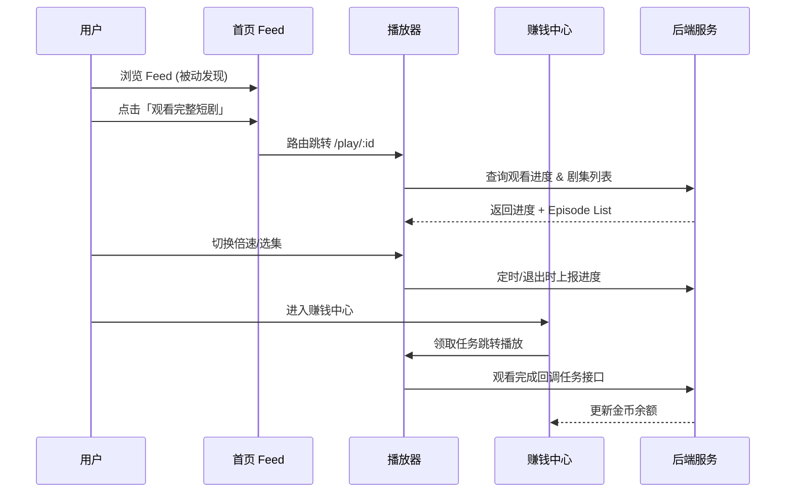
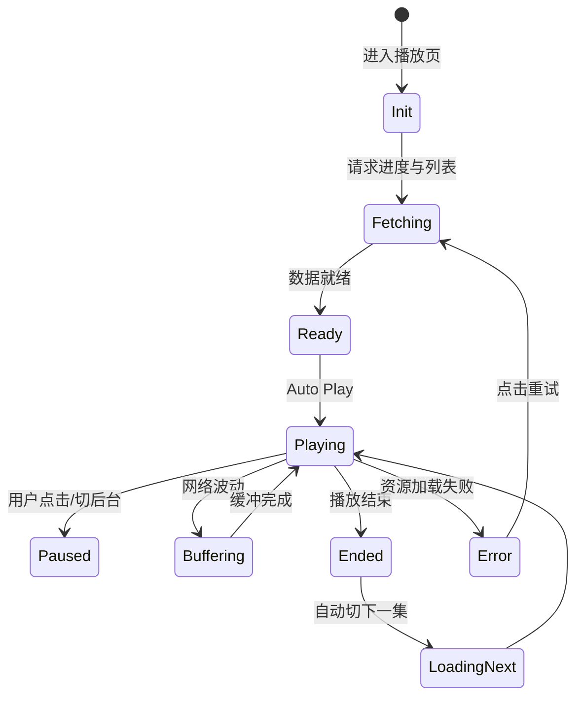
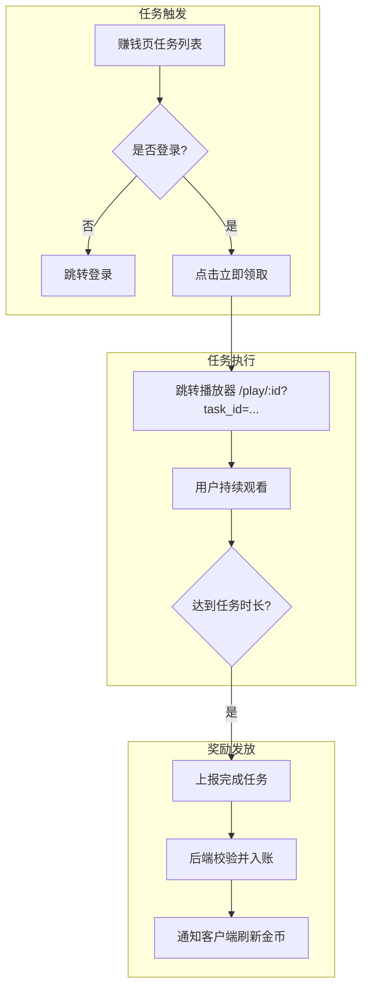
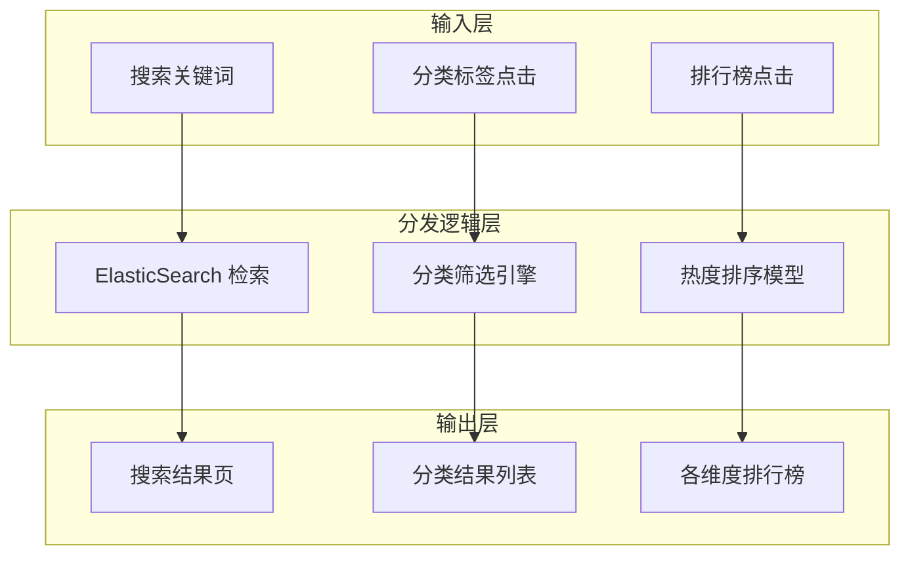
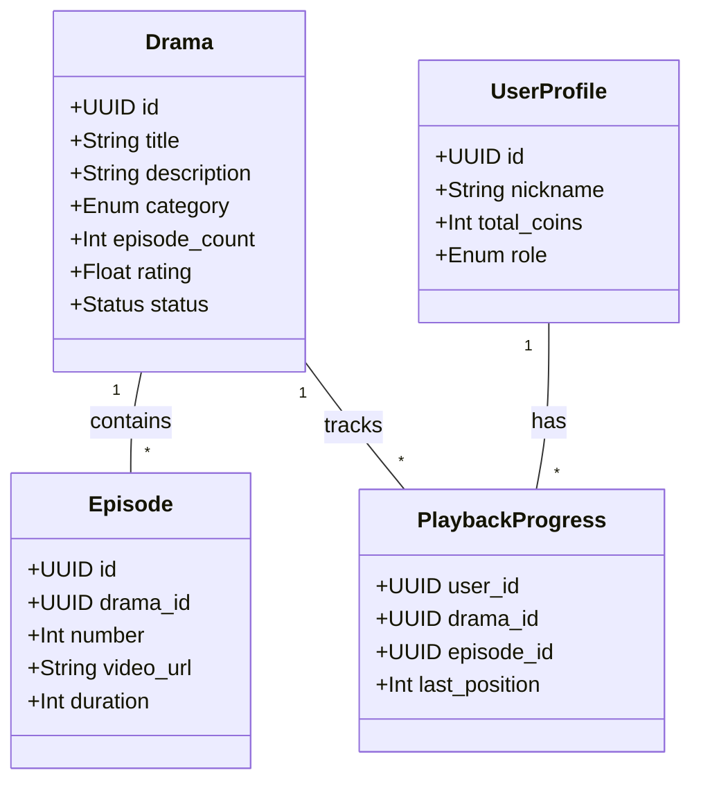

# 产品需求与业务逻辑

## 目录
1. [模块概览](#模块概览)
2. [引言](#引言)
3. [核心业务链路与用户旅程](#核心业务链路与用户旅程)
   - [发现阶段：多维度的内容触达](#发现阶段多维度的内容触达)
   - [消费阶段：沉浸式播放体验](#消费阶段沉浸式播放体验)
   - [互动阶段：社交与反馈闭环](#互动阶段社交与反馈闭环)
4. [视频播放器核心业务逻辑](#视频播放器核心业务逻辑)
   - [状态管理与生命周期](#状态管理与生命周期)
   - [断点续播的深度实现逻辑](#断点续播的深度实现逻辑)
   - [播放器交互边界与异常处理](#播放器交互边界与异常处理)
5. [激励体系：赚钱中心深度解析](#激励体系赚钱中心深度解析)
   - [金币任务系统架构](#金币任务系统架构)
   - [任务完成的验证与防作弊](#任务完成的验证与防作弊)
   - [收益提现与虚拟货币管理](#收益提现与虚拟货币管理)
6. [商业化闭环：商城与 H5 交互](#商业化闭环商城与-h5-交互)
   - [H5 容器与 Native 桥接协议](#h5-容器与-native-桥接协议)
   - [商城业务流程与登录拦截策略](#商城业务流程与登录拦截策略)
7. [内容分发体系：剧场、搜索与排行](#内容分发体系剧场搜索与排行)
   - [剧场频道的子 Tab 逻辑](#剧场频道的子-tab-逻辑)
   - [搜索算法与热搜权重模型](#搜索算法与热搜权重模型)
   - [排行榜的多维度计算](#排行榜的多维度计算)
8. [管理后台 (Admin Panel) 业务逻辑](#管理后台-admin-panel-业务逻辑)
   - [内容管理生命周期](#内容管理生命周期)
   - [基于 Supabase 的 RBAC 权限体系](#基于-supabase-的-rbac-权限体系)
9. [数据模型、API 契约与业务一致性](#数据模型api-契约与业务一致性)
   - [核心实体关系图](#核心实体关系图)
   - [状态同步与最终一致性](#状态同步与最终一致性)
10. [文件引用与参考资料](#文件引用与参考资料)

## 模块概览

本章节是对 ShortDrama 项目产品需求与业务逻辑的全面深度解析。基于对 `docs/product_manager/` 目录下 67 个核心文档（包含 20 多个独立功能 PRD）的系统化梳理，旨在为开发者提供从“产品愿景”到“代码实现”的完整映射。

**模块规模与覆盖度**：
- **文档总数**：67 个（涵盖了从项目初始化到 UI Wave 体验收口的全部过程）。
- **子模块覆盖**：
  - **核心消费层**：首页 Feed、全屏播放器、评论/点赞/收藏系统（覆盖率 100%）。
  - **内容发现层**：搜索体系、排行榜、分类浏览、剧场频道（覆盖率 100%）。
  - **增长与商业化**：赚钱中心、H5 商城、个人资产管理（覆盖率 100%）。
  - **支撑与管理层**：Admin 后台、用户角色权限、登录认证系统（覆盖率 100%）。

本章节将重点解析这些模块之间的交互边界、状态转换逻辑以及在极端情况下的业务处理策略。

## 引言

ShortDrama 不仅仅是一个简单的视频播放工具，它是一个集成了**内容消费、社交互动、任务激励、商业转化**于一体的复杂生态系统。其核心逻辑在于通过短平快的视频内容（Feed 流）吸引用户，利用任务系统（赚钱中心）留住用户，并最终通过商城和潜在的付费内容实现盈利。

对于开发者而言，理解这些业务逻辑的深度直接决定了代码的健壮性。例如，播放器不仅仅是调用 `play()` 和 `pause()`，它还涉及到复杂的进度上报、断点续播、倍速状态同步以及与赚钱中心任务回调的深度耦合。本章将逐一拆解这些逻辑背后的设计初衷。

## 核心业务链路与用户旅程

ShortDrama 的用户旅程被设计为一种“漏斗式”的转化结构。

### 发现阶段：多维度的内容触达

用户触达内容的路径分为三类：
1.  **推荐驱动（被动）**：首页 Feed 流利用算法（或初始权重）将视频推送到用户面前。这是流量最大的入口。
2.  **搜索驱动（主动）**：用户通过关键词、热搜榜或搜索历史，精准定位感兴趣的短剧。
3.  **分类/排行驱动（半主动）**：用户在剧场频道通过排行榜（热榜、新剧、预约）或标签分类（性别、时代、情节）进行探索。

### 消费阶段：沉浸式播放体验

一旦用户点击“观看完整短剧”，便进入了沉浸式消费阶段。此时，业务逻辑的重心转向了播放器的流畅度、选集的便捷性以及倍速等个性化设置。

### 互动阶段：社交与反馈闭环

在观看过程中，点赞、评论和收藏构成了互动闭环。这些行为不仅提升了用户参与度，也为后端推荐算法提供了关键的反馈数据。

**图表解析**：
该序列图展示了用户在不同模块间流转的逻辑。最关键的节点在于播放器（P）与后端服务（B）以及赚钱中心（E）之间的双向互动。播放器不仅是内容的载体，也是任务完成的验证点。

**Section sources**:
- [docs/product_manager/roadmap.md](docs/product_manager/roadmap.md)
- [docs/product_manager/prd/2026-07-25-full-player/prd.md](docs/product_manager/prd/2026-07-25-full-player/prd.md)

## 视频播放器核心业务逻辑

播放器模块（`PRD-03`）是整个 App 逻辑最密集的区域，其核心在于状态的持久化与交互的即时性。

### 状态管理与生命周期

播放器需要管理的状态包括但不限于：
- **播放状态**：`Idle`, `Loading`, `Playing`, `Paused`, `Ended`, `Error`。
- **配置状态**：倍速（`0.5x-2.0x`）、当前集数、当前进度。
- **UI 状态**：选集面板是否弹出、控制条是否隐藏、互动栏数据。

### 断点续播的深度实现逻辑

断点续播（Resume Playback）并非简单的跳转。
1.  **查询阶段**：进入页面时，并发请求剧集列表和进度。若 `GET /api/player/progress` 返回了有效的 `episode_id`，则优先定位到该集。
2.  **加载阶段**：视频加载时，若有 `start_time`，需在视频 `canplay` 事件后调用 `seek(start_time)`。
3.  **上报阶段**：
    - **心跳上报**：每 15 秒调用一次 `POST /api/player/stop`（或专门的心跳接口），防止 App 异常崩溃导致进度丢失。
    - **事件上报**：在切换集数、点击返回、App 切后台时立即触发上报。

### 播放器交互边界与异常处理

- **网络切换**：从 Wi-Fi 切换到蜂窝网络时，应自动暂停并弹出流量消耗提示（远期规划）。
- **加载失败**：提供重试逻辑，并在重试 3 次失败后引导用户检查网络或反馈。
- **资源空缺**：若某集 `video_url` 为空，在选集面板中应置灰并标记为“暂无资源”。

**图表解析**：
该状态图详细描述了播放器在各种外部干扰下的行为。特别需要注意的是 `Buffering` 和 `Error` 状态的处理，这直接关系到用户的流失率。

**Section sources**:
- [docs/product_manager/prd/2026-07-25-full-player/prd.md](docs/product_manager/prd/2026-07-25-full-player/prd.md)

## 激励体系：赚钱中心深度解析

赚钱中心（`PRD-14`）是产品的“增长引擎”，其业务逻辑围绕“任务-奖励-提现”展开。

### 金币任务系统架构

任务分为静态任务（如签到）和动态任务（如看剧）。
- **任务定义**：每个任务有 `task_type`、`reward_amount` 和 `limit_count`。
- **状态流转**：`未开始` -> `进行中` -> `待领取` -> `已领取`。

### 任务完成的验证与防作弊

为了防止用户通过接口刷金币，业务逻辑要求：
1.  **上下文校验**：从赚钱中心跳转播放器时，必须携带加密的 `task_token`。
2.  **时长校验**：后端在收到 `complete-task` 请求时，会校验该用户在对应时段内的播放器心跳记录，确保真实观看了对应时长。

### 收益提现与虚拟货币管理

首版采用虚拟金币体系，金币与现金的汇率由后端配置。
- **金币账单**：每一笔金币的产生（任务奖励）和消耗（兑换/提现）都必须记录在 `coin_transactions` 表中，确保账务可追溯。

**图表解析**：
流程图展示了从任务发现到奖励入账的闭环。逻辑的核心在于“达到任务时长”的判定，这需要播放器心跳与任务系统的深度协同。

**Section sources**:
- [docs/product_manager/prd/2026-07-25-earn-center/prd.md](docs/product_manager/prd/2026-07-25-earn-center/prd.md)

## 商业化闭环：商城与 H5 交互

商城（`PRD-13`）是 ShortDrama 的变现出口，其核心逻辑在于 H5 容器的深度集成。

### H5 容器与 Native 桥接协议

商城页面运行在 Native 提供的 Webview 中，通过 JSBridge 进行通信：
- **`openLoginPage()`**：H5 触发 Native 登录。
- **`onLoginSuccess(token)`**：Native 登录成功后回调 H5。
- **`navigate(route)`**：H5 调起 Native 的播放页或搜索页。

### 商城业务流程与登录拦截策略

商城的业务逻辑遵循“先浏览、后登录、再交易”的原则。
1.  **匿名浏览**：用户可以自由查看商品 Feed 和活动横幅。
2.  **登录拦截**：当用户点击“立即购买”、“加入购物车”或“查看订单”时，业务逻辑强制要求跳转登录。
3.  **状态同步**：登录成功后，Webview 需要重新加载或刷新 Header 中的 Token，以确保后续请求的授权。

**Section sources**:
- [docs/product_manager/prd/2026-07-25-mall/prd.md](docs/product_manager/prd/2026-07-25-mall/prd.md)

## 内容分发体系：剧场、搜索与排行

内容分发决定了内容的曝光效率。

### 剧场频道的子 Tab 逻辑

剧场频道（`PRD-12`）聚合了多个子频道。
- **动态配置**：子 Tab 的顺序和名称由后端配置下发。
- **懒加载机制**：仅在用户切换到对应 Tab 时才发起数据请求，降低服务器压力。

### 搜索算法与热搜权重模型

搜索（`PRD-04`）不仅是关键词匹配。
- **热搜榜计算**：`Score = (SearchCount * 0.6) + (ClickCount * 0.4) * TimeDecayFactor`。时间衰减因子确保了榜单的实时性。
- **搜索历史**：本地存储最近 10 条，点击即搜索，提升交互效率。

### 排行榜的多维度计算

排行榜（`PRD-05`）提供多种视角：
- **热度榜**：基于近 24 小时播放量。
- **预约榜**：基于用户点击“预约”按钮的频次。

**图表解析**：
该图展示了内容分发系统的架构。不同的用户行为被路由到不同的逻辑处理层，最终生成差异化的展示结果。

**Section sources**:
- [docs/product_manager/prd/2026-07-25-search/prd.md](docs/product_manager/prd/2026-07-25-search/prd.md)
- [docs/product_manager/prd/2026-07-25-theater-channel/prd.md](docs/product_manager/prd/2026-07-25-theater-channel/prd.md)

## 管理后台 (Admin Panel) 业务逻辑

管理后台（`PRD-15`）是系统的“控制塔”。

### 内容管理生命周期

短剧的生命周期管理包括：
1.  **草稿态**：仅在后台可见，用于编辑元数据。
2.  **上架态**：全端可见，进入推荐池。
3.  **下架态**：用户端不可见，保留历史数据。

### 基于 Supabase 的 RBAC 权限体系

利用 Supabase 的 RLS（Row Level Security）实现细粒度控制：
- **Admin**：可以修改所有表的所有记录。
- **Editor**：仅能修改 `dramas` 和 `episodes` 表，无法访问 `profiles` 表。
- **Viewer**：仅能对所有表执行 `SELECT` 操作。

**Section sources**:
- [docs/product_manager/prd/2026-07-27-admin-panel/prd.md](docs/product_manager/prd/2026-07-27-admin-panel/prd.md)

## 数据模型、API 契约与业务一致性

### 核心实体关系图

业务逻辑的底层支撑是数据模型。

**图表解析**：
实体关系图揭示了业务逻辑的骨架。`Drama` 与 `Episode` 的父子关系，以及 `UserProfile` 通过 `PlaybackProgress` 与内容的关联，构成了业务运作的基础。

### 状态同步与最终一致性

在分布式环境下（如 Native 客户端与后端 API），状态同步至关重要。
- **乐观 UI 更新**：在点赞/收藏时，客户端先变更 UI 状态，再异步请求 API。若失败则回滚。
- **幂等性请求**：所有奖励发放接口必须支持幂等，防止因网络重试导致金币多发。

## 文件引用与参考资料

**核心业务文档**：
- [docs/product_manager/roadmap.md](docs/product_manager/roadmap.md)
- [docs/product_manager/prd/2026-07-25-full-player/prd.md](docs/product_manager/prd/2026-07-25-full-player/prd.md)
- [docs/product_manager/prd/2026-07-25-earn-center/prd.md](docs/product_manager/prd/2026-07-25-earn-center/prd.md)
- [docs/product_manager/prd/2026-07-25-mall/prd.md](docs/product_manager/prd/2026-07-25-mall/prd.md)
- [docs/product_manager/prd/2026-07-27-admin-panel/prd.md](docs/product_manager/prd/2026-07-27-admin-panel/prd.md)

**技术决策参考**：
- [docs/product_manager/decisions/2026-07-25-full-prd-planning.md](docs/product_manager/decisions/2026-07-25-full-prd-planning.md)
- [docs/product_manager/decisions/2026-07-30-page-ui-alignment-splitting.md](docs/product_manager/decisions/2026-07-30-page-ui-alignment-splitting.md)
