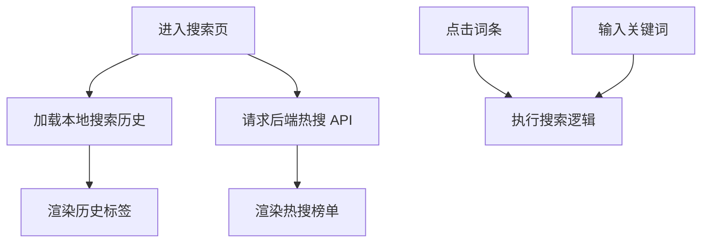
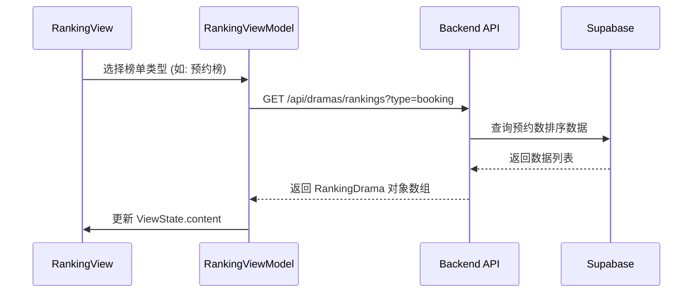
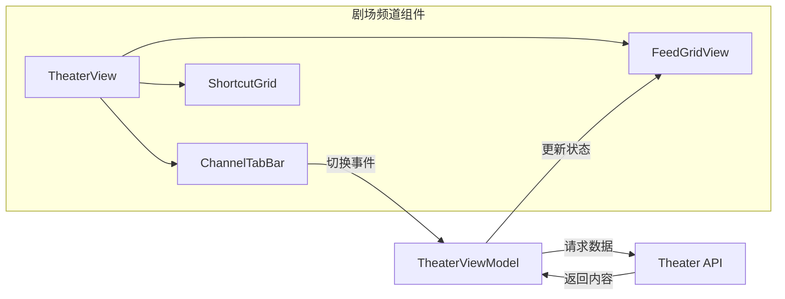
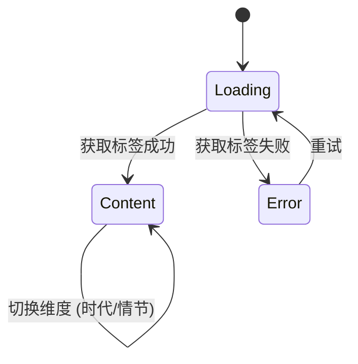
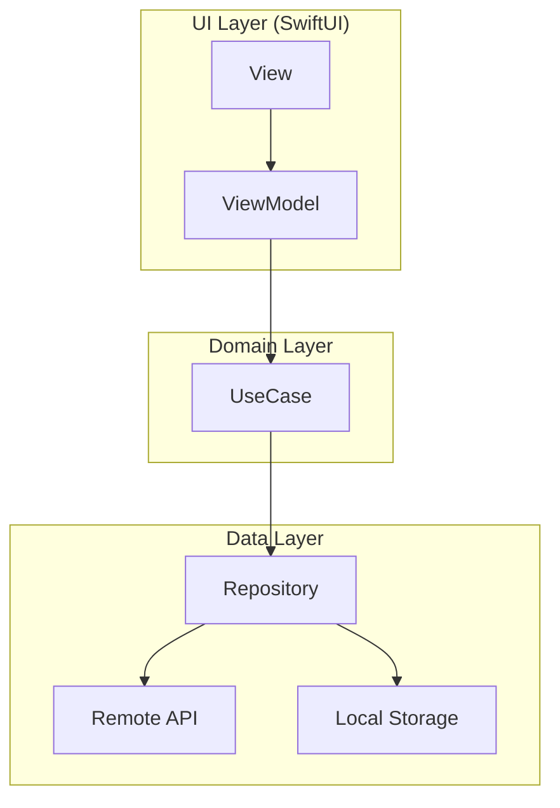

# 内容发现与分发体系逻辑

## 目录
1. [模块概览](#模块概览)
2. [引言](#引言)
3. [搜索体系逻辑](#搜索体系逻辑)
   - [热搜与搜索历史](#热搜与搜索历史)
   - [搜索结果聚合](#搜索结果聚合)
4. [排行榜体系](#排行榜体系)
   - [多维度排行逻辑](#多维度排行逻辑)
   - [预约与更新机制](#预约与更新机制)
5. [剧场频道分发](#剧场频道分发)
   - [动态 Feed 流与快捷入口](#动态-feed-流与快捷入口)
   - [频道切换与配置](#频道切换与配置)
6. [分类浏览与多维筛选](#分类浏览与多维筛选)
   - [标签体系与维度划分](#标签体系与维度划分)
7. [核心组件与实现](#核心组件与实现)
8. [架构与数据流](#架构与数据流)
9. [集成与依赖](#集成与依赖)
10. [文件参考](#文件参考)

## 模块概览

内容发现与分发体系是 ShortDrama 项目的核心业务模块，旨在通过多种路径帮助用户高效发现感兴趣的短剧内容。本模块涵盖了从主动搜索到被动推荐的全方位分发逻辑。

- **涉及文件总数**：约 45 个源文件。
- **核心子模块**：
  - **搜索 (Search)**：处理关键词检索、热搜展示及搜索历史管理。
  - **排行 (Ranking)**：实现热度榜、推荐榜、预约榜等多维度数据展示。
  - **剧场 (Theater)**：作为内容聚合中心，提供双列 Feed 流和快捷功能入口。
  - **分类 (Classification)**：基于性向、时代、情节等维度的多维标签筛选体系。

本章节将深入探讨这些子模块的实现逻辑、交互设计以及前后端协同机制。

## 引言

ShortDrama 的内容分发体系不仅仅是简单的数据展示，它构建了一个多层次的发现矩阵。用户可以通过**主动搜索**快速定位目标，通过**排行榜**紧跟潮流，通过**剧场频道**进行沉浸式浏览，或者利用**分类筛选**进行精准探索。

这种多样化的分发路径确保了不同偏好的用户都能在平台上获得良好的内容获取体验。系统通过 `TheaterViewModel`、`SearchHomeViewModel` 等核心组件，将复杂的业务逻辑与 UI 状态解耦，实现了高效的数据流转。

## 搜索体系逻辑

搜索系统是用户主动发现内容的首要入口。它不仅支持关键词匹配，还集成了热搜引导和历史记录功能，以减少用户的输入成本。

### 热搜与搜索历史

搜索首页通过 `SearchHomeViewModel` 管理状态。热搜词由后端 API 提供，反映了当前平台上的高频搜索趋势。搜索历史则存储在本地，支持快速回溯。



在 `SearchHomeViewModel.swift` 中，搜索历史的管理通过 `LoadSearchHistoryUseCase` 实现，确保了数据的持久化与即时刷新。

### 搜索结果聚合

当用户提交搜索请求时，系统会跳转至结果页。目前的匹配逻辑主要基于标题和分类标签。

> 💡 **注意**：首版搜索主要匹配 `title` 和 `category` 字段。未来的迭代计划引入更复杂的语义搜索和演员维度匹配。

**Section sources**:
- [SearchHomeViewModel.swift](ios/ShortDrama/Sources/Features/Search/ViewModels/SearchHomeViewModel.swift)
- [prd.md](docs/product_manager/prd/2026-07-25-search/prd.md)

## 排行榜体系

排行榜是基于用户行为数据的内容分发路径，通过不同维度的榜单展示短剧的热度与潜力。

### 多维度排行逻辑

排行榜分为三个主要维度：
1. **热榜 (Hot)**：基于播放量、点赞量等实时热度指标。
2. **推荐 (Recommendation)**：基于算法权重的精选内容。
3. **预约 (Booking)**：展示即将上映的短剧，支持用户提前锁定。



### 预约与更新机制

预约榜具有独特的交互逻辑。用户在登录状态下可以点击“预约”，系统会实时更新预约状态并反馈给后端。

在 `backend/src/app/api/dramas/rankings/route.ts` 中，API 接收 `type` 参数来决定返回哪种类型的榜单数据。排行数据的更新频率通常为准实时，以保证榜单的权威性。

**Section sources**:
- [RankingViewModel.swift](ios/ShortDrama/Sources/Features/Ranking/ViewModels/RankingViewModel.swift)
- [route.ts](backend/src/app/api/dramas/rankings/route.ts)

## 剧场频道分发

剧场频道是 ShortDrama 的核心内容聚合页，采用了类似“内容超市”的设计理念。

### 动态 Feed 流与快捷入口

剧场首页由顶部的频道 Tab、中间的快捷入口网格以及底部的双列 Feed 流组成。

- **双列 Feed**：展示短剧封面、标题、热度值和标签，支持瀑布流滚动加载。
- **快捷入口**：包括“筛选”、“排行”、“新剧”、“预约”，为用户提供跳转至特定功能模块的捷径。

### 频道切换与配置

`TheaterViewModel` 负责管理当前选中的频道（如：找剧、真人、动漫等）。虽然目前大部分数据集中在“找剧”频道，但系统架构已支持通过 `TheaterChannel` 枚举进行动态扩展。



剧场频道的 Feed 数据通过 `GET /api/dramas/channel` 接口获取，支持分页请求以优化性能。

**Section sources**:
- [TheaterViewModel.swift](ios/ShortDrama/Sources/Features/Theater/ViewModels/TheaterViewModel.swift)
- [prd.md](docs/product_manager/prd/2026-07-25-theater-channel/prd.md)
- [route.ts](backend/src/app/api/dramas/channel/route.ts)

## 分类浏览与多维筛选

分类页提供了更细粒度的内容探索方式，允许用户根据特定的标签组合进行筛选。

### 标签体系与维度划分

系统将标签划分为多个维度：
- **性向**：全部、男频、女频。
- **时代背景**：现代、古装、民国等。
- **情节元素**：逆袭、甜宠、虐恋、玄幻等。

`ClassificationViewModel` 通过 `FetchClassificationTagsUseCase` 获取这些维度的标签定义，并根据用户的选择实时更新展示内容。



**Section sources**:
- [ClassificationViewModel.swift](ios/ShortDrama/Sources/Features/Classification/ViewModels/ClassificationViewModel.swift)

## 核心组件与实现

以下是内容发现体系中的关键类及其职责说明：

| 组件名称 | 职责 | 关键方法 |
| :--- | :--- | :--- |
| `SearchHomeViewModel` | 管理搜索首页状态，包括历史记录和热搜。 | `loadHotSearches()`, `clearHistory()` |
| `TheaterViewModel` | 驱动剧场频道的 Feed 流和频道切换逻辑。 | `selectChannel()`, `loadMoreIfNeeded()` |
| `RankingViewModel` | 处理多维度排行榜的数据加载与预约交互。 | `selectRankingType()`, `book(drama:)` |
| `ClassificationViewModel` | 管理分类筛选维度的展示与用户交互。 | `selectGender()`, `selectDimension()` |

在 `TheaterViewModel.swift` 中，系统使用了 `ViewState` 枚举来精确控制页面的加载、内容、空态和错误状态，确保了 UI 的健壮性。

```swift
enum ViewState: Equatable {
    case loading
    case content([TheaterDrama])
    case empty
    case error(String)
}
```

**Section sources**:
- [TheaterViewModel.swift:L7-L12](ios/ShortDrama/Sources/Features/Theater/ViewModels/TheaterViewModel.swift#L7-L12)
- [SearchHomeViewModel.swift](ios/ShortDrama/Sources/Features/Search/ViewModels/SearchHomeViewModel.swift)

## 架构与数据流

整个分发体系遵循 Clean Architecture 原则，将 UI 逻辑、业务用例和数据源分离。



数据流向通常从用户交互开始，触发 ViewModel 中的方法，ViewModel 调用 UseCase，UseCase 通过 Repository 获取数据（无论是从远程 API 还是本地存储），最后数据反向流回并更新 UI 状态。

例如，在搜索历史功能中，数据流如下：
1. 用户点击搜索按钮。
2. `SearchHomeViewModel` 调用保存历史的 UseCase。
3. UseCase 协调 Repository 将关键词存入本地持久化存储。
4. ViewModel 重新加载历史列表并通知 View 刷新。

**Section sources**:
- [SearchHomeViewModel.swift](ios/ShortDrama/Sources/Features/Search/ViewModels/SearchHomeViewModel.swift)
- [TheaterViewModel.swift](ios/ShortDrama/Sources/Features/Theater/ViewModels/TheaterViewModel.swift)

## 集成与依赖

内容分发体系与系统中其他模块紧密集成：
- **播放器模块**：所有内容卡片点击后均跳转至 `/play/:dramaId`。
- **用户模块**：排行榜的“预约”功能依赖于用户的登录状态。
- **标签体系**：分类页与剧场频道的标签展示共享底层的标签元数据定义。

> ⚠️ **警告**：在进行频道切换或榜单切换时，应注意取消正在进行的网络请求，以防止竞态条件导致的数据错乱。

**Section sources**:
- [RankingViewModel.swift:L125-L129](ios/ShortDrama/Sources/Features/Ranking/ViewModels/RankingViewModel.swift#L125-L129)
- [TheaterViewModel.swift:L137-L151](ios/ShortDrama/Sources/Features/Theater/ViewModels/TheaterViewModel.swift#L137-L151)

## 文件参考

以下是本模块涉及的关键源文件列表：

- **PRD 文档**:
  - `docs/product_manager/prd/2026-07-25-theater-channel/prd.md`
  - `docs/product_manager/prd/2026-07-25-search/prd.md`
- **iOS ViewModels**:
  - `ios/ShortDrama/Sources/Features/Theater/ViewModels/TheaterViewModel.swift`
  - `ios/ShortDrama/Sources/Features/Search/ViewModels/SearchHomeViewModel.swift`
  - `ios/ShortDrama/Sources/Features/Search/ViewModels/SearchResultViewModel.swift`
  - `ios/ShortDrama/Sources/Features/Ranking/ViewModels/RankingViewModel.swift`
  - `ios/ShortDrama/Sources/Features/Classification/ViewModels/ClassificationViewModel.swift`
- **Backend APIs**:
  - `backend/src/app/api/dramas/rankings/route.ts`
  - `backend/src/app/api/dramas/channel/route.ts`
- **iOS Views (部分)**:
  - `ios/ShortDrama/Sources/Features/Theater/Views/TheaterView.swift`
  - `ios/ShortDrama/Sources/Features/Search/Views/SearchHomeView.swift`
  - `ios/ShortDrama/Sources/Features/Ranking/Views/RankingHomeView.swift`
  - `ios/ShortDrama/Sources/Features/Classification/Views/ClassificationHomeView.swift`
