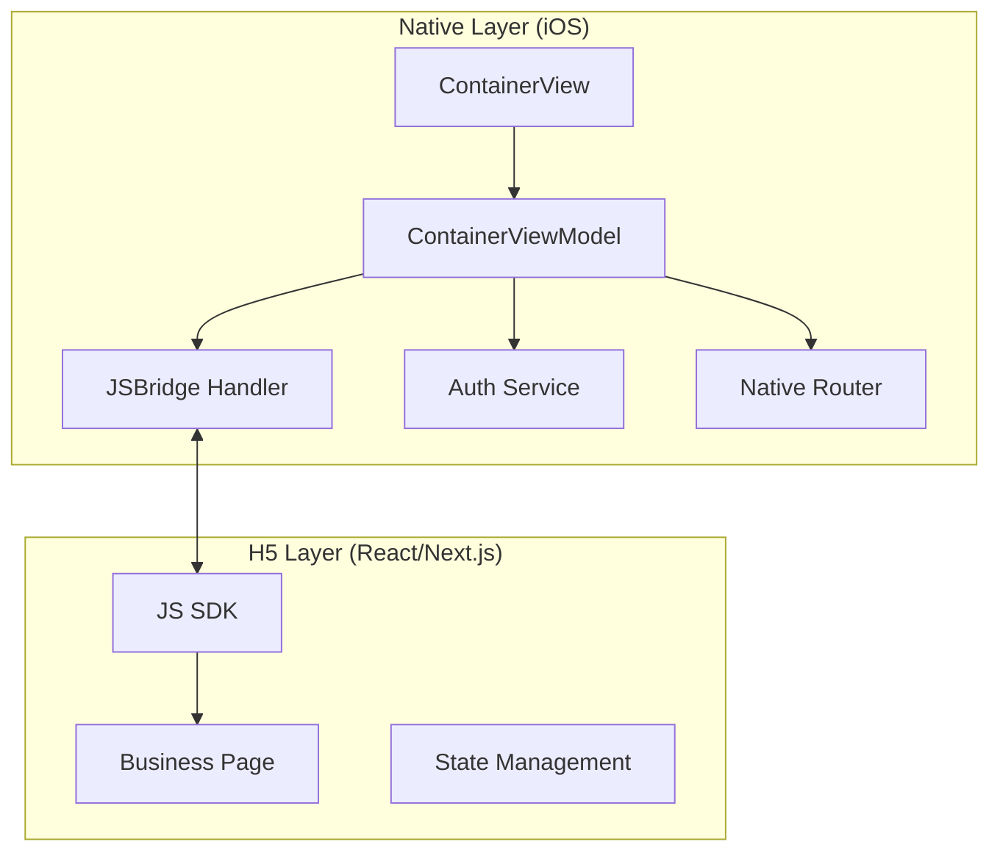
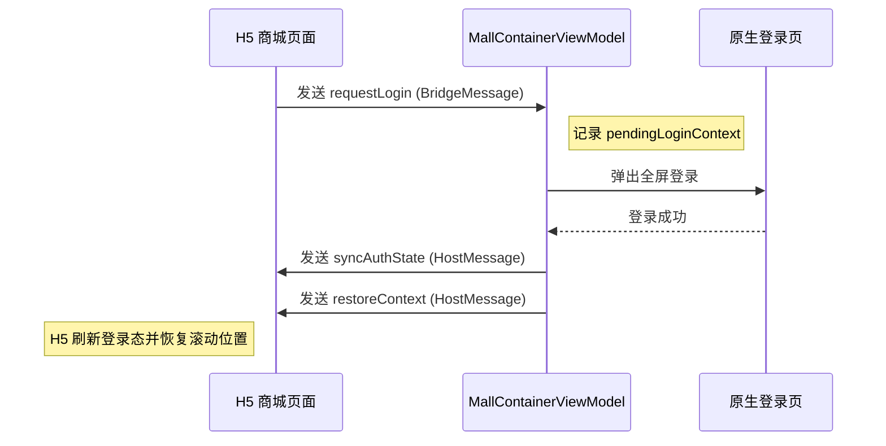
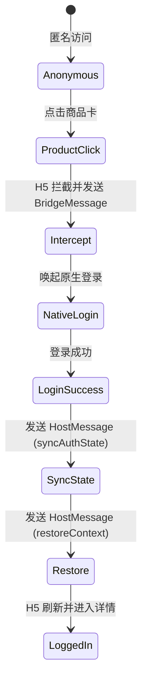
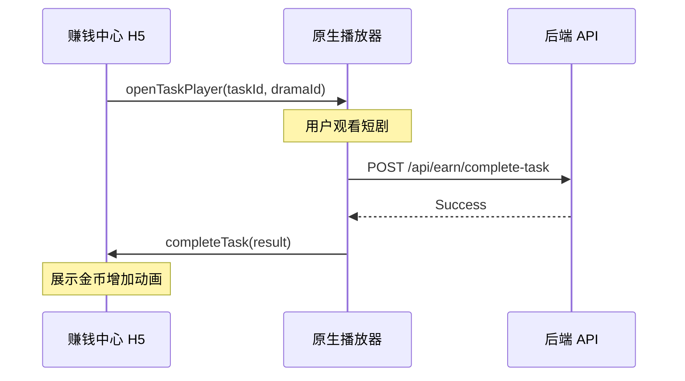
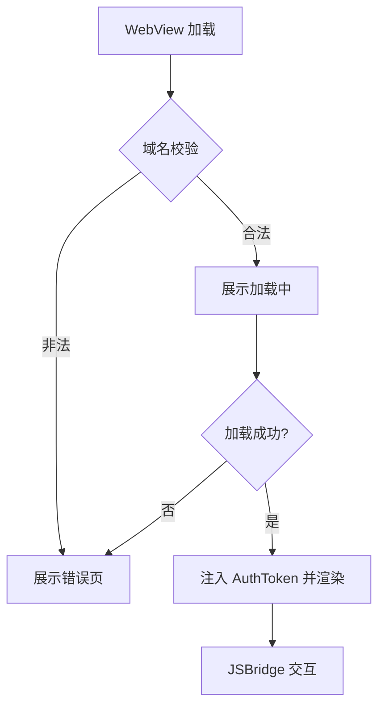

# 商城与激励系统业务逻辑

## 目录
1. [模块概览](#模块概览)
2. [引言](#引言)
3. [架构设计](#架构设计)
   - [Hybrid 容器架构](#hybrid-容器架构)
   - [JSBridge 通信机制](#jsbridge-通信机制)
4. [核心组件](#核心组件)
   - [原生容器 ViewModel](#原生容器-viewmodel)
   - [通信协议模型](#通信协议模型)
5. [商城业务逻辑](#商城业务逻辑)
   - [功能组成](#功能组成)
   - [登录拦截机制](#登录拦截机制)
6. [激励系统业务逻辑](#激励系统业务逻辑)
   - [任务系统生命周期](#任务系统生命周期)
   - [金币与收益展示](#金币与收益展示)
7. [API 与数据交互](#api-与数据交互)
   - [接口定义与契约](#接口定义与契约)
   - [数据同步策略](#数据同步策略)
8. [集成与安全性](#集成与安全性)
   - [容器安全加固](#容器安全加固)
   - [异常恢复与降级](#异常恢复与降级)
9. [性能优化考量](#性能优化考量)
10. [文件引用](#文件引用)

## 模块概览

本章节涵盖了 ShortDrama 应用中的两大商业化核心模块：**商城 (Mall)** 与 **赚钱中心 (Earn Center)**。这两个模块均采用了高度集成的 Hybrid 架构，通过原生容器承载 H5 页面，并利用自定义的 JSBridge 协议实现复杂的业务逻辑交互。

### 统计信息
- **涉及文件总数**: 约 22 个核心源文件
- **主要子目录**:
  - `ios/ShortDrama/Sources/Features/Mall`: 商城原生容器实现，包含视图模型、桥接消息定义及 UI 组件。
  - `ios/ShortDrama/Sources/Features/Earn`: 赚钱中心原生容器实现，负责任务流转与金币状态同步。
  - `backend/src/app/api/mall`: 商城相关 API 接口，提供商品分发能力。
  - `backend/src/app/api/earn`: 激励系统相关 API 接口，处理任务概览与进度上报。
  - `docs/product_manager/prd`: 业务需求定义文档，明确了商城与赚钱中心的功能边界。

### 覆盖范围
本 Wiki 将深入解析 Hybrid 容器的生命周期管理、JSBridge 的协议设计、商城登录拦截流以及激励系统的任务闭环逻辑。读者将了解到原生端如何通过状态同步与上下文恢复，为 H5 业务提供接近原生的流畅体验。

## 引言

在移动应用开发中，商城和激励系统通常具有高频迭代、活动运营驱动的特点。ShortDrama 选择了 **Hybrid (混合开发)** 架构来构建这两个模块，以平衡开发效率与用户体验。

- **商城 (Mall)**：作为应用的核心变现渠道，通过商品 Feed 流、活动横幅和快捷入口实现流量转化。其核心挑战在于如何在 H5 环境下无缝调用原生的登录和搜索能力，同时保持双列瀑布流的高性能渲染。
- **赚钱中心 (Earn Center)**：作为用户留存的关键引擎，通过金币任务（如看剧时长、签到）驱动用户活跃。其核心挑战在于跨端任务进度的实时同步与状态恢复，确保用户在切换播放器与任务中心时，奖励发放准确无误。

通过统一的容器化方案，原生端（iOS/Android）负责提供稳定的运行时环境、权限控制和高性能组件（如播放器、登录页），而 H5 端负责灵活的 UI 布局和业务规则编排。这种“强容器、轻业务”的设计模式，使得商业化活动可以实现“分钟级”的上线和调整。

## 架构设计

### Hybrid 容器架构

ShortDrama 的 Hybrid 方案基于 `WKWebView` 构建，每个业务模块拥有独立的 `ContainerViewModel` 来管理页面状态、URL 请求以及与 H5 的消息传递。

下面的架构图展示了原生容器与 H5 页面之间的层级关系及职责划分。理解这一层级结构对于定位跨端交互问题至关重要。



在原生层，`ContainerViewModel` 是整个架构的指挥中心。它不仅持有 `URLRequest`，还负责监听应用生命周期（如 `appResumed`）以触发状态同步。H5 层通过 `JS SDK` 发送指令，经由 `JSBridge Handler` 解析后分发给原生的 `Auth`（登录）或 `Router`（跳转）服务。这种解耦设计允许 H5 和 Native 独立演进。

### JSBridge 通信机制

通信协议分为 **BridgeMessage**（H5 到 Native）和 **HostMessage**（Native 到 H5）两个方向。这种双向通信闭环是实现复杂交互的基础。

下面的序列图展示了一个典型的 JSBridge 交互流程，以商城登录拦截为例。该流程体现了原生端如何接管 H5 的高权限操作。



该流程确保了用户在 H5 页面操作时，如果触发了需要原生权限的行为（如登录），原生端能够介入并接管流程，处理完成后再精准地将控制权和状态信息交还给 H5。特别地，`restoreContext` 消息能够让 H5 知道自己是从哪个原生页面返回的，从而执行特定的 UI 恢复逻辑。

**架构设计来源**:
- [MallContainerViewModel.swift](ios/ShortDrama/Sources/Features/Mall/ViewModels/MallContainerViewModel.swift)
- [EarnContainerViewModel.swift](ios/ShortDrama/Sources/Features/Earn/ViewModels/EarnContainerViewModel.swift)

## 核心组件

### 原生容器 ViewModel

`MallContainerViewModel` 和 `EarnContainerViewModel` 是实现 Hybrid 逻辑的核心类。它们通过 `@Published` 属性驱动 SwiftUI 视图更新，并封装了复杂的生命周期逻辑。

```swift
// 示例：商城容器 ViewModel 的核心逻辑
@MainActor
final class MallContainerViewModel: ObservableObject {
    @Published private(set) var state: MallContainerState = .loading
    @Published private(set) var hostMessage: MallHostMessage?
    
    // 同步登录态到 H5
    private func syncAuthState(reason: String) {
        hostMessage = .syncAuthState(
            MallHostAuthState(
                source: "mall",
                isLoggedIn: isUserLoggedIn,
                reason: reason,
                returnTarget: "/mall"
            )
        )
    }

    // 处理来自 H5 的消息
    func handleBridgeMessage(_ message: MallBridgeMessage) {
        switch message {
        case .openSearch(let context):
            routeEffect = .openSearch(context)
        case .requestLogin(let context):
            guard pendingLoginContext == nil else { return }
            pendingLoginContext = context
            routeEffect = .requestLogin(context)
        }
    }
}
```

ViewModel 采用了“单向数据流”的思想：所有来自 H5 的指令都会转化为 `routeEffect`，触发原生 UI 的变更；而原生的状态变更则通过 `hostMessage` 异步推送到 H5。这种模式极大地降低了状态冲突的可能性。

### 通信协议模型

协议模型定义在 `Models/` 目录下，使用 Swift 的 `Codable` 协议进行 JSON 序列化，确保了跨端数据传输的类型安全。

- **MallBridgeMessage**: 包含 `openSearch`（打开原生搜索）和 `requestLogin`（请求登录拦截）。
- **EarnBridgeMessage**: 包含 `requestLogin` 和 `openTaskPlayer`（打开任务播放器）。
- **HostMessage**: 包含 `syncAuthState`（同步登录态）和 `restoreContext`（恢复上下文），后者包含 `preserveScroll` 等控制位。

**核心组件来源**:
- [MallContainerViewModel.swift:L4-L80](ios/ShortDrama/Sources/Features/Mall/ViewModels/MallContainerViewModel.swift#L4-L80)
- [EarnContainerViewModel.swift:L4-L91](ios/ShortDrama/Sources/Features/Earn/ViewModels/EarnContainerViewModel.swift#L4-L91)
- [MallBridgeMessage.swift](ios/ShortDrama/Sources/Features/Mall/Models/MallBridgeMessage.swift)

## 商城业务逻辑

### 功能组成

根据 [PRD：商城](docs/product_manager/prd/2026-07-25-mall/prd.md) 的定义，商城页面由以下核心组件构成，旨在打造一个完整的电商导购入口：
1. **搜索栏**: 位于顶部，点击后通过 JSBridge 触发原生搜索页跳转，支持搜索词传递。
2. **快捷入口**: 包含“我的订单”、“优惠券”、“我的钱包”等 5 个网格入口，首版以 Toast 占位为主，预留了未来的 native 跳转逻辑。
3. **双列 Feed 流**: 采用瀑布流布局展示商品卡片，包含商品图、标题、价格等核心要素。
4. **活动横幅 (Banners)**: 运营配置的轮播图，支持自动切换和点击跳转。

### 登录拦截机制

商城中最关键的业务逻辑是**登录拦截**。当匿名用户点击商品卡片试图进入详情页时，H5 不会直接跳转，而是拦截该操作并通知原生端。

> **设计决策**: 为什么不在 H5 实现登录？
> 为了保证用户账号体系的安全性与统一性，所有登录行为必须由原生 SDK 处理。H5 仅作为触发源，通过 `requestLogin` 协议将拦截权交给 Native。这样可以复用原生的登录验证、风控和多端同步能力。



这种机制确保了用户在登录后的体验是连贯的。`restoreContext` 负载中的 `preserveScroll: true` 参数保证了用户登录回来后依然停留在刚才点击的商品位置，避免了页面重置带来的挫败感。

**业务逻辑来源**:
- [prd.md:L65-L79](docs/product_manager/prd/2026-07-25-mall/prd.md#L65-L79)
- [MallContainerViewModel.swift:L94-L104](ios/ShortDrama/Sources/Features/Mall/ViewModels/MallContainerViewModel.swift#L94-L104)

## 激励系统业务逻辑

### 任务系统生命周期

赚钱中心的核心是任务系统。用户通过完成特定任务（如“看剧 5 分钟”、“每日签到”）获取金币奖励。

任务的生命周期是一个跨端协作的过程：
1. **任务发现**: H5 渲染任务列表，根据后端返回的 `status` 显示“去完成”或“领奖励”。
2. **任务触发**: 用户点击“去完成”，H5 发送 `openTaskPlayer`，携带 `task_id` 和剧集 ID。
3. **任务执行**: 原生播放器承接播放。播放器在后台计时，并在达到任务要求时长时自动触发上报。
4. **任务上报**: 播放完成后，原生端调用 `handleTaskPlayerResult`，通过 `completeTask` 接口告知后端。
5. **奖励发放**: 原生端向 H5 发送 `completeTask` 消息，H5 触发金币掉落动画并更新本地余额。



### 金币与收益展示

首版实现中，金币系统采用虚拟货币定义，不涉及真实的现金提现。顶部收益头图展示用户的累计金币数，增强用户的获得感。
- **后端接口**: `GET /api/earn/overview` 返回用户的任务进度（如签到天数）和当前余额。
- **实时性**: 任务完成后，通过 JSBridge 立即通知 H5 更新 UI，无需全量刷新页面，保证了激励反馈的即时性。

**激励系统来源**:
- [prd.md:L57-L68](docs/product_manager/prd/2026-07-25-earn-center/prd.md#L57-L68)
- [EarnContainerViewModel.swift:L113-L124](ios/ShortDrama/Sources/Features/Earn/ViewModels/EarnContainerViewModel.swift#L113-L124)
- [route.ts](backend/src/app/api/earn/overview/route.ts)

## API 与数据交互

商城与激励系统的后端实现遵循 RESTful 规范，并集成了统一的错误处理与权限校验中间件。

### 接口定义与契约

| 接口路径 | 方法 | 描述 | 关键参数 |
| :--- | :--- | :--- | :--- |
| `/api/mall/products` | GET | 获取商品列表 | `page`, `pageSize` |
| `/api/earn/overview` | GET | 获取任务概览与收益 | `auth` (可选) |
| `/api/earn/complete-task` | POST | 上报任务完成状态 | `taskId`, `duration` |

### 数据同步策略

1. **H5 自主请求**: H5 页面加载时直接请求后端 API 获取业务数据（如商品 Feed、任务列表）。
2. **原生辅助授权**: 涉及敏感操作（如完成任务）时，由原生端代为发起请求，或者通过 `syncAuthState` 将最新的 `apiAccessToken` 注入到 H5 环境，确保 H5 的 API 请求具备正确的授权头。
3. **状态回传**: 当原生端完成登录或任务后，通过 `HostMessage` 机制将关键结果回传给 H5，触发 H5 的局部数据刷新。

**API 来源**:
- [backend/src/app/api/mall/products/route.ts](backend/src/app/api/mall/products/route.ts)
- [backend/src/app/api/earn/overview/route.ts](backend/src/app/api/earn/overview/route.ts)

## 集成与安全性

为了确保 Hybrid 架构在复杂的网络环境和业务场景下依然稳定可靠，系统实现了多层安全加固机制。

### 容器安全加固

1. **域名白名单**: 容器仅允许加载由 `AppConfig` 定义的官方域名，防止恶意网页注入或钓鱼攻击。
2. **Token 生命周期管理**: `EarnContainerViewModel` 负责监听 Token 过期，并通过 `syncAuthState` 实时更新 H5 的授权状态，避免 H5 使用过期 Token 导致 API 调用失败。
3. **上下文隔离**: H5 无法直接访问原生存储（如 UserDefaults）或敏感 API，必须通过经过校验的 JSBridge 接口进行通信。

### 异常恢复与降级

当 H5 页面加载失败或网络中断时，原生容器会展示 `MallContainerStateView`。
- **重试机制**: 提供显式的重试按钮，点击后调用 ViewModel 的 `reload()` 方法。
- **状态兜底**: 如果 H5 无法加载，原生端会展示占位 UI 或提示信息，确保应用不会出现“白屏”现象。



**安全性来源**:
- [MallContainerViewModel.swift:L138-L161](ios/ShortDrama/Sources/Features/Mall/ViewModels/MallContainerViewModel.swift#L138-L161)
- [EarnContainerViewModel.swift:L137-L148](ios/ShortDrama/Sources/Features/Earn/ViewModels/EarnContainerViewModel.swift#L137-L148)

## 性能优化考量

为了在 Hybrid 容器中实现丝滑的滚动和交互体验，代码中体现了以下优化点：

1. **预加载策略**: `loadInitialPage` 在容器初始化时即触发，减少了用户点击 Tab 后的等待时间。
2. **滚动位置保持**: 通过 `preserveScroll` 参数，在 Native-H5 切换时精确恢复滚动位置，消除了视觉上的跳变。
3. **按需刷新**: 通过 `syncAuthState` 的 `reason` 参数（如 `app-resume`、`login-success`），H5 可以判断是否需要全量刷新数据还是仅更新登录状态。
4. **资源缓存**: `WKWebView` 默认利用了原生缓存机制，对于商城中的商品图片和静态资源进行了有效缓存，降低了带宽消耗。

## 文件引用

以下是构建商城与激励系统涉及的关键源文件，建议在查阅代码时按此列表进行：

**产品文档 (PRDs)**:
- [docs/product_manager/prd/2026-07-25-mall/prd.md](docs/product_manager/prd/2026-07-25-mall/prd.md)
- [docs/product_manager/prd/2026-07-25-earn-center/prd.md](docs/product_manager/prd/2026-07-25-earn-center/prd.md)

**iOS 原生容器 (Mall)**:
- [ios/ShortDrama/Sources/Features/Mall/ViewModels/MallContainerViewModel.swift](ios/ShortDrama/Sources/Features/Mall/ViewModels/MallContainerViewModel.swift)
- [ios/ShortDrama/Sources/Features/Mall/Models/MallBridgeMessage.swift](ios/ShortDrama/Sources/Features/Mall/Models/MallBridgeMessage.swift)
- [ios/ShortDrama/Sources/Features/Mall/Views/MallContainerView.swift](ios/ShortDrama/Sources/Features/Mall/Views/MallContainerView.swift)

**iOS 原生容器 (Earn)**:
- [ios/ShortDrama/Sources/Features/Earn/ViewModels/EarnContainerViewModel.swift](ios/ShortDrama/Sources/Features/Earn/ViewModels/EarnContainerViewModel.swift)
- [ios/ShortDrama/Sources/Features/Earn/Models/EarnBridgeMessage.swift](ios/ShortDrama/Sources/Features/Earn/Models/EarnBridgeMessage.swift)
- [ios/ShortDrama/Sources/Features/Earn/Views/EarnContainerView.swift](ios/ShortDrama/Sources/Features/Earn/Views/EarnContainerView.swift)

**后端接口 (Backend)**:
- [backend/src/app/api/mall/products/route.ts](backend/src/app/api/mall/products/route.ts)
- [backend/src/app/api/earn/overview/route.ts](backend/src/app/api/earn/overview/route.ts)
- [backend/src/app/api/earn/complete-task/route.ts](backend/src/app/api/earn/complete-task/route.ts)
