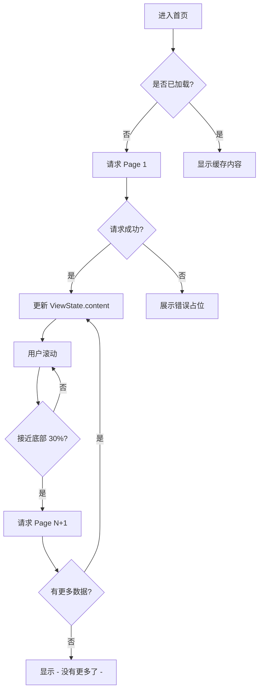
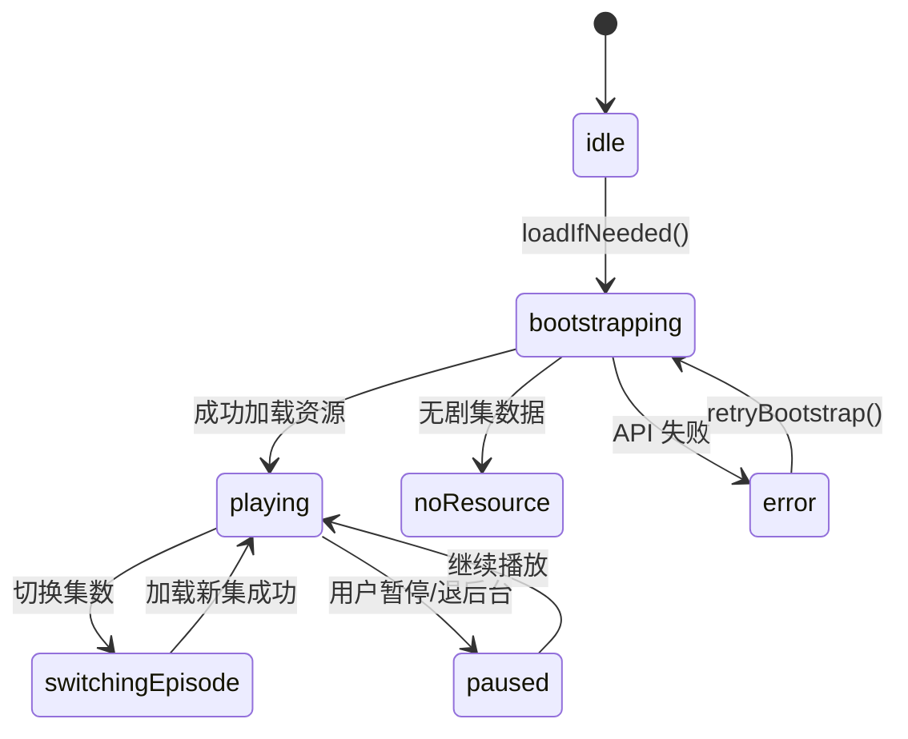
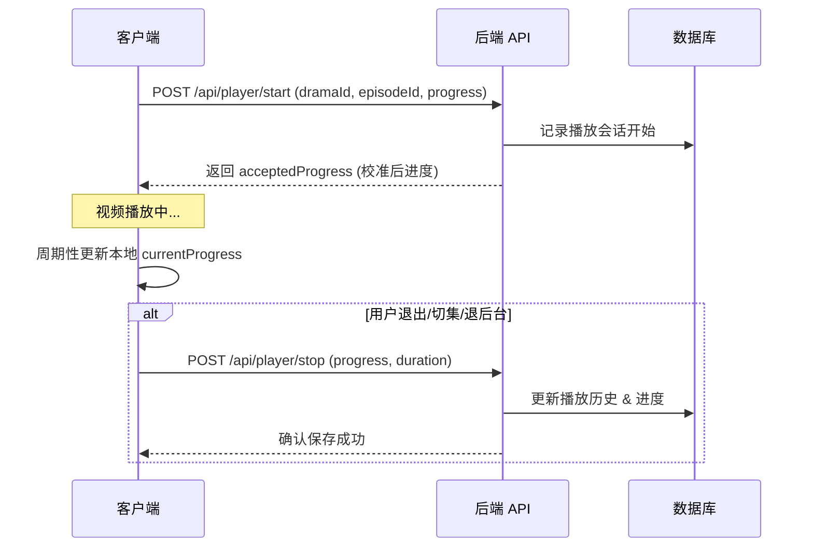
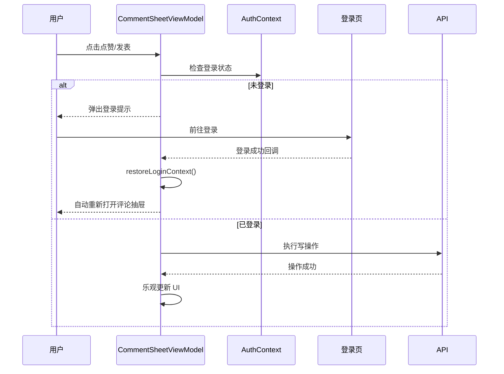

# 播放器与 Feed 流消费逻辑

## 目录
1. [模块概览](#模块概览)
2. [核心架构与数据流](#核心架构与数据流)
3. [首页 Feed 流消费逻辑](#首页-feed-流消费逻辑)
   - [分页加载与预加载策略](#分页加载与预加载策略)
   - [卡片交互与跳转链路](#卡片交互与跳转链路)
4. [播放器核心机制](#播放器核心机制)
   - [播放器状态机设计](#播放器状态机设计)
   - [断点续播 (Breakpoint Resume) 实现](#断点续播-breakpoint-resume-实现)
   - [播放进度同步与持久化策略](#播放进度同步与持久化策略)
5. [播放器交互组件与 UI 实现](#播放器交互组件与-ui-实现)
   - [选集面板与剧集切换](#选集面板与剧集切换)
   - [倍速控制与播放速率同步](#倍速控制与播放速率同步)
6. [评论系统实现](#评论系统实现)
   - [二级评论结构与分页加载](#二级评论结构与分页加载)
   - [登录拦截与操作恢复机制](#登录拦截与操作恢复机制)
7. [后端 API 契约与服务层实现](#后端-api-契约与服务层实现)
8. [异常处理与重试机制](#异常处理与重试机制)
9. [性能优化与体验细节](#性能优化与体验细节)
10. [文件索引](#文件索引)

## 模块概览

ShortDrama 的内容消费体验主要由首页 Feed 流和完整播放器两大部分组成。首页 Feed 流负责内容的初步分发与快速浏览，而播放器则承载了沉浸式的观看体验及深度的社交互动（如选集、倍速、长评论等）。

本模块涉及 iOS 客户端的三个核心特性目录及后端相关 API，共计约 55 个核心源码文件：
- **iOS 播放器模块** (`ios/.../Features/Player`): 包含播放器状态管理、UI 组件（选集、倍速、进度条）及原生播放器封装。涵盖 15+ 文件。
- **iOS 首页模块** (`ios/.../Features/Home`): 负责 Feed 流的瀑布流渲染、分页加载逻辑及全局弹窗管理。涵盖 10+ 文件。
- **iOS 评论模块** (`ios/.../Features/Comments`): 实现二级评论结构、排序过滤及登录状态敏感的交互拦截。涵盖 12+ 文件。
- **后端 API** (`backend/.../api/player` & `backend/.../api/dramas`): 提供播放进度同步、剧集列表及评论管理接口。涵盖 10+ 文件。

## 核心架构与数据流

内容消费模块采用了典型的 MVVM 架构，通过 UseCase 层解耦业务逻辑与数据仓库。

以下图表展示了用户从首页发现内容到进入播放器观看并互动的完整链路：

```mermaid
graph TB
    subgraph "客户端 (iOS)"
        HomeVM[HomeViewModel] -->|触发跳转| PlayerVM[PlayerViewModel]
        HomeVM -->|触发评论| CommentVM[CommentSheetViewModel]
        PlayerVM -->|共享| CommentVM
        
        subgraph "UI 组件"
            HomeView[HomeView / Feed]
            PlayerView[PlayerView]
            CommentSheet[CommentSheetView]
        end
        
        HomeVM -.-> HomeView
        PlayerVM -.-> PlayerView
        CommentVM -.-> CommentSheet
    end
    
    subgraph "领域层 (UseCases)"
        FetchDramas[FetchDramasUseCase]
        PlayerProgress[FetchPlayerProgressUseCase]
        StartPlayback[StartPlaybackUseCase]
        SyncProgress[StopPlaybackUseCase]
    end
    
    subgraph "后端 (Backend)"
        DramaAPI[/api/dramas]
        ProgressAPI[/api/player/progress]
        PlaybackAPI[/api/player/start/stop]
    end
    
    HomeVM --> FetchDramas --> DramaAPI
    PlayerVM --> PlayerProgress --> ProgressAPI
    PlayerVM --> StartPlayback --> PlaybackAPI
    PlayerVM --> SyncProgress --> PlaybackAPI
```

在这个流程中，`HomeViewModel` 负责驱动首页的 Feed 展示。当用户点击“去看”或卡片区域时，通过 `NavigationRouter` 跳转至 `PlayerView`。`PlayerViewModel` 在初始化时会并行请求播放进度和剧集列表，确保用户能从上次离开的位置继续观看。评论系统作为一个半屏抽屉，既可以从首页直接唤起，也可以在播放器内无缝切换，两者共享底层的 `CommentSheetViewModel` 逻辑。

**Diagram sources**:
- [HomeViewModel.swift](ios/ShortDrama/Sources/Features/Home/ViewModels/HomeViewModel.swift)
- [PlayerViewModel.swift](ios/ShortDrama/Sources/Features/Player/ViewModels/PlayerViewModel.swift)
- [CommentSheetViewModel.swift](ios/ShortDrama/Sources/Features/Comments/ViewModels/CommentSheetViewModel.swift)

## 首页 Feed 流消费逻辑

首页 Feed 流是 ShortDrama 的流量入口，其核心目标是实现极致的浏览流畅度。

### 分页加载与预加载策略

Feed 流采用无限滚动分页加载机制。`HomeViewModel` 默认每页请求 10 条数据（`pageSize = 10`）。为了保证用户滑动的连续性，系统在逻辑上将加载过程分为“首屏加载”和“分页追加”。



流程图展示了 `HomeViewModel` 如何处理分页逻辑。当用户滚动到列表底部约 30% 的位置时，会触发下一页的静默加载。这种预加载机制极大地减少了用户在浏览过程中的停顿感。

### 卡片交互与跳转链路

每个 Feed 卡片（`HomeDramaCardView`）都包含一个右侧交互栏和底部 CTA 区域。
- **右侧交互栏**: 提供“观看”、“评论”、“详情”快捷入口。
- **底部 CTA**: 醒目的“观看完整漫剧”按钮，直接链接到播放器的核心流程。

当用户点击跳转时，`HomeViewModel` 会通过 `onPlay` 回调执行路由跳转，将 `dramaId` 传递给播放器模块。

**Section sources**:
- [HomeViewModel.swift](ios/ShortDrama/Sources/Features/Home/ViewModels/HomeViewModel.swift)
- [HomeDramaCardView.swift](ios/ShortDrama/Sources/Features/Home/Views/Components/HomeDramaCardView.swift)

## 播放器核心机制

播放器是整个应用中最复杂的交互单元，涉及多维度的状态切换和同步。

### 播放器状态机设计

`PlayerViewModel` 使用 `UiState` 枚举管理播放器的完整生命周期。这种显式状态机设计确保了 UI 能够根据加载阶段、错误情况或资源状态做出正确响应。



状态机从 `idle` 开始，进入 `bootstrapping` 阶段进行资源初始化。如果剧集列表为空，则进入 `noResource` 状态；如果加载过程中出现网络错误，则进入 `error` 状态并提供重试入口。在正常播放期间，切换集数会进入短暂的 `switchingEpisode` 状态以显示加载指示器。

### 断点续播 (Breakpoint Resume) 实现

为了提升用户体验，系统必须记录并恢复用户的观看进度。这一逻辑在 `PlayerViewModel.performBootstrap` 中实现：

1.  **获取进度**: 调用 `fetchPlayerProgressUseCase` 从后端获取该短剧最近一次的 `episodeId` 和 `startTime`。
2.  **解析剧集**: 调用 `fetchDramaEpisodesUseCase` 获取全集列表。
3.  **决策逻辑**:
    - 如果后端返回了有效的历史记录，且该集在当前可播放列表中，则定位到该集。
    - 如果无历史记录，则默认从第一集开始。
4.  **上报开始**: 调用 `startPlaybackUseCase` 通知后端开始播放，并获取校准后的起始进度。

### 播放进度同步与持久化策略

播放进度的同步遵循“开始-停止”模型，旨在减少不必要的网络开销，同时保证数据的准确性。



该序列图展示了播放进度的上报逻辑。`acceptedProgress` 的返回非常关键，它允许后端根据业务逻辑（如广告点、非法进度纠正）对客户端上报的起始位置进行校准。停止上报时，客户端会计算 `normalizedProgress`（确保在 0 到总时长之间），以保证持久化数据的合法性。

**Section sources**:
- [PlayerViewModel.swift](ios/ShortDrama/Sources/Features/Player/ViewModels/PlayerViewModel.swift)
- [PlayerView.swift](ios/ShortDrama/Sources/Features/Player/Views/PlayerView.swift)
- [progress/route.ts](backend/src/app/api/player/progress/route.ts)

## 播放器交互组件与 UI 实现

播放器界面（`PlayerView`）采用了沉浸式设计，通过多个子组件协同工作。

### 选集面板与剧集切换

`EpisodePickerSheet` 提供了一个半屏弹窗，展示所有可播放剧集。
- **切换逻辑**: 当用户选择新剧集时，`PlayerViewModel` 会取消当前的 `switchEpisodeTask`（如果存在），并执行 `performEpisodeSwitch`。
- **平滑过渡**: 切换过程中，UI 会进入 `switchingEpisode` 状态，显示加载指示器并暂时禁用操作，防止并发切换导致的竞态条件。

### 倍速控制与播放速率同步

系统支持从 0.5x 到 2.0x 的 7 档倍速。
- **实现方式**: `PlayerViewModel` 维护 `playbackRate` 状态，该状态直接绑定到 `NativeVideoPlayerView` 的播放速率参数。
- **持久化**: 目前倍速仅在单次播放会话中生效，不进行跨剧集持久化（根据 PRD 第一阶段定义）。

**Section sources**:
- [PlayerView.swift](ios/ShortDrama/Sources/Features/Player/Views/PlayerView.swift)
- [EpisodePickerSheet.swift](ios/ShortDrama/Sources/Features/Player/Views/Components/EpisodePickerSheet.swift)

## 评论系统实现

评论系统作为一个独立的特性模块，支持在首页 Feed 和播放器中无缝切换。

### 二级评论结构与分页加载

`CommentSheetViewModel` 负责管理评论列表的生命周期。为了处理可能的高并发请求，系统引入了 `requestToken` 机制。

```mermaid
flowchart TD
    A[触发加载更多] --> B{是否正在加载?}
    B -->|是| C[忽略请求]
    B -->|否| D[生成新 requestToken]
    D --> E[发起 API 请求 Page N+1]
    E --> F{Token 是否匹配?}
    F -->|否| G[丢弃结果 (陈旧请求)]
    F -->|是| H[追加评论列表]
    H --> I[更新分页状态 (currentPage, totalPages)]
```

这种 Token 匹配机制有效防止了快速滚动或频繁切换排序方式时出现的“数据串线”问题。

### 登录拦截与操作恢复机制

对于点赞和发表评论等写操作，系统会进行登录状态检查。如果用户未登录，会触发 `requireLogin` 效应。



该流程展示了 ShortDrama 如何处理匿名用户的互动尝试。系统通过 `restoreLoginContext` 恢复评论抽屉的上下文环境，让用户在登录后能够立刻看到之前感兴趣的内容并手动完成操作。

**Section sources**:
- [CommentSheetViewModel.swift](ios/ShortDrama/Sources/Features/Comments/ViewModels/CommentSheetViewModel.swift)
- [CommentSheetView.swift](ios/ShortDrama/Sources/Features/Comments/Views/CommentSheetView.swift)

## 后端 API 契约与服务层实现

后端通过 `PlayerService` 和 `CommentService` 承载业务逻辑。

| 接口路径 | 方法 | 说明 | 关键参数 |
| :--- | :--- | :--- | :--- |
| `/api/player/progress` | `GET` | 获取断点续播进度 | `dramaId` |
| `/api/dramas/:id/episodes` | `GET` | 获取剧集列表 | `id` (Drama ID) |
| `/api/player/start` | `POST` | 开始播放上报 | `dramaId`, `episodeId`, `progress` |
| `/api/player/stop` | `POST` | 停止播放上报 | `dramaId`, `episodeId`, `progress`, `duration` |
| `/api/dramas/:id/comments` | `GET` | 评论列表 | `page`, `pageSize`, `sort` |

后端服务层使用 `withErrorHandler` 中间件统一处理异常，并结合 `requireAuthContext` 确保写操作的安全性。

## 异常处理与重试机制

内容消费模块在多个层级实现了容错机制：
1.  **UI 层重试**: 当 `PlayerViewModel` 或 `HomeViewModel` 进入 `error` 状态时，UI 会展示重试按钮，点击后重新触发 `bootstrap` 或 `load` 流程。
2.  **网络层容错**: 播放进度上报（`stopPlayback`）采用 `bestEffort` 模式，即如果上报失败，系统不会阻塞用户的退出操作，而是优先保证交互流畅度。
3.  **空状态处理**: 针对无剧集资源（`noResource`）或无评论（`empty`）的情况，系统提供了专门的占位视图，引导用户浏览其他内容。

## 性能优化与体验细节

1.  **乐观更新**: 在评论点赞和 Feed 点赞中，UI 会立即响应用户点击，随后在后台异步同步至服务器。
2.  **任务取消**: 在切换剧集或重新排序评论时，系统会显式取消之前的异步任务（`Task.cancel()`），避免资源浪费。
3.  **生命周期感知**: `PlayerView` 通过 `scenePhase` 监听 App 前后台切换，自动处理暂停和进度保存。
4.  **指纹校验**: 进度上报引入 `StopFingerprint` 校验，只有在进度发生实质性变化时才触发 API 调用，降低服务器负载。

## 文件索引

以下是本模块涉及的核心文件列表：

- **PRD 文档**:
  - [full-player/prd.md](docs/product_manager/prd/2026-07-25-full-player/prd.md)
  - [homepage-feed/prd.md](docs/product_manager/prd/2026-07-25-homepage-feed/prd.md)
  - [comments/prd.md](docs/product_manager/prd/2026-07-25-comments/prd.md)
- **iOS ViewModels**:
  - [PlayerViewModel.swift](ios/ShortDrama/Sources/Features/Player/ViewModels/PlayerViewModel.swift)
  - [HomeViewModel.swift](ios/ShortDrama/Sources/Features/Home/ViewModels/HomeViewModel.swift)
  - [CommentSheetViewModel.swift](ios/ShortDrama/Sources/Features/Comments/ViewModels/CommentSheetViewModel.swift)
- **iOS Views**:
  - [PlayerView.swift](ios/ShortDrama/Sources/Features/Player/Views/PlayerView.swift)
  - [HomeView.swift](ios/ShortDrama/Sources/Features/Home/Views/HomeView.swift)
  - [CommentSheetView.swift](ios/ShortDrama/Sources/Features/Comments/Views/CommentSheetView.swift)
- **后端 API**:
  - [player/progress/route.ts](backend/src/app/api/player/progress/route.ts)
  - [dramas/[id]/comments/route.ts](backend/src/app/api/dramas/[id]/comments/route.ts)
