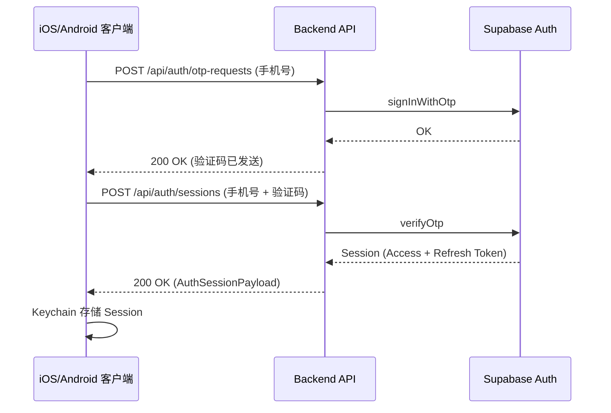
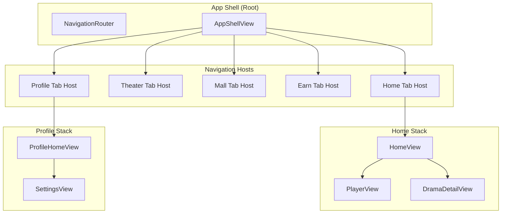
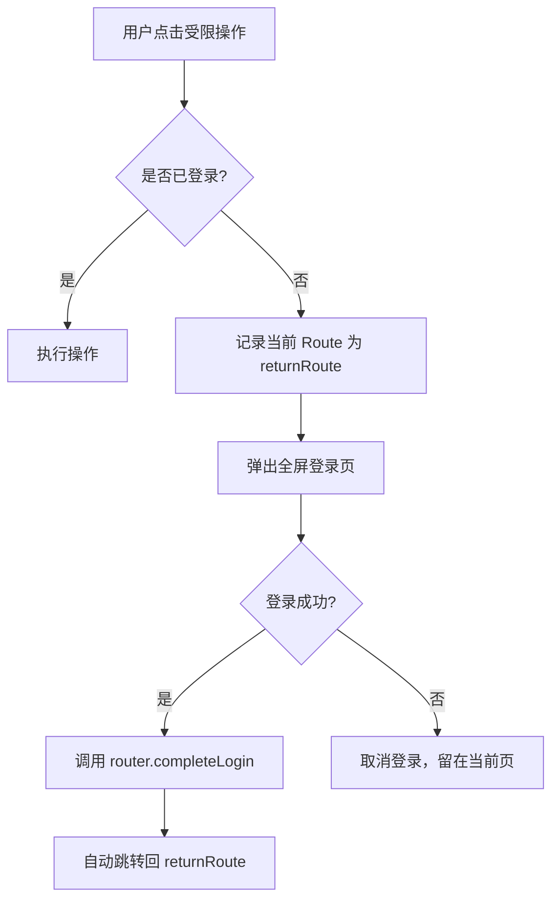
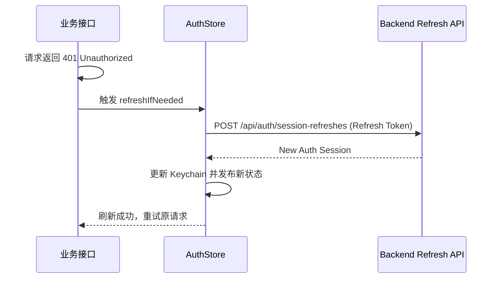

# 核心业务流程与用户体系

## 目录
1. [模块概览](#模块概览)
2. [引言](#引言)
3. [核心组件](#核心组件)
   - [认证与会话管理 (Auth & Session)](#认证与会话管理-auth--session)
   - [导航与路由控制 (Navigation & Routing)](#导航与路由控制-navigation--routing)
   - [个人资产与个人中心 (Assets & Profile)](#个人资产与个人中心-assets--profile)
   - [签到与消息系统 (Sign-in & Messages)](#签到与消息系统-sign-in--messages)
4. [架构概览](#架构概览)
   - [认证流程架构](#认证流程架构)
   - [多 Tab 导航架构](#多-tab-导航架构)
5. [关键业务逻辑分析](#关键业务逻辑分析)
   - [登录拦截与回跳机制](#登录拦截与回跳机制)
   - [Token 自动刷新流程](#token-自动刷新流程)
   - [签到弹窗策略](#签到弹窗策略)
6. [API 与数据模型](#api-与数据模型)
7. [集成点与跨端对齐](#集成点与跨端对齐)
8. [文件引用](#文件引用)

## 模块概览

本模块是 ShortDrama 系统的基石，涵盖了从用户身份识别到业务导流的完整闭环。经过对代码库的系统探索，该模块涉及约 35-40 个核心源文件，分布在后端 API、iOS 客户端以及产品需求文档中。

**文件统计与分布：**
- **后端 (Backend)**: 约 10 个文件，主要集中在 `backend/src/app/api/auth/`、`backend/src/services/auth/` 以及签到/消息相关的 API 目录下。
- **iOS 客户端**: 约 20 个文件，涵盖了 `ios/ShortDrama/Sources/Features/Auth/`、`ios/ShortDrama/Sources/App/` (路由与壳工程) 以及 `ios/ShortDrama/Sources/Features/Profile/`。
- **文档 (Docs)**: 约 10 个文件，包含 PRD 和技术方案规格说明。

**覆盖范围：**
本 wiki 将深入解析以下子模块：
- **认证体系 (Auth)**: 重点讲解基于 Supabase 的 OTP 登录、Session 管理及 Token 刷新。
- **导航架构 (Navigation)**: 详解 5 Tab 结构、独立导航栈管理以及全局路由分发。
- **用户资产 (User Assets)**: 介绍预约列表、下载入口及个人中心的状态流转。
- **激励与通知 (Sign-in & Messages)**: 解析冷启动签到弹窗逻辑与双分区消息中心实现。

## 引言

核心业务流程与用户体系模块（Core Business & User System）承担着 ShortDrama 应用的“骨架”与“灵魂”作用。它不仅定义了用户如何进入应用（登录注册）、如何在应用内移动（导航路由），还决定了用户如何沉淀价值（个人资产与激励）。

在 ShortDrama 的设计哲学中，我们采用了**“匿名优先，登录增强”**的策略。用户在未登录状态下仍可浏览首页 Feed 和部分短剧，但诸如评论、预约、查看消息等深度交互行为将触发**登录拦截**。这一设计旨在降低用户进入门槛，同时通过功能引导提升转化率。

**核心术语说明：**
- **OTP (One-Time Password)**: 一次性动态验证码，用于手机号快速登录。
- **Auth Session**: 包含 Access Token 和 Refresh Token 的会话对象。
- **Navigation Stack**: 每个 Tab 拥有的独立导航路径，确保切换 Tab 时状态不丢失。
- **Login Interception**: 当匿名用户执行受限操作时，系统自动弹出登录页并在成功后返回原操作点的机制。

## 核心组件

### 认证与会话管理 (Auth & Session)

认证体系是整个用户系统的核心，负责处理用户的登录、登出以及会话的持久化。

#### iOS 端：AuthStore
`AuthStore` 是移动端认证状态的唯一事实来源，它管理着 `AuthStatus` 枚举状态（`.anonymous`, `.authenticated`, `.refreshing`, `.expired`）。

```swift
@MainActor
final class AuthStore: ObservableObject {
    @Published private(set) var status: AuthStatus = .anonymous
    @Published private(set) var currentUser: AuthUser?

    private let sessionStore: AuthSessionStore
    
    // 恢复登录态
    func restoreIfNeeded() async {
        guard let session = try sessionStore.load() else {
            applyAnonymousState()
            return
        }
        // ... 校验与刷新逻辑
    }

    // 处理登录成功
    func handleLoginSuccess(_ session: AuthSession) async throws {
        try sessionStore.save(session)
        applyAuthenticatedState(session)
    }
}
```

#### 后端：AuthService
后端通过代理 Supabase Auth 提供统一的 API。`AuthService` 负责与 Supabase 通讯，并返回标准化的响应格式。

```typescript
export class AuthService {
  async sendOtp(input: SendOtpRequest) {
    // 调用 Supabase 发送短信验证码
  }

  async refreshSession(input: RefreshAuthSessionRequest) {
    // 使用 Refresh Token 获取新 Session
  }
}
```

### 导航与路由控制 (Navigation & Routing)

ShortDrama 采用典型的 5 Tab 底部导航结构，通过 `NavigationRouter` 和 `AppRoute` 实现精细化的路由控制。

#### NavigationRouter
`NavigationRouter` 负责维护每个 Tab 的 `NavigationPath`，确保各 Tab 间的导航互不干扰。

```swift
final class NavigationRouter: ObservableObject {
    @Published var selectedTab: AppTab = .home
    @Published private(set) var pathsByTab: [AppTab: NavigationPath] = AppTab.allCases.reduce(into: [:]) {
        $0[$1] = NavigationPath()
    }

    func navigate(to route: AppRoute) {
        let tab = route.owningTab
        selectedTab = tab
        var path = pathsByTab[tab] ?? NavigationPath()
        path.append(route)
        pathsByTab[tab] = path
    }
}
```

### 个人资产与个人中心 (Assets & Profile)

用户资产模块管理用户的预约、下载和历史记录。`ProfileViewModel` 监听 `AuthStore` 的状态变化，动态展示用户信息或登录引导。

- **预约管理**: 用户在剧集详情页或排行页点击预约后，数据持久化至后端，并在 `BookingAssetsView` 中分类展示。
- **个人中心**: `ProfileHomeView` 提供设置、预约、消息等入口，并根据登录态展示不同的 UI。

### 签到与消息系统 (Sign-in & Messages)

该子模块负责用户留存与互动提醒。

- **签到系统**: `HomeViewModel` 在冷启动时通过 `evaluateCheckInPopupIfNeeded()` 评估是否展示 7 日签到浮层。
- **消息中心**: `MessageCenterView` 采用双分区设计，系统消息对所有人可见，互动消息仅对登录用户可见。

**Section sources**:
- [AuthStore.swift](ios/ShortDrama/Sources/Features/Auth/AuthStore.swift)
- [NavigationRouter.swift](ios/ShortDrama/Sources/App/NavigationRouter.swift)
- [AppRoute.swift](ios/ShortDrama/Sources/App/AppRoute.swift)
- [backend/src/app/api/auth/session/route.ts](backend/src/app/api/auth/session/route.ts)

## 架构概览

### 认证流程架构

ShortDrama 的认证流程采用了“客户端 - 后端代理 - Supabase”的三层架构。这种设计隐藏了 Supabase 的敏感信息，并允许后端进行统一的限流和错误处理。

下面的序列图展示了从发送 OTP 到建立会话的完整过程：



该流程从用户输入手机号开始，后端 `AuthService` 接收到请求后调用 Supabase Auth 的 SDK 发起验证码发送。验证阶段，后端再次代理验证逻辑，并在成功后将包含双 Token 的 `AuthSession` 返回给客户端。客户端使用 Keychain 进行持久化存储，以确保安全性。

**Diagram sources**:
- [backend/src/app/api/auth/otp-requests/route.ts](backend/src/app/api/auth/otp-requests/route.ts)
- [backend/src/app/api/auth/sessions/route.ts](backend/src/app/api/auth/sessions/route.ts)
- [ios/ShortDrama/Sources/Features/Auth/AuthStore.swift](ios/ShortDrama/Sources/Features/Auth/AuthStore.swift)

### 多 Tab 导航架构

应用采用多栈导航模式，每个 Tab 都有自己独立的路由历史。



`AppShellView` 作为根容器，持有全局唯一的 `NavigationRouter`。每个 `TabNavigationHostView` 内部封装了一个 `NavigationStack`，其 `path` 绑定到 `NavigationRouter` 中对应的 `pathsByTab` 条目。这种结构允许用户在不同 Tab 之间切换时，保留每个 Tab 内部的页面层级（例如在首页看剧时切到个人中心，再切回首页时仍停留在播放页）。

**Diagram sources**:
- [AppShellView.swift](ios/ShortDrama/Sources/App/AppShellView.swift)
- [TabNavigationHostView.swift](ios/ShortDrama/Sources/App/TabNavigationHostView.swift)
- [NavigationRouter.swift](ios/ShortDrama/Sources/App/NavigationRouter.swift)

## 关键业务逻辑分析

### 登录拦截与回跳机制

为了提升用户体验，ShortDrama 实现了“无感拦截”逻辑。当用户点击需要登录的功能（如“预约”）时，`NavigationRouter` 会捕获当前的上下文并弹出登录页。



在 `NavigationRouter.swift` 中，`presentLogin(context:)` 方法接收一个 `LoginInterceptionContext`，其中包含了 `returnRoute`。登录成功后，`completeLogin()` 会根据该上下文自动执行 `navigate(to: returnRoute)`，确保用户流的连贯性。

### Token 自动刷新流程

为了保持长期的登录态，系统实现了基于 401 拦截的自动刷新机制。



`AuthStore` 监控所有 API 请求的错误。一旦捕获到特定的业务错误码（如 `AUTH_ACCESS_TOKEN_EXPIRED`），它会尝试使用本地存储的 `refreshToken` 调用后端的刷新接口。如果刷新成功，新的 Token 会被无缝更新；如果失败，用户将被降级为匿名态。

### 签到弹窗策略

签到系统遵循“账号优先，设备兜底”的原则。

1. **触发时机**: 仅在 App 冷启动进入首页且首页数据加载完成后触发。
2. **资格检查**: 调用 `GET /api/check-ins/status`。后端根据 `Authorization` 或 `X-Installation-Id` 计算签到进度。
3. **本地过滤**: 即使后端返回 `should_show_popup: true`，客户端仍会检查本地标记（如 `dismissed.<server_date>`），如果用户在同一业务日内已手动关闭过弹窗，则不再弹出。

**Section sources**:
- [NavigationRouter.swift:L183-L231](ios/ShortDrama/Sources/App/NavigationRouter.swift#L183-L231)
- [AuthStore.swift:L88-L101](ios/ShortDrama/Sources/Features/Auth/AuthStore.swift#L88-L101)
- [HomeViewModel.swift](ios/ShortDrama/Sources/Features/Home/ViewModels/HomeViewModel.swift)

## API 与数据模型

### 核心数据模型

| 模型名称 | 描述 | 关键字段 |
|---------|-----|---------|
| `AuthUser` | 用户基础信息 | `id`, `phone`, `displayName`, `avatarUrl` |
| `AuthSession` | 会话对象 | `accessToken`, `refreshToken`, `expiresAt`, `user` |
| `AppRoute` | 路由定义 | `Hashable` 枚举，定义了所有跳转目标及其所属 Tab |
| `CheckInStatus` | 签到状态 | `todaySigned`, `currentStreak`, `shouldShowPopup`, `days` |

### 关键 API 定义

- **认证类**:
  - `POST /api/auth/otp-requests`: 发送短信验证码。
  - `POST /api/auth/sessions`: 验证并建立会话。
  - `POST /api/auth/session-refreshes`: 刷新 Access Token。
  - `DELETE /api/auth/session`: 退出登录。
- **业务类**:
  - `GET /api/check-ins/status`: 获取签到板信息。
  - `POST /api/check-ins`: 执行签到动作。
  - `GET /api/messages/system`: 获取系统消息列表。
  - `GET /api/messages/interaction`: 获取互动消息列表（需认证）。

**Section sources**:
- [backend/src/app/api/auth/_helpers.ts](backend/src/app/api/auth/_helpers.ts)
- [docs/specs/2026-07-29-prd-10-signin-messages/spec.md](docs/specs/2026-07-29-prd-10-signin-messages/spec.md)

## 集成点与跨端对齐

### iOS 与后端的认证集成
iOS 客户端通过 `AuthStore` 与后端 API 进行深度集成。`KeychainAuthSessionStore` 确保了 Token 在应用重启后的持久性，而 `AuthStore` 的 `@Published` 属性则驱动了整个 UI 层的响应式更新。

### 跨端路由对齐
为了确保 Deeplink 和运营活动的统一，iOS、Android 和 Web 端在 `AppRoute` 的命名规范上保持了严格对齐。例如，播放页在所有端均映射为 `play/:id` 模式。在 iOS 中，这通过 `AppRoute.publicRouteName` 计算属性来实现。

### 登录回跳的统一处理
无论是从首页的评论拦截进入登录，还是从消息页的门槛点击进入，系统都复用了 `NavigationRouter` 的 `presentLogin` 链路。这种高度抽象的拦截机制使得新增受限功能时的开发成本极低。

## 文件引用

以下是本模块涉及的关键源文件，按功能领域划分：

**认证与会话 (Auth)**
- [backend/src/app/api/auth/session/route.ts](backend/src/app/api/auth/session/route.ts)
- [backend/src/app/api/auth/session-refreshes/route.ts](backend/src/app/api/auth/session-refreshes/route.ts)
- [backend/src/app/api/auth/otp-requests/route.ts](backend/src/app/api/auth/otp-requests/route.ts)
- [ios/ShortDrama/Sources/Features/Auth/AuthStore.swift](ios/ShortDrama/Sources/Features/Auth/AuthStore.swift)
- [ios/ShortDrama/Sources/Features/Auth/ViewModels/LoginViewModel.swift](ios/ShortDrama/Sources/Features/Auth/ViewModels/LoginViewModel.swift)

**导航与路由 (Navigation)**
- [ios/ShortDrama/Sources/App/AppRoute.swift](ios/ShortDrama/Sources/App/AppRoute.swift)
- [ios/ShortDrama/Sources/App/NavigationRouter.swift](ios/ShortDrama/Sources/App/NavigationRouter.swift)
- [ios/ShortDrama/Sources/App/AppShellView.swift](ios/ShortDrama/Sources/App/AppShellView.swift)
- [ios/ShortDrama/Sources/App/TabNavigationHostView.swift](ios/ShortDrama/Sources/App/TabNavigationHostView.swift)

**业务与激励 (Business & Incentives)**
- [docs/product_manager/prd/2026-07-25-login/prd.md](docs/product_manager/prd/2026-07-25-login/prd.md)
- [docs/product_manager/prd/2026-07-25-user-assets/prd.md](docs/product_manager/prd/2026-07-25-user-assets/prd.md)
- [docs/product_manager/prd/2026-07-25-signin-messages/prd.md](docs/product_manager/prd/2026-07-25-signin-messages/prd.md)
- [ios/ShortDrama/Sources/Features/Profile/ViewModels/ProfileViewModel.swift](ios/ShortDrama/Sources/Features/Profile/ViewModels/ProfileViewModel.swift)
- [backend/src/app/api/users/me/route.ts](backend/src/app/api/users/me/route.ts)
