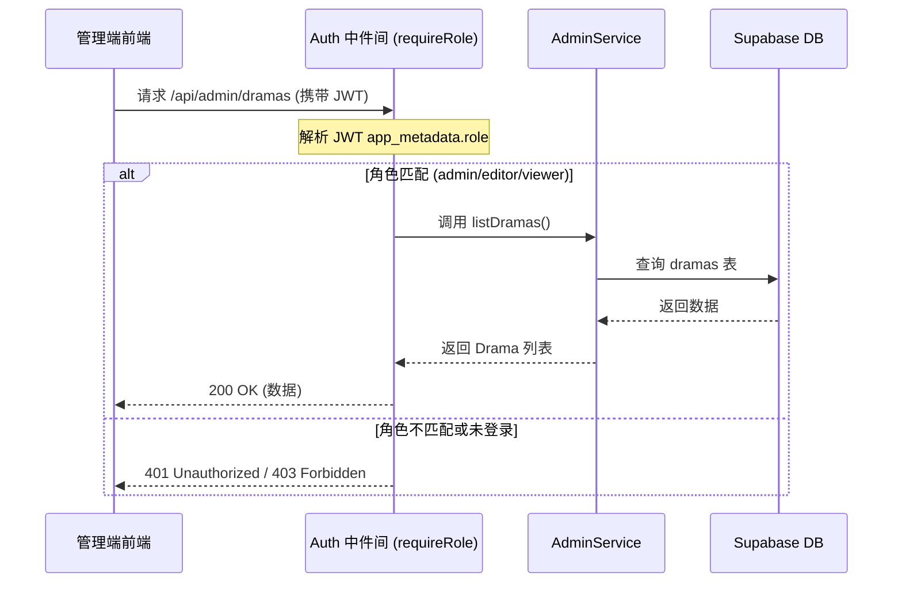
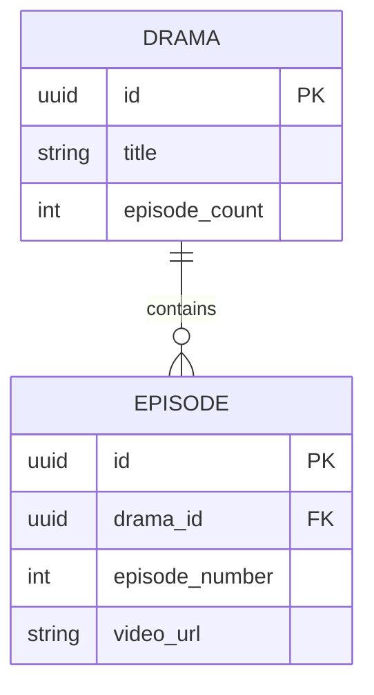
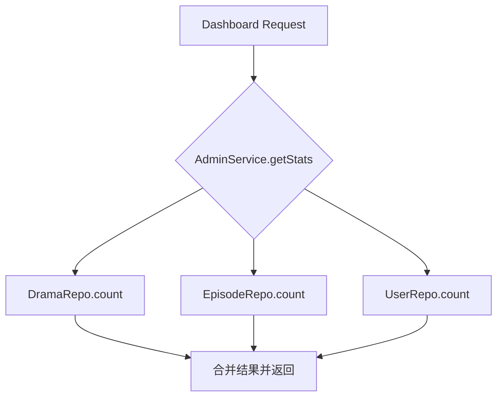
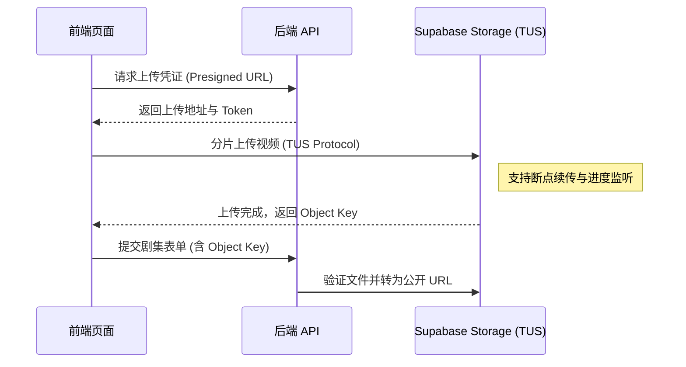

# 管理后台业务逻辑

## 目录
1. [模块概览](#模块概览)
2. [引言](#引言)
3. [架构设计](#架构设计)
   - [基于角色的访问控制 (RBAC)](#基于角色的访问控制-rbac)
   - [鉴权与授权流程](#鉴权与授权流程)
4. [核心组件](#核心组件)
   - [AdminService：业务逻辑核心](#adminservice业务逻辑核心)
   - [Repository 层：数据持久化](#repository-层数据持久化)
5. [内容管理逻辑](#内容管理逻辑)
   - [短剧与剧集的关联维护](#短剧与剧集的关联维护)
   - [级联删除与数据一致性](#级联删除与数据一致性)
6. [数据统计与看板](#数据统计与看板)
   - [指标聚合方案](#指标聚合方案)
7. [文件上传处理策略](#文件上传处理策略)
   - [当前方案：手动 URL 管理](#当前方案手动-url-管理)
   - [进阶方案：大文件断点续传 (TUS)](#进阶方案大文件断点续传-tus)
8. [数据模型定义](#数据模型定义)
9. [文件引用](#文件引用)

## 模块概览

管理后台（Admin Panel）是 ShortDrama 项目中负责内容运营、用户管理及数据监控的核心模块。该模块通过一套完整的管理 API 实现了对系统资源的精细化控制。

- **文件总数**：约 20 个核心文件（包含 API 路由、服务层、仓库层及中间件）。
- **核心子目录**：
  - `backend/src/app/api/admin/`：管理端 API 路由入口，按功能划分为 `auth`、`dramas`、`episodes`、`stats` 和 `users`。
  - `backend/src/services/admin/`：封装了管理后台的业务逻辑。
  - `backend/src/middleware/`：包含关键的鉴权中间件 `auth.ts`。
- **覆盖范围**：本章节将深度解析管理后台的 RBAC 权限体系、内容 CRUD 逻辑的实现细节、数据统计的聚合方案以及针对大文件上传的技术演进路径。

## 引言

管理后台的主要目标是为运营人员提供可视化的操作界面，以取代直接操作数据库或 mock 数据的低效方式。它在系统中扮演着“控制中枢”的角色，确保只有具备相应权限的人员才能修改核心业务数据。

在 ShortDrama 系统中，管理后台不仅负责基础的增删改查（CRUD），还承担了数据一致性维护（如剧集数自动更新）和业务指标统计的任务。通过集成 Supabase Auth 和自定义中间件，该模块构建了一个安全、可扩展的权限管理体系。

## 架构设计

管理后台采用了典型的分层架构，从外到内依次为：API 路由层、中间件层、服务层和仓库层。

### 基于角色的访问控制 (RBAC)

系统定义了三种核心角色，每种角色对应不同的权限范围：
- **超级管理员 (admin)**：拥有最高权限，可管理所有内容、查看统计看板并分配用户角色。
- **内容编辑 (editor)**：负责内容的日常上架与维护，可进行短剧和剧集的 CRUD 操作，但无权管理用户。
- **普通查看者 (viewer)**：仅拥有只读权限，可浏览内容列表和统计数据，无法发起任何写操作。

### 鉴权与授权流程

管理后台的安全性基于 Supabase Auth 实现。当管理员登录时，系统会验证其邮箱和密码，并返回一个包含角色信息的 JWT。

下面的序列图展示了一个受保护的 API 请求是如何被处理的：



在上述流程中，`requireRole` 中间件起到了关键的守门员作用。它从请求头中提取 Bearer Token，通过 Supabase Admin SDK 验证其合法性，并检查 JWT 中的角色声明是否满足 API 的最低要求。这种设计将权限校验逻辑从业务代码中解耦，提高了系统的安全性。

**架构参考**:
- [auth.ts](backend/src/middleware/auth.ts)
- [admin.service.ts](backend/src/services/admin/admin.service.ts)

## 核心组件

### AdminService：业务逻辑核心

`AdminService` 是管理后台的大脑，它协调各个 Repository 完成复杂的业务操作。

```typescript
// backend/src/services/admin/admin.service.ts 部分实现
export class AdminService {
  constructor(
    private dramaRepo = new DramaSupabaseRepository(),
    private episodeRepo = new EpisodeSupabaseRepository(),
    private userRepo = new UserSupabaseRepository(),
  ) {}

  async createEpisode(dramaId: string, data: AdminEpisodeCreate): Promise<Episode> {
    // 1. 验证父级短剧是否存在
    const drama = await this.dramaRepo.findById(dramaId);
    if (!drama) throw Errors.notFound('Drama', dramaId);

    // 2. 创建剧集记录
    const episode = await this.episodeRepo.create({
      drama_id: dramaId,
      ...data
    });

    // 3. 触发副作用：更新短剧的总剧集数计数器
    const count = await this.episodeRepo.countByDramaId(dramaId);
    await this.dramaRepo.update(dramaId, { episode_count: count });

    return EpisodeSchema.parse(episode);
  }
}
```

`AdminService` 的设计遵循了单一职责原则，每个方法对应一个明确的业务动作。特别是在处理剧集增删改时，它负责同步更新 `dramas` 表中的 `episode_count` 字段，确保前端展示的统计信息始终准确。

### Repository 层：数据持久化

Repository 层直接与 Supabase 交互。`DramaSupabaseRepository` 和 `EpisodeSupabaseRepository` 封装了底层的 SQL 操作，提供了类型安全的接口。

**组件来源**:
- [admin.service.ts](backend/src/services/admin/admin.service.ts)
- [drama.supabase.repository.ts](backend/src/repositories/supabase/drama.supabase.repository.ts)

## 内容管理逻辑

内容管理是后台最繁重的部分，涉及短剧（Drama）和剧集（Episode）的层级关系。

### 短剧与剧集的关联维护

短剧是剧集的容器。在数据库设计中，`episodes` 表通过 `drama_id` 外键关联到 `dramas` 表。



这种一对多的关系要求在操作剧集时必须考虑对短剧的影响。例如，每当新增或删除一个剧集，`AdminService` 都会重新计算该短剧下的剧集总数并回写到 `dramas` 表。虽然这可以通过数据库触发器（Trigger）实现，但在服务层处理更利于业务逻辑的显式表达和单元测试。

### 级联删除与数据一致性

为了防止孤儿数据的产生，系统在数据库层面配置了 `ON DELETE CASCADE`。当一个短剧被删除时，其下属的所有剧集会自动被清理。但在业务层，`AdminService.deleteDrama` 仍然是唯一的入口点，负责执行前置检查（如权限校验）。

**逻辑参考**:
- [episode.supabase.repository.ts](backend/src/repositories/supabase/episode.supabase.repository.ts)
- [admin.service.ts:L147-L159](backend/src/services/admin/admin.service.ts#L147-L159)

## 数据统计与看板

管理后台的首页是一个数据看板，展示了系统的核心运行指标。

### 指标聚合方案

目前的统计方案采用了“实时聚合”模式。当管理员访问仪表盘时，`AdminService.getStats()` 会并发调用多个 Repository 的 `count()` 方法。



这种方案的优点是实现简单、数据绝对准确。在数据量较小（万级以内）时，Supabase 的索引计数性能足以支撑秒级响应。随着业务增长，未来可以考虑引入 Redis 缓存统计结果，或使用 Supabase 的物化视图（Materialized View）进行异步计算。

**统计逻辑参考**:
- [stats/route.ts](backend/src/app/api/admin/stats/route.ts)
- [admin.service.ts:L32-L44](backend/src/services/admin/admin.service.ts#L32-L44)

## 文件上传处理策略

视频内容是短剧系统的核心资产。处理大文件上传是管理后台面临的一大技术挑战。

### 当前方案：手动 URL 管理

在初始版本中，系统采用了最简化的方案：运营人员在外部 CDN 或云存储中上传视频，然后将获取到的 URL 手动填入剧集表单。
- **优点**：开发成本极低，不占用后端带宽。
- **缺点**：操作链路长，容易出错，缺乏上传进度反馈。

### 进阶方案：大文件断点续传 (TUS)

为了提升运营体验，系统规划了基于 Supabase Storage 的直传方案，特别针对大视频文件推荐使用 **TUS 协议**。



通过引入 TUS 协议，管理后台可以处理数百 MB 甚至 GB 级别的 4K 视频上传，且在网络波动时能够自动恢复上传进度，极大地提高了系统的健壮性。

## 数据模型定义

管理后台使用了专门的 Zod Schema 来规范输入输出，确保数据的严谨性。

| Schema 名 | 用途 | 关键字段 |
|-----------|------|---------|
| `AdminDramaCreateSchema` | 创建短剧校验 | `title`, `cover_url`, `category` |
| `AdminEpisodeCreateSchema` | 创建剧集校验 | `episode_number`, `video_url`, `duration` |
| `AdminRoleUpdateSchema` | 角色修改校验 | `role` (admin/editor/viewer) |
| `AdminStatsResponseSchema` | 统计接口输出 | `total_dramas`, `total_episodes`, `total_users` |

**模型参考**:
- [schemas.ts:L700-L766](backend/src/lib/schemas.ts#L700-L766)

## 文件引用

以下是构建管理后台业务逻辑的关键源文件：

- **API 路由**:
  - [backend/src/app/api/admin/auth/login/route.ts](backend/src/app/api/admin/auth/login/route.ts) - 管理员登录逻辑
  - [backend/src/app/api/admin/dramas/route.ts](backend/src/app/api/admin/dramas/route.ts) - 短剧 CRUD 接口
  - [backend/src/app/api/admin/stats/route.ts](backend/src/app/api/admin/stats/route.ts) - 数据看板统计接口
  - [backend/src/app/api/admin/users/route.ts](backend/src/app/api/admin/users/route.ts) - 用户角色管理接口

- **业务逻辑与中间件**:
  - [backend/src/services/admin/admin.service.ts](backend/src/services/admin/admin.service.ts) - 后台核心服务类
  - [backend/src/middleware/auth.ts](backend/src/middleware/auth.ts) - RBAC 权限校验中间件

- **数据持久化**:
  - [backend/src/repositories/supabase/drama.supabase.repository.ts](backend/src/repositories/supabase/drama.supabase.repository.ts) - 短剧数据库操作
  - [backend/src/repositories/supabase/episode.supabase.repository.ts](backend/src/repositories/supabase/episode.supabase.repository.ts) - 剧集数据库操作
  - [backend/src/repositories/supabase/user.supabase.repository.ts](backend/src/repositories/supabase/user.supabase.repository.ts) - 用户资料与角色操作

- **模型定义**:
  - [backend/src/lib/schemas.ts](backend/src/lib/schemas.ts) - Zod 校验模型定义
