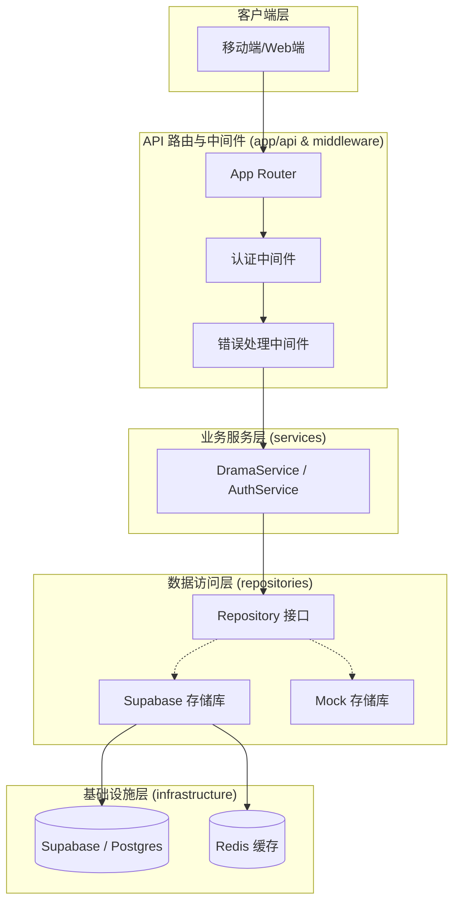
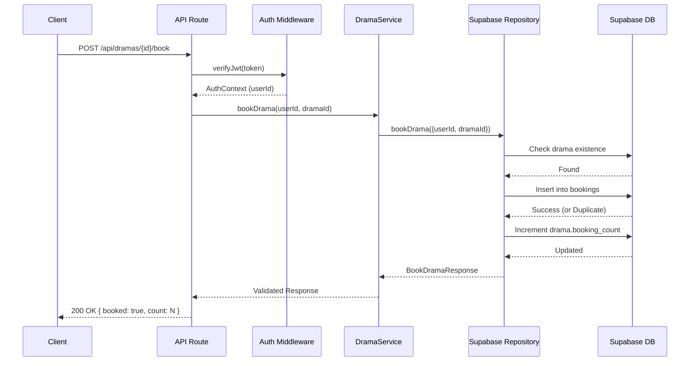
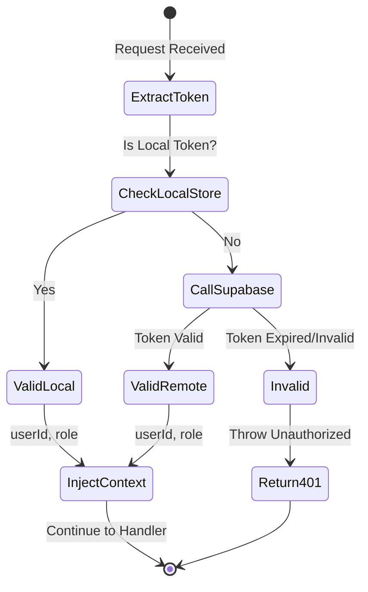
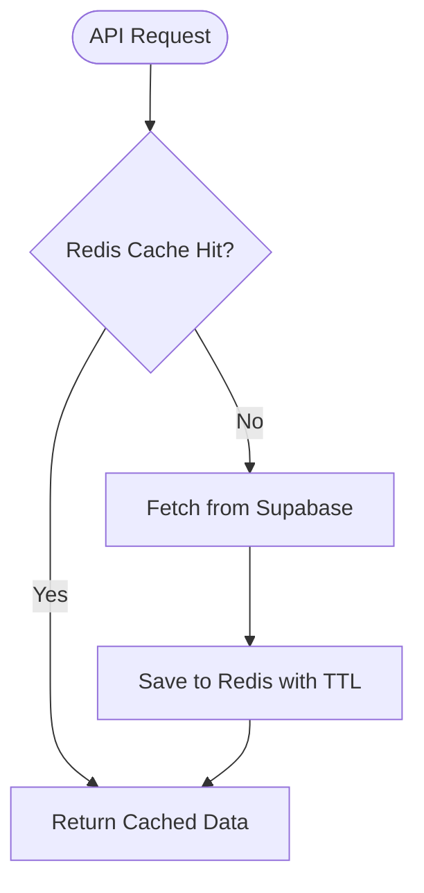
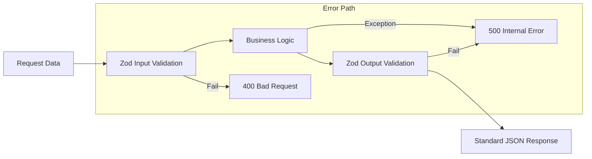

# 后端服务开发指南（Next.js）

## 目录
1. [模块概览](#模块概览)
2. [引言](#引言)
3. [架构概览](#架构概览)
4. [核心组件](#核心组件)
   - [App Router 与 API 路由](#app-router-与-api-路由)
   - [服务层 (Service Layer) 设计](#服务层-service-layer-设计)
   - [存储库层 (Repository Layer) 设计](#存储库层-repository-layer-设计)
5. [Supabase 集成与数据库设计](#supabase-集成与数据库设计)
   - [数据库 Schema 解释](#数据库-schema-解释)
   - [行级安全性 (RLS) 实践](#行级安全性-rls-实践)
6. [业务逻辑与数据流](#业务逻辑与数据流)
7. [认证与授权](#认证与授权)
8. [性能优化与缓存策略](#性能优化与缓存策略)
9. [错误处理与数据验证](#错误处理与数据验证)
10. [文件参考](#文件参考)

## 模块概览

本模块涵盖了基于 Next.js 16 的后端服务实现。通过对 `backend/src/` 目录的扫描，我们识别出以下核心结构：

- **总文件数**: 约 154 个源文件（包含测试文件）。
- **核心子目录**:
    - `app/api/`: 基于 Next.js App Router 的 RESTful API 路由实现。
    - `services/`: 业务逻辑层，负责解耦 API 逻辑与数据访问逻辑。
    - `repositories/`: 数据访问层，包含接口定义、Mock 实现以及 Supabase 实现。
    - `infrastructure/`: 基础设施层，包含 Supabase 和 Redis 的客户端配置。
    - `middleware/`: 中间件层，处理认证、跨域和全局错误捕获。
    - `lib/`: 通用库，包含 Zod 校验 Schema、类型定义和错误类。

本指南将深入探讨上述所有核心子模块，重点介绍如何利用 Next.js 的现代特性构建高性能、可扩展的后端服务。

## 引言

后端服务是整个应用的核心，负责处理复杂的业务逻辑、数据持久化以及安全性保障。本项目采用了 **Next.js 16 App Router** 作为基础框架，这使得我们能够利用 Serverless 函数的优势，同时保持清晰的路由结构。

为了实现高内聚低耦合的设计目标，我们引入了经典的 **Service-Repository** 模式。API 路由仅负责请求的接收与响应的发送，业务逻辑封装在 Service 层中，而具体的数据操作则委派给 Repository 层。这种架构不仅便于单元测试，也为未来更换底层存储（如从 Supabase 迁移到原生 PostgreSQL）提供了极大的灵活性。

此外，我们集成了 **Supabase** 作为后端即服务 (BaaS) 方案，利用其强大的 PostgreSQL 能力和内置的认证系统。为了应对高并发场景，我们还预留了 **Redis** 缓存机制，用于优化排行榜和热门搜索等高频访问接口。

## 架构概览

本系统的架构遵循分层模式，确保了职责的清晰划分。每一层都通过接口或明确的调用约定进行交互。

以下图表展示了请求从进入系统到数据返回的完整路径：



在该架构中，`Client` 发起的请求首先由 Next.js 的 `Router` 接收。`AuthMid` 负责验证 JWT 令牌，并将 `AuthContext` 注入请求对象。`ErrorMid` 作为一个高阶函数包装器，捕获所有未处理的异常并返回标准化的错误响应。`Service` 层包含核心业务逻辑，它不直接依赖具体的数据库实现，而是通过 `RepoIntf` 与数据交互。最后，`RepoImpl` 使用 `infrastructure` 中的客户端与 `Supabase` 或 `Redis` 通信。

**架构参考**:
- [src/app/api/dramas/route.ts](backend/src/app/api/dramas/route.ts)
- [src/services/drama/drama.service.ts](backend/src/services/drama/drama.service.ts)
- [src/repositories/interfaces/drama.repository.interface.ts](backend/src/repositories/interfaces/drama.repository.interface.ts)

## 核心组件

### App Router 与 API 路由

Next.js 的 App Router 允许我们在 `app/api` 目录下定义嵌套路由。每个路由文件导出的 `GET`, `POST`, `PUT`, `DELETE` 等函数对应相应的 HTTP 方法。

我们使用了 `withErrorHandler` 装饰器来统一处理异常，并结合 Zod 进行请求参数校验。

```typescript
// 示例：获取剧场列表路由
export const GET = withErrorHandler(async (request: NextRequest) => {
  const { searchParams } = new URL(request.url);
  const { page, pageSize } = PaginationQuerySchema.parse({
    page: searchParams.get('page') ?? undefined,
    pageSize: searchParams.get('pageSize') ?? undefined,
  });

  const service = new DramaService(getDramaRepository());
  const result = await service.listDramas({ page, pageSize });

  return NextResponse.json(result);
});
```

**组件来源**:
- [src/app/api/dramas/route.ts](backend/src/app/api/dramas/route.ts)

### 服务层 (Service Layer) 设计

Service 层是业务逻辑的载体。它负责编排多个存储库的操作，并对返回的数据进行最终的 Schema 校验。

```typescript
export class DramaService {
  constructor(private dramaRepository: DramaRepositoryInterface) {}

  async listDramas(params: PaginationParams): Promise<PaginatedResult<Drama>> {
    // 调用存储库获取原始数据，并使用 Zod Schema 确保返回数据符合契约
    return DramaListResponseSchema.parse(await this.dramaRepository.findMany(params));
  }
}
```

通过这种方式，Service 层确保了即使底层数据库结构发生变化，返回给前端的数据始终符合预期的 API 契约。

**组件来源**:
- [src/services/drama/drama.service.ts](backend/src/services/drama/drama.service.ts)

### 存储库层 (Repository Layer) 设计

存储库层实现了具体的持久化逻辑。我们采用了接口驱动的设计方式，使得我们可以轻松地在生产环境（Supabase）和测试环境（Mock）之间切换。

```typescript
export class DramaSupabaseRepository implements DramaRepositoryInterface {
  async findMany(params: PaginationParams): Promise<PaginatedResult<Drama>> {
    const supabase = getSupabaseAdmin();
    const from = (params.page - 1) * params.pageSize;
    const to = from + params.pageSize - 1;

    const { data, error, count } = await supabase
      .from('dramas')
      .select(DRAMA_SELECT_COLUMNS, { count: 'exact' })
      .range(from, to)
      .order('created_at', { ascending: false });

    // ... 映射逻辑
  }
}
```

**组件来源**:
- [src/repositories/supabase/drama.supabase.repository.ts](backend/src/repositories/supabase/drama.supabase.repository.ts)
- [src/repositories/interfaces/drama.repository.interface.ts](backend/src/repositories/interfaces/drama.repository.interface.ts)

## Supabase 集成与数据库设计

### 数据库 Schema 解释

我们利用 Supabase 提供的 PostgreSQL 存储数据。核心表结构设计如下：

| 表名 | 说明 | 关键字段 |
|------|------|----------|
| `dramas` | 剧场信息表 | `id`, `title`, `cover_url`, `category`, `rating`, `play_count`, `booking_count` |
| `episodes` | 剧集信息表 | `id`, `drama_id`, `episode_number`, `video_url`, `duration` |
| `bookings` | 用户预约表 | `user_id`, `drama_id`, `created_at` |
| `playback_history` | 播放历史表 | `user_id`, `drama_id`, `episode_id`, `progress` |

**Schema 来源**:
- [src/lib/schemas.ts](backend/src/lib/schemas.ts)

### 行级安全性 (RLS) 实践

Supabase 的 RLS 是保障数据安全的关键。我们在数据库层面定义了策略，确保用户只能访问其有权访问的数据。

例如，对于 `bookings` 表，我们设置了以下策略：
- **SELECT**: 仅允许用户查询自己的预约记录 (`auth.uid() = user_id`)。
- **INSERT**: 仅允许已认证用户为自己创建预约。
- **DELETE**: 仅允许用户删除自己的预约。

在后端代码中，我们通常使用 `getSupabaseAdmin()`（使用 Service Role Key）来绕过 RLS 进行管理操作，但在处理用户私有数据时，我们会显式地在查询中加入 `user_id` 过滤条件。

## 业务逻辑与数据流

以“预约剧场”为例，展示系统内部的交互流程：



在这个流程中，`Auth Middleware` 确保了只有登录用户才能发起预约。`DramaSupabaseRepository` 负责处理并发下的计数更新（通过原子的数据库操作或重试机制）。最后，`DramaService` 对结果进行 Zod 校验，确保前端收到正确格式的数据。

**流程参考**:
- [src/app/api/dramas/[id]/book/route.ts](backend/src/app/api/dramas/[id]/book/route.ts)
- [src/repositories/supabase/drama.supabase.repository.ts:L581-L637](backend/src/repositories/supabase/drama.supabase.repository.ts#L581-L637)

## 认证与授权

我们的认证系统基于 JWT 令牌。`middleware/auth.ts` 提供了核心验证逻辑。



**关键点**:
1. **JWT 验证**: 使用 Supabase Admin Client 的 `auth.getUser(token)` 方法。这不仅验证了签名，还确保了用户未被禁用。
2. **角色管理**: 从用户的 `app_metadata` 中提取 `role`（如 `admin`, `editor`, `viewer`）。
3. **本地 Session**: 为了支持开发环境和 Mock 测试，我们实现了一个内存中的 `local-auth-session.store`。
4. **中间件包装**: `requireAuth` 和 `requireRole` 高阶函数使得在路由定义中声明权限变得非常简单。

**组件来源**:
- [src/middleware/auth.ts](backend/src/middleware/auth.ts)
- [src/services/auth/local-auth-session.store.ts](backend/src/services/auth/local-auth-session.store.ts)

## 性能优化与缓存策略

对于排行榜 (`rankings`) 和热门搜索 (`hot-search`) 等高频访问且数据更新频率适中的接口，我们采用了基于 Redis 的缓存策略。

**设计方案**:
1. **Cache-Aside 模式**:
   - 当请求进入时，首先检查 Redis 中是否存在对应的 Key。
   - 如果命中缓存，直接返回数据。
   - 如果未命中，从 Supabase 读取数据，并将其存入 Redis，同时设置过期时间（TTL）。

2. **缓存失效策略**:
   - **主动失效**: 当后台管理员更新剧场信息或剧集发布时，清除相关的排行榜缓存。
   - **被动失效**: 设置合理的 TTL（例如排行榜 10 分钟，热门搜索 1 小时）。



虽然目前的 `DramaSupabaseRepository` 尚未完全集成 Redis 逻辑，但 `infrastructure/redis.ts` 已经配置完毕，准备好在 `DramaService` 中通过组合模式引入。

**基础设施参考**:
- [src/infrastructure/redis.ts](backend/src/infrastructure/redis.ts)

## 错误处理与数据验证

我们通过 Zod 实现了端到端的数据验证。所有 API 的输入（查询参数、请求体）和输出（响应数据）都必须通过 Schema 校验。

1. **输入校验**: 在 API 路由中使用 `Schema.parse()`。如果校验失败，Zod 会抛出异常，由 `withErrorHandler` 捕获并返回 400 错误。
2. **输出校验**: 在 Service 层使用 `Schema.parse()`。这保证了即使数据库返回了异常数据，也不会泄露给前端，而是触发 500 错误。
3. **全局错误映射**: `lib/errors.ts` 定义了一系列标准错误类（如 `NotFoundError`, `UnauthorizedError`），并由 `middleware/error-handler.ts` 统一转化为 JSON 响应。



**组件来源**:
- [src/lib/schemas.ts](backend/src/lib/schemas.ts)
- [src/lib/errors.ts](backend/src/lib/errors.ts)
- [src/middleware/error-handler.ts](backend/src/middleware/error-handler.ts)

## 文件参考

以下是本章节涉及的核心源文件：

- [src/app/api/dramas/route.ts](backend/src/app/api/dramas/route.ts): 剧场列表 API 路由。
- [src/app/api/dramas/rankings/route.ts](backend/src/app/api/dramas/rankings/route.ts): 排行榜 API 路由。
- [src/services/drama/drama.service.ts](backend/src/services/drama/drama.service.ts): 剧场相关业务逻辑。
- [src/repositories/interfaces/drama.repository.interface.ts](backend/src/repositories/interfaces/drama.repository.interface.ts): 存储库接口定义。
- [src/repositories/supabase/drama.supabase.repository.ts](backend/src/repositories/supabase/drama.supabase.repository.ts): 基于 Supabase 的数据访问实现。
- [src/infrastructure/supabase.ts](backend/src/infrastructure/supabase.ts): Supabase 客户端配置。
- [src/infrastructure/redis.ts](backend/src/infrastructure/redis.ts): Redis 客户端配置。
- [src/middleware/auth.ts](backend/src/middleware/auth.ts): 认证与授权中间件。
- [src/lib/schemas.ts](backend/src/lib/schemas.ts): 全局 Zod Schema 定义。
- [src/lib/errors.ts](backend/src/lib/errors.ts): 标准错误类定义。
