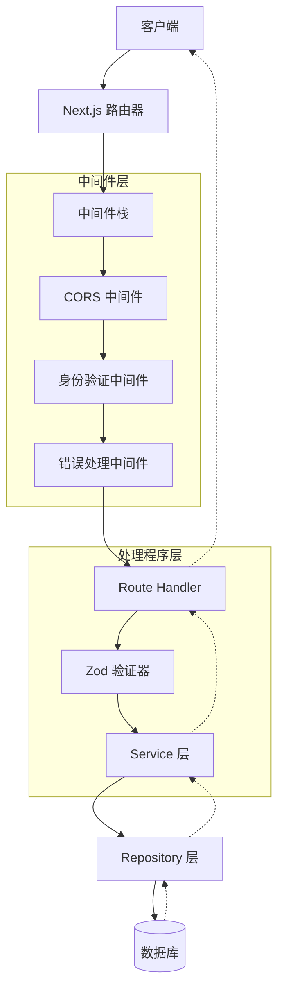
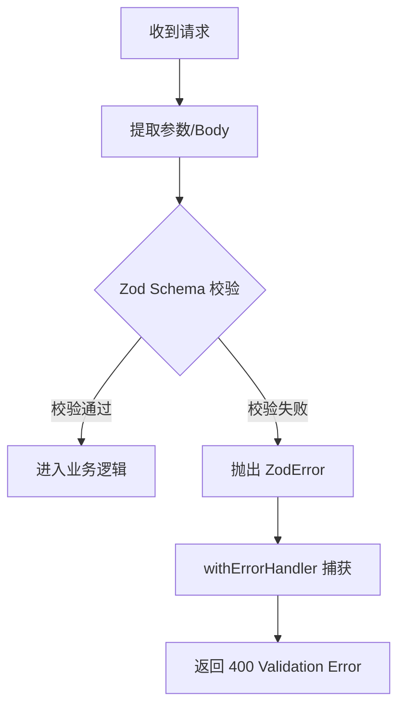
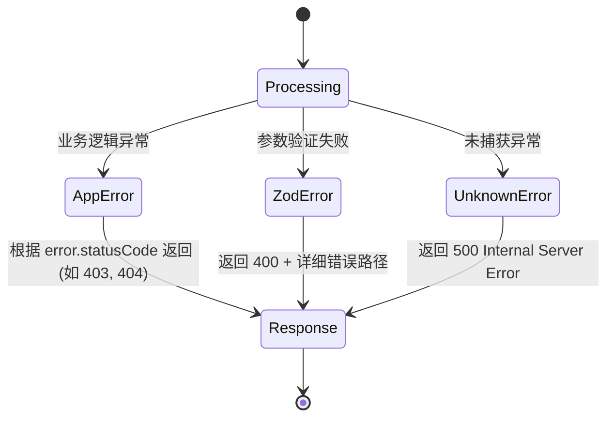
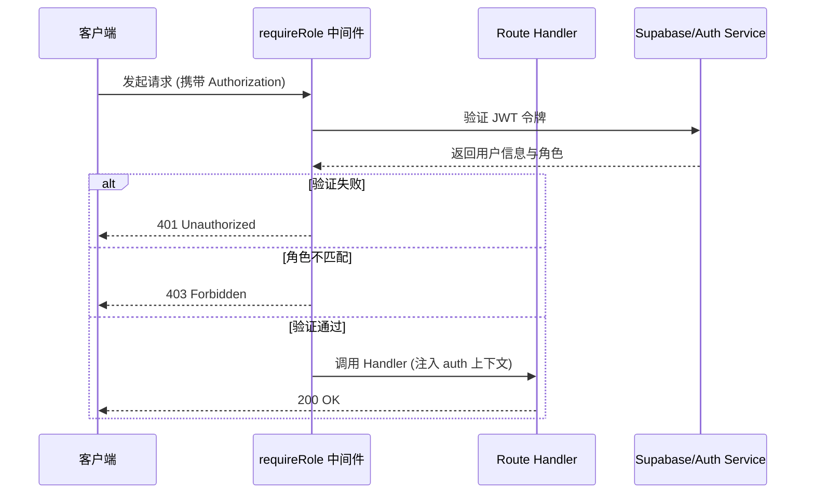
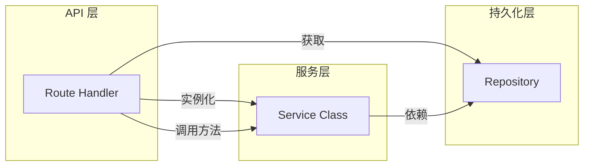

# API 路由与控制器实现

## 目录
1. [模块概览](#模块概览)
2. [导言](#导言)
3. [架构设计与请求生命周期](#架构设计与请求生命周期)
4. [路由结构与 RESTful 映射](#路由结构与-restful-映射)
5. [核心实现模式](#核心实现模式)
6. [请求解析与数据验证](#请求解析与数据验证)
7. [响应规范与错误处理](#响应规范与错误处理)
8. [权限控制与安全](#权限控制与安全)
9. [业务逻辑集成](#业务逻辑集成)
10. [文件参考](#文件参考)

## 模块概览

本模块涵盖了后端 API 的核心入口实现，基于 Next.js App Router 架构。通过对 `backend/src/app/api/` 目录的扫描，我们识别出以下关键信息：

*   **文件总数**：共发现 40 个 `route.ts` 路由处理文件。
*   **子模块分布**：
    *   `admin/`：管理后台 API，包含剧集管理、用户角色管理及统计数据。
    *   `auth/`：用户认证系统，处理会话（Session）、OTP 请求及刷新令牌。
    *   `dramas/`：核心剧集业务，包括搜索、排行、分类标签及剧集详情。
    *   `player/`：播放器相关逻辑，管理播放进度、历史记录及播放状态。
    *   `check-ins/`：签到系统，处理用户每日签到逻辑。
    *   `users/`：用户个人资料及订阅/预订管理。
    *   `messages/`：系统通知与互动消息。
    *   `mall/`：商城系统，处理产品列表等。
    *   `earn/`：任务系统，处理积分赚取与概览。
    *   `health/`：系统健康检查接口。

本指南将深入探讨这些路由的实现细节，重点分析如何利用 Next.js 的特性构建健壮、可维护且安全的 API 层。

## 导言

在现代 Web 应用中，API 层是前端与后端业务逻辑之间的桥梁。本项目采用 Next.js App Router 的 Route Handlers 模式，取代了传统的 Express 或 Koa 控制器。这种模式允许我们将 API 路由直接定义在文件系统中，利用 Next.js 的内置优化和边缘运行时能力。

API 路由的主要职责包括：
1.  **请求接收**：监听特定的 HTTP 方法（GET, POST, PUT, DELETE）。
2.  **输入验证**：确保客户端发送的数据符合预期格式。
3.  **权限校验**：检查请求者是否有权执行该操作。
4.  **业务分发**：调用相应的 Service 层处理逻辑。
5.  **响应标准化**：将处理结果以统一的格式返回给客户端。

通过严格遵循这些职责，我们确保了 API 层的一致性和可测试性。

## 架构设计与请求生命周期

本项目的 API 架构遵循分层模式，请求从客户端发起后，会经过多个中间件和处理层，最终到达业务逻辑层。

### 请求流转图

下图展示了一个典型的 API 请求在系统内部的流转过程：



**图表说明**：
请求首先进入 Next.js 路由器，根据 URL 匹配到对应的文件。在进入实际的业务处理函数之前，请求会依次通过跨域处理（CORS）、身份验证（Auth）和全局错误处理包装器（ErrorHandler）。这种链式结构确保了横切关注点（Cross-cutting Concerns）被统一处理。`Route Handler` 内部则负责具体的数据验证和 Service 调用。

**Diagram sources**:
- [error-handler.ts](backend/src/middleware/error-handler.ts)
- [auth.ts](backend/src/middleware/auth.ts)
- [cors.ts](backend/src/middleware/cors.ts)

## 路由结构与 RESTful 映射

Next.js App Router 使用目录结构来定义路由路径。这种“约定优于配置”的方式使得 API 的 URL 结构非常直观。

### 目录与 URL 映射关系

```mermaid
graph LR
    subgraph "文件系统结构"
        D1[api/dramas/route.ts]
        D2[api/dramas/[id]/route.ts]
        D3[api/admin/users/route.ts]
    end
    
    subgraph "RESTful API 路径"
        U1[/api/dramas]
        U2[/api/dramas/:id]
        U3[/api/admin/users]
    end
    
    D1 --> U1
    D2 --> U2
    D3 --> U3
```

**图表说明**：
*   `api/dramas/route.ts` 映射到 `/api/dramas`，通常用于列表查询（GET）或创建新剧集（POST）。
*   `api/dramas/[id]/route.ts` 使用动态段 `[id]`，映射到 `/api/dramas/:id`，用于获取特定剧集的详情。
*   `api/admin/` 前缀用于区分管理端接口，通常配合更严格的权限控制。

这种结构不仅清晰，而且方便开发者快速定位代码。例如，如果需要修改剧集评论的逻辑，可以直接跳转到 `backend/src/app/api/dramas/[id]/comments/route.ts`。

## 核心实现模式

所有的 Route Handlers 都遵循一个标准的模板，使用 `withErrorHandler` 进行包装，以捕获并统一处理异常。

### 基础路由处理程序示例

以下是 `backend/src/app/api/dramas/route.ts` 的核心实现：

```typescript
import { NextRequest, NextResponse } from 'next/server';
import { z } from 'zod';
import { DramaService } from '@/services/drama/drama.service';
import { getDramaRepository } from '@/repositories/repository-registry';
import { withErrorHandler } from '@/middleware/error-handler';

const PaginationQuerySchema = z.object({
  page: z.coerce.number().int().min(1).default(1),
  pageSize: z.coerce.number().int().min(1).max(100).default(10),
});

export const GET = withErrorHandler(async (request: NextRequest) => {
  const { searchParams } = new URL(request.url);
  
  // 1. 请求验证
  const { page, pageSize } = PaginationQuerySchema.parse({
    page: searchParams.get('page') ?? undefined,
    pageSize: searchParams.get('pageSize') ?? undefined,
  });

  // 2. 业务逻辑调用
  const service = new DramaService(getDramaRepository());
  const result = await service.listDramas({ page, pageSize });

  // 3. 返回标准化响应
  return NextResponse.json(result);
});
```

**代码分析**：
1.  **包装器模式**：`withErrorHandler` 是一个高阶函数，它包裹了异步处理函数，自动处理 `ZodError` 和业务自定义的 `AppError`。
2.  **Zod 验证**：使用 `z.coerce` 处理 URL 查询参数（它们通常是字符串），并提供默认值。
3.  **依赖注入**：通过 `getDramaRepository()` 获取仓储实例，并注入到 Service 中。这虽然不是严格的 DI 容器，但在 Next.js 环境下非常实用。

**Section sources**:
- [dramas/route.ts](backend/src/app/api/dramas/route.ts)
- [error-handler.ts](backend/src/middleware/error-handler.ts)

## 请求解析与数据验证

数据验证是 API 安全的第一道防线。本项目统一使用 `zod` 库进行声明式验证。

### 验证流程图



**图表说明**：
验证流程是强制性的。如果 `Schema.parse()` 失败，它会立即抛出一个 `ZodError`。由于我们的路由函数被 `withErrorHandler` 包裹，这个错误会被拦截并转换为标准化的 400 Bad Request 响应，其中包含详细的字段错误信息。

### 复杂对象验证示例

在 `admin` 模块中，创建剧集需要验证复杂的 JSON 对象：

```typescript
// backend/src/lib/schemas.ts
export const AdminDramaCreateSchema = z.object({
  title: z.string().min(1, '标题不能为空'),
  description: z.string().optional(),
  coverUrl: z.string().url('封面图地址格式不正确'),
  tags: z.array(z.string()).default([]),
  status: z.enum(['published', 'draft', 'archived']).default('draft'),
});

// backend/src/app/api/admin/dramas/route.ts
export const POST = withErrorHandler(async (request: NextRequest) => {
  const body = await request.json();
  const data = AdminDramaCreateSchema.parse(body); // 如果不匹配，直接抛出异常
  
  const service = new AdminService();
  const drama = await service.createDrama(data);
  
  return NextResponse.json(drama, { status: 201 });
});
```

**Section sources**:
- [admin/dramas/route.ts](backend/src/app/api/admin/dramas/route.ts)
- [schemas.ts](backend/src/lib/schemas.ts)

## 响应规范与错误处理

为了让前端能够一致地处理成功和失败，后端定义了统一的响应结构。

### 成功响应

通常使用 `NextResponse.json()` 返回数据。在某些模块（如 `auth`）中，使用了 `success` 辅助函数：

```typescript
export function success<T>(data: T) {
  return NextResponse.json({
    code: 0,
    data,
    message: 'ok',
  });
}
```

### 错误处理机制

错误处理由 `withErrorHandler` 中间件集中管理。它能够识别不同类型的错误并返回相应的 HTTP 状态码。



**图表说明**：
状态机展示了错误分类处理的逻辑。`AppError` 是业务代码中主动抛出的异常，携带了预定义的错误码和状态码。`ZodError` 则是验证层自动生成的。所有其他未预料到的错误（如数据库连接失败）都会被归类为 `UnknownError`，以防止敏感信息泄露。

**Section sources**:
- [error-handler.ts](backend/src/middleware/error-handler.ts)
- [errors.ts](backend/src/lib/errors.ts)
- [_helpers.ts](backend/src/app/api/auth/_helpers.ts)

## 权限控制与安全

API 的安全性主要通过中间件装饰器来实现。

### 权限校验流程



**图表说明**：
权限控制是声明式的。通过 `requireRole(['admin'], handler)`，我们可以在进入业务逻辑之前拦截非法请求。中间件会从请求头中提取 `Bearer` 令牌，调用认证服务进行校验，并检查用户的角色是否在允许列表中。如果校验通过，用户信息会被注入到请求对象中，供后续逻辑使用。

### 代码实现示例

```typescript
// backend/src/app/api/admin/dramas/route.ts
export const GET = withCors(requireRole(
  ['admin', 'editor', 'viewer'],
  withErrorHandler(async (request: NextRequest) => {
    // 只有具备上述角色的用户才能到达这里
    const auth = getAuth(request);
    console.log(`User ${auth.userId} is accessing admin data`);
    
    const service = new AdminService();
    const result = await service.listDramas();
    return success(result);
  })
));
```

**Section sources**:
- [auth.ts](backend/src/middleware/auth.ts)
- [admin/dramas/route.ts](backend/src/app/api/admin/dramas/route.ts)

## 业务逻辑集成

Route Handler 不应该包含复杂的业务逻辑，而应该作为协调者，调用 Service 层。

### 服务调用模式



**图表说明**：
在路由处理程序中，我们通常会从 `repository-registry` 获取所需的仓储实例，然后创建 Service 实例。这种方式虽然简单，但确保了 Service 层是无状态的，且易于在单元测试中进行 Mock。

### 示例：播放进度更新

```typescript
// backend/src/app/api/player/progress/route.ts
export const GET = withErrorHandler(async (request: NextRequest) => {
  const { searchParams } = new URL(request.url);
  const dramaId = searchParams.get('dramaId');

  // 获取播放会话 ID (可能来自 Header 或 Cookie)
  const playbackSessionId = parsePlaybackSessionId(request);
  
  // 组装 Service 及其依赖
  const service = new PlayerService(
    getDramaRepository(),
    getEpisodeRepository(),
    getPlaybackHistoryRepository(),
  );

  const result = await service.getPlaybackProgress(playbackSessionId, dramaId);
  return NextResponse.json(result);
});
```

**Section sources**:
- [player/progress/route.ts](backend/src/app/api/player/progress/route.ts)
- [repository-registry.ts](backend/src/repositories/repository-registry.ts)

## 文件参考

以下是本模块涉及的关键源文件，开发者在实现新的 API 时应参考这些文件的模式：

*   **核心路由示例**：
    *   `backend/src/app/api/dramas/route.ts`：标准 GET 列表接口。
    *   `backend/src/app/api/admin/dramas/route.ts`：带权限控制的 CRUD 接口。
    *   `backend/src/app/api/auth/session/route.ts`：认证会话管理。
*   **中间件与辅助工具**：
    *   `backend/src/middleware/error-handler.ts`：全局错误处理包装器。
    *   `backend/src/middleware/auth.ts`：身份验证与角色校验。
    *   `backend/src/app/api/auth/_helpers.ts`：响应标准化辅助函数。
*   **验证与错误定义**：
    *   `backend/src/lib/schemas.ts`：统一的 Zod 验证模式。
    *   `backend/src/lib/errors.ts`：业务错误类型定义。
*   **其他功能接口**：
    *   `backend/src/app/api/player/progress/route.ts`：播放进度逻辑。
    *   `backend/src/app/api/check-ins/route.ts`：签到功能实现。

通过遵循上述模式和结构，开发者可以快速构建出高性能、安全且易于维护的 API 端点。
