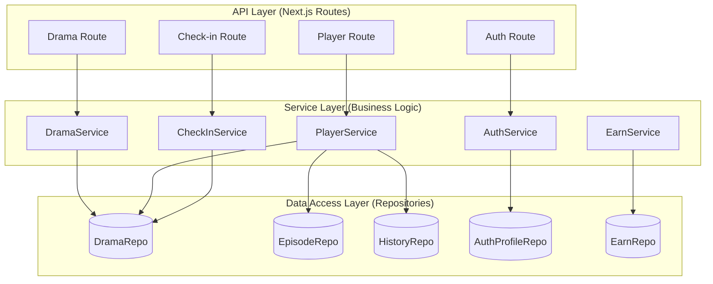
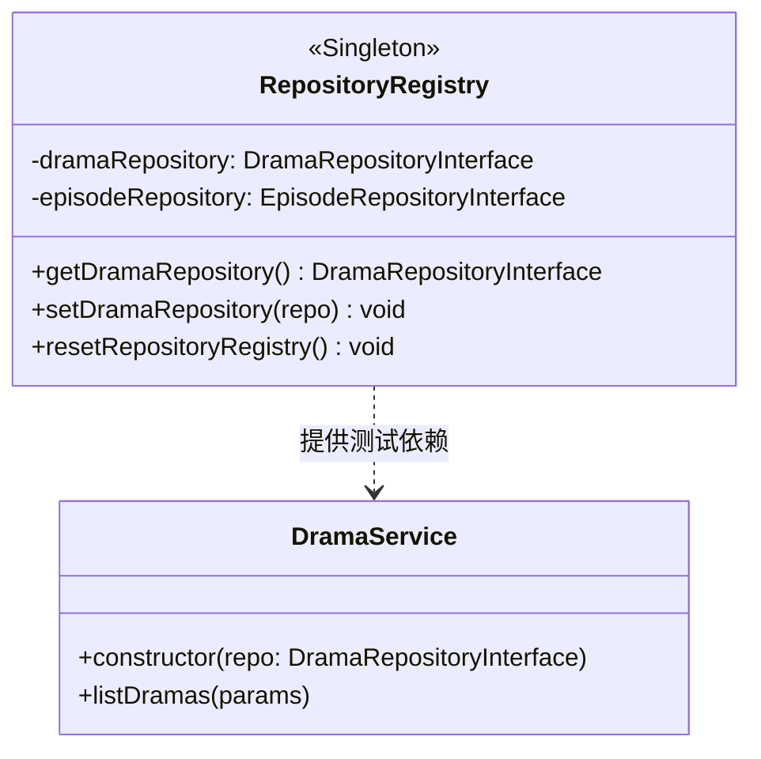
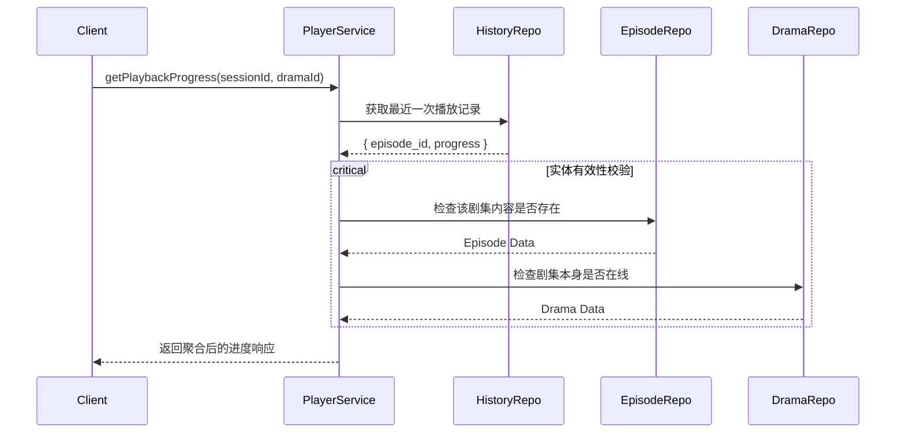
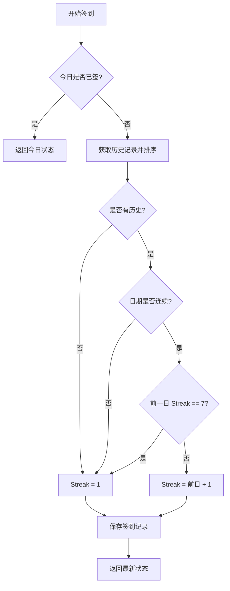
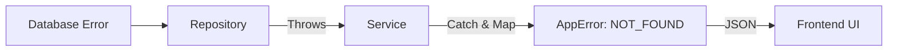

# 业务逻辑服务层设计

## 目录
1. [模块概览](#模块概览)
2. [服务层架构设计](#服务层架构设计)
3. [核心组件与 Service 模式](#核心组件与-service-模式)
4. [依赖管理与注入机制](#依赖管理与注入机制)
5. [核心业务领域实现](#核心业务领域实现)
   - [剧集业务 (DramaService)](#剧集业务-dramaservice)
   - [播放器业务 (PlayerService)](#播放器业务-playerservice)
   - [身份验证业务 (AuthService)](#身份验证业务-authservice)
   - [签到业务 (CheckInService)](#签到业务-checkinservice)
   - [任务与奖励业务 (EarnService)](#任务与奖励业务-earnservice)
6. [跨模块业务流程分析](#跨模块业务流程分析)
7. [错误处理与数据验证策略](#错误处理与数据验证策略)
8. [单元测试与质量保证](#单元测试与质量保证)
9. [性能考量与最佳实践](#性能考量与最佳实践)
10. [文件参考](#文件参考)

## 模块概览

业务逻辑服务层（Service Layer）是后端架构的核心心脏，位于 API 路由（Controller）与数据访问层（Repository）之间。它的核心使命是封装复杂的业务规则，确保逻辑的原子性、可重用性和高度可测试性。通过将业务判断从 HTTP 处理流程中剥离，服务层使得系统能够灵活应对业务需求的变更，而不必担心破坏底层的通信协议或存储结构。

### 规模评估
- **总文件数**: 22 个 TypeScript 文件，包含 11 个核心 Service 类及其对应的 `.test.ts` 单元测试文件。
- **子模块分布**: 
  - `auth`: 处理 OTP 验证、Session 生命周期管理。
  - `drama`: 剧集搜索、排行、推荐及订阅逻辑。
  - `player`: 播放进度同步、历史记录管理。
  - `earn` & `check-in`: 任务系统、连续签到算法。
  - `comment` & `message`: 社交互动与消息通知系统。
  - `mall` & `admin`: 商城业务与后台管理逻辑。
- **覆盖深度**: 本文档将作为“深度”级别指南，不仅阐述代码结构，还将深入探讨复杂算法（如签到连续性计算）的数学模型及其在代码中的实现。

## 服务层架构设计

在 Next.js 的后端架构中，服务层扮演着“编排者”的角色。它不直接处理 HTTP 请求头或响应体，而是接收纯粹的业务对象（Plain Objects），并返回经过验证的结果。



这种分层设计的核心价值在于**单一职责原则 (SRP)**。API 路由仅负责“翻译”协议，而 Service 层负责“执行”业务。例如，当一个剧集订阅请求到达时，API 路由负责验证用户 Token，而 `DramaService` 则负责检查该剧集是否可订阅、更新订阅计数并维护用户的资产状态。

**Section sources**:
- [backend/src/services/drama/drama.service.ts](backend/src/services/drama/drama.service.ts)
- [backend/src/app/api/dramas/route.ts](backend/src/app/api/dramas/route.ts)

## 核心组件与 Service 模式

本项目统一采用**类驱动 (Class-based)** 的 Service 模式。每个 Service 类都是一个独立的逻辑单元，通过构造函数实现依赖注入（Dependency Injection）。

### Service 类结构规范
1. **显式依赖声明**: Service 类在构造函数中声明其所需的 Repository 接口。这种做法遵循了“依赖倒置原则”，使得 Service 不绑定于特定的数据库实现。
2. **私有逻辑封装**: 复杂的内部算法（如进度裁剪、日期计算）被封装为 `private` 方法，仅向外暴露简洁的业务接口。
3. **响应式验证**: 所有的 Service 方法在返回数据前，都会使用 Zod Schema 进行运行时类型检查。这保证了即使 Repository 层返回了异常数据，Service 层也能在第一时间拦截并抛出受控的错误。

```typescript
// 典型的 Service 实现模式
export class PlayerService {
  constructor(
    private readonly dramaRepository: DramaRepositoryInterface,
    private readonly episodeRepository: EpisodeRepositoryInterface,
    private readonly playbackHistoryRepository: PlaybackHistoryRepositoryInterface,
  ) {}

  async stopPlayback(params: PlaybackParams): Promise<PlayerStopResponse> {
    // 1. 业务前置校验
    await this.ensureDramaExists(params.dramaId);
    
    // 2. 核心逻辑执行
    const savedProgress = this.clampProgress(params.progress, params.duration);
    
    // 3. 数据持久化编排
    const history = await this.playbackHistoryRepository.upsert({ ... });
    
    // 4. 结果验证与返回
    return PlayerStopResponseSchema.parse({ data: history });
  }
}
```

这种结构确保了代码的整洁性。对于阅读者来说，只需查看 Service 的构造函数，就能立即理解该业务涉及哪些数据领域；查看公共方法，就能理解该业务支持哪些操作。

**Section sources**:
- [backend/src/services/player/player.service.ts](backend/src/services/player/player.service.ts)
- [backend/src/lib/schemas/index.ts](backend/src/lib/schemas/index.ts)

## 依赖管理与注入机制

在复杂的后端系统中，如何管理 Service 与 Repository 之间的依赖关系是架构设计的关键。本项目采用了“混合注入”模式，兼顾了生产环境的性能与测试环境的灵活性。

### 生产环境：手动构造注入
在 API 路由中，我们采用显式的手动注入。这种方式虽然看起来繁琐，但在 Next.js 的 Serverless 环境下具有极高的启动性能，因为它避免了复杂的反射或 DI 容器初始化过程。

```typescript
// backend/src/app/api/dramas/rankings/route.ts
export const GET = withErrorHandler(async (request: NextRequest) => {
  // 生产环境下直接注入 Supabase 实现
  const service = new DramaService(new DramaSupabaseRepository());
  // ...
});
```

### 测试与开发环境：Registry 注册表模式
为了支持单元测试中的 Mock 替换，项目提供了一个 `RepositoryRegistry` 模块。它允许开发者在全局范围内动态切换 Repository 的实现。



在运行单元测试时，测试用例会调用 `setDramaRepository(new DramaMockRepository())`。这样，`DramaService` 在运行时就会使用内存中的 Mock 数据，而不需要连接真实的数据库，极大地提高了测试的执行速度和确定性。

**Section sources**:
- [backend/src/repositories/repository-registry.ts](backend/src/repositories/repository-registry.ts)
- [backend/src/app/api/dramas/rankings/route.ts](backend/src/app/api/dramas/rankings/route.ts)

## 核心业务领域实现

### 剧集业务 (DramaService)
`DramaService` 是整个系统的流量入口。它不仅处理简单的列表查询，还负责复杂的**多维度排行逻辑**。

- **排行算法**: 系统支持按“热门度”、“订阅数”和“推荐分”进行排行。Service 层负责将前端的抽象指令（如 `type: 'hot'`）转化为 Repository 层的具体查询逻辑。
- **订阅幂等性**: 在 `bookDrama` 方法中，Service 确保了订阅操作的幂等性。如果用户已经订阅了某部剧，再次调用将返回当前状态而非创建重复记录。

### 播放器业务 (PlayerService)
`PlayerService` 展示了 Service 层作为“数据聚合器”的能力。它需要协调三个 Repository 来完成一次进度查询。



该服务还包含了一个重要的业务规则：**进度裁剪（Clamping）**。在 `stopPlayback` 时，Service 会确保用户提交的播放进度不会超过视频的总时长，也不会小于零，从而保证了数据的完整性。

### 身份验证业务 (AuthService)
`AuthService` 封装了与第三方身份验证服务（Supabase Auth）的交互。它的复杂性在于**混合 Session 管理**。

- **OTP 流程**: 封装了短信验证码的发送与校验逻辑，并针对测试环境提供了“万能验证码”的 Bypass 机制。
- **错误映射**: 将 Supabase 返回的底层错误（如 `429 Too Many Requests`）映射为业务层定义的 `authRateLimited` 错误，确保前端能显示用户友好的提示。

### 签到业务 (CheckInService)
这是系统中逻辑密度最高的模块。它实现了一个**基于周期的滑动窗口签到算法**。

签到逻辑的核心在于判断“连续性”。`CheckInService` 通过 `computeNextStreakDay` 方法，分析用户过去 30 天的签到记录，判断当前签到是延续了之前的 Streak，还是因为中断需要重置为第 1 天，或者是已经完成了 7 天周期需要开启新循环。



### 任务与奖励业务 (EarnService)
`EarnService` 负责处理用户的激励逻辑。虽然它目前主要作为 Repository 的代理，但它预留了处理**防作弊校验**和**奖励倍率计算**的空间。在 `completeTask` 流程中，它会验证任务的有效性，并确保奖励的发放符合当前的运营策略。

**Section sources**:
- [backend/src/services/check-in/check-in.service.ts](backend/src/services/check-in/check-in.service.ts)
- [backend/src/services/auth/auth.service.ts](backend/src/services/auth/auth.service.ts)
- [backend/src/services/player/player.service.ts](backend/src/services/player/player.service.ts)

## 跨模块业务流程分析

在真实的业务场景中，一个操作往往涉及多个模块的协作。以“用户完成播放并触发奖励”为例（虽然目前代码中是分开的，但 Service 层提供了这种聚合的可能性）。

Service 层通过组合不同的 Repository，可以轻松实现跨域操作：
1. `PlayerService` 记录播放结束并达到 100% 进度。
2. 触发 `EarnService` 检查是否满足“观看完整剧集”的任务条件。
3. 如果满足，调用 `MessageService` 发送系统通知。

这种跨模块的编排能力，使得 Service 层成为了系统中最具扩展性的地方。

**Section sources**:
- [backend/src/services/player/player.service.ts:L144-L174](backend/src/services/player/player.service.ts#L144-L174)
- [backend/src/services/earn/earn.service.ts:L32-L47](backend/src/services/earn/earn.service.ts#L32-L47)

## 错误处理与数据验证策略

Service 层是系统稳定性的坚实护盾。它采用了一套标准化的错误处理与验证流程。

### 1. 强类型契约 (Zod)
每个 Service 方法的输入和输出都严格绑定到 Zod Schema。这不仅提供了编译时的类型安全，更重要的是提供了运行时的**数据清洗（Sanitization）**。例如，如果 Repository 意外返回了多余的敏感字段，Zod Schema 会在返回给 API 层之前将其剔除。

### 2. 业务错误映射 (AppError)
Service 层不应该泄露底层的数据库错误或网络错误。它通过 `isAppError` 检查和统一的错误工厂（`Errors`），将异常转化为具有明确业务语义的错误码（如 `DRAMA_NOT_FOUND`、`AUTH_INVALID_CODE`）。



这种机制确保了无论底层技术栈如何变化（例如从 Supabase 迁移到 PostgreSQL），前端接收到的错误格式始终保持一致。

**Section sources**:
- [backend/src/lib/errors/index.ts](backend/src/lib/errors/index.ts)
- [backend/src/services/drama/drama.service.ts:L43-L51](backend/src/services/drama/drama.service.ts#L43-L51)

## 单元测试与质量保证

Service 层的高覆盖率单元测试是系统质量的基石。由于采用了依赖注入，我们可以实现完全脱离环境的测试。

### 测试策略分析
- **Mock 驱动**: 使用 `vitest` 的 Mock 功能模拟 Repository 的行为。这允许我们测试各种极端边界情况，例如“当数据库返回一个已删除的剧集 ID 时，播放器服务如何反应”。
- **契约测试**: 测试 Service 是否严格遵守了 Zod Schema 定义的契约。在 `drama.service.test.ts` 中，有专门的用例验证当 Repository 返回非法格式数据时，Service 是否能正确抛出 `INTERNAL_ERROR`。
- **幂等性测试**: 验证如“订阅”、“签到”等操作在多次触发时是否能保持状态的一致性。

```typescript
// 典型的单元测试用例
it('应该在签到中断时重置连续天数为 1', async () => {
  // 1. 准备中断的签到历史数据
  mockRepo.setRecords([{ business_date: '2026-07-01', streak_day: 5 }]);
  
  // 2. 执行 2026-07-03 的签到（中间隔了一天）
  const status = await service.checkIn({ userId: 'user-1' });
  
  // 3. 断言 streak 被重置
  expect(status.current_streak).toBe(1);
});
```

**Section sources**:
- [backend/src/services/drama/drama.service.test.ts](backend/src/services/drama/drama.service.test.ts)
- [backend/src/services/check-in/check-in.service.test.ts](backend/src/services/check-in/check-in.service.test.ts)

## 性能考量与最佳实践

在设计 Service 层时，我们遵循了以下性能优化原则：

1. **避免 N+1 查询**: 在 `getRecentlyViewed` 等需要聚合数据的场景中，Service 尽量使用 `Promise.all` 并发获取数据，或者调用 Repository 提供的批量查询接口。
2. **轻量化对象**: Service 返回的是经过过滤的 Plain Objects，避免了携带复杂的类实例或循环引用，从而减少了内存占用和序列化开销。
3. **无状态设计**: Service 类本身不持有任何请求相关的状态。所有的上下文信息（如 `AuthContext`）都通过方法参数显式传递。这使得 Service 实例可以在多个请求之间安全地重用。

> 💡 **最佳实践**: 始终在 Service 层处理“默认值”逻辑。例如，如果用户没有头像，Service 应该返回默认的占位符 URL，而不是让前端或数据库去处理这种琐碎的逻辑。

## 文件参考

以下是本模块涉及的核心源文件（按业务领域划分）：

- **剧集领域**:
  - [backend/src/services/drama/drama.service.ts](backend/src/services/drama/drama.service.ts): 剧集搜索、排行与推荐核心。
  - [backend/src/services/drama/drama.service.test.ts](backend/src/services/drama/drama.service.test.ts): 剧集业务单元测试。
- **播放与历史**:
  - [backend/src/services/player/player.service.ts](backend/src/services/player/player.service.ts): 播放进度同步逻辑。
  - [backend/src/services/player/player.service.test.ts](backend/src/services/player/player.service.test.ts): 播放器业务测试。
- **身份验证**:
  - [backend/src/services/auth/auth.service.ts](backend/src/services/auth/auth.service.ts): OTP 发送、Session 校验与错误映射。
  - [backend/src/services/auth/local-auth-session.store.ts](backend/src/services/auth/local-auth-session.store.ts): 本地开发环境的 Session 模拟存储。
- **激励系统**:
  - [backend/src/services/check-in/check-in.service.ts](backend/src/services/check-in/check-in.service.ts): 连续签到算法实现。
  - [backend/src/services/earn/earn.service.ts](backend/src/services/earn/earn.service.ts): 任务完成与奖励发放逻辑。
- **基础设施**:
  - [backend/src/repositories/repository-registry.ts](backend/src/repositories/repository-registry.ts): 依赖注入与 Mock 切换注册表。
  - [backend/src/lib/errors/index.ts](backend/src/lib/errors/index.ts): 业务错误定义与工厂方法。
