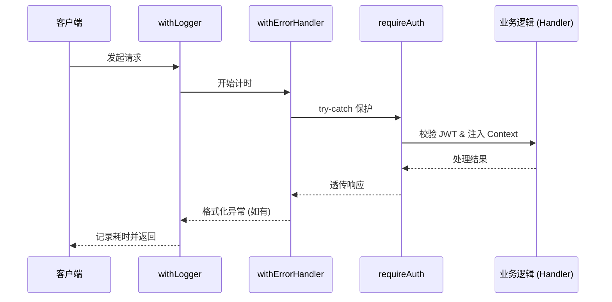
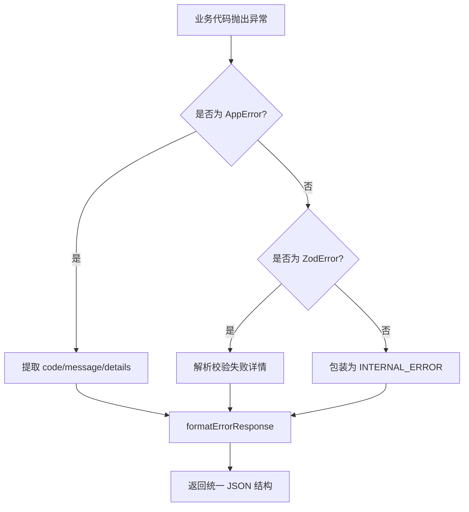

# 基础设施、中间件与通用工具

## 目录
1. [模块概览](#模块概览)
2. [中间件流水线与请求生命周期](#中间件流水线与请求生命周期)
   - [高阶函数包装模式 (HOF)](#高阶函数包装模式-hof)
   - [身份验证与权限控制深度解析](#身份验证与权限控制深度解析)
   - [日志与性能监控](#日志与性能监控)
3. [全局错误处理与异常规范](#全局错误处理与异常规范)
   - [自定义错误体系 AppError](#自定义错误体系-apperror)
   - [错误码映射与 HTTP 状态码](#错误码映射与-http-状态码)
   - [Zod 校验错误集成处理](#zod-校验错误集成处理)
4. [基础设施与持久化连接管理](#基础设施与持久化连接管理)
   - [Redis 缓存策略与连接池](#redis-缓存策略与连接池)
   - [Supabase 客户端双轨制](#supabase-客户端双轨制)
   - [连接健康检查机制](#连接健康检查机制)
5. [类型安全与全栈数据校验](#类型安全与全栈数据校验)
   - [基于 Zod 的领域驱动校验](#基于-zod-的领域驱动校验)
   - [运行时校验与编译时类型的统一](#运行时校验与编译时类型的统一)
   - [通用类型工具库](#通用类型工具库)
6. [配置管理与环境隔离](#配置管理与环境隔离)
7. [测试策略与质量保障](#测试策略与质量保障)
8. [文件参考](#文件参考)

## 模块概览

本模块是后端系统的“中枢神经系统”，涵盖了横切关注点（Cross-cutting Concerns）的完整实现。这些功能分布在 `backend/src/middleware/`、`backend/src/infrastructure/` 和 `backend/src/lib/` 目录下，为上层业务逻辑提供了一套标准化的运行环境。

在文件规模上，该部分包含 17 个核心文件，其中 11 个为生产代码，6 个为配套的单元测试文件。这些代码库定义了请求如何安全地进入系统、如何高效地访问缓存、如何优雅地处理失败以及如何保证全链路的类型安全。

**核心职责划分：**
- **中间件 (Middleware)**：采用高阶函数（HOF）模式，负责请求的预处理、日志审计、CORS 策略以及多维度的身份验证（JWT/Session）。
- **基础设施 (Infrastructure)**：管理与 Redis 和 Supabase 的持久化连接，通过单例模式和自动重试机制确保底层资源的高可用性。
- **通用库 (Lib)**：提供了全栈共享的业务工具，包括统一的错误处理规范、基于 Zod 的 DTO 校验 Schema、集中式配置管理以及 TypeScript 类型工具。

这种分层设计不仅提高了代码的复用性，更重要的是通过强制性的校验和统一的异常处理，极大地降低了业务开发的复杂度，确保了系统在面对异常情况时的健壮性。

## 中间件流水线与请求生命周期

后端的请求处理并没有采用 Next.js 原生的全局中间件（`middleware.ts`），而是选择在路由处理函数（Route Handlers）层级使用高阶函数（Higher-Order Functions, HOF）进行包装。这种设计提供了更好的灵活性，允许针对不同的 API 路径定制不同的中间件组合。

### 高阶函数包装模式 (HOF)

通过嵌套包装，我们构建了一个类似于“洋葱模型”的执行流水线。每个包装器负责一个特定的功能，并在执行完自身逻辑后调用下一个处理器。



**图表说明**：
该序列图展示了请求在到达核心业务逻辑之前所经历的层层过滤。`withLogger` 位于最外层，确保能监控到包括中间件报错在内的所有请求耗时；`withErrorHandler` 负责捕获下游抛出的所有异常；`requireAuth` 则是最后一道安全防线，确保只有合法用户能访问受保护的资源。

### 身份验证与权限控制深度解析

身份验证逻辑（`auth.ts`）是系统的安全核心。它不仅支持标准的 JWT 校验，还为了开发便利性集成了本地 Session 存储。

**验证流程：**
1. **Token 提取**：从 `Authorization` 请求头中解析 `Bearer` 令牌。
2. **本地校验**：如果是开发环境的测试 Token，直接从内存存储 `local-auth-session.store` 中检索用户信息。
3. **云端校验**：使用 `getSupabaseAdmin()` 获取管理员权限客户端，调用 `auth.getUser(token)` 验证合法性。
4. **角色判定**：从用户的 `app_metadata` 中提取角色信息（admin, editor, viewer），并注入 `AuthContext`。

```typescript
// 权限控制包装器示例
export function requireRole(roles: string[], handler: RouteHandler): RouteHandler {
  return async (request: NextRequest, context: unknown) => {
    const auth = await verifyJwt(request);
    if (!auth) throw Errors.authUnauthorized('请先登录');
    
    if (!roles.includes(auth.role)) {
      throw Errors.forbidden('您的权限不足以执行此操作');
    }

    // 将验证后的上下文注入请求对象，供后续 Handler 使用
    (request as any).auth = auth;
    return handler(request, context);
  };
}
```

### 日志与性能监控

`withLogger` 中间件为每个请求提供了基础的审计日志。它记录了 HTTP 方法、请求路径以及完整的响应时长。这对于定位慢查询和监控系统负载至关重要。

> **💡 提示**：在生产环境中，这些日志通常会被重定向到 ELK 或类似的日志分析平台，通过 `[duration]ms` 字段可以快速筛选出性能瓶颈。

**Section sources**:
- [auth.ts](backend/src/middleware/auth.ts)
- [logger.ts](backend/src/middleware/logger.ts)
- [error-handler.ts](backend/src/middleware/error-handler.ts)

## 全局错误处理与异常规范

为了避免前端处理各种千奇百怪的错误格式，后端实现了一套严谨的错误处理体系。

### 自定义错误体系 AppError

我们在 `backend/src/lib/errors.ts` 中定义了 `AppError` 类，这是整个系统唯一允许手动抛出的异常类型。它强制要求提供一个 `ErrorCode`，从而实现了错误类型的语义化。

| 错误码 (ErrorCode) | HTTP 状态码 | 适用场景 |
| :--- | :--- | :--- |
| `NOT_FOUND` | 404 | 资源（短剧、剧集、评论）不存在 |
| `VALIDATION_ERROR` | 400 | 参数格式错误或 Zod 校验失败 |
| `UNAUTHORIZED` | 401 | 未登录或 Token 已过期 |
| `FORBIDDEN` | 403 | 权限不足，无法访问特定资源 |
| `CONFLICT` | 409 | 数据冲突，如重复点赞、重复签到 |
| `INTERNAL_ERROR` | 500 | 未捕获的系统异常 |

### 错误码映射与 HTTP 状态码

`AppError` 构造函数会自动根据 `ErrorCode` 查找对应的 HTTP 状态码。这种映射关系被集中管理在 `ErrorStatusCode` 对象中，确保了状态码的一致性。



### Zod 校验错误集成处理

当 API 接收到非法参数时，Zod 会抛出复杂的 `ZodError`。`withErrorHandler` 会将其捕获并转换为结构化的 `details` 数组，前端可以根据 `path` 字段直接将错误信息定位到具体的表单项上。

```typescript
// 统一的错误响应结构
export interface ErrorResponseBody {
  error: {
    code: string;
    message: string;
    details?: any; // 仅在校验失败时存在
  };
}
```

**Section sources**:
- [errors.ts](backend/src/lib/errors.ts)
- [error-handler.ts](backend/src/middleware/error-handler.ts)

## 基础设施与持久化连接管理

基础设施层负责与外部状态服务交互，其核心目标是“连接复用”和“故障自愈”。

### Redis 缓存策略与连接池

Redis 客户端基于 `ioredis` 实现，采用了单例模式。为了应对不稳定的网络环境，我们配置了智能重试策略（Exponential Backoff）：

```typescript
retryStrategy(times: number) {
  if (times > 3) return null; // 超过3次重试则放弃，避免阻塞进程
  return Math.min(times * 200, 2000); // 初始200ms，最大2s
}
```

Redis 在系统中主要承担两类职责：
1. **高频数据缓存**：如短剧排行榜（Ranking）和热门搜索词（Hot Search），过期时间通常设置为 5-10 分钟。
2. **状态同步**：用于处理一些需要原子操作的计数器或简单的分布式锁。

### Supabase 客户端双轨制

系统维护了两个不同的 Supabase 客户端，以适应不同的安全上下文：
- **getSupabaseClient()**：使用匿名 Key，遵循数据库中定义的 RLS（Row Level Security）规则。
- **getSupabaseAdmin()**：使用 Service Role Key，拥有“超级管理员”权限。主要用于中间件中的用户校验、后台管理系统的数据修改等需要绕过 RLS 的场景。

### 连接健康检查机制

每个基础设施组件都暴露了 `checkHealth` 方法。这些方法被集成到全局的 `/api/health` 接口中，用于负载均衡器的健康检查。

```typescript
export async function checkRedisHealth(): Promise<boolean> {
  try {
    const redis = getRedis();
    const result = await redis.ping();
    return result === 'PONG';
  } catch {
    return false;
  }
}
```

**Section sources**:
- [redis.ts](backend/src/infrastructure/redis.ts)
- [supabase.ts](backend/src/infrastructure/supabase.ts)

## 类型安全与全栈数据校验

类型安全是本项目后端架构的基石，它通过 Zod 实现了“运行时校验”与“编译时类型”的完美统一。

### 基于 Zod 的领域驱动校验

在 `backend/src/lib/schemas.ts` 中，我们为每个业务领域定义了详尽的 Schema。这些 Schema 不仅校验数据类型，还包含业务约束（如 `min(1)`, `url()`, `uuid()`）。

```typescript
export const DramaSchema = z.object({
  id: z.string().uuid(),
  title: z.string().min(1).max(200),
  cover_url: z.string().url().nullable(),
  episode_count: z.number().int().nonnegative(),
  // ...
});

// 自动推导 TypeScript 类型
export type Drama = z.infer<typeof DramaSchema>;
```

### 运行时校验与编译时类型的统一

通过这种方式，我们消除了“类型欺骗”的可能性。当数据从数据库读取或从 API 接收时，通过 `parse()` 方法进行校验，如果失败则立即拦截。如果成功，TypeScript 会自动获得一个经过验证的、类型完备的对象。

### 通用类型工具库

`types.ts` 提供了一系列高级类型工具，用于处理复杂的业务场景：
- `DeepPartial<T>`：用于更新操作，允许只传递对象的部分字段。
- `Nullable<T>`：用于数据库映射，将所有字段标记为可空。

**Section sources**:
- [schemas.ts](backend/src/lib/schemas.ts)
- [types.ts](backend/src/lib/types.ts)

## 配置管理与环境隔离

所有的环境变量读取都集中在 `backend/src/lib/config.ts` 中。这种设计避免了 `process.env` 散落在代码各处导致的“配置地狱”。

**关键特性：**
- **只读性**：使用 `as const` 确保配置在运行时不可修改。
- **动态计算**：部分配置（如 `allowTestOtpBypass`）通过 Getter 函数实现，允许根据其他环境变量动态调整逻辑。
- **默认值保护**：为所有非核心配置提供了合理的默认值，确保系统在基础环境下也能启动。

## 测试策略与质量保障

为了确保基础设施和中间件的稳定性，我们在 `__tests__` 目录下编写了大量的单元测试。

- **中间件测试**：通过模拟 `NextRequest` 和 `NextResponse`，验证 `auth` 的拦截逻辑和 `error-handler` 的格式化逻辑。
- **基础设施测试**：使用 Mock 版本的 Redis 和 Supabase，验证单例初始化和健康检查逻辑。
- **Schema 测试**：针对复杂的校验逻辑（如 `ClassificationDimensionsSchema`）编写边界条件测试，确保数据约束的有效性。

## 文件参考

以下是本模块涉及的核心源文件（路径相对于工作区根目录）：

- [backend/src/middleware/auth.ts](backend/src/middleware/auth.ts)：身份验证、JWT 校验与角色控制核心逻辑。
- [backend/src/middleware/error-handler.ts](backend/src/middleware/error-handler.ts)：全局异常捕获、Zod 错误解析与响应格式化。
- [backend/src/middleware/logger.ts](backend/src/middleware/logger.ts)：请求耗时记录与审计日志。
- [backend/src/infrastructure/redis.ts](backend/src/infrastructure/redis.ts)：基于 ioredis 的缓存客户端单例实现。
- [backend/src/infrastructure/supabase.ts](backend/src/infrastructure/supabase.ts)：双轨制 Supabase 客户端管理。
- [backend/src/lib/errors.ts](backend/src/lib/errors.ts)：AppError 类定义、ErrorCode 枚举及错误工厂。
- [backend/src/lib/schemas.ts](backend/src/lib/schemas.ts)：全站 Zod 数据校验模型与 DTO 定义。
- [backend/src/lib/types.ts](backend/src/lib/types.ts)：通用 TypeScript 工具类型库。
- [backend/src/lib/config.ts](backend/src/lib/config.ts)：集中式环境变量与系统配置管理。
