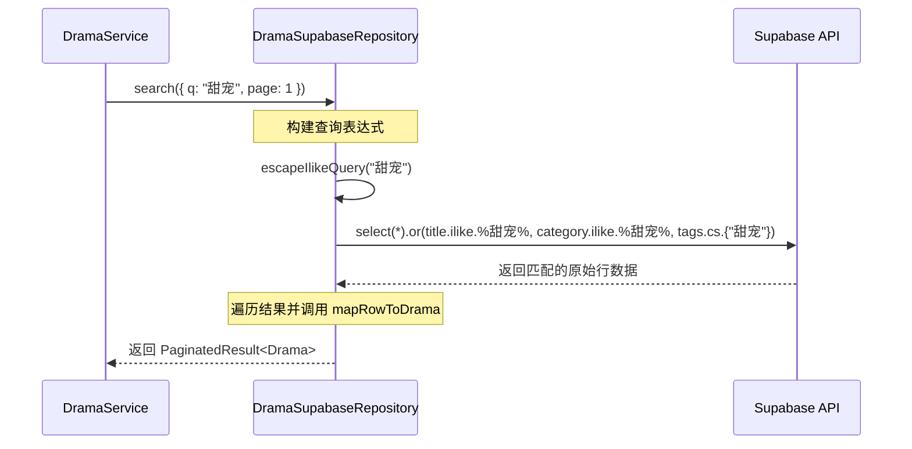
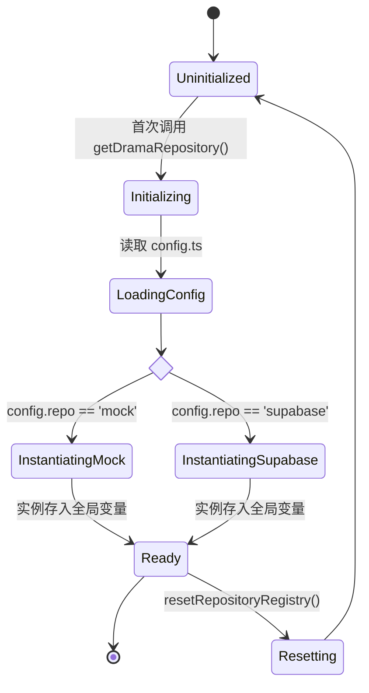
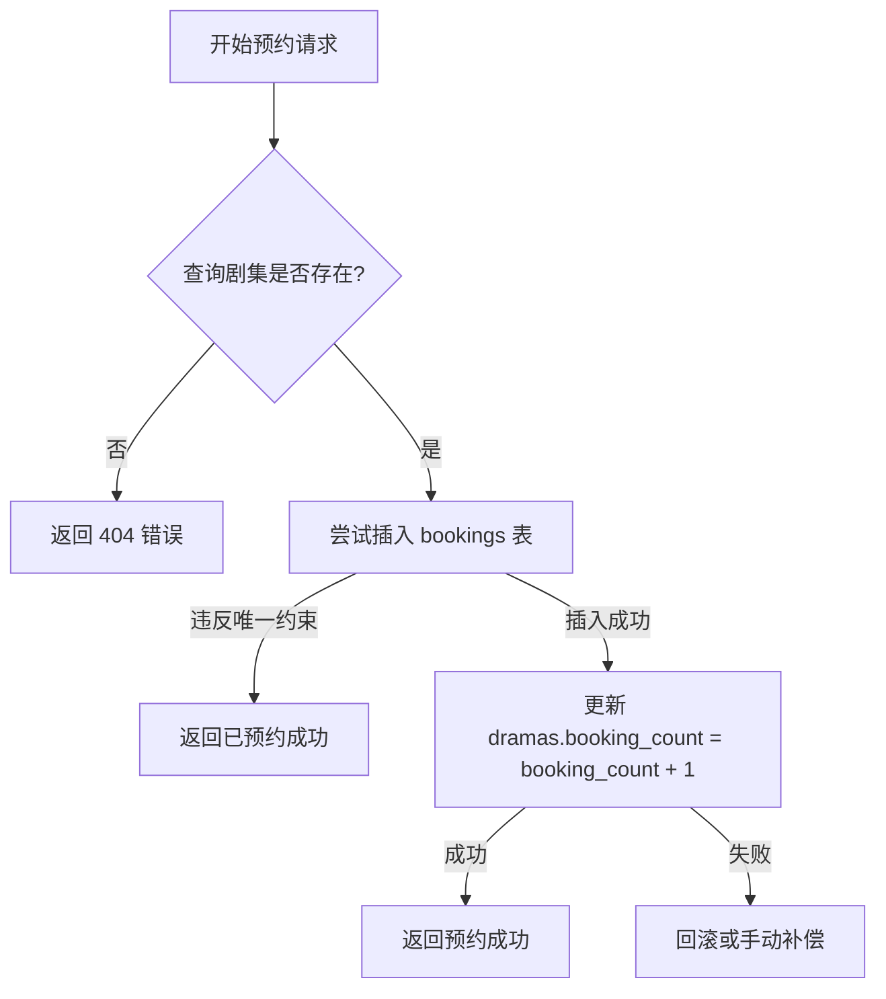

# 数据访问与 Repository 模式

## 目录
1. [模块概览](#模块概览)
2. [数据访问层架构设计](#数据访问层架构设计)
3. [核心组件：Repository 接口契约](#核心组件repository-接口契约)
4. [Supabase 持久化实现深度解析](#supabase-持久化实现深度解析)
5. [Mock 实现与开发效率优化](#mock-实现与开发效率优化)
6. [Repository 注册与发现机制](#repository-注册与发现机制)
7. [数据库 Schema 设计与演进](#数据库-schema-设计与演进)
8. [关键业务逻辑实现：预约与排行](#关键业务逻辑实现预约与排行)
9. [性能考量与查询优化策略](#性能考量与查询优化策略)
10. [测试策略与 Mock 应用](#测试策略与-mock-应用)
11. [文件参考](#文件参考)

## 模块概览

本模块负责后端系统的数据访问层（Data Access Layer, DAL），采用了经典的 **Repository 模式**。在现代 Web 应用开发中，数据访问层往往面临着存储引擎变更、测试复杂性高以及业务逻辑与 SQL 耦合严重等挑战。本模块通过引入 Repository 模式，成功地将数据持久化逻辑与上层业务逻辑（Service Layer）解耦，为系统提供了极高的灵活性和可维护性。

**模块统计与范围**：
- **文件规模**：该模块包含约 45 个 TypeScript 源文件，涵盖了从底层数据库连接到高层接口定义的完整链路。
- **子模块划分**：
  - `interfaces/`：**核心契约层**。定义了所有数据操作的抽象接口，是业务层唯一依赖的对象。
  - `supabase/`：**生产实现层**。基于 Supabase (PostgreSQL) 的高性能实现，利用了 PostgREST 的强大查询能力。
  - `mock/`：**开发辅助层**。提供基于内存的模拟实现，极大提升了前端联调和本地开发的效率。
  - `infrastructure/`：**基础设施层**。管理数据库连接池、客户端单例以及底层配置。
  - `__tests__/`：**质量保证层**。针对每种实现提供详尽的单元测试，确保数据访问的准确性。

本页面将以 `DramaRepository` 为核心案例，深入剖析 Repository 模式在本项目中的落地实践，指导开发者如何扩展新的数据实体或优化现有查询。

**Section sources**:
- [backend/src/repositories/](backend/src/repositories/)
- [backend/supabase/migrations/](backend/supabase/migrations/)

## 数据访问层架构设计

数据访问层的设计遵循了“清洁架构”（Clean Architecture）的原则，通过接口层实现了依赖倒置。业务逻辑层不再直接调用具体的数据库驱动，而是通过接口与数据层对话。这种设计使得系统在面对底层技术变更（例如从 Supabase 迁移到原生 PostgreSQL 或 MongoDB）时，能够将影响范围降至最低。

下面的架构图展示了组件之间的层级关系与交互流程：

```mermaid
graph TB
    subgraph "Service Layer (Domain Logic)"
        DS[DramaService]
        ES[EpisodeService]
    end

    subgraph "Repository Layer (Contracts)"
        DRI[DramaRepositoryInterface]
        ERI[EpisodeRepositoryInterface]
    end

    subgraph "Implementations (Adapters)"
        direction LR
        DSR[DramaSupabaseRepository]
        DMR[DramaMockRepository]
        ESR[EpisodeSupabaseRepository]
        EMR[EpisodeMockRepository]
    end

    subgraph "Data Sources"
        SC[Supabase / Postgres]
        IM[In-Memory Store]
    end

    DS --> DRI
    ES --> ERI
    DRI <|-- DSR
    DRI <|-- DMR
    ERI <|-- ESR
    ERI <|-- EMR
    DSR --> SC
    ESR --> SC
    DMR --> IM
    EMR --> IM
```

**架构设计深度分析**：
1. **依赖倒置 (Dependency Inversion)**：`DramaService` 依赖于 `DramaRepositoryInterface` 而非具体的实现类。这意味着我们可以随时通过配置更换实现，而无需修改 Service 层的任何一行代码。
2. **关注点分离 (Separation of Concerns)**：Repository 仅负责数据的 CRUD 和查询逻辑，不包含任何业务规则。例如，判断一个用户是否有权预约某部剧是 Service 层的职责，而 Repository 仅负责执行“增加预约计数”的操作。
3. **适配器模式 (Adapter Pattern)**：`SupabaseRepository` 和 `MockRepository` 本质上是针对不同存储介质的适配器。它们将底层的原始数据格式转换为系统内部统一的领域模型。

**Diagram sources**:
- [backend/src/repositories/repository-registry.ts](backend/src/repositories/repository-registry.ts)
- [backend/src/repositories/interfaces/drama.repository.interface.ts](backend/src/repositories/interfaces/drama.repository.interface.ts)

## 核心组件：Repository 接口契约

接口定义是整个 Repository 模式的基石。它不仅规定了可用的操作，还定义了数据交换的标准格式。在本项目中，接口定义位于 `backend/src/repositories/interfaces/` 目录下。

以 `DramaRepositoryInterface` 为例，它设计得非常全面，涵盖了从基础 CRUD 到复杂的业务查询：

```typescript
// backend/src/repositories/interfaces/drama.repository.interface.ts

/**
 * 剧集仓库接口契约
 * 定义了业务层对剧集数据的所有操作需求
 */
export interface DramaRepositoryInterface {
  // 基础列表与分页
  findMany(params: PaginationParams): Promise<PaginatedResult<Drama>>;
  
  // 复杂搜索：支持关键字匹配标题、分类和标签
  search(params: SearchDramasParams): Promise<PaginatedResult<Drama>>;
  
  // 剧场频道分发：根据不同频道（如真人、动漫）获取数据
  listTheaterFeed(params: TheaterFeedParams): Promise<PaginatedResult<TheaterDrama>>;
  
  // 排行榜查询：支持热度、推荐、预约等多种排序维度
  listRankings(params: RankingParams, authContext?: AuthContext): Promise<PaginatedResult<RankingDrama>>;
  
  // 预约操作：涉及状态变更与计数更新
  bookDrama(params: BookDramaParams): Promise<BookDramaResult>;
  
  // 用户预约列表：展示用户已预订的资产
  listUserBookings(params: ListUserBookingsParams): Promise<BookingAssetListResponse>;
  
  // 标准 CRUD
  findById(id: string): Promise<Drama | null>;
  create(data: Omit<Drama, 'id' | 'created_at' | 'updated_at'>): Promise<Drama>;
  update(id: string, data: Partial<Omit<Drama, 'id' | 'created_at' | 'updated_at'>>): Promise<Drama | null>;
  delete(id: string): Promise<boolean>;
}
```

**关键设计决策**：
- **参数对象化**：避免使用长参数列表，而是将查询条件封装在 `PaginationParams` 或 `SearchDramasParams` 中。这使得接口在未来增加过滤条件时具有更好的向后兼容性。
- **领域模型驱动**：接口返回的 `Drama` 类型是定义在 `lib/schemas` 中的领域模型，它与数据库的物理表结构解耦。例如，数据库中可能是 `total_episodes`，但领域模型中统一为 `episode_count`。
- **分页元数据**：`PaginatedResult<T>` 包含了 `total_pages` 和 `total` 等关键信息，这对于前端渲染分页器至关重要。

**Section sources**:
- [backend/src/repositories/interfaces/drama.repository.interface.ts](backend/src/repositories/interfaces/drama.repository.interface.ts)

## Supabase 持久化实现深度解析

`DramaSupabaseRepository` 是 Repository 接口在生产环境下的具体实现。它通过 `@supabase/supabase-js` 客户端与远程 PostgreSQL 数据库进行交互。

### 数据映射与校验 (Mapping & Validation)
由于数据库返回的 JSON 结构可能与领域模型不完全一致，Repository 内部使用了 Zod 进行严格的数据校验和转换。

```typescript
// backend/src/repositories/supabase/drama.supabase.repository.ts

function mapRowToDrama(row: unknown): Drama {
  // 1. 使用 Zod 校验数据库返回的原始行
  const parsed = SupabaseDramaRowSchema.safeParse(row);
  if (!parsed.success) {
    throw Errors.internal('Invalid drama row returned from Supabase');
  }

  // 2. 转换为领域模型，并处理默认值和 null
  const drama = DramaSchema.safeParse({
    id: parsed.data.id,
    title: parsed.data.title,
    description: parsed.data.description ?? '',
    cover_url: parsed.data.cover_url ?? null,
    episode_count: parsed.data.episode_count,
    tags: parsed.data.tags ?? [],
    // ... 其他字段
  });

  if (!drama.success) {
    throw Errors.internal('Failed to map drama row to canonical contract');
  }

  return drama.data;
}
```

### 复杂查询的构建
对于 `search` 接口，Repository 利用了 Supabase 的 `.or()` 和 PostgreSQL 的 `ilike` 操作符来实现跨列搜索。



**性能与安全性考量**：
- **查询转义**：`escapeIlikeQuery` 函数确保用户输入的特殊字符不会破坏 SQL 查询结构，有效防止注入攻击。
- **精确计数**：使用 `{ count: 'exact' }` 选项获取总记录数，虽然这会增加一点数据库开销，但对于准确的分页是必须的。
- **范围查询**：`.range(from, to)` 是基于零索引的，Repository 负责处理 `(page - 1) * pageSize` 的转换逻辑。

**Section sources**:
- [backend/src/repositories/supabase/drama.supabase.repository.ts](backend/src/repositories/supabase/drama.supabase.repository.ts)
- [backend/src/infrastructure/supabase.ts](backend/src/infrastructure/supabase.ts)

## Mock 实现与开发效率优化

在现代全栈开发中，后端数据库的部署往往滞后于接口定义。为了让前端开发者能够立即开始工作，我们提供了 `DramaMockRepository`。

### 内存存储机制
Mock 实现使用 `Map<string, RankingDrama>` 在内存中存储数据。它不仅模拟了基础的 CRUD，还完整模拟了分页、排序和搜索的算法。

```typescript
// backend/src/repositories/mock/drama.mock.repository.ts

export class DramaMockRepository implements DramaRepositoryInterface {
  private data: Map<string, RankingDrama>;

  async listRankings(params: RankingParams, authContext?: AuthContext): Promise<PaginatedResult<RankingDrama>> {
    // 1. 模拟过滤逻辑
    let filtered = Array.from(this.data.values())
      .filter(d => params.contentType === 'all' || d.content_type === params.contentType);

    // 2. 模拟排序逻辑（热度、推荐、预约）
    const sorted = sortRankings(filtered, params.type);

    // 3. 模拟分页切片
    return paginate(sorted, params);
  }
}
```

**Mock 的核心优势**：
1. **零配置启动**：新加入的开发者无需配置本地数据库或 Supabase 密钥，即可运行整个系统。
2. **极速反馈**：单元测试无需网络开销，数百个测试用例可在几秒内完成。
3. **状态控制**：在测试中可以轻松构造各种边界情况（如空列表、超长文本等），而无需在真实数据库中手动插入数据。

**Section sources**:
- [backend/src/repositories/mock/drama.mock.repository.ts](backend/src/repositories/mock/drama.mock.repository.ts)

## Repository 注册与发现机制

为了在运行时灵活切换实现，系统引入了 `RepositoryRegistry`。它充当了工厂和单例管理器的双重角色。



**关键机制说明**：
- **单例模式**：每个 Repository 在应用生命周期内仅实例化一次，减少内存开销。
- **依赖注入支持**：通过 `setDramaRepository()`，我们可以在单元测试中注入 Mock 实例或 Spy 对象，实现对 Service 层的隔离测试。
- **环境隔离**：通过环境变量（如 `PLAYER_HISTORY_REPOSITORY=supabase`）控制不同环境下的行为，确保生产环境始终使用真实数据库。

```typescript
// backend/src/repositories/repository-registry.ts

export function getDramaRepository(): DramaRepositoryInterface {
  // 逻辑：如果未初始化则根据配置创建，否则返回现有实例
  return dramaRepository;
}
```

**Section sources**:
- [backend/src/repositories/repository-registry.ts](backend/src/repositories/repository-registry.ts)

## 数据库 Schema 设计与演进

数据库结构是数据访问层的物理基础。本项目使用 Supabase 迁移工具管理 Schema 的演进。

### 核心表结构：dramas
`dramas` 表经历了从基础信息到复杂排行榜支持的演进过程。

```sql
-- backend/supabase/migrations/00000000000001_init_tables.sql
CREATE TABLE dramas (
  id            UUID PRIMARY KEY DEFAULT gen_random_uuid(),
  title         TEXT NOT NULL CHECK (char_length(title) > 0),
  description   TEXT,
  cover_url     TEXT,
  category      TEXT,
  total_episodes INTEGER NOT NULL DEFAULT 0,
  rating        NUMERIC(3,1),
  status        TEXT NOT NULL DEFAULT 'ongoing',
  created_at    TIMESTAMPTZ DEFAULT NOW(),
  updated_at    TIMESTAMPTZ DEFAULT NOW()
);

-- 扩展：增加排行榜支持 (20260727000100)
ALTER TABLE dramas
  ADD COLUMN content_type TEXT DEFAULT 'live_action',
  ADD COLUMN booking_count INTEGER DEFAULT 0,
  ADD COLUMN recommendation_score NUMERIC(10,2) DEFAULT 0;

-- 扩展：增加标签系统 (20260727000200)
ALTER TABLE dramas
  ADD COLUMN tags TEXT[] DEFAULT ARRAY[]::TEXT[];
```

**设计亮点**：
- **约束保障**：使用了大量 `CHECK` 约束（如 `rating` 在 0-10 之间，`booking_count` 非负），在数据库层面保证数据一致性。
- **自动更新时间戳**：通过 `trg_dramas_updated_at` 触发器，确保每次更新记录时 `updated_at` 字段都会自动同步。
- **数组列应用**：`tags` 使用了 PostgreSQL 的 `TEXT[]` 数组类型，相比于传统的关联表，在读多写少的场景下查询性能更优。

**Section sources**:
- [backend/supabase/migrations/00000000000001_init_tables.sql](backend/supabase/migrations/00000000000001_init_tables.sql)
- [backend/supabase/migrations/20260727000100_add_ranking_fields_and_bookings.sql](backend/supabase/migrations/20260727000100_add_ranking_fields_and_bookings.sql)

## 关键业务逻辑实现：预约与排行

### 剧集预约的原子性处理
预约操作是一个典型的“读取-修改-写入”过程。为了保证 `booking_count` 的准确性，Repository 采用了以下策略：



在 `DramaSupabaseRepository.bookDrama` 中，我们利用了 PostgreSQL 的唯一索引来处理并发冲突。如果用户已经预约过，插入 `bookings` 表会触发唯一约束冲突，Repository 会捕获此错误并优雅地返回“已预约”状态，而不是报错。

### 排行榜状态合并
`listRankings` 接口需要返回剧集的预约状态。由于排行榜数据量大且涉及跨表，Repository 采用了“分步加载”的优化策略：
1. **获取主列表**：从 `dramas` 表获取当前页的排行榜剧集。
2. **提取 ID 集合**：获取当前页 10-20 部剧集的 UUID。
3. **批量查询状态**：如果用户已登录，发起一次针对 `bookings` 表的批量查询（使用 `in` 操作符）。
4. **内存合并**：在 Repository 内部将预约状态注入到 `RankingDrama` 对象中。

这种策略避免了复杂的 SQL JOIN，减轻了数据库压力，且更易于缓存。

**Section sources**:
- [backend/src/repositories/supabase/drama.supabase.repository.ts:L581-L637](backend/src/repositories/supabase/drama.supabase.repository.ts#L581-L637)

## 性能考量与查询优化策略

随着剧集数量的增加，数据访问层的性能直接影响用户体验。我们实施了以下优化措施：

1. **GIN 索引加速标签搜索**：
   对于 `tags` 数组列，普通的 B-tree 索引无效。我们使用了 GIN (Generalized Inverted Index) 索引，使得“包含特定标签”的查询能够达到毫秒级响应。
   ```sql
   CREATE INDEX IF NOT EXISTS idx_dramas_tags_gin ON dramas USING GIN (tags);
   ```

2. **覆盖索引与复合索引**：
   排行榜查询通常涉及排序。我们为常用的排序组合创建了复合索引，减少了内存排序（External Sort）的开销。
   ```sql
   CREATE INDEX IF NOT EXISTS idx_dramas_play_count_desc ON dramas(play_count DESC, created_at DESC);
   ```

3. **按需字段选择**：
   在 `select` 语句中，我们从不使用 `*`，而是显式列出需要的字段（`DRAMA_SELECT_COLUMNS`）。这减少了网络传输的 Payload 大小，特别是对于包含长描述或大 JSON 对象的表。

4. **分页硬限制**：
   在 Repository 层强制执行 `pageSize` 的上限，防止恶意请求导致数据库扫描过大范围的数据。

**Section sources**:
- [backend/supabase/migrations/20260727000200_add_drama_tags.sql](backend/supabase/migrations/20260727000200_add_drama_tags.sql)
- [backend/supabase/migrations/20260727000100_add_ranking_fields_and_bookings.sql](backend/supabase/migrations/20260727000100_add_ranking_fields_and_bookings.sql)

## 测试策略与 Mock 应用

数据访问层的测试分为两部分：针对 Mock 实现的单元测试和针对 Supabase 实现的集成测试。

### 单元测试示例
在 `backend/src/repositories/__tests__/` 目录下，我们可以看到如何利用 Mock Repository 快速验证逻辑：

```typescript
// 示例：验证搜索逻辑
test('DramaMockRepository.search should filter by title', async () => {
  const repo = new DramaMockRepository([
    { id: '1', title: '逆袭之战', ... },
    { id: '2', title: '豪门恩怨', ... }
  ]);
  
  const result = await repo.search({ q: '逆袭', page: 1, pageSize: 10 });
  expect(result.data).toHaveLength(1);
  expect(result.data[0].title).toBe('逆袭之战');
});
```

### 集成测试
对于 Supabase 实现，测试会连接到一个本地的 Docker 容器（包含 PostgreSQL 和 PostgREST），确保 SQL 语法和约束逻辑的正确性。这保证了在生产环境部署前，所有复杂的 SQL 表达式都经过了实战检验。

**Section sources**:
- [backend/src/repositories/__tests__/drama.mock.repository.test.ts](backend/src/repositories/__tests__/drama.mock.repository.test.ts)
- [backend/src/repositories/supabase/__tests__/drama.supabase.repository.test.ts](backend/src/repositories/supabase/__tests__/drama.supabase.repository.test.ts)

## 文件参考

以下是本模块涉及的核心文件列表，建议开发者在扩展功能前仔细阅读：

- **核心接口定义**：
  - `backend/src/repositories/interfaces/drama.repository.interface.ts`
  - `backend/src/repositories/interfaces/episode.repository.interface.ts`
- **Supabase 持久化实现**：
  - `backend/src/repositories/supabase/drama.supabase.repository.ts`
  - `backend/src/repositories/supabase/auth-profile.supabase.repository.ts`
- **Mock 内存实现**：
  - `backend/src/repositories/mock/drama.mock.repository.ts`
- **注册与分发逻辑**：
  - `backend/src/repositories/repository-registry.ts`
- **基础设施与配置**：
  - `backend/src/infrastructure/supabase.ts`
  - `backend/src/lib/config.ts`
- **数据库迁移脚本**：
  - `backend/supabase/migrations/00000000000001_init_tables.sql`
  - `backend/supabase/migrations/20260727000100_add_ranking_fields_and_bookings.sql`
  - `backend/supabase/migrations/20260727000200_add_drama_tags.sql`
