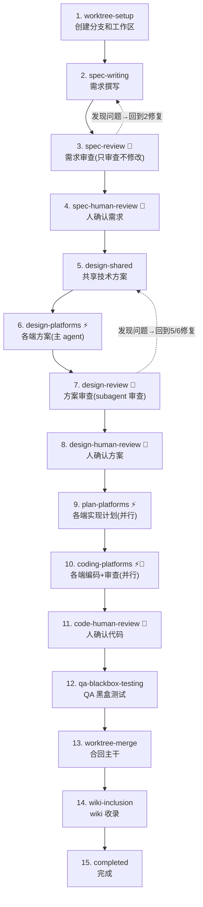
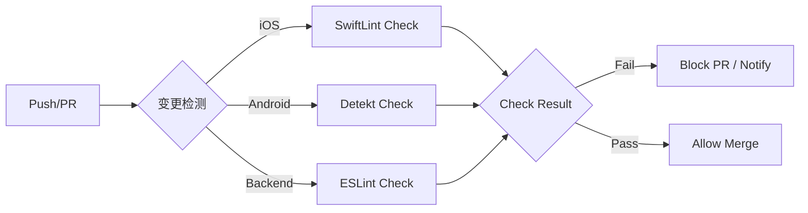
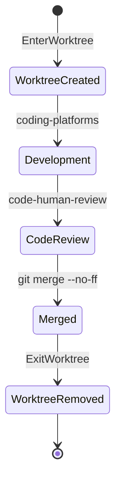
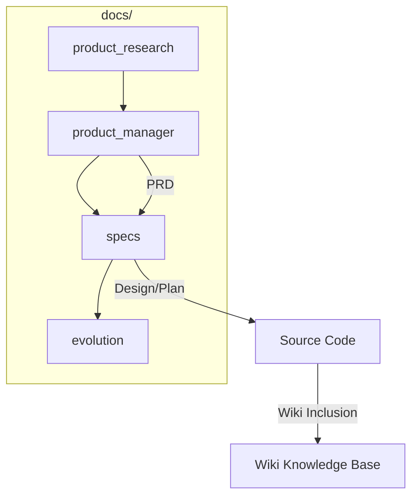

# 工程化规范与 AI 辅助工作流

## 目录
1. [模块概览](#模块概览)
2. [AI 辅助工作流详解](#ai-辅助工作流详解)
   - [feature-workflow 核心流程](#feature-workflow-核心流程)
   - [AI Skills 矩阵与职责](#ai-skills-矩阵与职责)
3. [自动化规范与 Lint 体系](#自动化规范与-lint-体系)
   - [多端 Lint 配置标准](#多端-lint-配置标准)
   - [CI 中的自动化执行](#ci-中的自动化执行)
4. [Git 工作流与提交规范](#git-工作流与提交规范)
   - [基于 Worktree 的隔离开发](#基于-worktree-的分离开发)
   - [Conventional Commits 提交规范](#conventional-commits-提交规范)
5. [文档驱动开发 (DDD)](#文档驱动开发-ddd)
   - [docs 目录结构与职责](#docs-目录结构与职责)
   - [Wiki 维护与同步](#wiki-维护与同步)
6. [核心组件与配置文件](#核心组件与配置文件)
7. [文件参考](#文件参考)

## 模块概览

本模块定义了项目的工程化规范与 AI 辅助开发流程。项目深度集成 AI（Claude）能力，通过 `.claude/skills/` 目录下的技能定义，实现了从需求分析、技术方案设计、代码实现到测试验收的全流程自动化编排。

**核心发现与覆盖范围**：
- **AI 技能库**：共发现 10+ 个核心技能，涵盖 `feature-workflow`（全流程编排）、`ios-development`、`android-development`、`backend-development` 等。
- **自动化工具**：集成了 `SwiftLint` (iOS)、`Detekt` (Android) 和 `ESLint` (Backend/Web)，确保多端代码质量一致性。
- **文档体系**：建立了以 `docs/specs/` 为核心的开发文档体系和以 `llm-wiki` 为核心的知识库同步机制。
- **Git 工作流**：采用 `git worktree` 进行需求隔离开发，确保主干分支的稳定性。

本章节将重点介绍如何利用这些工具和规范提升开发效率，并确保团队协作的高质量产出。

## AI 辅助工作流详解

项目工程化的核心在于 **AI 辅助工作流**。通过 `feature-workflow` 技能，AI 能够自主推进开发的各个阶段，开发者仅在关键节点（需求确认、方案确认、代码确认）进行介入。

### feature-workflow 核心流程

`feature-workflow` 将需求落地划分为 15 个阶段，每个阶段都有明确的执行者、前置条件和产物。

**流程说明**：
1. **高度自动化**：在 `spec-review`、`design-review` 和 `coding` 阶段，系统内置了「执行→审查→修复」的闭环循环，AI 会自动尝试修复 3 轮以内的问题。
2. **人工确认点**：流程强制在阶段 4（需求）、阶段 8（方案）和阶段 11（代码）暂停，等待开发者确认后方可继续。
3. **并行开发**：在 `plan` 和 `coding` 阶段，AI 会根据涉及的平台（iOS、Android、Backend）并行派发 subagent，极大提升了多端同步开发的效率。

### AI Skills 矩阵与职责

项目通过技能矩阵实现了职责分离，每个技能负责特定的工程领域。

| 技能名称 | 核心职责 | 关键参考文件 |
| :--- | :--- | :--- |
| `feature-workflow` | 流程编排、状态管理、worktree 切换 | `scripts/workflow.py` |
| `llm-wiki` | 知识库更新、文档一致性维护 | `assets/index-template.md` |
| `ios-development` | iOS 端架构设计 (SwiftUI + MVVM) 与编码 | `standards/architecture.md` |
| `android-development` | Android 端架构设计 (Compose + Clean Arch) | `standards/coding-standards.md` |
| `product-manager` | 需求拆解、PRD 维护、进度追踪 | `assets/prd-template.md` |

**Diagram sources**: 
- [.claude/skills/feature-workflow/SKILL.md:L67-L89](.claude/skills/feature-workflow/SKILL.md#L67-L89)

## 自动化规范与 Lint 体系

为了保证代码库的整洁和可维护性，项目在各端都配置了严格的静态分析工具（Lint）。

### 多端 Lint 配置标准

项目针对不同技术栈采用了业界主流的 Lint 方案，并进行了靶向配置：

1. **iOS (SwiftLint)**：
   - 配置文件：`ios/.swiftlint.yml`
   - 核心规则：强制执行 120 字符行宽限制，禁止 `force_unwrapping`，规范闭包间距。
   - 错误级别：将严重违规（如超长文件）标记为 Error，阻塞构建。

2. **Android (Detekt)**：
   - 配置文件：`android/.detekt/detekt.yml`
   - 核心规则：开启 `WildcardImport` 和 `UnusedImports` 检查，限制函数参数数量（max 10）。
   - 警告即错误：配置 `warningsAsErrors: true`，确保任何 Lint 问题都必须被修复。

3. **Backend/Web (ESLint)**：
   - 配置文件：`backend/eslint.config.mjs`
   - 核心规则：继承 `next/core-web-vitals` 和 `typescript` 规范。
   - 排除范围：自动忽略 `.next/`、`build/` 等构建产物。

### CI 中的自动化执行

所有的 Lint 检查都集成在 GitHub Actions 流水线中。

在 CI 流程中，Lint 检查作为第一道防线。如果代码不符合规范，Job 将立即失败，防止劣质代码进入主干。

**Section sources**:
- [ios/.swiftlint.yml](ios/.swiftlint.yml)
- [android/.detekt/detekt.yml](android/.detekt/detekt.yml)
- [backend/eslint.config.mjs](backend/eslint.config.mjs)

## Git 工作流与提交规范

项目采用基于 **Worktree** 的隔离开发模式，并遵循 **Conventional Commits** 提交规范。

### 基于 Worktree 的隔离开发

不同于传统的分支切换（`git checkout`），项目使用 `git worktree` 为每个需求创建独立的物理目录。

**Worktree 优势**：
- **环境隔离**：不同需求的构建产物（如 `node_modules`、`build/`）互不干扰。
- **快速切换**：无需暂存（stash）当前修改即可同时处理多个紧急 Bug 或需求。
- **清理彻底**：需求完成后，通过 `ExitWorktree` 物理删除目录，保持主工作区整洁。

### Conventional Commits 提交规范

项目要求提交信息必须遵循约定式提交格式，以便自动生成变更日志（Changelog）和进行版本控制。

**格式要求**：
`<type>(<scope>): <description>`

**常用类型**：
- `feat`: 新功能
- `fix`: 修补 bug
- `docs`: 文档变更
- `style`: 不影响代码含义的变更（空白、格式、缺少分号等）
- `refactor`: 重构代码
- `test`: 添加缺失的测试或更正现有的测试

**Section sources**:
- [.claude/skills/feature-workflow/SKILL.md:L32-L38](.claude/skills/feature-workflow/SKILL.md#L32-L38)
- [.opencode/commands/commit.md](.opencode/commands/commit.md)

## 文档驱动开发 (DDD)

项目坚持「文档先行」的原则，确保技术设计与代码实现同步。

### docs 目录结构与职责

`docs/` 目录是项目的「大脑」，记录了从市场调研到技术实现的每一个决策。

- **product_research/**：竞品分析、市场调研。
- **product_manager/**：PRD 文档、Backlog、Roadmap。
- **specs/**：针对具体 Feature 的技术规格书，包含 `design.md`（方案）、`plan.md`（计划）和 `qa-test.md`（测试）。
- **evolution/**：记录项目的重大架构演进和决策。

### Wiki 维护与同步

在 `feature-workflow` 的第 14 阶段，AI 会自动调用 `llm-wiki` 技能，将本次需求的变更汇总并更新到 Wiki 知识库中。这确保了 Wiki 永远反映代码的最新状态，而不是过时的文档。

**Section sources**:
- [docs/specs/2026-07-24-project-init/spec.md](docs/specs/2026-07-24-project-init/spec.md)
- [.claude/skills/llm-wiki/SKILL.md](.claude/skills/llm-wiki/SKILL.md)

## 核心组件与配置文件

以下是支撑整个工程化体系的关键配置文件：

| 文件路径 | 用途 |
| :--- | :--- |
| `.claude/skills/feature-workflow/SKILL.md` | AI 工作流的总纲 |
| `.claude/skills/feature-workflow/scripts/workflow.py` | 流程状态管理脚本 |
| `ios/.swiftlint.yml` | iOS 代码规范配置 |
| `android/.detekt/detekt.yml` | Android 代码规范配置 |
| `backend/eslint.config.mjs` | 后端/Web 代码规范配置 |
| `PRODUCT.md` | 项目核心标识与技术定义 |

## 文件参考

本章节内容基于对以下关键文件的分析：
- [.claude/skills/feature-workflow/SKILL.md](.claude/skills/feature-workflow/SKILL.md)
- [.claude/skills/ios-development/SKILL.md](.claude/skills/ios-development/SKILL.md)
- [android/.detekt/detekt.yml](android/.detekt/detekt.yml)
- [ios/.swiftlint.yml](ios/.swiftlint.yml)
- [backend/eslint.config.mjs](backend/eslint.config.mjs)
- [docs/specs/2026-07-24-project-init/spec.md](docs/specs/2026-07-24-project-init/spec.md)
- [.opencode/commands/commit.md](.opencode/commands/commit.md)
