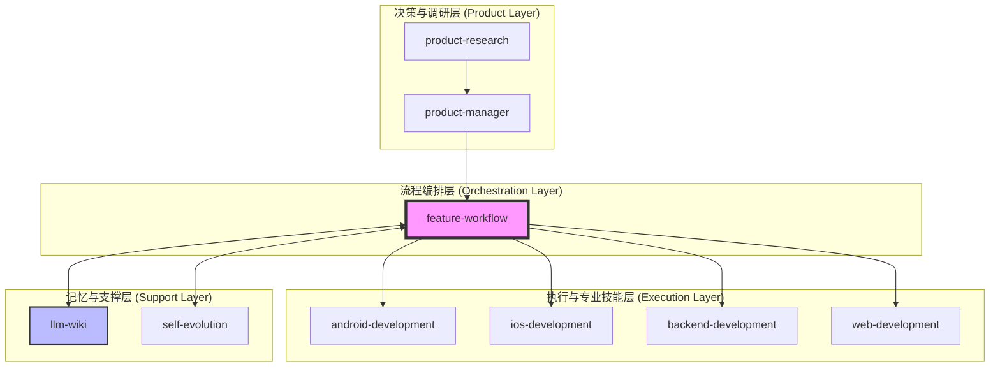
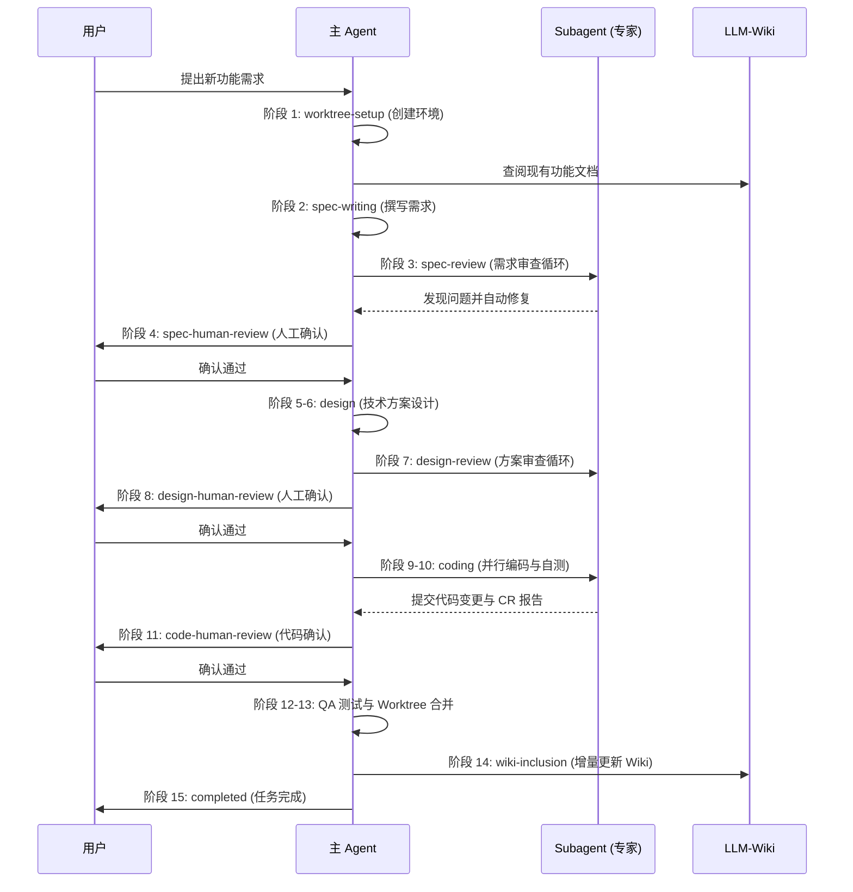
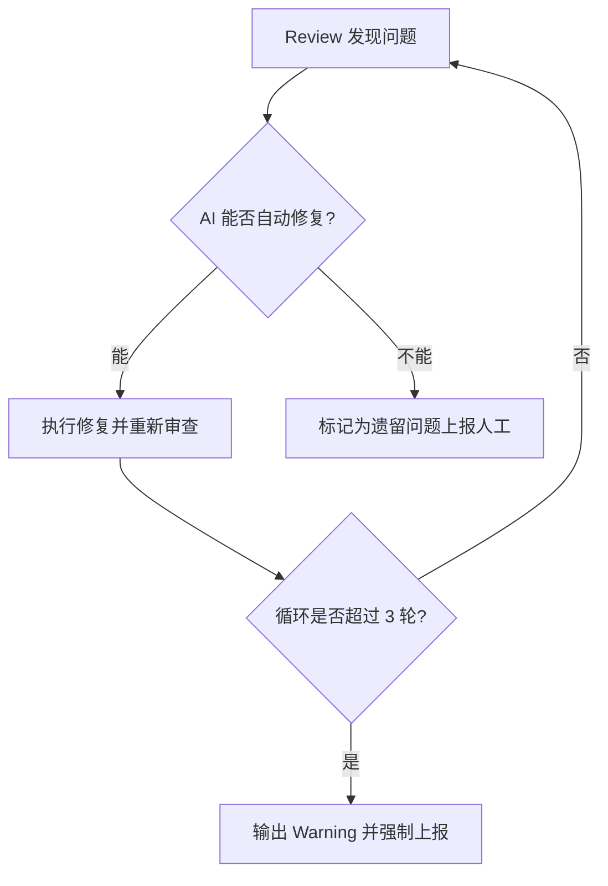

# Claude AI Skills 使用指南

## 目录
1. [模块概览](#模块概览)
2. [技能体系架构](#技能体系架构)
3. [核心工作流：从需求到落地](#核心工作流从需求到落地)
4. [各端 AI 操作规范](#各端-ai-操作规范)
5. [技能调用与 Prompt 示例](#技能调用与-prompt-示例)
6. [常见问题与 AI 解决方案](#常见问题与-ai-解决方案)
7. [文件参考](#文件参考)

## 模块概览

`.claude/skills` 目录是本项目 AI 辅助开发的核心大脑。它不仅包含了一系列针对特定任务的 Markdown 指令（SKILL.md），还配套了丰富的参考文档（references）、资源模板（assets）以及自动化管理脚本（scripts）。

### 统计信息
- **总文件数**: 161 个文件
- **子模块数量**: 13 个核心技能模块
- **覆盖范围**: 需求分析、产品规划、跨端开发（Android/iOS/Web/Backend）、自动化测试、Wiki 维护、项目演进等全生命周期。

### 子模块列表
| 模块名 | 职责描述 | 覆盖深度 |
| :--- | :--- | :--- |
| `feature-workflow` | **核心编排层**：管理从需求启动到代码合并的 15 个阶段。 | 深度覆盖 |
| `product-manager` | **产品决策层**：负责需求拆解、PRD 撰写、工时估算与进展管理。 | 深度覆盖 |
| `android-development` | **Android 专家**：提供 Kotlin + Jetpack Compose 的开发与 AI 操作规范。 | 深度覆盖 |
| `ios-development` | **iOS 专家**：提供 Swift + SwiftUI 的开发与 AI 操作规范。 | 深度覆盖 |
| `backend-development` | **后端专家**：提供 Node.js + Supabase 的 API 设计与数据库操作规范。 | 深度覆盖 |
| `web-development` | **Web 专家**：提供 React + Tailwind 的前端开发规范。 | 标准覆盖 |
| `llm-wiki` | **项目记忆层**：负责项目功能文档的自动生成、查询与增量更新。 | 深度覆盖 |
| `product-research` | **调研层**：负责竞品分析与产品调研。 | 标准覆盖 |
| `self-evolution` | **进化层**：记录项目演进过程，实现 AI 技能的自我迭代。 | 标准覆盖 |
| `init-project` | **初始化层**：负责新项目的脚手架搭建与环境配置。 | 标准覆盖 |

**模块概览来源**:
- [.claude/skills/](.claude/skills/)

## 技能体系架构

本项目的技能体系采用了**分层协作模型**。这种设计确保了 AI 在处理复杂任务时，能够像一个真实的软件开发团队一样进行分工协作。

### 分层模型图示



### 核心职能分工
1.  **`feature-workflow` (指挥官)**: 不直接写代码，而是负责“什么时候该做什么”。它驱动整个开发流水线，并管理 subagent 的派发。
2.  **`product-manager` (大脑)**: 负责回答“为什么做”和“做什么”。它将模糊的想法转化为可落地的 PRD 和子任务。
3.  **专业端技能 (专家)**: 负责“怎么做”。例如 `android-development` 包含了如何使用 ADB 调试、如何编写 Compose 组件等具体知识。
4.  **`llm-wiki` (长期记忆)**: 存储项目的所有功能逻辑。AI 在开始新任务前必须查阅 Wiki 以了解现状。

**架构设计来源**:
- [.claude/skills/feature-workflow/SKILL.md](.claude/skills/feature-workflow/SKILL.md)
- [.claude/skills/product-manager/SKILL.md](.claude/skills/product-manager/SKILL.md)

## 核心工作流：从需求到落地

`feature-workflow` 定义了一个严密的 15 阶段闭环流程。这个流程的核心理念是：**AI 高度自主推进，人在关键点决策。**

### 全流程时序图



### 核心阶段详解
-   **需求编写 (Spec Writing)**: 强调“先了解现状，再定义未来”。必须查阅 Wiki 和现有代码，确保新功能不与旧逻辑冲突。
-   **技术设计 (Design)**: 分为 `Shared`（跨端一致性）和 `Platforms`（端侧实现）两部分。
-   **代码实现 (Coding)**: 采用 **Build & Lint -> Tests -> Review** 的渐进式验证循环。Subagent 在提交前必须确保编译通过且测试全绿。
-   **Wiki 收录 (Wiki Inclusion)**: 这是流程的最后一步，确保 AI 的“记忆”与代码同步，避免文档过时。

**工作流规范来源**:
- [.claude/skills/feature-workflow/SKILL.md](.claude/skills/feature-workflow/SKILL.md)
- [.claude/skills/feature-workflow/references/spec-writing.md](.claude/skills/feature-workflow/references/spec-writing.md)
- [.claude/skills/feature-workflow/references/coding.md](.claude/skills/feature-workflow/references/coding.md)

## 各端 AI 操作规范

每个平台（Android, iOS, Backend）都有独立的 `SKILL.md` 和 `references/standards/` 目录，定义了 AI 在该平台下的操作边界。

### 平台技能矩阵
| 平台 | 核心技术栈 | AI 特色操作 | 关键参考文件 |
| :--- | :--- | :--- | :--- |
| **Android** | Kotlin, Compose | 使用 ADB 采集日志、UIAutomator 截图 | `android-development/references/standards/ai-operations.md` |
| **iOS** | Swift, SwiftUI | 使用 `simctl` 管理模拟器、XCUITest 自动化 | `ios-development/references/standards/ai-operations.md` |
| **Backend** | TS, Next.js | 数据库 Migration 自动执行、API 契约测试 | `backend-development/references/standards/ai-operations.md` |

### AI 操作原则
1.  **强制加载**: 涉及特定端的任务时，AI 必须第一时间加载对应的 `Skill("<platform>-development")`。
2.  **环境隔离**: 编码阶段 Subagent 只能修改对应平台目录（如 `android/`）下的文件，禁止跨目录修改。
3.  **证据优先**: AI 在报告任务完成时，必须提供 `build` 或 `test` 命令的真实输出，不得口头承诺。

**平台规范来源**:
- [.claude/skills/android-development/SKILL.md](.claude/skills/android-development/SKILL.md)
- [.claude/skills/ios-development/SKILL.md](.claude/skills/ios-development/SKILL.md)
- [.claude/skills/backend-development/SKILL.md](.claude/skills/backend-development/SKILL.md)

## 技能调用与 Prompt 示例

在 Claude 界面中，AI 通过 `Skill()` 工具触发特定能力。以下是几个关键阶段的 Prompt 逻辑。

### 1. 触发需求审查 (Spec Review)
当 `spec.md` 撰写完成后，主 Agent 会派发一个 Subagent 执行以下逻辑：

```markdown
你是一个需求文档质量审查 agent。你的职责是发现问题并记录，不做修复。
## 审查维度
1. 完整性：是否包含背景、范围、用户故事、验收标准？
2. 边界与异常：是否覆盖了网络异常、并发冲突、输入边界值？
3. 一致性：是否与现有 wiki 文档冲突？
## 输出
按 `assets/spec-review-template.md` 格式输出报告。
```

### 2. 触发并行编码 (Coding)
主 Agent 为每个涉及的平台（如 iOS 和 Android）并行派发 Subagent：

```markdown
你是一个 <platform> 端开发 agent。
## 执行流程
遵循验证循环：编写代码 -> Build & Lint -> Tests -> Review。
## 约束
你只能修改 `<platform>/` 目录下的文件。禁止硬编码常量。
## 验收标准
提供 build 命令输出和测试通过证据。
```

### 3. 自动化状态管理
主 Agent 使用 `scripts/workflow.py` 脚本管理流程状态：
-   `python3 scripts/workflow.py init <name>`: 初始化新需求。
-   `python3 scripts/workflow.py advance`: 推进到下一阶段。
-   `python3 scripts/workflow.py review-loop <stage> --increment`: 开启一轮新的 Review 循环。

**调用规范来源**:
- [.claude/skills/feature-workflow/references/spec-review.md](.claude/skills/feature-workflow/references/spec-review.md)
- [.claude/skills/feature-workflow/references/coding.md](.claude/skills/feature-workflow/references/coding.md)

## 常见问题与 AI 解决方案

在 AI 辅助开发过程中，可能会遇到 Review 无法收敛或环境冲突等问题。

### 决策流图：处理 Review 冲突



### 典型问题对策
-   **Review 循环不收敛**: 如果 AI 连续 3 轮无法解决某个 Spec 或 Design 问题，脚本会自动触发 Warning。此时开发者应介入，在 `spec.md` 或 `design.md` 中直接给出明确的决策指令。
-   **代码合并冲突**: 在 `worktree-merge` 阶段，如果发生 Git 冲突，AI 会尝试自动解决。如果涉及复杂的业务逻辑冲突，AI 会暂停并请求开发者手动处理冲突。
-   **Wiki 更新失败**: 如果 `llm-wiki` 发现变更与现有架构严重冲突且无法自动同步，它会产出一份冲突报告，要求开发者重新审视技术方案。

**解决方案来源**:
- [.claude/skills/feature-workflow/SKILL.md](.claude/skills/feature-workflow/SKILL.md)
- [.claude/skills/feature-workflow/references/design-review.md](.claude/skills/feature-workflow/references/design-review.md)

## 文件参考

以下是本指南涉及的核心文件，建议开发者在需要深入了解特定环节时查阅：

### 核心流程文件
- `feature-workflow/SKILL.md`: 全流程总纲。
- `feature-workflow/scripts/workflow.py`: 流程状态管理脚本。
- `feature-workflow/references/worktree.md`: Git 工作区管理规范。

### 平台开发规范
- `android-development/SKILL.md`: Android 开发总纲。
- `ios-development/SKILL.md`: iOS 开发总纲。
- `backend-development/SKILL.md`: 后端开发总纲。
- `android-development/references/standards/architecture.md`: Android 架构规范。

### 模板资源 (Assets)
- `feature-workflow/assets/spec-template.md`: 需求文档模板。
- `feature-workflow/assets/design-template.md`: 技术方案模板。
- `feature-workflow/assets/plan-template.md`: 实现计划模板。

### 记忆与决策
- `llm-wiki/SKILL.md`: Wiki 维护规范。
- `product-manager/SKILL.md`: 需求拆解与规划规范。
