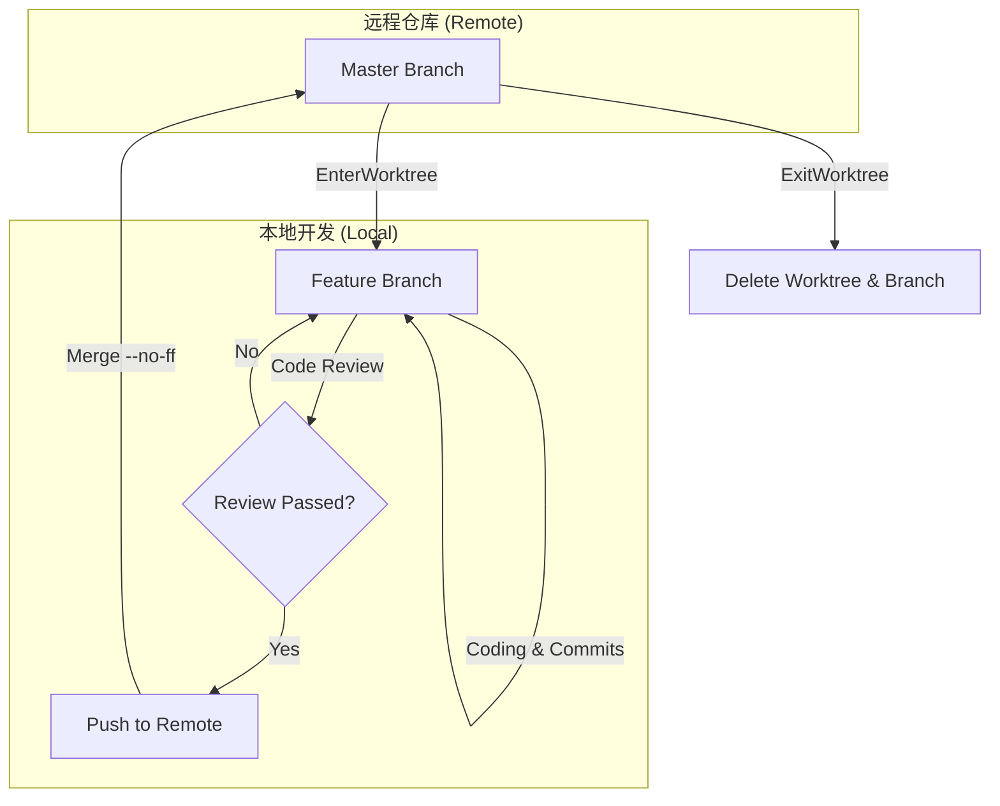
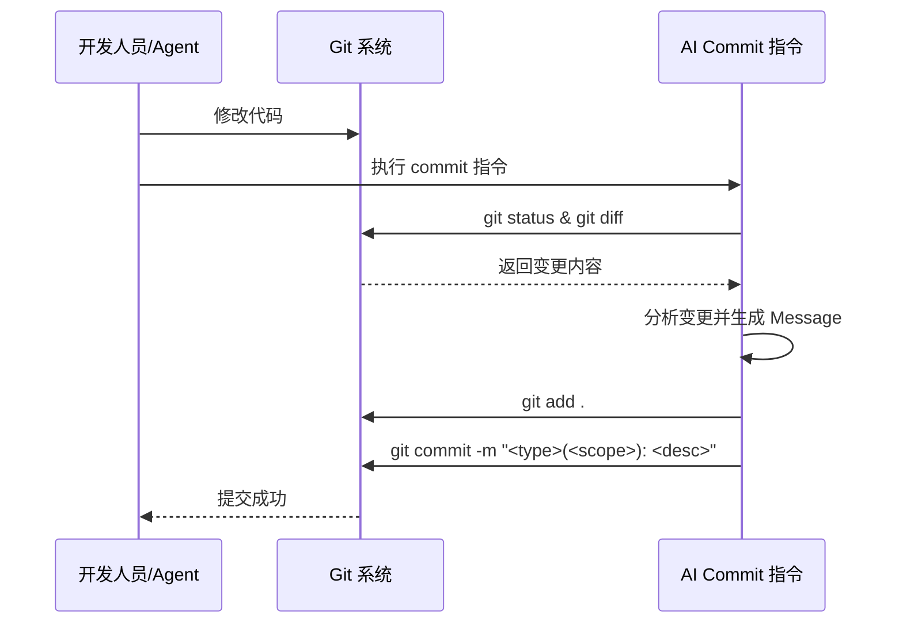
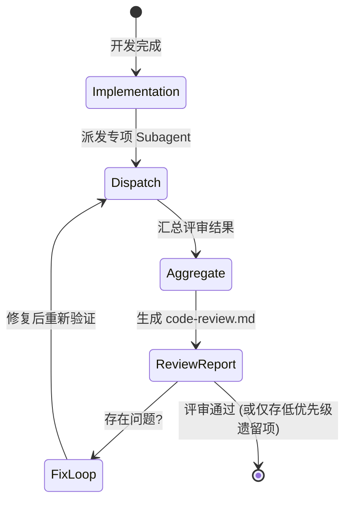
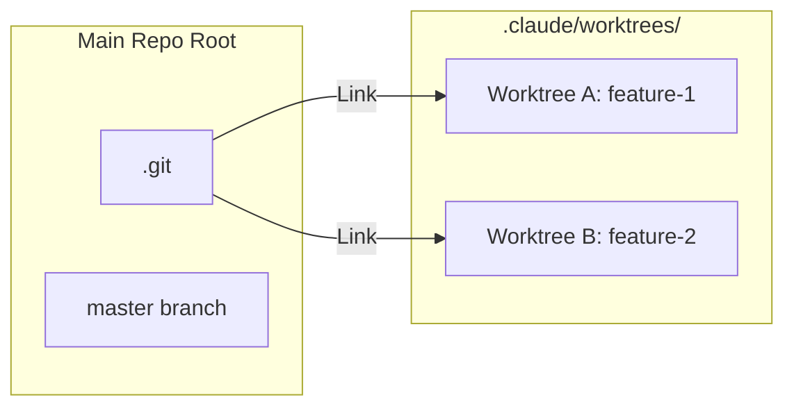

# Git 工作流与提交规范

## 目录
1. [模块概览](#模块概览)
2. [引言](#引言)
3. [分支策略与生命周期管理](#分支策略与生命周期管理)
4. [提交规范 (Conventional Commits)](#提交规范-conventional-commits)
5. [AI 辅助提交流程](#ai-辅助提交流程)
6. [代码评审 (Code Review) 流程](#代码评审-code-review-流程)
7. [工作区管理 (Git Worktree)](#工作区管理-git-worktree)
8. [核心指令与代码示例](#核心指令与代码示例)
9. [文件引用](#文件引用)

## 模块概览

本模块定义了 `fork-any-application` 项目的 Git 协作标准与流程。通过集成 AI 辅助指令和结构化的工作流，确保代码质量的一致性与提交历史的清晰度。

- **涉及文件总数**：约 45 个配置文件与指令脚本。
- **核心子目录**：
    - `.opencode/commands/`：包含 Git 提交相关的 AI 指令。
    - `.claude/commands/`：包含自动化工作流（如 `fast-forward`）的定义。
    - `.claude/skills/feature-workflow/`：定义了完整的特性开发流，包括评审规范与工作区管理。
- **覆盖范围**：本文档将深入探讨 Git 分支策略、提交规范、AI 辅助提交、代码评审机制以及基于 `git worktree` 的多任务管理实践。

## 引言

在大型协作项目或由 AI 辅助开发的系统中，清晰的 Git 协作流程是维持项目可维护性的基石。`fork-any-application` 采用了一套高度规范化的 Git 工作流，旨在通过自动化工具和严格的提交标准来降低评审成本并提高代码回溯效率。

本规范的核心目标包括：
1. **建立原子化提交历史**：确保每个提交只负责一个逻辑变更，便于回滚和代码审计。
2. **规范化评审流程**：通过专项 Subagent 并行评审，将代码质量检查从人工抽查转变为系统性验证。
3. **隔离开发环境**：利用 `git worktree` 实现多需求并行开发时的环境隔离，避免分支切换带来的上下文污染。
4. **提升 AI 协作效率**：为 AI Agent 提供明确的提交模板和合并指令，减少沟通歧义。

## 分支策略与生命周期管理

项目采用基于特性的分支模型（Feature Branch Workflow），所有开发活动均在独立的特性分支中进行，严禁直接向 `master` 分支提交代码。

### 分支命名规范
- **特性分支 (Feature)**：格式为 `feature/<YYYY-MM-dd>-<name>`。例如：`feature/2023-10-27-login-refactor`。
- **主分支 (Master)**：生产环境代码的唯一来源。
- **修复分支 (Hotfix)**：用于紧急修复线上问题，命名格式为 `hotfix/<YYYY-MM-dd>-<issue-id>`。

### 分支生命周期
特性分支的生命周期通常遵循“创建 -> 开发 -> 评审 -> 合并 -> 清理”的循环。



在上述流程中，`EnterWorktree` 工具负责从 `master` 切出新分支并创建独立的物理目录。开发完成后，必须通过 `--no-ff`（非快进式）合并回 `master`，以保留完整的特性分支历史轨迹。这种做法在处理复杂的 AI 生成代码时尤为重要，因为它能清晰地标记出某项功能的所有相关变更。

**分支管理源文件**:
- [fast-forward.md](.claude/commands/fast-forward.md)
- [worktree.md](.claude/skills/feature-workflow/references/worktree.md)

## 提交规范 (Conventional Commits)

为了使 Git 历史具备可读性和机器可解析性，我们严格遵循 [Conventional Commits](https://www.conventionalcommits.org/) 规范。

### 提交信息格式
```text
<type>(<scope>): <description>

[optional body]

[optional footer(s)]
```

### 类型 (Type) 定义
下表列出了常用的提交类型及其适用场景：

| 类型 | 描述 | 示例 |
| :--- | :--- | :--- |
| `feat` | 新功能 (feature) | `feat(backend): 增加用户登录接口` |
| `fix` | 修补 bug | `fix(ios): 修复启动闪退问题` |
| `docs` | 文档变更 | `docs: 更新 Git 工作流文档` |
| `style` | 不影响代码含义的变更 (空白、格式、缺少分号等) | `style(web): 调整 CSS 缩进` |
| `refactor` | 既不是修复 bug 也不是添加功能的代码变更 | `refactor(cross): 重构权限校验逻辑` |
| `test` | 添加缺失的测试或更正现有的测试 | `test(android): 增加单元测试覆盖率` |
| `chore` | 构建过程或辅助工具的变动 | `chore: 更新依赖库` |

### 作用域 (Scope) 说明
在本项目中，`scope` 通常对应于受影响的平台或模块：
- `backend`: 后端服务
- `ios`: iOS 客户端
- `android`: Android 客户端
- `web`: 前端网页
- `cross`: 涉及多端的跨平台变更

**提交规范源文件**:
- [commit.md](.opencode/commands/commit.md)
- [worktree.md](.claude/skills/feature-workflow/references/worktree.md)

## AI 辅助提交流程

在 AI 辅助开发模式下，手动编写高质量的提交信息往往效率较低。项目通过 `.opencode/commands/commit.md` 指令，利用 LLM 自动分析变更内容并生成符合规范的提交信息。

### 自动生成逻辑
AI 在执行提交指令时，会遵循以下步骤：
1. **获取上下文**：执行 `git status` 和 `git diff HEAD` 获取当前暂存区和未暂存的变更。
2. **分析意图**：对比 `git log` 中的历史提交风格，识别当前变更的逻辑核心。
3. **构造信息**：根据变更的文件路径自动推断 `scope`，根据变更性质选择 `type`。



这种流程确保了即使是微小的代码调整也能获得准确的描述，极大地提升了 `git blame` 时的可读性。

**AI 提交源文件**:
- [commit.md](.opencode/commands/commit.md)

## 代码评审 (Code Review) 流程

代码评审是 `feature-workflow` 中的关键环节，采用“并行专项评审”模式，通过多个垂直领域的 Subagent 对代码进行全方位扫描。

### 评审维度与分工
评审不再是由一个通用的 Agent 完成，而是被拆分为多个专项任务：
- **通用维度**：硬编码检查、代码风格、API 合规性。
- **平台专属**：iOS 的内存管理、Android 的生命周期、后端的数据库安全等。

### 评审生命周期
评审过程是一个闭环，直到所有高严重度问题被修复。



### 代码评审 CheckList
在评审过程中，Subagent 会重点检查以下各项：

| 检查项 | 描述 | 严重度 |
| :--- | :--- | :--- |
| **硬编码** | 是否包含明文 Token、密钥或环境 URL | 🔴 高 |
| **逻辑错误** | 边界条件处理是否正确，是否存在潜在崩溃点 | 🔴 高 |
| **设计一致性** | 是否符合 `design.md` 中定义的架构设计 | 🟡 中 |
| **代码风格** | 命名是否规范，函数长度是否超标 (建议 < 50 行) | 🟢 低 |
| **测试覆盖** | 变更的逻辑是否配备了相应的单元测试 | 🟡 中 |

**代码评审源文件**:
- [code-review.md](.claude/skills/feature-workflow/references/code-review.md)
- [code-review-template.md](.claude/skills/feature-workflow/assets/code-review-template.md)
- [code-standards.md](.claude/skills/feature-workflow/references/common-code-review/code-standards.md)

## 工作区管理 (Git Worktree)

为了支持多任务并行且不互相干扰，项目强制使用 `git worktree`。这允许开发者在不同的物理目录下同时操作同一个仓库的不同分支，而无需频繁执行 `git stash` 或 `git checkout`。

### 核心约束
- **禁止手动操作**：必须使用内置的 `EnterWorktree` 和 `ExitWorktree` 工具。
- **目录隔离**：所有 worktree 统一存放在 `.claude/worktrees/` 目录下。
- **状态同步**：在 worktree 中完成代码合并后，必须使用 `ExitWorktree` 进行清理，以防止残留的分支引用导致仓库状态混乱。



通过这种结构，开发者可以同时在一个 worktree 中运行后端测试，在另一个 worktree 中调整前端 UI，互不阻塞。

**工作区管理源文件**:
- [worktree.md](.claude/skills/feature-workflow/references/worktree.md)

## 核心指令与代码示例

以下是项目定义的 Git 相关指令实现片段，展示了如何通过脚本封装复杂的 Git 操作。

### 自动化推进指令示例
在 `fast-forward.md` 中，定义了如何自动合并特性分支：

```bash
# 从 fast-forward.md 提取的合并逻辑
# 确认当前在 worktree 目录中
pwd

# 提交所有未提交的变更
git add .
git commit -m "chore: fast-forward complete - $ARGUMENTS"

# 推送 feature 分支到远程
git push origin feature/$(date +%Y-%m-%d)-<name>

# 回到主仓库并合并
cd <project-root>
git checkout master
git pull origin master
git merge --no-ff feature/$(date +%Y-%m-%d)-<name>
git push origin master
```

### AI 提交指令配置
在 `commit.md` 中，定义了 AI 生成提交信息所需的上下文：

```markdown
## Context

- Current git status: !`git status`
- Current git diff (staged and unstaged changes): !`git diff HEAD`
- Current branch: !`git branch --show-current`
- Recent commits: !`git log --oneline -10`
```

通过这些上下文，AI 能够准确判断提交的范围（Scope）和类型（Type）。

## 文件引用

以下是构建本规范所参考的核心源文件，建议在修改 Git 流程前查阅：

**核心指令**:
- [.opencode/commands/commit.md](.opencode/commands/commit.md)
- [.claude/commands/fast-forward.md](.claude/commands/fast-forward.md)

**流程规范**:
- [.claude/skills/feature-workflow/references/worktree.md](.claude/skills/feature-workflow/references/worktree.md)
- [.claude/skills/feature-workflow/references/code-review.md](.claude/skills/feature-workflow/references/code-review.md)
- [.claude/skills/feature-workflow/references/common-code-review/code-standards.md](.claude/skills/feature-workflow/references/common-code-review/code-standards.md)

**模板资产**:
- [.claude/skills/feature-workflow/assets/code-review-template.md](.claude/skills/feature-workflow/assets/code-review-template.md)
