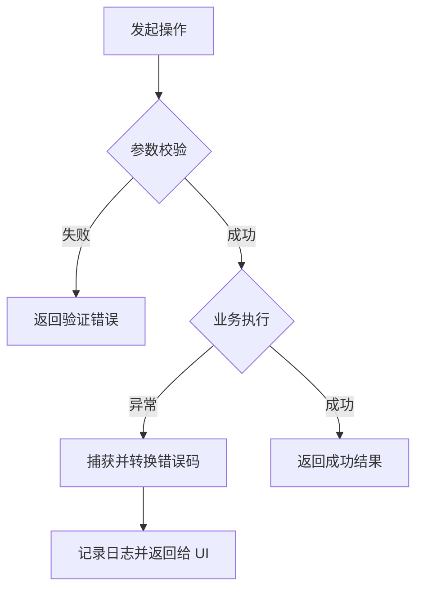
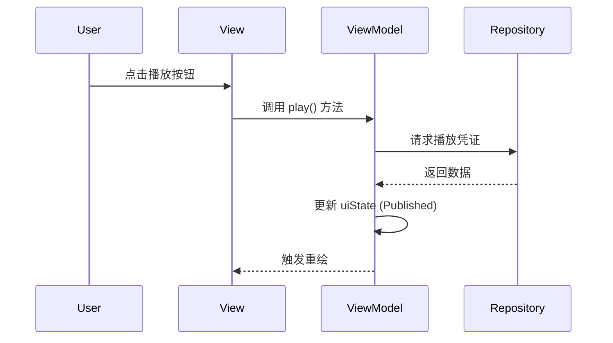
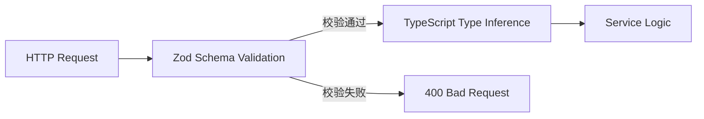
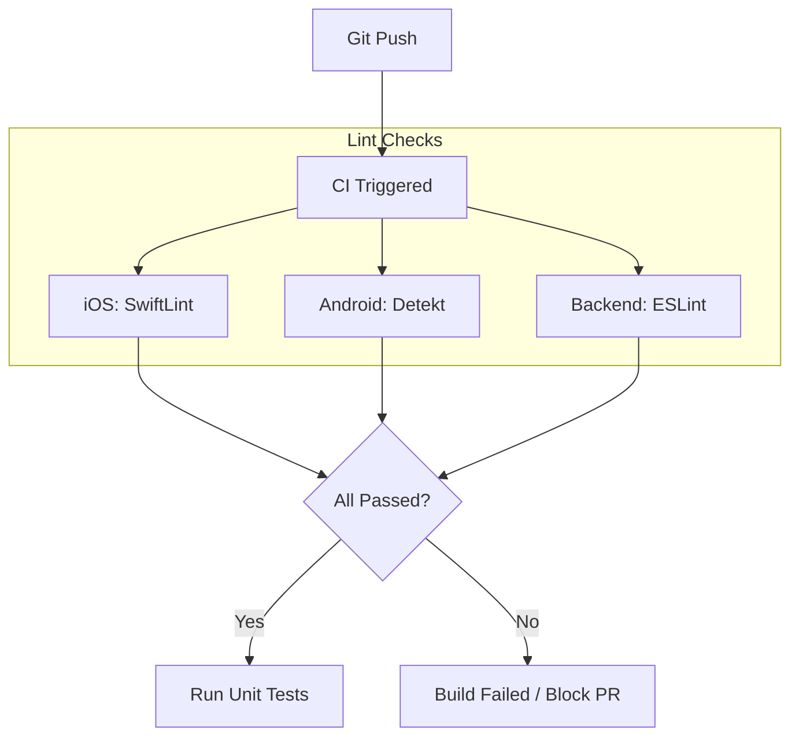

# 代码风格与自动化 Lint 规范

## 目录
1. [模块概览](#模块概览)
2. [引言](#引言)
3. [跨端通用规范](#跨端通用规范)
   - [命名约定](#命名约定)
   - [注释与文档](#注释与文档)
   - [错误处理原则](#错误处理原则)
4. [iOS 规范与 SwiftLint 深度解析](#ios-规范与-swiftlint-深度解析)
   - [SwiftLint 核心规则配置](#swiftlint-核心规则配置)
   - [SwiftUI 编写最佳实践](#swiftui-编写最佳实践)
   - [并发与异步规范](#并发与异步规范)
5. [Android 规范与 Detekt 深度解析](#android-规范与-detekt-深度解析)
   - [Detekt 静态检查规则](#detekt-静态检查规则)
   - [Jetpack Compose 编码标准](#jetpack-compose-编码标准)
   - [Kotlin 协程使用规范](#kotlin-协程使用规范)
6. [Backend 规范与 ESLint 深度解析](#backend-规范与-eslint-深度解析)
   - [TypeScript 类型安全与 ESLint](#typescript-类型安全与-eslint)
   - [Zod 数据校验规范](#zod-数据校验规范)
   - [Next.js API 路由标准](#nextjs-api-路由标准)
7. [自动化集成与 CI 流程](#自动化集成与-ci-流程)
   - [本地检查触发](#本地检查触发)
   - [CI 流程中的强制执行](#ci-流程中的强制执行)
8. [常见 Lint 报错修复与规则自定义](#常见-lint-报错修复与规则自定义)
   - [常见报错修复方法](#常见报错修复方法)
   - [如何自定义或禁用规则](#如何自定义或禁用规则)
9. [代码审查清单 (汇总)](#代码审查清单-汇总)
10. [关键文件引用](#关键文件引用)

## 模块概览

本模块定义了 **ShortDrama** 项目在 iOS、Android 和 Backend 三个端的代码风格标准及自动化检查机制。通过统一的 Lint 规范，我们确保了跨平台代码的一致性、可读性和可维护性，降低了多端协作的沟通成本。

**覆盖范围统计**：
- **总文件数**：约 450+ 个源文件（涵盖 Swift, Kotlin, TypeScript, SQL 等）。
- **涉及子模块**：
    - `ios/`：基于 SwiftLint 的 iOS 端规范。
    - `android/`：基于 Detekt 和 ktlint 的 Android 端规范。
    - `backend/`：基于 ESLint 和 Zod 的后端/Web 端规范。
    - `.claude/skills/`：各端编码标准参考文档。

**内容深度说明**：
本页面将深入解析各端的配置文件（`.swiftlint.yml`, `detekt.yml`, `eslint.config.mjs`），并结合项目实际代码示例，阐述如何通过自动化工具强制执行编码标准。

## 引言

在多端协作的大型项目中，代码风格的不一致往往会导致代码审查（Code Review）效率低下、潜在 Bug 增加以及维护成本上升。**ShortDrama** 项目采用了“规范先行、工具保障”的策略，将编码规范固化为自动化检查脚本。

本规范的目标不仅是让代码看起来“整齐”，更重要的是通过静态分析发现潜在的逻辑缺陷（如强拆包、协程泄露、类型不安全等）。我们坚持以下核心理念：
1. **自动化优先**：凡是能通过工具检查的规则，绝不靠人工记忆。
2. **零容忍警告**：CI 流程中任何 Lint 警告都将被视为错误，必须修复后方可合并。
3. **语义化命名**：代码即文档，通过清晰的命名表达业务意图。

## 跨端通用规范

尽管各端的语言和框架各异，但在基础编程范式上，我们遵循一套通用的准则。

### 命名约定

我们统一采用 **CamelCase**（驼峰命名法）作为代码层面的主要命名方式，而资源文件和数据库则采用 **snake_case**。

| 元素类型 | 规范 | 示例 |
| :--- | :--- | :--- |
| 类 / 结构体 / 协议 | UpperCamelCase | `DramaDetailViewModel`, `AuthService` |
| 函数 / 方法 / 变量 | lowerCamelCase | `fetchData()`, `isLoading` |
| 常量 | UPPER_SNAKE_CASE | `MAX_RETRY_COUNT`, `DEFAULT_PAGE_SIZE` |
| 资源文件 (图片/布局) | snake_case | `ic_play_icon.xml`, `bg_login_header.png` |
| 数据库表与字段 | snake_case | `drama_episodes`, `created_at` |

> **💡 提示**：布尔值变量必须以 `is`、`has`、`should` 或 `can` 开头，以增强可读性。例如：`isUserLoggedIn` 优于 `userLoginStatus`。

### 注释与文档

我们提倡“代码自解释”，但对于复杂的业务逻辑或非直观的算法，必须编写高质量注释。

1. **文档注释**：公共接口（Public API）必须使用各语言标准的文档注释格式（Swift: `///`, Kotlin: `/** */`, TS: `/** */`）。
2. **逻辑注释**：在函数内部，解释“为什么”这样做，而不是“在做什么”。
3. **TODO 规范**：所有 `TODO` 必须关联到具体的任务单号（如 JIRA ID），禁止提交无主、无期限的 `TODO`。

### 错误处理原则

跨端通用的错误处理流程遵循“尽早返回、结构化反馈”的原则。



**错误处理策略说明**：
各端必须将底层错误（网络异常、数据库错误）转换为统一的业务错误模型。在后端，我们使用 Zod 进行输入校验；在移动端，我们使用 `Result` 类型或 `try-catch` 配合自定义 Error 枚举。

**Section sources**:
- [.claude/skills/ios-development/references/standards/coding-standards.md](.claude/skills/ios-development/references/standards/coding-standards.md)
- [.claude/skills/android-development/references/standards/coding-standards.md](.claude/skills/android-development/references/standards/coding-standards.md)
- [.claude/skills/backend-development/references/standards/coding-standards.md](.claude/skills/backend-development/references/standards/coding-standards.md)

## iOS 规范与 SwiftLint 深度解析

iOS 端采用 Swift 语言，UI 框架为 SwiftUI。我们通过 SwiftLint 强制执行代码风格。

### SwiftLint 核心规则配置

项目根目录下的 `ios/.swiftlint.yml` 定义了 iOS 端的静态检查规则。

```yaml
# ios/.swiftlint.yml 核心片段
line_length:
  warning: 120
  error: 200

# 启用的可选规则
opt_in_rules:
  - empty_count          # 优先使用 .isEmpty 而非 .count == 0
  - unused_import        # 禁止未使用的导入
  - force_unwrapping     # 严禁强拆包 (!)
  - sorted_imports       # 导入按字母排序

# 长度限制
function_body_length:
  warning: 50
  error: 100
```

**关键规则解析**：
- **`force_unwrapping`**：这是项目中最严格的规则。禁止使用 `!`。必须使用 `if let` 或 `guard let` 安全解包。
- **`line_length`**：单行限制 120 字符。这有助于在分屏查看代码时保持良好的体验。
- **`function_body_length`**：函数体超过 50 行会触发警告。这强制开发者进行合理的函数拆分。

### SwiftUI 编写最佳实践

我们遵循 **MVVM** 架构和 **单向数据流 (UDF)** 原则。



**SwiftUI 核心规范**：
1. **View 拆分**：单个 `body` 计算属性不得超过 30 行。
2. **状态管理**：
   - 局部状态使用 `@State`。
   - 业务逻辑和跨视图状态交给 `@Observable` (iOS 17+) 或 `@StateObject`。
3. **预览支持**：每个 View 必须提供 `#Preview`，并覆盖 `loading`、`error` 和 `data` 多种状态。

### 并发与异步规范

Swift 并发模型（Modern Concurrency）是项目的标准。

- **`async/await`**：取代传统的闭包回调。
- **`@MainActor`**：所有 ViewModel 必须标记为 `@MainActor`，确保 UI 更新在主线程执行。
- **`Sendable`**：跨并发域传递的数据模型必须遵循 `Sendable` 协议。

**正例 (Swift)**：
```swift
@MainActor
class DramaViewModel: ObservableObject {
    @Published private(set) var drama: Drama?
    
    func loadDrama(id: String) async {
        do {
            // 使用 async/await 替代回调
            self.drama = try await repository.fetchDrama(id: id)
        } catch {
            // 结构化错误处理
            logger.error("Failed to load drama: \(error)")
        }
    }
}
```

**Diagram sources**:
- [ios/ShortDrama/Sources/Features/Player/ViewModels/PlayerViewModel.swift](ios/ShortDrama/Sources/Features/Player/ViewModels/PlayerViewModel.swift)
- [ios/.swiftlint.yml](ios/.swiftlint.yml)

## Android 规范与 Detekt 深度解析

Android 端采用 Kotlin 语言，UI 框架为 Jetpack Compose。我们使用 Detekt 进行深度静态分析。

### Detekt 静态检查规则

`android/.detekt/detekt.yml` 配置文件定义了 Android 端的复杂度、命名和风格规则。

```yaml
# android/.detekt/detekt.yml 核心片段
style:
  MagicNumber:
    active: false       # 允许在 Compose 中使用魔法数字（如 DP 值）
  MaxLineLength:
    maxLineLength: 120

naming:
  FunctionNaming:
    ignoreAnnotated: ['Composable'] # Composable 函数允许使用 PascalCase
    functionPattern: '[a-z][a-zA-Z0-9]*'

complexity:
  LongParameterList:
    functionThreshold: 10 # 考虑到 Compose 的参数较多，放宽限制
```

**规则说明**：
- **`FunctionNaming`**：普通 Kotlin 函数使用 `lowerCamelCase`，但带有 `@Composable` 注解的函数必须使用 `UpperCamelCase`（名词性质）。
- **`MagicNumber`**：虽然在逻辑层禁用，但在 UI 层（Compose）中为了方便设置间距，通常会关闭或放宽此项检查。

### Jetpack Compose 编码标准

Compose 的核心是 **Stateless (无状态)** 组件。

1. **参数顺序**：`必选数据 -> Modifier -> 可选参数 -> 回调 -> 插槽`。
2. **状态提升 (State Hoisting)**：将状态移至调用方或 ViewModel，使组件更易于测试和复用。
3. **重组优化**：
   - 使用 `remember` 缓存计算结果。
   - 列表项必须指定 `key`。

**正例 (Kotlin/Compose)**：
```kotlin
@Composable
fun VideoCard(
    video: VideoDto,
    modifier: Modifier = Modifier, // Modifier 必须作为第一个可选参数
    onItemClick: (String) -> Unit = {}
) {
    Card(
        modifier = modifier.clickable { onItemClick(video.id) }
    ) {
        // UI 实现...
    }
}
```

### Kotlin 协程使用规范

协程是 Android 异步操作的基石。

- **调度器选择**：网络请求用 `Dispatchers.IO`，计算任务用 `Dispatchers.Default`，UI 操作用 `Dispatchers.Main.immediate`。
- **结构化并发**：禁止使用 `GlobalScope`。必须使用 `viewModelScope` 或 `lifecycleScope`。
- **挂起函数**：所有 `suspend` 函数必须是主线程安全的（Main-safe）。

**Section sources**:
- [android/.detekt/detekt.yml](android/.detekt/detekt.yml)
- [.claude/skills/android-development/references/standards/coding-standards.md](.claude/skills/android-development/references/standards/coding-standards.md)

## Backend 规范与 ESLint 深度解析

后端基于 Next.js App Router 架构，使用 TypeScript。

### TypeScript 类型安全与 ESLint

`backend/eslint.config.mjs` 继承了 Next.js 的核心配置，并加强了类型检查。

- **`strict: true`**：在 `tsconfig.json` 中开启，确保零 `any` 容忍。
- **`no-explicit-any`**：ESLint 强制拦截显式的 `any` 声明。
- **`noUncheckedIndexedAccess`**：强制对数组索引访问进行空检查。

### Zod 数据校验规范

Zod 是我们唯一的“真相来源”（Single Source of Truth）。



**数据流解析**：
所有 API 的输入（Body, Query, Params）都必须先通过 Zod Schema 校验。校验成功后，通过 `z.infer` 自动推导出 TypeScript 类型，从而避免手写接口导致的类型不同步问题。

**代码示例 (TypeScript)**：
```typescript
import { z } from 'zod';

// 定义 Schema
export const createDramaSchema = z.object({
  title: z.string().min(1),
  episodeCount: z.number().int().positive(),
});

// 自动推导类型
export type CreateDramaRequest = z.infer<typeof createDramaSchema>;

export async function POST(request: NextRequest) {
  const body = await request.json();
  const result = createDramaSchema.safeParse(body);
  
  if (!result.success) {
    return NextResponse.json({ error: result.error.flatten() }, { status: 400 });
  }
  // result.data 现在具有完整的类型提示
}
```

### Next.js API 路由标准

1. **分层架构**：`Route Handler (API) -> Service -> Repository`。
2. **响应格式**：统一使用 `{ data: T }` 或 `{ error: { code, message } }`。
3. **无状态设计**：API 必须是无状态的，认证信息通过 JWT 传递。

**Section sources**:
- [backend/eslint.config.mjs](backend/eslint.config.mjs)
- [backend/src/lib/schemas.ts](backend/src/lib/schemas.ts)
- [.claude/skills/backend-development/references/standards/coding-standards.md](.claude/skills/backend-development/references/standards/coding-standards.md)

## 自动化集成与 CI 流程

Lint 检查是 CI/CD 管道的第一道关卡。

### 本地检查触发

开发者在提交代码前应在本地运行以下命令：

- **iOS**: `swiftlint lint --config ios/.swiftlint.yml`
- **Android**: `./gradlew detekt`
- **Backend**: `npm run lint`

> **💡 提示**：建议安装对应的 IDE 插件（SwiftLint for Xcode, Detekt for Android Studio, ESLint for VS Code），在编写代码时实时获取反馈。

### CI 流程中的强制执行

在项目的 CI 脚本中（如 GitHub Actions），Lint 检查被配置为阻塞性任务。



**执行逻辑说明**：
任何一端的检查失败都会导致整个 Build 失败。我们使用 `--strict` 标志将所有警告（Warning）提升为错误（Error），确保代码库始终保持最高标准。

## 常见 Lint 报错修复与规则自定义

### 常见报错修复方法

1. **Force Unwrapping (iOS)**：
   - *错误*：`let id = drama!.id`
   - *修复*：`guard let id = drama?.id else { return }`
2. **Magic Number (Android)**：
   - *错误*：`padding(16.dp)`
   - *修复*：在 `Dimens.kt` 中定义 `val SpacingNormal = 16.dp`。
3. **Explicit Any (Backend)**：
   - *错误*：`function handle(data: any)`
   - *修复*：使用 `unknown` 配合类型守卫，或定义完整的 Zod Schema。

### 如何自定义或禁用规则

虽然不鼓励禁用规则，但在某些特殊场景下（如第三方库集成、遗留代码迁移），可以通过以下方式局部禁用：

- **Swift**: `// swiftlint:disable <rule_name>`
- **Kotlin**: `@Suppress("<rule_id>")`
- **TypeScript**: `// eslint-disable-next-line <rule_id>`

> **⚠️ 警告**：禁用规则必须附带注释说明原因。在 `.swiftlint.yml` 或 `detekt.yml` 中全局修改规则需经过团队架构师审批。

## 代码审查清单 (汇总)

在进行 Code Review 时，请重点关注以下非自动化检查项：

- [ ] **命名语义**：变量名是否能清晰表达其业务含义？
- [ ] **逻辑拆分**：函数是否过长？是否违反了单一职责原则？
- [ ] **错误处理**：是否覆盖了所有可能的异常路径？是否向用户展示了友好的错误信息？
- [ ] **性能影响**：是否存在不必要的重组（Compose）或重绘（SwiftUI）？
- [ ] **安全风险**：是否有硬编码的密钥或敏感信息？

## 关键文件引用

本规范涉及的核心配置文件如下：

- **iOS 配置**：[ios/.swiftlint.yml](ios/.swiftlint.yml)
- **Android 配置**：[android/.detekt/detekt.yml](android/.detekt/detekt.yml)
- **Backend 配置**：[backend/eslint.config.mjs](backend/eslint.config.mjs)
- **iOS 编码标准**：[.claude/skills/ios-development/references/standards/coding-standards.md](.claude/skills/ios-development/references/standards/coding-standards.md)
- **Android 编码标准**：[.claude/skills/android-development/references/standards/coding-standards.md](.claude/skills/android-development/references/standards/coding-standards.md)
- **Backend 编码标准**：[.claude/skills/backend-development/references/standards/coding-standards.md](.claude/skills/backend-development/references/standards/coding-standards.md)
