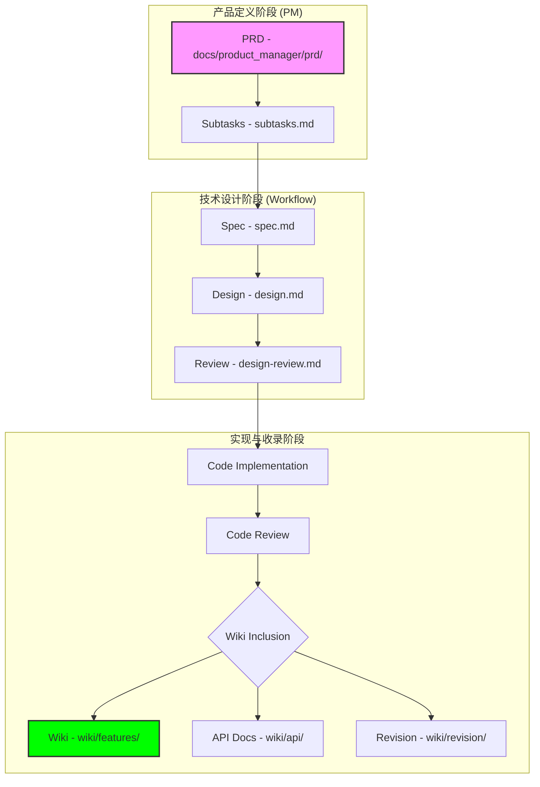
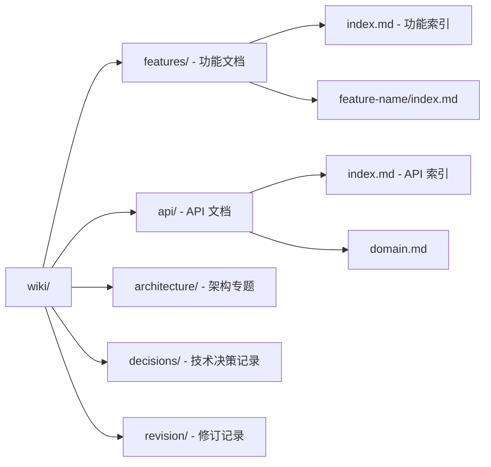
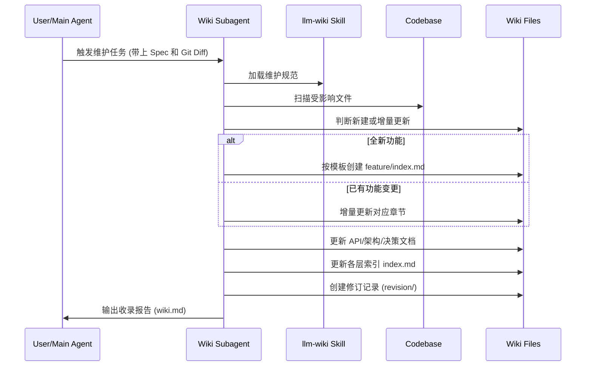

# 文档驱动开发与 Wiki 维护规范

## 目录
1. [模块概览](#模块概览)
2. [引言：文档驱动开发 (DDD)](#引言文档驱动开发-ddd)
3. [文档演进路径](#文档演进路径)
4. [Wiki 维护标准](#wiki-维护标准)
   - [目录结构规范](#目录结构规范)
   - [自动化维护机制](#自动化维护机制)
5. [演进记录与技术决策 (ADR)](#演进记录与技术决策-adr)
6. [模板使用规范](#模板使用规范)
7. [文档质量控制](#文档质量控制)
8. [文件引用](#文件引用)

## 模块概览

本模块涵盖了项目文档体系的核心规范与维护机制。通过文档驱动开发（Documentation-Driven Development, DDD），我们确保项目的知识资产能够随着代码的演进实时同步，从而降低沟通成本并增强 Agent 的“长期记忆”。

**规模评估**：
- **总文件数**：发现超过 338 个相关 Markdown 文档。
  - `docs/` 目录下包含 200+ 个文档（涵盖产品研究、PRD、技术规范等）。
  - `.claude/skills/` 目录下包含 138 个技能定义与参考文档。
- **核心子目录**：
  - `docs/product_manager/`: 存放 PRD、积压工作（Backlog）和进度记录。
  - `docs/specs/`: 存放具体功能的技术规范（Spec）与设计文档。
  - `docs/evolution/`: 记录项目的重大架构演进与改进。
  - `.claude/skills/llm-wiki/`: 定义了 Wiki 的生成与维护标准。
  - `.claude/skills/feature-workflow/`: 定义了从需求到收录的完整开发流。

**覆盖范围**：
本页面将深入探讨 `llm-wiki` 技能的维护标准以及 `feature-workflow` 中的文档流转机制。我们将重点介绍如何通过自动化 Subagent 保持 Wiki 的实时更新，并展示 `docs/` 目录的层级结构。

## 引言：文档驱动开发 (DDD)

文档驱动开发（DDD）是本项目核心的开发哲学。在传统的开发模式中，文档往往是事后补齐的“负担”，导致文档与代码严重脱节。在本项目中，文档是**开发的起点**，也是**开发的终点**。

对于 AI Agent 而言，Wiki 不仅仅是给人看的文档，更是它的**长期记忆**。通过维护一份结构化、高准确度的 Wiki，Agent 在新的会话中无需重新阅读数万行代码，即可快速理解项目当前的架构、功能实现逻辑以及各端协作方式。

> 💡 **核心目标**：确保 `docs/` 目录和 Wiki 文档与代码实现高度同步，实现“代码即文档，文档即真相”。

## 文档演进路径

文档在项目中经历了一个从“模糊意图”到“精确实现”再到“长期记忆”的演变过程。

以下图表展示了一个功能从 PRD 阶段到最终被收录进 Wiki 的完整生命周期：

**流程说明**：
1. **PRD 阶段**：PM 编写精简版 PRD，明确“做什么、为什么、给谁用”。
2. **Spec/Design 阶段**：开发人员根据 PRD 编写详细的技术规范和多端设计方案。
3. **实现阶段**：根据设计方案进行编码。
4. **Wiki 收录阶段**：开发完成后，系统自动触发 `wiki-inclusion` Subagent。该 Agent 收集 Spec、Design 和 Git Diff 信息，通过 `llm-wiki` 技能更新 Wiki 库。

**Diagram sources**:
- [.claude/skills/product-manager/references/prd-writing.md](.claude/skills/product-manager/references/prd-writing.md)
- [.claude/skills/feature-workflow/references/wiki-inclusion.md](.claude/skills/feature-workflow/references/wiki-inclusion.md)

## Wiki 维护标准

Wiki 的维护遵循严格的结构化标准，确保信息的可索引性和一致性。

### 目录结构规范

Wiki 存放在根目录的 `wiki/` 文件夹下，其结构如下：

**结构要点**：
- **强制索引**：除 `revision/` 外，每个目录必须包含 `index.md`。
- **功能域划分**：每个功能域使用 `kebab-case` 命名，拥有独立子目录。
- **API 统一管理**：API 定义统一在 `wiki/api/` 维护，功能文档仅通过链接引用，严禁重复定义。

### 自动化维护机制

Wiki 的更新不是手动完成的，而是由 `llm-wiki` 技能驱动的 Subagent 自动执行。

**维护原则**：
- **代码为唯一真相**：Spec 和 Design 仅作参考，若代码实现与文档不符，以代码为准。
- **源文件标注**：每个关键逻辑必须标注源文件路径（如 `web/src/xxx.ts:L42`）。
- **修订优先**：实现被替换时，记录“旧 -> 新”的演进，而非直接删除。

**Section sources**:
- [.claude/skills/llm-wiki/references/wiki-standards.md](.claude/skills/llm-wiki/references/wiki-standards.md)
- [.claude/skills/llm-wiki/references/generate-and-update.md](.claude/skills/llm-wiki/references/generate-and-update.md)

## 演进记录与技术决策 (ADR)

项目通过两种方式记录决策与演进：

1.  **项目进化记录 (`docs/evolution/`)**：
    记录 Agent 自身能力的提升、工具链的改进以及重复性问题的优化。
    - `index.md`：汇总所有进化素材。
    - `evolution.md`：描述进化的目标与实现。
    - `record.md`：记录进化的具体过程。

2.  **技术决策记录 (`wiki/decisions/`)**：
    类似于 ADR（Architecture Decision Records），记录架构选型和关键技术路径的决策。
    - 格式：`YYYY-MM-DD-<title>.md`。
    - 包含：背景、可选方案、最终决策、后果。

## 模板使用规范

为了保持文档一致性，项目在 `.claude/skills/*/assets/` 下提供了丰富的模板：

| 模板类型 | 路径 | 适用场景 |
| :--- | :--- | :--- |
| **PRD 模板** | `product-manager/assets/prd-template.md` | 新功能启动时的产品定义 |
| **子任务模板** | `product-manager/assets/subtasks.md` | PRD 拆分为可执行任务 |
| **技术规范 (Spec)** | `feature-workflow/assets/spec-template.md` | 详细的技术实现方案 |
| **功能 Wiki 模板** | `llm-wiki/assets/feature-template.md` | Wiki 功能页面的首版生成 |
| **决策记录模板** | `llm-wiki/assets/decisions-template.md` | 记录架构或技术选型决策 |

**填写规范**：
- 严禁删除模板中的核心章节（如功能文档的 `核心逻辑`、`多端实现`）。
- 章节顺序应保持一致，以便 AI 快速定位信息。

## 文档质量控制

文档质量由 AI 自动评审和验证机制保障：

- **交叉引用验证**：Subagent 会检查 Wiki 页面间的链接是否有效，API 引用是否正确。
- **Mermaid 语法检查**：自动验证文档中嵌入的图表语法。
- **完整性评审**：通过 `docs/specs/` 下的 `spec-review.md` 和 `design-review.md` 对文档的深度和覆盖面进行 AI 评审。
- **准确性校验**：在 `wiki-inclusion` 阶段，Agent 会对比代码与文档，对无法确认的信息标注 `[待确认]`，确保不输出虚假信息。

## 文件引用

**核心技能文件**：
- [.claude/skills/llm-wiki/SKILL.md](.claude/skills/llm-wiki/SKILL.md) — Wiki 维护总纲
- [.claude/skills/llm-wiki/references/wiki-standards.md](.claude/skills/llm-wiki/references/wiki-standards.md) — Wiki 目录与格式标准
- [.claude/skills/llm-wiki/references/generate-and-update.md](.claude/skills/llm-wiki/references/generate-and-update.md) — 自动化更新机制
- [.claude/skills/product-manager/references/prd-writing.md](.claude/skills/product-manager/references/prd-writing.md) — PRD 撰写流
- [.claude/skills/feature-workflow/references/wiki-inclusion.md](.claude/skills/feature-workflow/references/wiki-inclusion.md) — 功能收录流

**项目文档路径**：
- [docs/evolution/index.md](docs/evolution/index.md) — 项目进化索引
- [docs/product_manager/](docs/product_manager/) — 产品管理目录
- [docs/specs/](docs/specs/) — 技术规范目录
- [wiki/](wiki/) — 项目 Wiki 根目录
